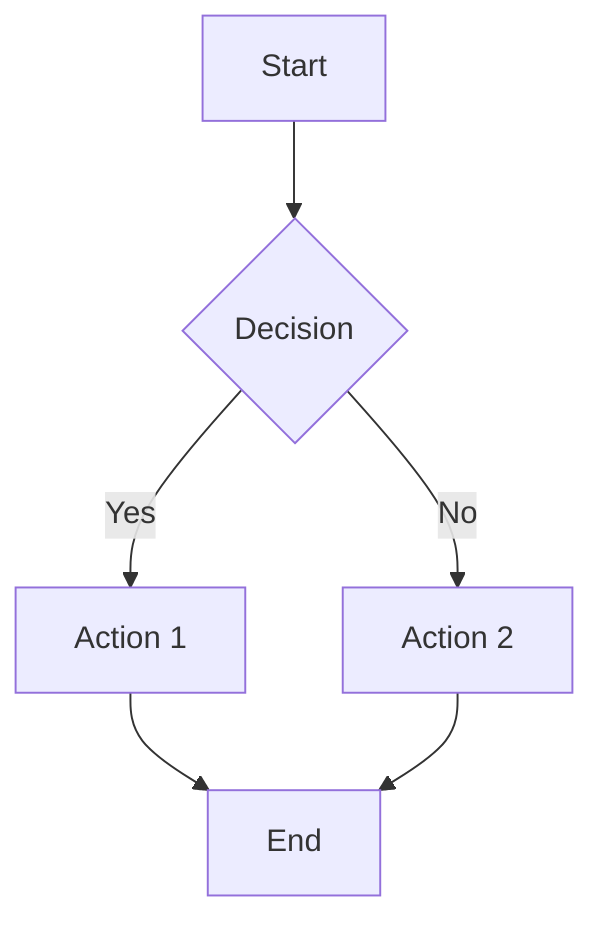
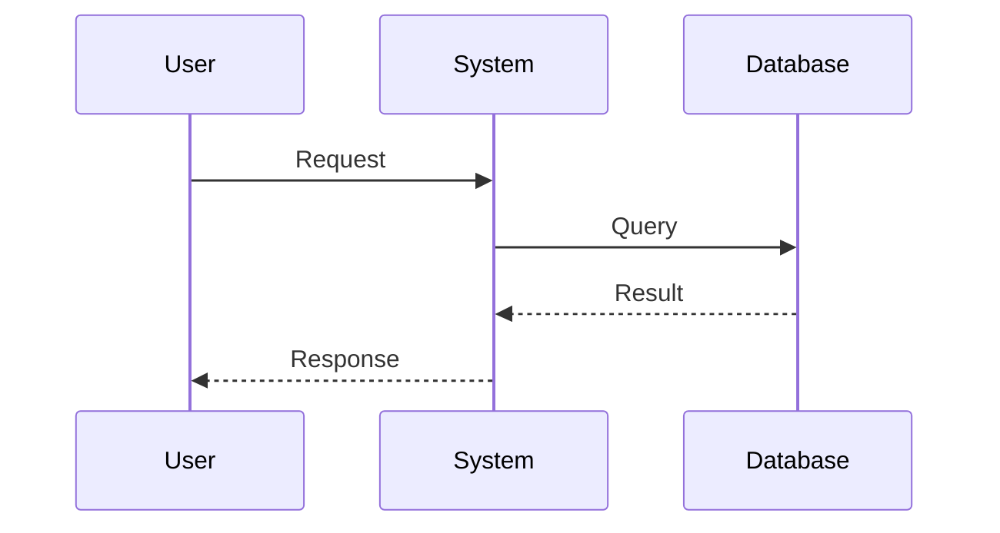
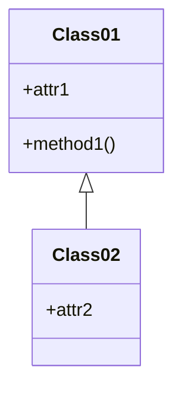
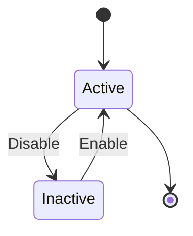
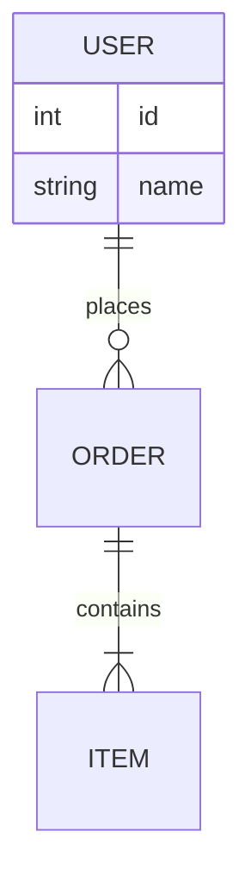
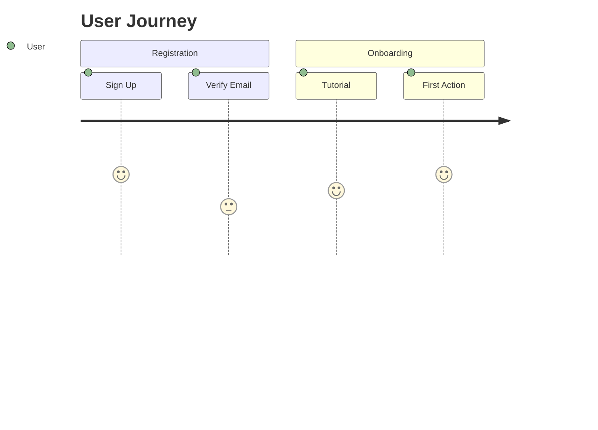
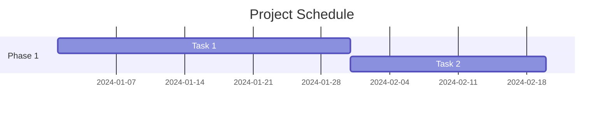
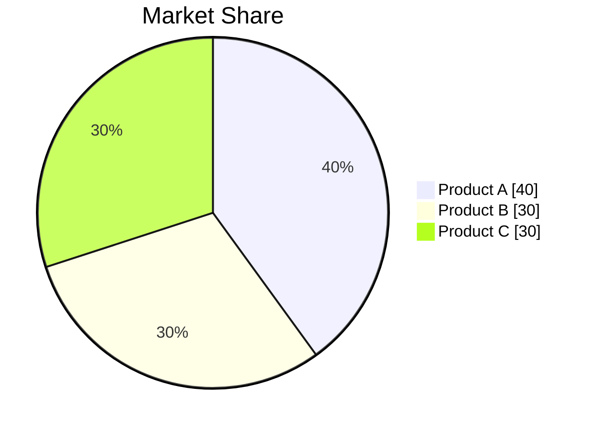
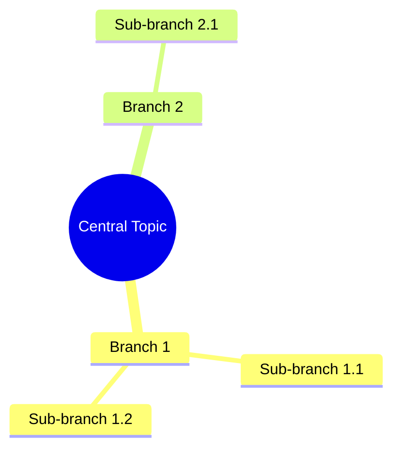
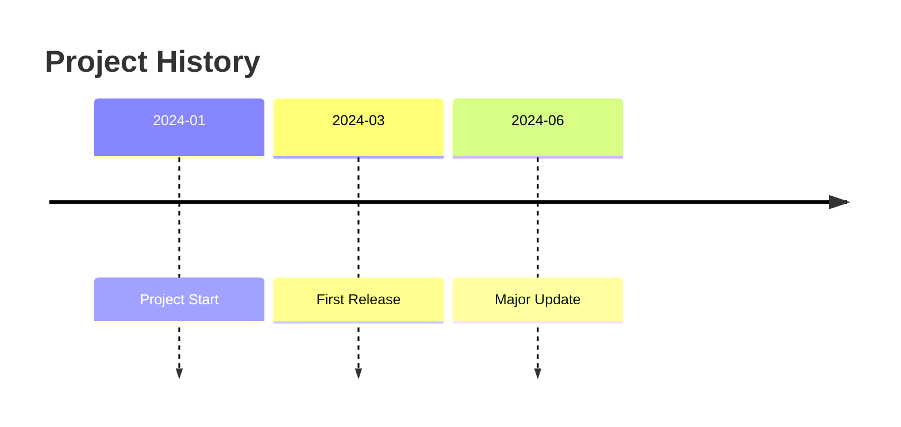

# Knowledge Document Designer

A specialized skill for creating professional, visually appealing, and logically structured Markdown knowledge documents with comprehensive diagram and table support.

## Core Capabilities

### 1. Knowledge Structure Integration
- Organize complex information into clear hierarchies
- Establish relationships between concepts and modules
- Create cross-references and navigation structures
- Build knowledge graphs and mind maps

### 2. Rich Diagram Support

#### Flowcharts (流程图)
Use Mermaid syntax for process visualization:

#### Sequence Diagrams (时序图)
Perfect for showing interactions:

#### Class Diagrams (类图)
For object-oriented design:

#### State Diagrams (状态图)
Show state transitions:

#### Entity Relationship Diagrams (关系图)
Database and entity relationships:

#### Journey Maps (旅程图)
User journey visualization:

#### Gantt Charts (甘特图)
Project timeline visualization:

#### Pie Charts (饼状图)
Data distribution:

#### Mind Maps (思维导图)
Concept organization:

#### Timeline (时间轴)
Historical or process timeline:

### 3. Table Design Patterns

#### Comparison Tables
| Feature | Option A | Option B |
|---------|----------|----------|
| Performance | High | Medium |
| Cost | $$$ | $$ |

#### Feature Matrix
| Component | Status | Priority | Notes |
|-----------|--------|----------|-------|
| Module 1 | ✅ Done | High | Core feature |
| Module 2 | 🚧 WIP | Medium | Enhancement |

### 4. Document Structure Best Practices

#### Standard Sections
1. **Overview/Introduction** - Brief summary and purpose
2. **Prerequisites** - Required knowledge or setup
3. **Core Concepts** - Key ideas and definitions
4. **Architecture/Design** - Structural overview with diagrams
5. **Implementation** - Step-by-step guides
6. **Examples** - Practical use cases
7. **Best Practices** - Recommendations and tips
8. **Troubleshooting** - Common issues and solutions
9. **References** - Links and resources

#### Visual Hierarchy
- Use appropriate heading levels (H1-H6)
- Apply emoji for visual appeal (🎯, 📊, ⚡, 🔧, etc.)
- Use callout boxes for important notes
- Apply code blocks with syntax highlighting
- Use bold/italic for emphasis

### 5. Writing Style Guidelines

#### Clarity Principles
- Start with the conclusion (BLUF method)
- Use active voice
- Keep sentences concise
- One idea per paragraph
- Use bullet points for lists

#### Engagement Techniques
- Add real-world examples
- Include visual diagrams
- Use analogies for complex concepts
- Provide interactive examples
- Add "Pro Tips" sections

## When to Invoke This Skill

Invoke this skill when:
- User requests creation of technical documentation
- User asks for knowledge base articles
- User needs architecture or design documentation
- User wants to create tutorials or guides
- User requests documentation with diagrams
- User needs to visualize complex relationships
- User wants to create API documentation
- User asks for process documentation

## Output Standards

1. **Structure**: Always organize content with clear sections
2. **Visuals**: Include at least one diagram for complex topics
3. **Tables**: Use tables for comparisons and feature lists
4. **Code**: Provide syntax-highlighted code examples
5. **Navigation**: Include table of contents for long documents
6. **Cross-references**: Link to related sections and external resources

## Example Usage

**User Request**: "Create documentation for a microservices architecture"

**Output Structure**:
1. Overview with architecture diagram
2. Service breakdown with class diagrams
3. Communication patterns with sequence diagrams
4. Deployment flow with flowcharts
5. Comparison table of service options
6. Best practices with examples

## Tools and Syntax

- **Mermaid**: Primary diagram syntax (supported by most platforms)
- **Markdown Tables**: For structured data
- **Code Blocks**: With language identifiers
- **Emoji**: For visual enhancement
- **HTML**: For advanced formatting when needed

## Quality Checklist

Before completing documentation:
- [ ] Clear title and introduction
- [ ] Logical section organization
- [ ] At least one visual diagram
- [ ] Proper code formatting
- [ ] Tables for comparisons
- [ ] Working cross-references
- [ ] Consistent formatting
- [ ] No broken links
- [ ] Accessible language
- [ ] Complete examples

## Advanced Features

### Multi-language Support
Create documentation in user's preferred language while maintaining technical accuracy.

### Platform Optimization
Adapt output for different platforms:
- GitHub/GitLab (Mermaid native)
- VuePress/VitePress
- Docusaurus
- Confluence
- Notion

### Interactive Elements
When supported, include:
- Collapsible sections
- Tabbed content
- Interactive diagrams
- Embedded playgrounds

---

**Remember**: Great documentation tells a story. Use diagrams to visualize, tables to organize, and clear language to explain. Always prioritize the reader's understanding over technical completeness.
