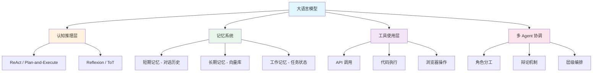

# 🤖 Agent 架构

> **核心目标**：掌握将大语言模型构建为自主 Agent 的核心技术，包括认知推理架构、多层记忆系统、工具调用机制、多 Agent 协作模式。

## 📋 目录

- [认知架构](./cognitive/) — ReAct、Plan-and-Execute、Reflexion
- [记忆系统](./memory/) — 短期/长期记忆、向量数据库、记忆管理
- [工具使用](./tool-use/) — Function Calling、代码解释器、浏览器自动化
- [多 Agent 协作](./multi-agent/) — 角色分工、辩论机制、编排框架

## 🎯 概述

Agent 是大语言模型从"聊天机器人"到"自主智能体"的跃迁。核心能力架构包括：

### Agent 核心能力模型

| 能力 | 说明 | 代表框架 |
|------|------|---------|
| 推理规划 | 复杂任务分解与执行 | ReAct, ToT, GoT |
| 记忆管理 | 信息存储与检索 | MemGPT, LangMem |
| 工具调用 | 外部能力扩展 | LangChain, AutoGPT |
| 协作机制 | 多 Agent 协同 | CrewAI, ChatDev |

## ⚡ 关键指标

| 指标 | 说明 | 评估方式 |
|------|------|---------|
| 任务完成率 | Agent 成功完成任务的比例 | 自动化测试 |
| 步骤效率 | 完成任务所需平均步骤数 | 日志分析 |
| 工具调用准确率 | 正确选择和使用工具 | 人工标注 |
| 记忆检索准确率 | 相关记忆检索的命中率 | RAG 评估 |
| 鲁棒性 | 异常输入下的稳定性 | 对抗测试 |

## 🔗 相关主题

- [模型训练](../04-model-training/) — 训练 Agent 所需的基础模型
- [AI 安全](../02-ai-security/) — Agent 安全边界与风险控制
- [架构设计](../03-architecture/) — Agent 系统架构设计
- [视觉与物理](../07-vision-physical/) — 多模态 Agent 与具身智能

## 📚 延伸阅读

- [ReAct: Synergizing Reasoning and Acting](https://arxiv.org/abs/2210.03629)
- [Plan-and-Solve Prompting](https://arxiv.org/abs/2305.04091)
- [Generative Agents](https://arxiv.org/abs/2304.03442)
- [MemGPT: Towards LLMs as Operating Systems](https://arxiv.org/abs/2310.08560)
