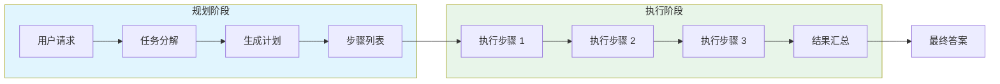
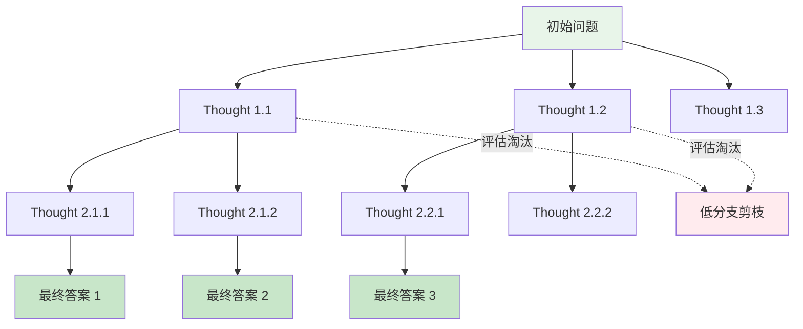
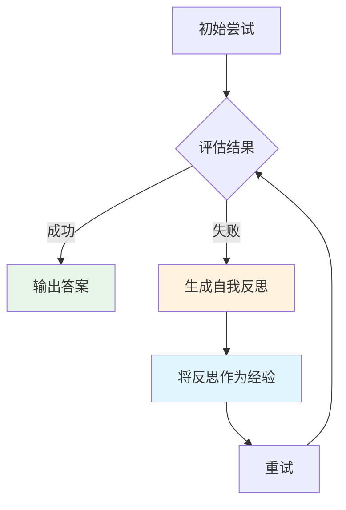

# 🧠 认知推理架构

> **一句话总结**：认知推理架构决定 Agent 如何将复杂任务分解、规划并执行，是 Agent 的"大脑"。

## 📋 目录

- [ReAct 框架](#react-框架)
- [Plan-and-Execute](#plan-and-execute)
- [Tree of Thoughts](#tree-of-thoughts)
- [Reflexion](#reflexion)
- [其他架构](#其他架构)
- [方法对比](#方法对比)

## 🔄 ReAct 框架

### 核心理念

ReAct = **Re**asoning + **Act**ing

Agent 在推理和行动之间交替：思考 → 行动 → 观察 → 思考 → 行动...

```mermaid
sequenceDiagram
    participant Agent as Agent
    participant Env as 环境
    participant Thought as 推理 Thought
    participant Action as 行动 Action
    participant Obs as 观察 Obs
    
    Agent->>Thought: 思考当前状态
    Thought->>Action: 生成动作
    Action->>Env: 执行动作
    Env-->>Obs: 返回观察结果
    Obs->>Agent: 观察结果
    Agent->>Thought: 基于观察推理
    Thought->>Action: 生成下一步动作
    Action->>Env: 执行动作
    Env-->>Obs: 返回观察结果
    Obs->>Agent: 观察
    Agent->>Agent: 终止条件满足，输出结果
    
    style Agent fill:#e1f5fe
    style Thought fill:#fff3e0
    style Action fill:#e8f5e9
```

### ReAct Prompt 模板

```
Question: 如何找到某篇文章的作者？
Thought 1: 我需要先理解这个问题。这是一个搜索任务，我需要找到特定的信息。
Action 1: search[文章标题]
Observation 1: 搜索结果...
Thought 2: 搜索结果中没有直接找到作者信息，我需要更精确的搜索。
Action 2: search[文章标题 + author]
Observation 2: 找到相关信息...
Thought 3: 现在我有了作者信息，任务完成。
Answer: 作者是 XXX
```

### ReAct 实现要点

```python
class ReActAgent:
    def __init__(self, llm, tools, max_steps=10):
        self.llm = llm
        self.tools = tools
        self.max_steps = max_steps
        self.history = []
    
    def execute(self, query):
        """执行 ReAct 循环"""
        for step in range(self.max_steps):
            # 1. 生成 Thought + Action
            prompt = self.build_prompt(query, self.history)
            response = self.llm.generate(prompt)
            thought, action = self.parse_response(response)
            
            # 2. 执行 Action
            observation = self.execute_action(action)
            
            # 3. 记录到历史
            self.history.append({
                "step": step,
                "thought": thought,
                "action": action,
                "observation": observation
            })
            
            # 4. 检查终止条件
            if self.is_complete(observation):
                return self.format_answer(query)
        
        return "超出最大步骤数"
```

## 📝 Plan-and-Execute

### 两阶段架构



### 优势与局限

| 特性 | ReAct | Plan-and-Execute |
|------|-------|-----------------|
| 规划方式 | 在线动态规划 | 离线一次性规划 |
| 灵活性 | 高（可随时调整） | 中（执行中难改计划） |
| 效率 | 低（每步都要推理） | 高（执行阶段快） |
| 适合场景 | 开放域探索 | 结构化任务 |
| 幻觉风险 | 较高 | 较低 |

### 计划生成 Prompt

```
请规划完成以下任务的步骤：
任务：分析某公司的财务报表，评估其健康状况

步骤：
1. 搜索该公司最近的财务报表
2. 提取关键财务指标（营收、利润、现金流）
3. 分析营收增长趋势
4. 计算关键比率（负债率、利润率等）
5. 与行业平均水平对比
6. 综合评估并给出建议
```

## 🌳 Tree of Thoughts (ToT)

### 核心思想

将推理过程建模为树状结构，在每个决策点探索多个可能的"Thought"，然后评估并选择最优路径。



### 搜索策略

| 策略 | 描述 | 适用场景 |
|------|------|---------|
| Greedy Beam Search | 保留 top-k 分支 | 实时性要求高 |
| BFS | 广度优先搜索 | 需要最优解 |
| MCTS | 蒙特卡洛树搜索 | 搜索空间大 |
| DFS | 深度优先搜索 | 深度较浅时 |

### 评估器设计

```python
def evaluate_thought(thought, context, llm):
    """使用 LLM 作为评估器"""
    prompt = f"""
    评估以下推理步骤的质量（1-5分）：
    上下文: {context}
    推理: {thought}
    请只返回分数。
    """
    score = llm.generate(prompt)
    return int(score)
```

## 🔄 Reflexion

### 自我反思循环



### 反思 Prompt

```
你在上一个尝试中犯的错误：
- 步骤 2 使用了错误的 API 参数
- 没有检查 API 返回的错误码

改进策略：
- 先查阅 API 文档确认参数格式
- 每一步都检查返回状态

请基于以上反思重新尝试。
```

### Reflexion 优势

| 特性 | 传统 Agent | Reflexion |
|------|----------|---------|
| 错误处理 | 重新开始 | 基于经验改进 |
| 多轮成功率 | 低（同样错误反复） | 高（记住教训） |
| 训练成本 | 高（需要大量 prompt） | 低（自我改进） |

## 📐 其他架构

| 架构 | 特点 | 适用场景 |
|------|------|---------|
| **Chain-of-Thought** | 逐步推理 | 简单数学/逻辑 |
| **Graph of Thoughts** | 图结构组合 | 多步骤复合任务 |
| **Multimodal CoT** | 多模态推理 | 图文/视频任务 |
| **Auto-CoT** | 自动生成 CoT | 无标注数据场景 |
| **Eureka** | 组合多种策略 | 复杂科研任务 |

## 📊 方法对比

| 方法 | 复杂度 | 效果 | 速度 | 可解释性 |
|------|--------|------|------|---------|
| ReAct | ⭐⭐ | ⭐⭐⭐⭐ | ⭐⭐⭐ | ⭐⭐⭐⭐⭐ |
| Plan-and-Execute | ⭐⭐ | ⭐⭐⭐ | ⭐⭐⭐⭐ | ⭐⭐⭐⭐ |
| Tree of Thoughts | ⭐⭐⭐⭐ | ⭐⭐⭐⭐⭐ | ⭐⭐ | ⭐⭐⭐⭐⭐ |
| Reflexion | ⭐⭐⭐ | ⭐⭐⭐⭐ | ⭐⭐⭐ | ⭐⭐⭐⭐ |

## 📚 延伸阅读

- [ReAct](https://arxiv.org/abs/2210.03629) — 推理与行动��同
- [Tree of Thoughts](https://arxiv.org/abs/2305.10601) — 树状推理
- [Reflexion](https://arxiv.org/abs/2303.11366) — 自我反思学习
- [Graph of Thoughts](https://arxiv.org/abs/2308.09687) — 图结构推理
