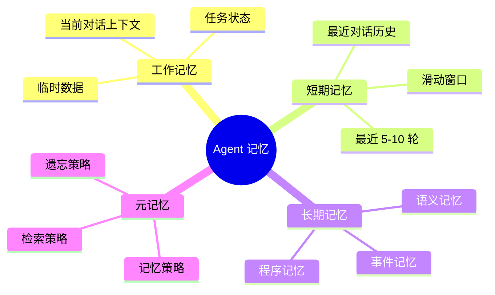
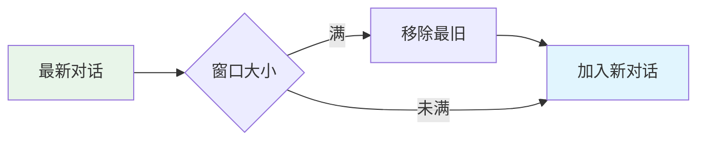
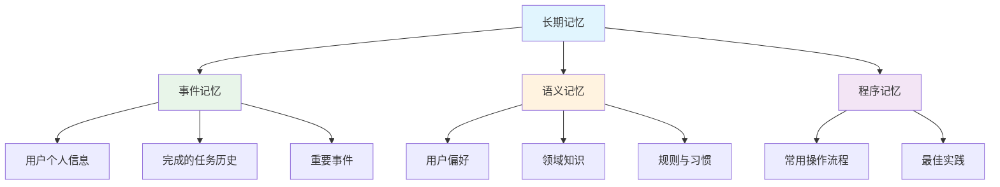
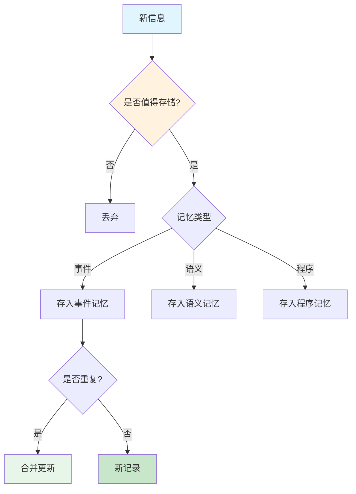

# 💾 记忆系统

> **一句话总结**：记忆系统是 Agent 的"大脑硬盘"，让模型在对话和任务中保持上下文连贯性和经验积累。

## 📋 目录

- [记忆分类](#记忆分类)
- [短期记忆](#短期记忆)
- [长期记忆](#长期记忆)
- [向量数据库](#向量数据库)
- [记忆管理](#记忆管理)

## 🧩 记忆分类



### 记忆层级对比

| 层级 | 容量 | 保留时间 | 检索方式 | 类比 |
|------|------|---------|---------|------|
| 工作记忆 | 几千 Token | 当前会话 | 直接访问 | 工作台面 |
| 短期记忆 | 几万 Token | 数天/周 | 顺序/最近 | 记事本 |
| 长期记忆 | 无限 | 永久 | 语义检索 | 档案库 |
| 程序记忆 | 模型参数 | 永久 | 内隐 | 肌肉记忆 |

## ⏱️ 短期记忆

### 滑动窗口管理



### 摘要压缩

```python
class ShortTermMemory:
    def __init__(self, max_tokens=8000, llm=None):
        self.messages = []
        self.max_tokens = max_tokens
        self.llm = llm
    
    def add_message(self, message):
        self.messages.append(message)
        self._trim_if_needed()
    
    def _trim_if_needed(self):
        """当超出窗口时，使用摘要压缩"""
        current_tokens = count_tokens(self.messages)
        if current_tokens > self.max_tokens:
            # 保留最近 N 轮 + 摘要旧对话
            recent = self.messages[-6:]  # 最近 6 轮
            old = self.messages[:-6]
            summary = self.llm.generate(
                f"请总结以下对话：{''.join(old)}"
            )
            self.messages = [{"role": "system", "content": f"[对话摘要]: {summary}"}] + recent
```

### 关键对话提取

```python
# 不是所有对话都同样重要
importance_score = calculate_importance(message, context)
# 高重要性标记：
# - 用户提供了关键信息
# - 达成了重要决定
# - 触发了异常状态
```

## 📚 长期记忆

### 记忆类型



### 事件记忆存储

```python
@dataclass
class Episode:
    """事件记忆：一次完整的交互事件"""
    timestamp: str
    user_query: str
    agent_action: str
    outcome: str
    metadata: dict
    embedding: list  # 向量表示
    
class EpisodicMemory:
    def __init__(self, vector_store):
        self.store = vector_store
        self.indexed = set()
    
    def store_episode(self, episode: Episode):
        if episode.timestamp in self.indexed:
            return
        self.store.add(episode.embedding, {
            "episode": episode.__dict__,
            "timestamp": episode.timestamp
        })
        self.indexed.add(episode.timestamp)
    
    def retrieve_relevant(self, query: str, top_k=5):
        results = self.store.search(query, top_k=top_k)
        return [r["episode"] for r in results]
```

### 语义记忆构建

```python
# 从事件记忆中提取语义知识
def extract_semantic_memory(episodes: List[Episode], llm):
    """定期从事件记忆中提炼语义知识"""
    prompt = """
    分析以下用户交互事件，提取通用的用户偏好、习惯和知识。
    
    事件列表：
    {episodes}
    
    请提取：
    1. 用户偏好（如编程语言偏好、风格偏好）
    2. 用户习惯（如常用工具、工作流程）
    3. 领域知识（用户关注的技术方向）
    
    以结构化格式输出。
    """
    semantic = llm.generate(prompt.format(episodes=episodes))
    return parse_semantic(semantic)
```

## 🗄️ 向量数据库

### 向量检索流程

```mermaid
sequenceDiagram
    participant Agent as Agent
    participant DB as 向量数据库
    participant Embed as Embedding Model
    
    Agent->>Embed: 编码查询
    Embed-->>Agent: 查询向量
    Agent->>DB: 近似最近邻搜索
    DB-->>Agent: Top-K 相似记忆
    Agent->>Agent: 筛选与排序
    Agent->>Agent: 注入上下文
    
    style Agent fill:#e1f5fe
    style DB fill:#e8f5e9
    style Embed fill:#fff3e0
```

### 常用向量数据库

| 数据库 | 特点 | 适用场景 |
|--------|------|---------|
| **Chroma** | 轻量、嵌入式 | 本地开发、小型项目 |
| **Milvus** | 高性能、分布式 | 大规模向量检索 |
| **Pinecone** | 全托管 SaaS | 快速上线、生产环境 |
| **Weaviate** | 混合搜索 | 向量 + 关键词联合 |
| **Qdrant** | Rust 实现 | 高性能、日本开发 |

### 相似度度量

| 方法 | 公式 | 特点 |
|------|------|------|
| Cosine | $\cos(\theta) = \frac{A \cdot B}{\|A\|\|B\|}$ | 最常用，关注方向 |
| L2 | $d = \|A - B\|_2$ | 关注绝对距离 |
| Dot Product | $A \cdot B$ | 结合大小和方向 |

### Embedding 模型选择

| 模型 | 维度 | 速度 | 质量 | 推荐场景 |
|------|------|------|------|---------|
| text-embedding-3-small | 1536 | 快 | ⭐⭐⭐ | 通用场景 |
| text-embedding-3-large | 3072 | 中 | ⭐⭐⭐⭐⭐ | 高质量检索 |
| bge-large | 1024 | 快 | ⭐⭐⭐⭐ | 开源方案 |
| nomic-embed | 768 | 快 | ⭐⭐⭐⭐ | 本地部署 |

## 🔄 记忆管理

### 记忆写入策略



### 记忆遗忘策略

| 策略 | 描述 | 适用场景 |
|------|------|---------|
| 时间衰减 | 按时间衰减重要性 | 通用 |
| 重要性衰减 | 基于信息重要性 | 长期记忆 |
| 冗余消除 | 合并相似记忆 | 语义记忆 |
| 主动遗忘 | 定期清理低频记忆 | 资源受限 |

### 检索策略

```python
class MemoryRetriever:
    def retrieve(self, context, agent_state):
        """多策略记忆检索"""
        memories = []
        
        # 1. 语义检索（基于内容相似性）
        semantic = self.vector_store.search(
            query=context, top_k=10
        )
        memories.extend(semantic)
        
        # 2. 时间检索（最近的重要记忆）
        temporal = self.get_recent_memories(hours=24, top_k=5)
        memories.extend(temporal)
        
        # 3. 关联检索（相关记忆图遍历）
        related = self.graph_traversal(
            seed=context, depth=2, top_k=5
        )
        memories.extend(related)
        
        # 4. 排序与去重
        return self.rank_and_dedup(memories, context)
```

### 记忆冲突解决

| 冲突类型 | 解决方案 |
|---------|---------|
| 信息矛盾 | 时间优先（新的覆盖旧的） |
| 信息矛盾 | 置信度优先（高可信度覆盖） |
| 信息矛盾 | 请求用户确认 |
| 信息冗余 | 合并相似条目 |

## 📚 延伸阅读

- [MemGPT](https://arxiv.org/abs/2310.08560) — LLM 操作系统
- [Generative Agents](https://arxiv.org/abs/2304.03442) — 虚拟世界记忆
- [Experience Summarization](https://arxiv.org/abs/2307.00577) — 记忆摘要
- [Rapid Learning from Few Examples](https://arxiv.org/abs/2212.12437) — 快速记忆
