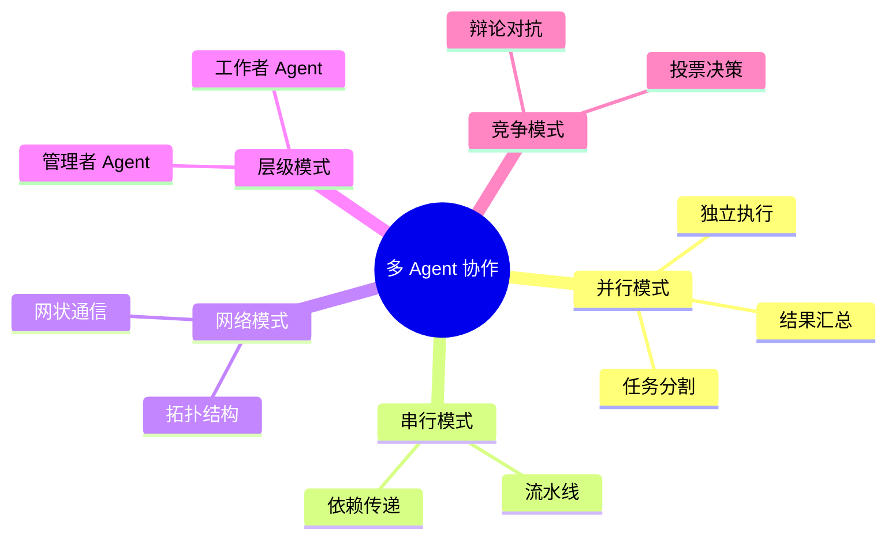
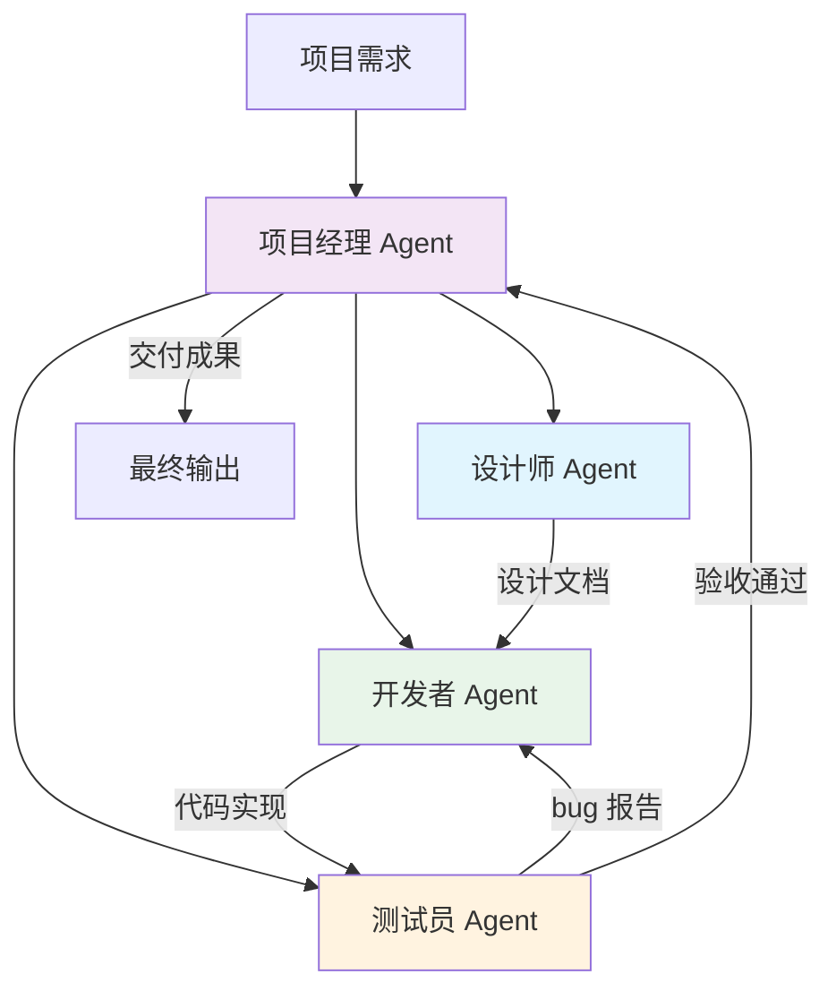
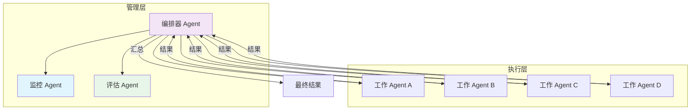
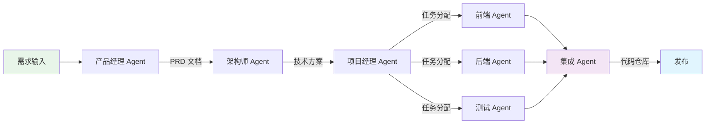

# 👥 多 Agent 协作

> **一句话总结**：多 Agent 协作让多个 Agent 通过分工、辩论和编排，实现单个 Agent 无法完成的复杂任务。

## 📋 目录

- [协作架构](#协作架构)
- [角色分工](#角色分工)
- [辩论机制](#辩论机制)
- [编排框架](#编排框架)
- [实践案例](#实践案例)

## 🏗️ 协作架构

### 协作模式分类



### 架构对比

| 架构 | 通信方式 | 复杂度 | 适用场景 |
|------|---------|--------|---------|
| 并行模式 | 无/最终汇总 | ⭐ | 独立子任务 |
| 串行模式 | 单向传递 | ⭐⭐ | 流程化任务 |
| 网络模式 | 多对多 | ⭐⭐⭐⭐ | 创意协作 |
| 层级模式 | 中心化管理 | ⭐⭐⭐ | 大型组织模拟 |
| 竞争模式 | 对抗/投票 | ⭐⭐⭐ | 决策/评估 |

## 🎭 角色分工

### 经典角色模板



### 角色定义

```python
@dataclass
class AgentRole:
    """Agent 角色定义"""
    name: str
    role: str           # 角色名称
    skills: List[str]   # 核心技能
    system_prompt: str  # 角色提示词
    tools: List[str]    # 可用工具
    
class RoleManager:
    def __init__(self):
        self.roles = {
            "planner": AgentRole(
                name="规划师",
                role="任务分解与规划",
                skills=["task_analysis", "planning"],
                system_prompt="你是一个专业的任务规划师..."
            ),
            "executor": AgentRole(
                name="执行者",
                role="具体任务执行",
                skills=["coding", "writing", "analysis"],
                system_prompt="你是一个专业的执行者..."
            ),
            "reviewer": AgentRole(
                name="评审员",
                role="质量审查与反馈",
                skills=["review", "critique", "evaluation"],
                system_prompt="你是一个严格的质量评审员..."
            ),
        }
```

### 动态角色分配

```python
class DynamicRoleAssignment:
    def assign_roles(self, task: Task, agents: List[Agent]):
        """基于能力匹配动态分配角色"""
        scores = {}
        for agent in agents:
            scores[agent.id] = self.compute_fit_score(
                agent.capabilities, task.required_skills
            )
        
        # 排序并分配
        sorted_agents = sorted(scores.items(), key=lambda x: -x[1])
        role_assignments = {}
        for role, (agent_id, score) in zip(task.roles, sorted_agents):
            if score > self.threshold:
                role_assignments[role] = agent_id
        
        return role_assignments
```

## ⚔️ 辩论机制

### 辩论架构

```mermaid
sequenceDiagram
    participant Q as 问题
    participant M as 裁判 Agent
    participant A as 正方 Agent
    participant B as 反方 Agent
    
    Q->>M: 提出问题
    M->>A: 请给出正方观点
    M->>B: 请给出反方观点
    
    A->>M: 正方论点 + 论据
    B->>M: 反方论点 + 论据
    
    M->>A: 反方质疑，请回应
    A->>M: 回应论证
    
    M->>B: 正方质疑，请回应
    B->>M: 回应论证
    
    M->>M: 综合评估
    M-->>Q: 给出综合结论
    
    style M fill:#f3e5f5
    style A fill:#e8f5e9
    style B fill:#fff3e0
```

### 辩论 Prompt 设计

```
=== 第一轮：观点陈述 ===

正方，请就"{topic}"发表你的观点。提供至少3个论据。

反方，请就"{topic}"发表你的观点。提供至少3个论据。

=== 第二轮：反驳 ===

正方，反方提出以下反对意见：
{反方论点}
请针对每个反对意见进行回应。

反方，正方提出以下论点：
{正方论点}
请针对每个论点进行回应。

=== 第三轮：总结陈词 ===

正方：总结你的核心观点。
反方：总结你的核心观点。

请裁判 Agent 基于以上辩论，给出综合评估。
```

### 集体决策投票

```python
class VotingSystem:
    def vote(self, options: List[str], agents: List[Agent]) -> str:
        """多 Agent 投票决策"""
        votes = {}
        for agent in agents:
            choice = agent.vote(options, context=self.context)
            votes[choice] = votes.get(choice, 0) + 1
        
        # 多数决
        winner = max(votes.items(), key=lambda x: x[1])
        
        # 计算置信度
        confidence = winner[1] / len(agents)
        
        return winner[0], confidence
```

## 📊 编排框架

### 层级编排



### 主流框架对比

| 框架 | 特点 | 协作模式 | 适用场景 |
|------|------|---------|---------|
| **CrewAI** | 角色驱动，易于使用 | 并行 + 串行 | 快速原型 |
| **AutoGen** | 微软出品，灵活 | 多模式 | 复杂对话 |
| **LangGraph** | 图结构工作流 | 任意拓扑 | 复杂流程 |
| **ChatDev** | 软件开发模拟 | 层级 + 并行 | 代码生成 |
| **MetaGPT** | 软件公司模拟 | 层级 | 软件工程 |
| **MultiOn** | 浏览器 Agent 协作 | 并行 | Web 自动化 |

### CrewAI 示例

```python
from crewai import Agent, Task, Crew, Process

# 定义 Agent
researcher = Agent(
    role="市场分析师",
    goal="分析市场趋势并识别机会",
    backstory="你是一位经验丰富的市场分析师...",
    tools=[search_tool, analyzer_tool],
    verbose=True
)

writer = Agent(
    role="内容作家",
    goal="基于分析结果撰写专业报告",
    backstory="你是一位专业的技术文档作家...",
    tools=[writer_tool, formatter_tool]
)

# 定义任务
research_task = Task(
    description="分析{行业}市场的最新趋势",
    agent=researcher,
    expected_output="市场分析报告"
)

write_task = Task(
    description="基于研究报告撰写执行摘要",
    agent=writer,
    expected_output="执行摘要文档"
)

# 组建 Crew
crew = Crew(
    agents=[researcher, writer],
    tasks=[research_task, write_task],
    process=Process.sequential  # 串行执行
)

result = crew.kickoff()
```

### AutoGen 对话模式

```python
import autogen

# 创建 Agent
user_proxy = autogen.UserProxyAgent(
    name="UserProxy",
    human_input_mode="NEVER",
    code_execution_config={"work_dir": "coding"}
)

assistant = autogen.AssistantAgent(
    name="Assistant",
    llm_config={"config_list": [{"model": "gpt-4"}]}
)

# 发起对话
user_proxy.initiate_chat(
    assistant,
    message="请帮我写一个 Python 函数，实现快速排序"
)
```

## 💡 实践案例

### 案例 1：AI 软件公司（MetaGPT）



### 案例 2：研究协作

```
任务：研究"大模型在医疗领域的应用"

1. 搜索 Agent × 3（并行搜索不同方向）
   - 临床应用方向
   - 研发方向
   - 合规方向

2. 分析 Agent × 2（并行分析）
   - 技术趋势分析
   - 市场规模分析

3. 写作 Agent × 1（汇总整合）
   - 综合研究报告
```

## 📊 协作效果对比

| 指标 | 单 Agent | 多 Agent（协作） | 提升 |
|------|---------|-----------------|------|
| 复杂任务完成率 | 45% | 78% | +73% |
| 输出质量评分 | 3.2/5 | 4.1/5 | +28% |
| 步骤效率 | 1.0× | 0.8×（并行） | -20% |
| Token 消耗 | 1.0× | 2.5-5.0× | +150-400% |
| 延迟 | 1.0× | 1.2-3.0× | +20-200% |

> **Pro Tip**：多 Agent 协作的核心不是 Agent 数量，而是**协作架构设计**。一个好的编排方案比多个平庸的 Agent 更有效。

## 📚 延伸阅读

- [CrewAI](https://docs.crewai.com/) — 角色驱动框架
- [AutoGen](https://microsoft.github.io/autogen/) — 微软多 Agent 框架
- [ChatDev](https://arxiv.org/abs/2307.07924) — 虚拟软件公司
- [MetaGPT](https://arxiv.org/abs/2308.00352) — 元学习软件公司
- [Emergent Autonomous Research Scientists](https://arxiv.org/abs/2312.03811) — 多 Agent 科研
