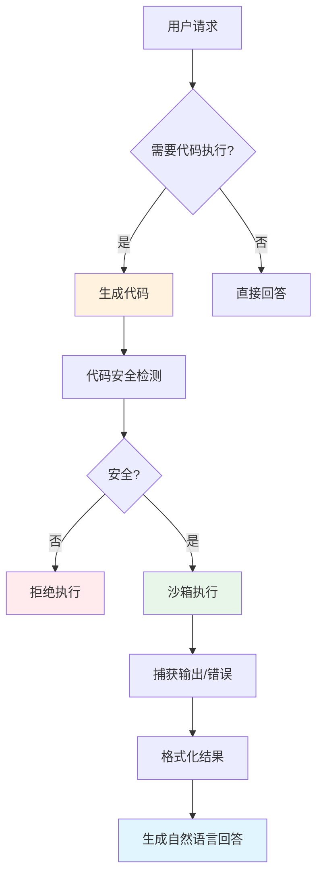
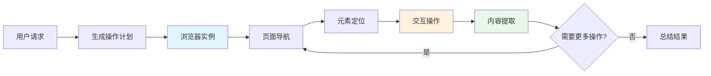
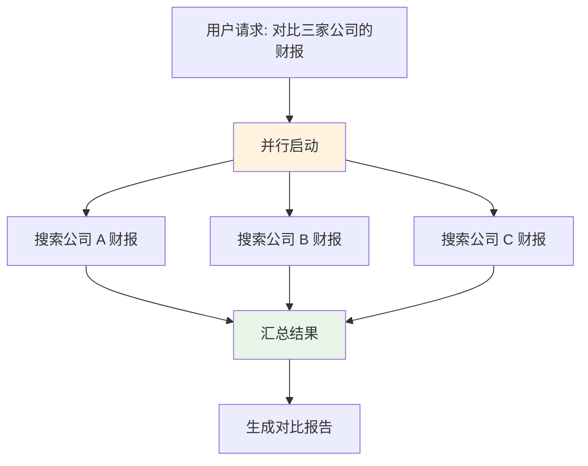

# 🛠️ 工具使用

> **一句话总结**：工具调用让 Agent 突破自身能力的边界，能够使用搜索、计算、编程、浏览器等外部能力来解决复杂问题。

## 📋 目录

- [Function Calling](#function-calling)
- [代码解释器](#代码解释器)
- [浏览器自动化](#浏览器自动化)
- [工具编排](#工具编排)
- [安全考量](#安全考量)

## 🔧 Function Calling

### 工作原理

```mermaid
sequenceDiagram
    participant User as 用户
    participant Agent as Agent
    participant LLM as LLM
    participant Tools as 工具注册表
    
    User->>Agent: "帮我查一下今天的天气"
    Agent->>LLM: 发送对话 + 工具描述
    LLM->>Tools: 分析意图，选择工具
    Tools-->>LLM: 返回工具调用格式
    LLM-->>Agent: {"tool": "get_weather", "args": {"city": "北京"}}
    Agent->>Tools: 执行 get_weather(city="北京")
    Tools-->>Agent: {"temp": 25, "humidity": 60}
    Agent->>LLM: 带回工具结果
    LLM-->>Agent: 生成自然语言回答
    Agent-->>User: "北京今天 25°C，湿度 60%..."
    
    style Agent fill:#e1f5fe
    style LLM fill:#fff3e0
    style Tools fill:#e8f5e9
```

### 工具描述规范（OpenAI 格式）

```json
{
  "name": "get_weather",
  "description": "获取指定城市的天气信息",
  "parameters": {
    "type": "object",
    "properties": {
      "city": {
        "type": "string",
        "description": "城市名称，如'北京'、'New York'"
      },
      "unit": {
        "type": "string",
        "enum": ["celsius", "fahrenheit"],
        "description": "温度单位",
        "default": "celsius"
      }
    },
    "required": ["city"]
  }
}
```

### 多工具选择

```python
tools = [
    {
        "name": "search_web",
        "description": "搜索互联网获取最新信息",
        "parameters": { "query": str }
    },
    {
        "name": "calculate",
        "description": "执行数学计算",
        "parameters": { "expression": str }
    },
    {
        "name": "read_file",
        "description": "读取本地文件内容",
        "parameters": { "path": str }
    },
    {
        "name": "send_email",
        "description": "发送邮件",
        "parameters": { "to": str, "subject": str, "body": str }
    }
]

# Agent 根据意图自动选择最合适的工具
# 用户："计算 123 * 456 + 789 的结果" → 选择 calculate
# 用户："搜索最新的 AI 新闻" → 选择 search_web
```

## 💻 代码解释器

### 架构



### 安全沙箱

```python
class CodeInterpreter:
    def __init__(self):
        self.timeout = 30  # 执行超时（秒）
        self.max_memory = "512M"
        self.blocked_modules = ["os", "subprocess", "sys", "socket"]
    
    def execute(self, code: str) -> ExecutionResult:
        """安全执行 Python 代码"""
        # 1. 语法检查
        try:
            compile(code, '<string>', 'exec')
        except SyntaxError as e:
            return ExecutionResult(error=f"语法错误: {e}")
        
        # 2. 危险模块检测
        for mod in self.blocked_modules:
            if f"import {mod}" in code or f"from {mod}" in code:
                return ExecutionResult(error=f"禁止模块: {mod}")
        
        # 3. 沙箱执行（使用 restrictedpython 或 Docker）
        try:
            with time_limit(self.timeout):
                result = sandbox_execute(code, 
                    globals={"print": safe_print},
                    locals={}
                )
            return ExecutionResult(output=result.stdout, 
                                   error=result.stderr)
        except TimeoutError:
            return ExecutionResult(error="执行超时")
        except Exception as e:
            return ExecutionResult(error=str(e))
```

### 代码生成 Prompt

```
你是一个代码助手。请根据用户的需求生成可执行的 Python 代码。

用户请求：分析 data.csv 中销售额随时间的变化趋势，并画出折线图

要求：
1. 只生成 Python 代码，不要生成其他解释
2. 使用 pandas 处理数据
3. 使用 matplotlib 绘图
4. 代码要能独立运行

代码:
```python
import pandas as pd
import matplotlib.pyplot as plt

df = pd.read_csv('data.csv')
df['date'] = pd.to_datetime(df['date'])
df = df.sort_values('date')

plt.figure(figsize=(12, 6))
plt.plot(df['date'], df['sales'], marker='o')
plt.title('Sales Trend Over Time')
plt.xlabel('Date')
plt.ylabel('Sales')
plt.xticks(rotation=45)
plt.tight_layout()
plt.savefig('sales_trend.png')
plt.show()
```
```

## 🌐 浏览器自动化

### 架构



### 浏览器代理操作

```python
class BrowserAgent:
    def __init__(self, browser: Browser):
        self.browser = browser
        self.page = None
    
    def navigate(self, url: str):
        self.page = self.browser.new_page()
        self.page.goto(url, wait_until="networkidle")
    
    def click(self, selector: str):
        self.page.click(selector)
    
    def fill(self, selector: str, value: str):
        self.page.fill(selector, value)
    
    def extract_text(self, selector: str) -> str:
        return self.page.inner_text(selector)
    
    def take_screenshot(self, path: str):
        self.page.screenshot(path=path)
    
    def auto_fill_search(self, query: str, engine="google"):
        """自动搜索引擎搜索"""
        search_url = {
            "google": f"https://www.google.com/search?q={query}",
            "bing": f"https://www.bing.com/search?q={query}"
        }[engine]
        self.navigate(search_url)
        results = self.extract_text(".g, .tF2Cjf")
        return results
```

## 🔗 工具编排

### 顺序编排


### 条件编排

```python
from enum import Enum

class ToolRouter:
    """根据条件路由到不同工具链"""
    
    async def route(self, user_input):
        intent = self.classify_intent(user_input)
        
        routes = {
            Intent.SEARCH: self.search_workflow,
            Intent.CALCULATE: self.calculate_workflow,
            Intent.CODE: self.code_workflow,
            Intent.EMAIL: self.email_workflow,
        }
        
        workflow = routes.get(intent, self.default_workflow)
        return await workflow(user_input)
```

### 并行编排



## ⚠️ 安全考量

### 工具调用风险

| 风险 | 描述 | 缓解措施 |
|------|------|---------|
| 工具滥用 | Agent 执行非预期工具 | 权限分级 + 审批机制 |
| 注入攻击 | 通过用户输入注入恶意操作 | 输入验证 + 沙箱 |
| 信息泄露 | 敏感数据通过工具外泄 | 数据过滤 + 审计 |
| 无限循环 | Agent 陷入工具调用循环 | 步骤上限 + 超时 |

### 安全策略

```python
class ToolSecurityManager:
    def __init__(self):
        self.allowed_tools = set()  # 白名单
        self.rate_limits = {}       # 速率限制
        self.audit_log = []         # 审计日志
    
    def check_permission(self, tool_name: str, user_id: str) -> bool:
        """检查工具访问权限"""
        if tool_name not in self.allowed_tools:
            return False
        return self.check_rate_limit(tool_name, user_id)
    
    def audit_call(self, tool_name: str, args: dict, result):
        """记录工具调用审计"""
        self.audit_log.append({
            "tool": tool_name,
            "args": args,
            "result_summary": str(result)[:100],
            "timestamp": datetime.now()
        })
```

## 📚 延伸阅读

- [OpenAI Function Calling](https://platform.openai.com/docs/guides/function-calling)
- [Toolformer](https://arxiv.org/abs/2302.04761) — 大模型工具使用
- [Code as Policies](https://arxiv.org/abs/2208.09716) — 代码作为策略
- [WebGPT](https://arxiv.org/abs/2112.09332) — 浏览器操作 Agent
