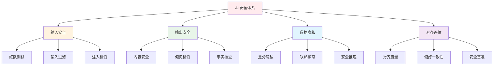

# 🔒 AI 安全与对齐

> **核心目标**：构建 AI 系统的安全防线，包括对抗攻击检测、内容安全过滤、隐私保护、对齐评估等全栈技术。

## 📋 目录

- [红队测试](./red-team/) — 越狱攻击、提示注入、数据泄露
- [内容安全](./content-safety/) — 有害内容检测、偏见评估、事实核查
- [隐私保护](./privacy/) — 差分隐私、联邦学习、安全推理
- [对齐评估](./alignment-eval/) — 对齐度量、人类偏好一致性、红队基准

## 🎯 概述

AI 安全是确保大模型在开放场景中安全、可靠、可控运行的关键技术栈：

### 安全威胁地图

| 威胁类型 | 攻击面 | 影响 |
|---------|--------|------|
| 提示注入 | 用户输入 | 绕过安全限制 |
| 越狱攻击 | 对话交互 | 输出有害内容 |
| 数据泄露 | 模型参数/推理 | 训练数据泄露 |
| 偏见输出 | 模型生成 | 歧视性内容 |
| 幻觉输出 | 模型生成 | 虚假信息传播 |
| 模型窃取 | API 接口 | 知识产权损失 |

## ⚡ 关键技术栈

### 输入侧安全

- **输入过滤**：恶意内容检测、Prompt 注入检测
- **对抗鲁棒性**：对抗样本训练、输入验证
- **权限控制**：基于角色的访问控制、工具调用权限

### 输出侧安全

- **内容过滤**：分类模型实时过滤有害输出
- **事实核查**：RAG + 事实知识库验证
- **偏见审计**：公平性度量 + 偏见缓解

### 训练侧安全

- **安全微调**：Safety SFT / Safety DPO
- **红队对抗**：对抗数据增强训练
- **宪法 AI**：基于原则的自我约束

### 运行时安全

- **实时监测**：推理时异常检测
- **速率限制**：API 调用频率控制
- **审计日志**：完整操作可追溯

## 🔗 相关主题

- [模型训练/对齐](../04-model-training/alignment/) — 对齐算法技术细节
- [架构设计/质量平台](../03-architecture/quality-platform/) — 安全质量保障体系
- [Agent 架构](../01-agent-arch/) — Agent 安全边界设计

## 📚 延伸阅读

- [SPIRED: Safety Evaluation](https://arxiv.org/abs/2403.03082)
- [TrojanLMS](https://arxiv.org/abs/2310.09970) — 安全分析
- [Privacy in LLMs](https://arxiv.org/abs/2310.10683) — 隐私综述
