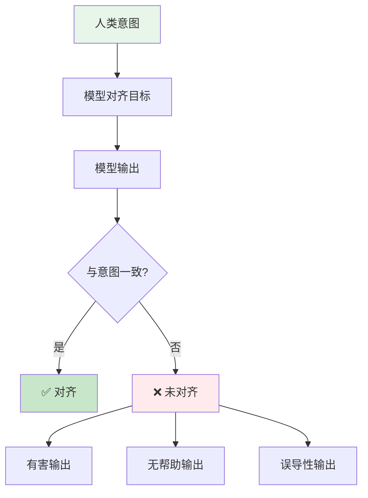
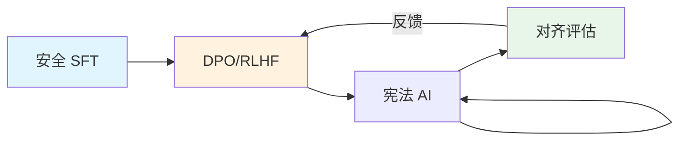
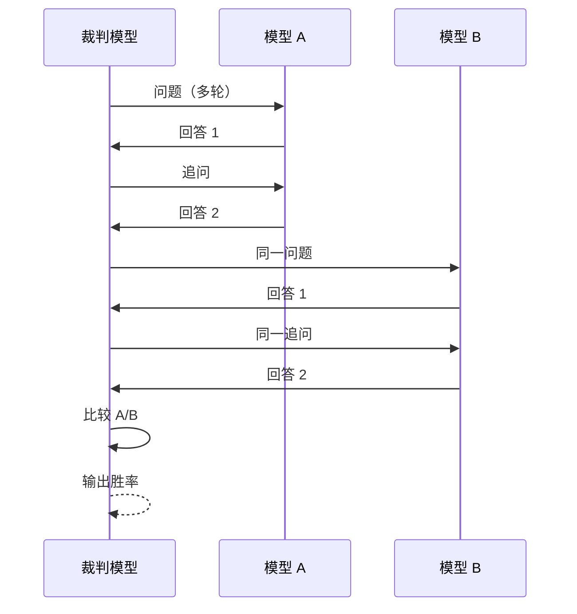
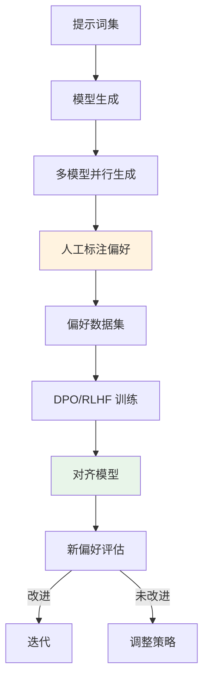
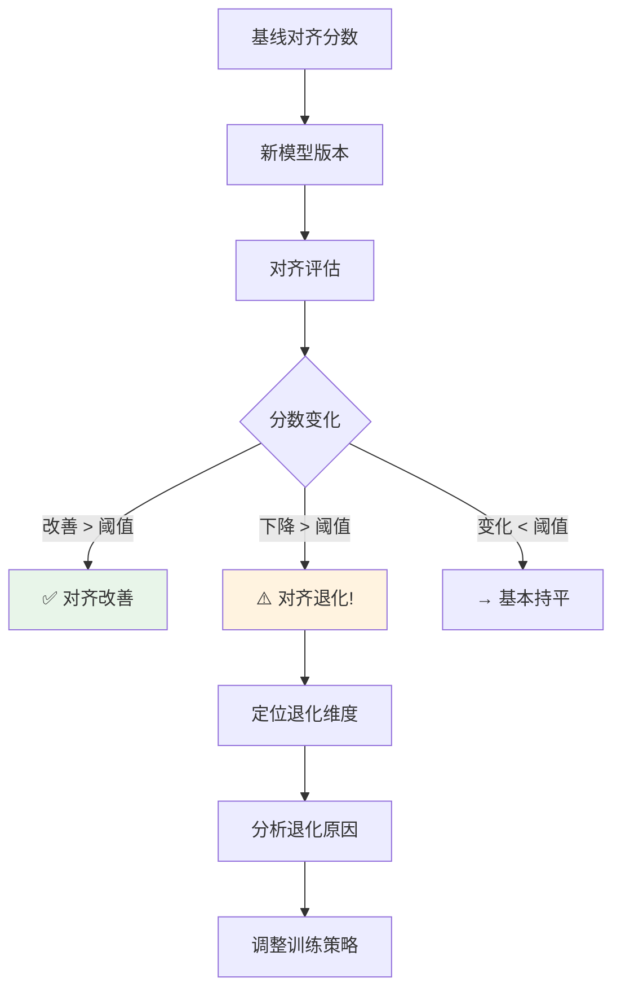
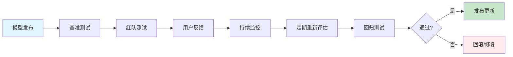

# 📏 对齐评估

> **一句话总结**：对齐评估衡量 AI 系统输出与人类价值观和意图的一致性，是确保安全可控的关键量化手段。

## 📋 目录

- [对齐基础](#对齐基础)
- [评估基准](#评估基准)
- [人类偏好一致性](#人类偏好一致性)
- [对齐度量指标](#对齐度量指标)
- [持续评估](#持续评估)

## 🎯 对齐基础

### 对齐问题定义



### 对齐的三个维度

| 维度 | 目标 | 方法 |
|------|------|------|
| Helpfulness | 有用性 | RLHF / DPO |
| Honesty | 诚实性 | 事实核查 + DPO |
| Harmlessness | 无害性 | 安全 SFT + RLHF |

### 对齐技术栈



## 📊 评估基准

### 主流对齐基准

| 基准 | 覆盖范围 | 规模 | 评估内容 |
|------|---------|------|---------|
| **MT-Bench** | 多轮对话 | 815 题 | 多轮对话能力 |
| ** AlpacaEval** | 开放域 | 805 题 | 指令跟随 |
| **HELM** | 全面评估 | 50+ 场景 | 多维度 |
| **TruthfulQA** | 真实性 | 817 题 | 事实性/谎言 |
| **HH-RLHF** | 安全对齐 | 多层级 | 偏好排序 |
| **GSM8K** | 数学推理 | 8.5K | 推理能力 |
| **MMLU** | 学科知识 | 57 学科 | 知识覆盖 |

### MT-Bench 评估流程



### 自动评估 vs 人工评估

| 方法 | 成本 | 准确性 | 可扩展性 |
|------|------|--------|---------|
| 人工评估 | 高 | ⭐⭐⭐⭐⭐ | 低 |
| LLM-as-Judge | 低 | ⭐⭐⭐⭐ | 高 |
| 规则评估 | 最低 | ⭐⭐ | 最高 |
| 混合评估 | 中 | ⭐⭐⭐⭐⭐ | 中 |

## 👤 人类偏好一致性

### 偏好数据收集



### 偏好数据格式（DPO）

```json
{
  "prompt": "解释量子计算的基本原理",
  "chosen": "量子计算利用量子比特的叠加态...[高质量回答]",
  "rejected": "量子计算就是一种更快的计算机...[低质量回答]"
}
```

### 偏好一致性度量

```python
class PreferenceConsistency:
    def evaluate(self, model, preference_data):
        """评估模型输出与人类偏好的不一致"""
        
        scores = []
        for item in preference_data:
            # 模型生成
            response = model.generate(item.prompt)
            
            # 与 chosen 比较
            chosen_score = self.similarity(response, item.chosen)
            
            # 与 rejected 比较
            rejected_score = self.similarity(response, item.rejected)
            
            # 偏好一致性
            consistent = chosen_score > rejected_score
            scores.append(1 if consistent else 0)
        
        consistency_rate = sum(scores) / len(scores)
        return {
            'consistency_rate': consistency_rate,
            'avg_prefer_score': sum(scores) / len(scores)
        }
```

## 📐 对齐度量指标

### 综合对齐分数

```python
class AlignmentScore:
    def __init__(self):
        self.metrics = {
            'helpfulness': HelpfulnessEvaluator(),
            'honesty': HonestyEvaluator(),
            'harmlessness': HarmlessnessEvaluator(),
            'instruction_following': IFEvaluator(),
        }
    
    def compute(self, model, benchmark):
        """计算综合对齐分数"""
        scores = {}
        for name, evaluator in self.metrics.items():
            scores[name] = evaluator.evaluate(model, benchmark)
        
        # 加权综合
        weights = {
            'helpfulness': 0.35,
            'honesty': 0.25,
            'harmlessness': 0.25,
            'instruction_following': 0.15,
        }
        
        weighted_sum = sum(scores[k] * weights[k] for k in scores)
        scores['alignment_score'] = weighted_sum
        
        return scores
```

### 各维度指标

| 维度 | 指标 | 说明 |
|------|------|------|
| 有用性 | 回复长度/信息密度 | 回答的深度和广度 |
| 诚实性 | 事实准确率 | 与知识库对比 |
| 无害性 | 违规率 | 有害输出比例 |
| 指令跟随 | 指令满足率 | 满足用户指令的比例 |

### 对齐退化检测



## 🔁 持续评估

### 评估流水线



### 监控指标

| 指标 | 监控频率 | 警报阈值 |
|------|---------|---------|
| 对齐分数变化 | 每日 | > 5% |
| 违规输出率 | 实时 | > 1% |
| 用户投诉率 | 每小时 | > 0.1% |
| 新攻击发现 | 每周 | 1+ |

## 📚 延伸阅读

- [MT-Bench](https://arxiv.org/abs/2306.05685) — 多轮对话基准
- [DPO](https://arxiv.org/abs/2305.18290) — 直接偏好优化
- [Constitutional AI](https://arxiv.org/abs/2212.08073) — 宪法 AI
- [LLM-as-Judge](https://arxiv.org/abs/2306.05685) — LLM 裁判
