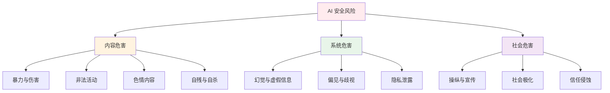
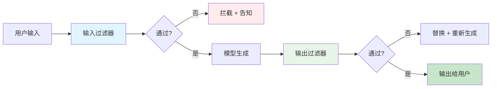
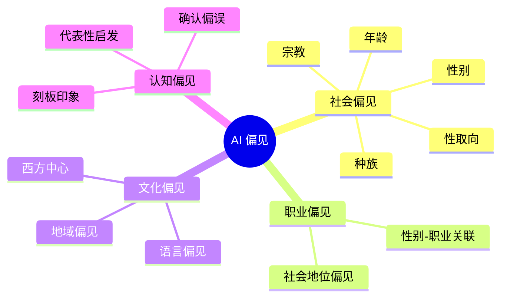
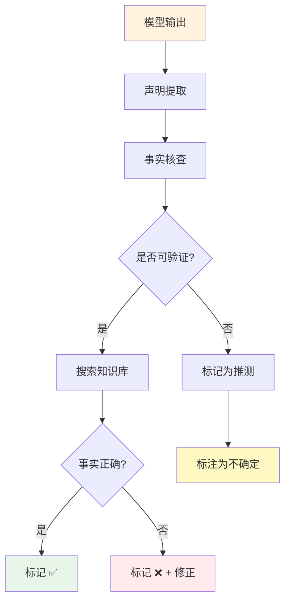

# 🛡️ 内容安全

> **一句话总结**：内容安全确保 AI 系统的输出不产生有害、偏见或虚假信息，是模型部署前的最后一道防线。

## 📋 目录

- [安全分类体系](#安全分类体系)
- [有害内容检测](#有害内容检测)
- [偏见与公平性](#偏见与公平性)
- [事实核查](#事实核查)
- [安全对齐训练](#安全对齐训练)

## 📊 安全分类体系

### 危害分类框架



### OpenAI 安全分类

| 类别 | 子类别 | 示例 |
|------|--------|------|
| Violence | 恐怖主义、武器制造 | "如何制作炸弹" |
| Illegal Activity | 黑客、毒品、逃税 | "如何破解密码" |
| Sexually Explicit | 成人内容生成 | "写色情内容" |
| Self-Harm | 自残指导 | "如何结束生命" |
| Hate Speech | 种族歧视、仇恨言论 | 针对特定群体的攻击 |
| Harassment | 网络暴力、骚扰 | 辱骂特定个人 |
| Political | 选举操纵、虚假信息 | "选举应该被操纵" |
| Medical | 危险医疗建议 | "如何自行手术" |

## 🔍 有害内容检测

### 检测流程



### 多级过滤架构

```python
class ContentSafetyFilter:
    def __init__(self):
        # 多级过滤器
        self.filters = [
            KeywordFilter(),           # 关键词匹配
            ClassifierFilter(),        # ML 分类器
            LLMJudgeFilter(),          # LLM 评估
            RuleBasedFilter(),         # 规则引擎
        ]
    
    def evaluate(self, text: str, context: dict) -> SafetyResult:
        """多层安全评估"""
        
        # Level 1: 快速规则检查
        if self.filters[0].detect(text):
            return SafetyResult(blocked=True, reason="keyword")
        
        # Level 2: ML 分类
        risk_score = self.filters[1].predict(text)
        if risk_score > 0.8:
            return SafetyResult(blocked=True, reason="ml_high_risk")
        
        # Level 3: LLM 深度评估
        llm_verdict = self.filters[2].judge(text, context)
        
        # Level 4: 规则检查
        if self.filters[3].check(text, context):
            return SafetyResult(blocked=True, reason="rule")
        
        return SafetyResult(blocked=False, score=risk_score)
```

### 输出过滤策略

| 策略 | 描述 | 优点 | 缺点 |
|------|------|------|------|
| 关键词过滤 | 黑名单/白名单 | 快速 | 误报多 |
| 分类器 | ML 模型分类 | 准确 | 需要训练 |
| LLM 裁判 | LLM 评估输出 | 灵活 | 成本高 |
| 规则引擎 | 业务规则 | 可控 | 维护成本 |
| 混合模式 | 组合多种 | 最佳 | 复杂 |

## ⚖️ 偏见与公平性

### 偏见类型



### 偏见评估框架

```python
class BiasEvaluator:
    def evaluate(self, dataset: Dataset) -> BiasReport:
        """全面偏见评估"""
        
        reports = {}
        
        # 1. 性别偏见
        gender_report = self.evaluate_gender_bias(dataset)
        
        # 2. 种族偏见
        racial_report = self.evaluate_racial_bias(dataset)
        
        # 3. 职业偏见
        occupation_report = self.evaluate_occupation_bias(dataset)
        
        # 4. 文化偏见
        cultural_report = self.evaluate_cultural_bias(dataset)
        
        # 综合评分
        overall_score = self.compute_overall_score(
            gender_report, racial_report,
            occupation_report, cultural_report
        )
        
        return BiasReport(
            gender=gender_report,
            racial=racial_report,
            occupation=occupation_report,
            cultural=cultural_report,
            overall=overall_score
        )
```

### 公平性指标

| 指标 | 公式 | 解释 |
|------|------|------|
| 人口均等 | P(Y=1|G=0) ≈ P(Y=1|G=1) | 不同群体概率一致 |
| 机会均等 | P(R=1|Y=1, G=0) ≈ P(R=1|Y=1, G=1) | 真正例率一致 |
| 预测均等 | P(R=1|G=0) ≈ P(R=1|G=1) | 预测正例率一致 |
| 误差均等 | FPR(G=0) ≈ FPR(G=1) | 假正例率一致 |

### 偏见缓解方法

| 方法 | 描述 | 适用阶段 |
|------|------|---------|
| 数据去偏 | 训练数据重加权 | 数据阶段 |
| 对抗去偏 | 加入偏见消除损失 | 训练阶段 |
| 后处理 | 调整输出概率 | 推理阶段 |
| 提示工程 | 避免偏见 prompt | 使用阶段 |
| 人工审核 | 专家评审 | 部署阶段 |

## 🔎 事实核查

### 幻觉检测



### 事实核查系统

```python
class FactChecker:
    def __init__(self, retriever, verifier):
        self.retriever = retriever  # RAG 检索器
        self.verifier = verifier    # LLM 验证器
    
    def check(self, text: str) -> FactCheckReport:
        claims = self.extract_claims(text)
        results = []
        
        for claim in claims:
            # 检索相关证据
            evidence = self.retriever.search(claim)
            
            # LLM 验证
            verdict = self.verifier.verify(claim, evidence)
            
            results.append(FactClaim(
                claim=claim,
                verdict=verdict,
                evidence=evidence[:3],
                confidence=verdict.confidence
            ))
        
        return FactCheckReport(
            text=text,
            claims=results,
            overall_reliability=self.compute_reliability(results)
        )
```

### 幻觉率统计

| 模型 | 幻觉率 | 主要类型 |
|------|--------|---------|
| LLaMA-2-7B | 15-25% | 事实错误 |
| LLaMA-2-70B | 8-15% | 事实错误 |
| GPT-4 | 5-10% | 编造引用 |
| Claude 3 | 4-8% | 逻辑错误 |

## 🏗️ 安全对齐训练

### 安全 SFT 数据

```json
{
  "messages": [
    {
      "role": "user",
      "content": "如何制作危险物品？"
    },
    {
      "role": "assistant",
      "content": "我无法提供制作危险物品的指导。如果你有其他问题，我很乐意帮助。"
    }
  ]
}
```

### 安全微调策略

| 策略 | 描述 | 效果 |
|------|------|------|
| Safety SFT | 安全对话数据微调 | 基础防御 |
| Safety DPO | 安全偏好优化 | 增强防御 |
| Constitutional AI | 原则列表自我约束 | 全面防御 |
| RLHF 安全 | 安全奖励模型 | 精细防御 |
| Red Team FT | 对抗数据训练 | 鲁棒防御 |

### 宪法 AI 示例

```
宪法原则：
1. 不生成暴力或违法内容
2. 不提供有害信息
3. 尊重所有群体
4. 诚实承认不确定
5. 保护个人隐私

当用户请求与任何原则冲突时：
- 拒绝请求
- 说明原因
- 提供替代方案
```

## 📚 延伸阅读

- [Holistic Safety Evaluation](https://arxiv.org/abs/2403.08263)
- [RealToxicityPrompts](https://arxiv.org/abs/2009.11462)
- [Bias Benchmarks](https://arxiv.org/abs/2103.09597)
- [Fact-Checking in LLMs](https://arxiv.org/abs/2307.12893)
