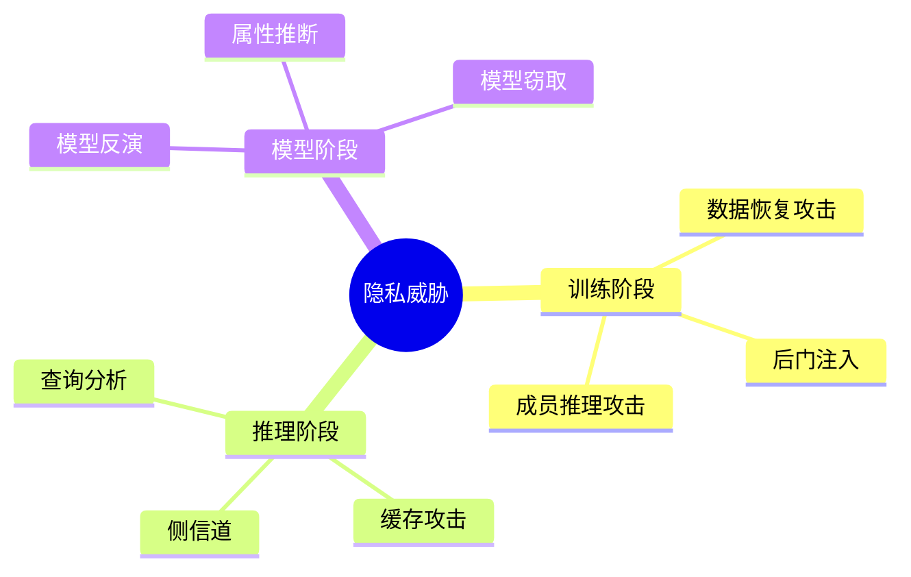
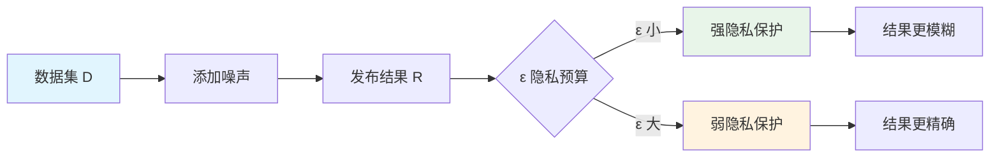
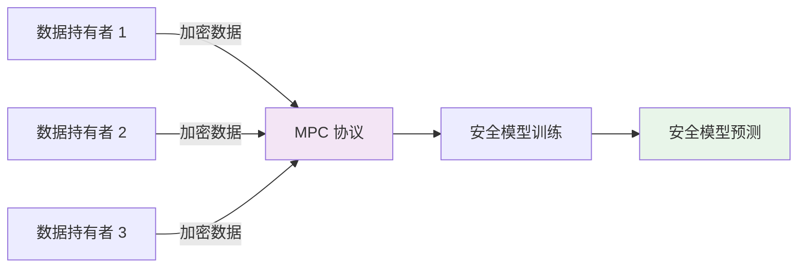
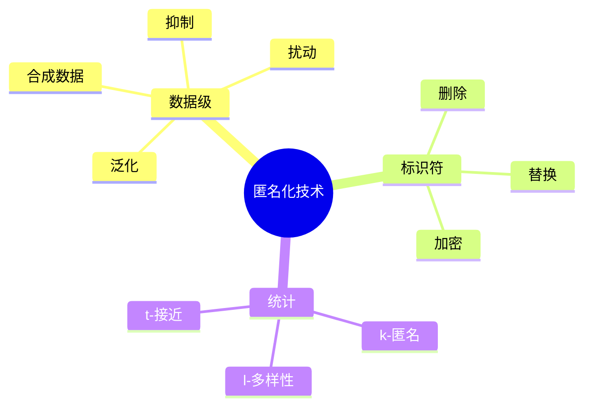

# 🔐 隐私保护

> **一句话总结**：隐私保护在 AI 训练中防止敏感数据泄露，在推理中保护用户隐私，同时保持模型效用。

## 📋 目录

- [隐私威胁](#隐私威胁)
- [差分隐私](#差分隐私)
- [联邦学习](#联邦学习)
- [安全多方计算](#安全多方计算)
- [数据匿名化](#数据匿名化)

## ⚠️ 隐私威胁

### 隐私泄露攻击类型



### 威胁模型

| 威胁者 | 能力 | 目标 |
|--------|------|------|
| 外部攻击者 | API 查询 | 提取训练数据 |
| 半诚实内部 | 访问模型参数 | 恢复敏感信息 |
| 恶意同谋 | 访问训练日志 | 推断用户数据 |
| 侧信道攻击者 | 观测运行时间 | 推断输入数据 |

## 📐 差分隐私

### 核心概念



### 差分隐私公式

$$DP: P(M(D) \in S) \leq e^\epsilon \times P(M(D') \in S) + \delta$$

其中 $D$ 和 $D'$ 仅相差一条记录。

### DP-SGD 实现

```python
class DPSGDTrainer:
    def __init__(self, model, epsilon, delta, clip_norm):
        self.model = model
        self.epsilon = epsilon
        self.delta = delta
        self.clip_norm = clip_norm
        self.noise_multiplier = self.compute_noise()
    
    def compute_noise(self):
        """计算噪声系数"""
        # 基于 (ε, δ)-DP 公式计算
        return (clip_norm * math.sqrt(2 * math.log(1.25 / delta))) / epsilon
    
    def train_step(self, batch):
        """差分隐私训练步骤"""
        # 1. 计算每个样本的梯度
        gradients = []
        for sample in batch:
            grad = compute_gradient(self.model, sample)
            # 2. 梯度裁剪
            grad = clip_gradient(grad, self.clip_norm)
            gradients.append(grad)
        
        # 3. 聚合梯度
        mean_grad = torch.stack(gradients).mean(dim=0)
        
        # 4. 添加高斯噪声
        noise = torch.randn_like(mean_grad) * self.noise_multiplier
        noisy_grad = mean_grad + noise
        
        # 5. 更新模型
        self.model.apply_gradient(noisy_grad)
```

### 隐私预算追踪

| ε 值 | 保护强度 | 适用场景 |
|------|---------|---------|
| 1.0 | 极高 | 医疗数据 |
| 5.0 | 高 | 金融数据 |
| 10.0 | 中高 | 一般个人数据 |
| 100.0 | 中 | 公开数据集 |

## 🌐 联邦学习

### 联邦学习架构

```mermaid
sequenceDiagram
    participant Server as 中央服务器
    participant C1 as 客户端 1
    participant C2 as 客户端 2
    participant C3 as 客户端 3
    
    Server->>C1: 发送全局模型
    Server->>C2: 发送全局模型
    Server->>C3: 发送全局模型
    
    C1->>C1: 本地训练
    C2->>C2: 本地训练
    C3->>C3: 本地训练
    
    C1-->>Server: 上传模型更新
    C2-->>Server: 上传模型更新
    C3-->>Server: 上传模型更新
    
    Server->>Server: 聚合更新
    Server->>C1: 发送新全局模型
    Server->>C2: 发送新全局模型
    Server->>C3: 发送新全局模型
    
    style Server fill:#f3e5f5
    style C1 fill:#e1f5fe
    style C2 fill:#e8f5e9
    style C3 fill:#fff3e0
```

### 联邦聚合算法

| 算法 | 描述 | 鲁棒性 |
|------|------|--------|
| FedAvg | 简单平均 | 低 |
| FedProx | 加入 proximal 项 | 中 |
| FedMedian | 中值聚合 | 高 |
| Krum | 基于距离选择 | 高 |
| Trimmed Mean | 修剪均值 | 高 |

### FedAvg 实现

```python
class FedAvgServer:
    def __init__(self, model, n_clients, round_fraction=0.1):
        self.model = model
        self.n_clients = n_clients
        self.round_fraction = round_fraction
    
    def train_round(self, clients, local_epochs=5, batch_size=32):
        """单个联邦训练轮次"""
        # 1. 选择活跃客户端
        active_clients = random.sample(clients, 
            int(len(clients) * self.round_fraction))
        
        # 2. 发送全局模型
        global_weights = self.model.get_weights()
        
        # 3. 收集本地更新
        updates = []
        for client in active_clients:
            local_model = client.train(local_weights, 
                local_epochs, batch_size)
            update = local_model.get_weights() - global_weights
            updates.append((client.data_size, update))
        
        # 4. 加权聚合
        total_size = sum(size for size, _ in updates)
        aggregated = np.zeros_like(global_weights)
        for size, update in updates:
            aggregated += (size / total_size) * update
        
        # 5. 更新全局模型
        self.model.set_weights(global_weights + aggregated)
        
        return self.evaluate()
```

### 隐私保护联邦

```python
class PrivacyPreservingFedAvg:
    def __init__(self, server, dp_epsilon, secure_aggregation=True):
        self.server = server
        self.epsilon = dp_epsilon
        self.secure_agg = secure_aggregation
    
    def secure_aggregate(self, updates):
        """安全聚合：服务器只看到和，看不到单个更新"""
        # 使用同态加密或秘密共享
        encrypted_updates = [self.encrypt(u) for u in updates]
        # 服务器只能解密总和
        aggregated = self.decrypt_sum(encrypted_updates)
        return aggregated
```

## 🔒 安全多方计算

### MPC 在 AI 中的应用



### MPC 技术方案

| 方案 | 通信复杂度 | 计算复杂度 | 适用场景 |
|------|-----------|-----------|---------|
| GMW | O(n) | O(n) | 两方计算 |
| SPDZ | O(n) | O(n²) | 多方计算 |
| TFHE | O(log n) | O(n log n) | 同态加密 |
| Secret Sharing | O(n²) | O(n²) | 通用场景 |

## 🧹 数据匿名化

### 匿名化技术



### k-匿名模型

```python
class KAnonymizer:
    def __init__(self, k):
        self.k = k
    
    def anonymize(self, df: pd.DataFrame) -> pd.DataFrame:
        """实现 k-匿名"""
        # 1. 识别准标识符
        quasi_identifiers = self.identify_qi(df)
        
        # 2. 泛化函数
        generalization_hierarchy = {
            'age': [0, 10, 20, 30, 40, 50, 60, 70, 80, 90],
            'zip_code': ['*', '123', '1234', '12345'],
            'gender': {0: 'M', 1: 'F'}
        }
        
        # 3. 划分等价类
        equivalence_classes = df.groupby(quasi_identifiers)
        
        # 4. 确保每类大小 >= k
        for name, group in equivalence_classes:
            if len(group) < self.k:
                df = self.suppress_or_generalize(df, group)
        
        return df
```

### 隐私保护等级

| 等级 | 技术 | 保护强度 | 数据效用 |
|------|------|---------|---------|
| 原始 | 无 | 无 | 100% |
| L1 | 删除标识符 | 低 | 80% |
| L2 | 泛化 | 中 | 60% |
| L3 | k-匿名 | 中高 | 50% |
| L4 | 差分隐私 | 高 | 30-70% |
| L5 | 联邦 + DP | 最高 | 25-65% |

## 📚 延伸阅读

- [Differential Privacy](https://arxiv.org/abs/1607.02087) — DP 综述
- [Federated Learning](https://arxiv.org/abs/1902.01046) — 联邦学习综述
- [PrivateAgg](https://arxiv.org/abs/1709.02753) — 安全聚合
- [DP-SGD](https://arxiv.org/abs/1607.02533) — 差分隐私 SGD
