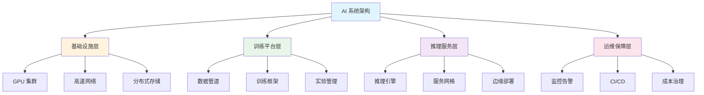

# 🏗️ 架构设计

> **核心目标**：掌握 AI 系统的全栈架构设计，包括云原生基础设施、分布式训练推理、CI/CD 集成、指标监控和平台持续演进。

## 📋 目录

- [分布式训练](./distributed/) — 数据并行、模型并行、流水线并行、张量并行
- [云平台基础设施](./cloud-infra/) — GPU 集群管理、资源调度、成本优化
- [编程范式](./programming/) — CUDA、Triton、算子优化
- [CI/CD 集成](./cicd-integration/) — 模型流水线、自动化测试、部署策略
- [指标体系](./metrics/) — 性能监控、质量评估、可观测性
- [质量平台](./quality-platform/) — QA 流程、自动化质量门禁
- [平台演进](./platform-evolution/) — 技术债务管理、版本策略、迁移

## 🎯 概述

AI 系统架构与传统软件架构有本质不同，需要在算力、数据、模型复杂度之间取得平衡：

## 📊 架构演进阶段

| 阶段 | 架构模式 | 规模 | 典型场景 |
|------|---------|------|---------|
| v1.0 | 单体 | <100M 参数 | 实验验证 |
| v2.0 | 模块化 | <1B 参数 | 产品原型 |
| v3.0 | 微服务 | 1-7B 参数 | 小规模生产 |
| v4.0 | 云原生 | 7-70B 参数 | 大规模生产 |
| v5.0 | 分布式 | 100B+ 参数 | 超大规模 |

## ⚡ 关键指标

| 指标 | 说明 | 目标 |
|------|------|------|
| 训练吞吐量 | TFLOPS/GPU | >70% 峰值 |
| 推理延迟 P99 | ms | <100ms (短文本) |
| 训练成本 | $ / 1T tokens | 持续下降 |
| 可用率 | % | >99.9% |
| 资源利用率 | GPU% | >60% |

## 🔗 相关主题

- [模型训练](../04-model-training/) — 分布式训练架构
- [服务端平台](../05-server-platform/) — 基础设施与部署
- [稳定性](../06-stability/) — 架构稳定性保障
- [Agent 架构](../01-agent-arch/) — Agent 系统架构

## 📚 延伸阅读

- [Megatron-LM](https://arxiv.org/abs/1909.08053) — 张量并行
- [DeepSpeed](https://arxiv.org/abs/2207.00032) — 大规模训练
- [ModelSharding](https://arxiv.org/abs/2104.03155) — 分布式训练
