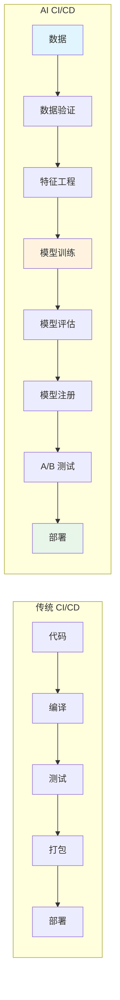
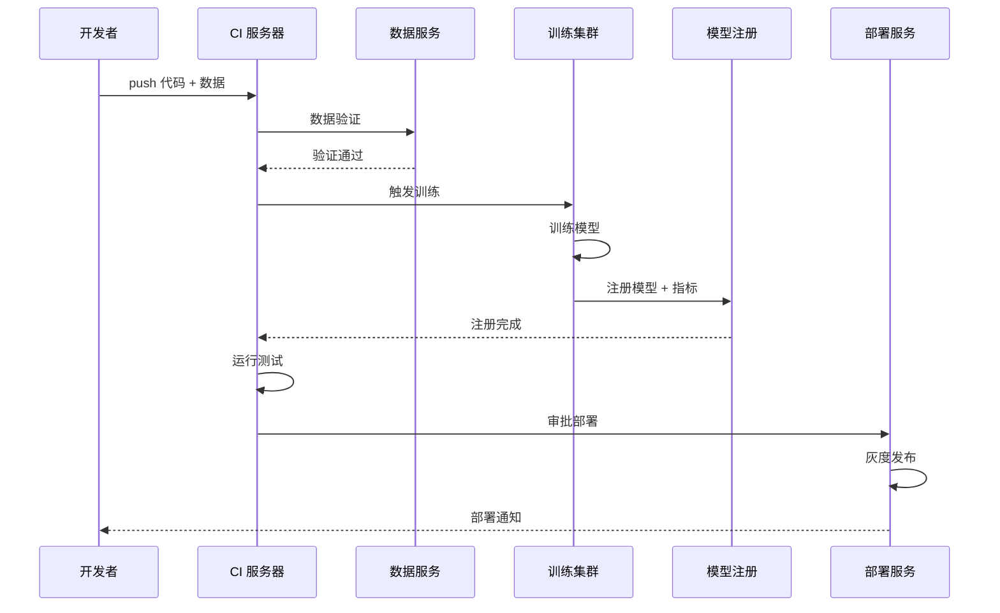
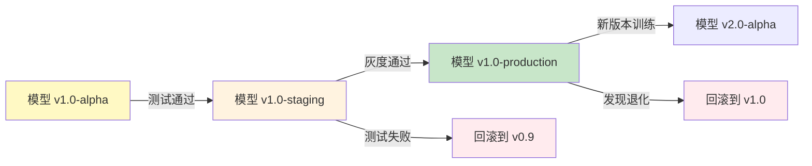

# 🔄 CI/CD 集成

> **一句话总结**：AI 模型 CI/CD 将传统 DevOps 实践扩展到模型生命周期，实现从数据处理到模型部署的全自动化的可靠交付。

## 📋 目录

- [AI CI/CD 架构](#ai-cicd-架构)
- [模型构建流水线](#模型构建流水线)
- [自动化测试](#自动化测试)
- [部署策略](#部署策略)
- [模型注册与管理](#模型注册与管理)
- [回滚与治理](#回滚与治理)

## 🏗️ AI CI/CD 架构

### 与传统 CI/CD 的区别



### AI 流水线阶段

| 阶段 | 输入 | 输出 | 自动化程度 |
|------|------|------|-----------|
| 数据验证 | 原始数据 | 验证报告 | 100% |
| 特征工程 | 清洗数据 | 特征集 | 90% |
| 实验追踪 | 实验配置 | 模型权重 | 95% |
| 模型评估 | 训练模型 | 评估报告 | 100% |
| 模型注册 | 评估通过的模型 | 模型版本 | 100% |
| 部署 | 注册模型 | 线上服务 | 95% |

## 🏭 模型构建流水线

### 完整流水线设计



### CI/CD 配置示例

```yaml
# GitHub Actions 示例
name: AI Model Pipeline

on:
  push:
    branches: [main]

jobs:
  data-validation:
    runs-on: ubuntu-latest
    steps:
      - uses: actions/checkout@v3
      - name: Validate data
        run: python scripts/validate_data.py
      - name: Upload results
        uses: actions/upload-artifact@v3
        with:
          name: validation-report
          path: reports/

  train:
    needs: data-validation
    runs-on: [self-hosted, gpu]
    steps:
      - uses: actions/checkout@v3
      - name: Train model
        run: python train.py --config configs/model.yaml
      - name: Evaluate
        run: python evaluate.py
      - name: Register model
        run: mlflow models register
        env:
          MLFLOW_TRACKING_URI: ${{ secrets.MLFLOW_URI }}

  deploy:
    needs: train
    runs-on: ubuntu-latest
    steps:
      - name: Deploy to staging
        run: kubectl apply -f k8s/staging/
      - name: Smoke test
        run: python tests/smoke_test.py
      - name: Promote to production
        if: success()
        run: kubectl apply -f k8s/production/
```

## ✅ 自动化测试

### AI 测试金字塔

```mermaid
pyramid
    title AI 测试金字塔
    unit tests: 单元测试
    integration: 集成测试
    e2e: 端到端测试
    production: 生产监控
    
    unit tests: 500
    integration: 50
    e2e: 10
    production: 持续
```

### 测试类型

| 测试类型 | 内容 | 工具 |
|---------|------|------|
| 数据测试 | 数据完整性、分布一致性 | Great Expectations |
| 数据质量 | 缺失值、异常值检测 | Pandera |
| 单元测试 | 特征工程、工具函数 | pytest |
| 集成测试 | 训练管线端到端 | pytest + fixture |
| 模型测试 | 性能阈值、漂移检测 | MLflow + Evidently |
| 回归测试 | 与基线模型对比 | Custom metrics |
| 安全测试 | 越狱、偏见检测 | 自定义测试集 |

### 模型测试示例

```python
import pytest
import numpy as np

class TestModelPerformance:
    @pytest.fixture
    def model(self):
        return load_registered_model("my-model:v1.2")
    
    def test_accuracy_threshold(self, model):
        """测试准确率阈值"""
        accuracy = evaluate(model, test_dataset)
        assert accuracy >= 0.85, f"准确率 {accuracy} 低于阈值 0.85"
    
    def test_inference_latency(self, model):
        """测试推理延迟"""
        latencies = measure_latency(model, sample_data, n_runs=100)
        p99_latency = np.percentile(latencies, 99)
        assert p99_latency < 100, f"P99 延迟 {p99_latency}ms 超过 100ms"
    
    def test_drift_detection(self, model):
        """检测数据漂移"""
        drift_score = check_drift(model, production_data, baseline_data)
        assert drift_score < 0.1, f"漂移分数 {drift_score} 超过阈值"
    
    def test_safety_check(self, model):
        """安全测试"""
        jailbreak_results = test_jailbreaks(model, attack_set)
        failure_rate = sum(r.failed for r in jailbreak_results) / len(jailbreak_results)
        assert failure_rate < 0.01, f"越狱成功率 {failure_rate} 超过阈值"
```

## 🚀 部署策略

### 部署模式对比

| 模式 | 描述 | 优点 | 缺点 | 适用场景 |
|------|------|------|------|---------|
| 直接部署 | 直接替换旧模型 | 简单快速 | 风险高 | 低风险模型 |
| 蓝绿部署 | 新旧并行，切换流量 | 快速回滚 | 资源翻倍 | 生产环境 |
| 灰度发布 | 逐步增加新流量比例 | 风险最小 | 需要 A/B | 关键业务 |
| Canary | 小比例用户先体验 | 真实反馈 | 复杂 | 重大更新 |

### 灰度发布实现

```python
class CanaryDeployment:
    def __init__(self, new_model, old_model, gateway):
        self.new_model = new_model
        self.old_model = old_model
        self.gateway = gateway
        self.canary_percentage = 0.0  # 从 0% 开始
    
    def start_canary(self, increment=5.0):
        """开始灰度，每次增加 5%"""
        self.canary_percentage = min(
            self.canary_percentage + increment, 100.0
        )
        self.gateway.update_traffic(
            new_model=self.new_model,
            old_model=self.old_model,
            new_percentage=self.canary_percentage
        )
        return self.canary_percentage
    
    def check_metrics(self):
        """检查关键指标"""
        metrics = {
            "error_rate": self.gateway.get_error_rate(),
            "latency_p99": self.gateway.get_p99_latency(),
            "model_score": self.new_model.evaluate(),
        }
        return self.is_safe(metrics)
    
    def is_safe(self, metrics):
        """判断是否安全"""
        return (
            metrics["error_rate"] < 0.01 and
            metrics["latency_p99"] < 200 and
            metrics["model_score"] > 0.85
        )
    
    def can_promote(self):
        """判断是否可以全量推广"""
        metrics = self.check_metrics()
        return (
            self.canary_percentage >= 100.0 and
            self.is_safe(metrics)
        )
```

## 📦 模型注册与管理

### MLflow 模型注册

```python
import mlflow

# 训练完成后注册模型
with mlflow.start_run() as run:
    # 训练代码...
    model_uri = f"runs:/{run.info.run_id}/model"
    
    # 注册到模型仓库
    mlflow.register_model(
        model_uri=model_uri,
        name="customer-churn-predictor",
        tags={
            "version": "1.0",
            "author": "ml-team",
            "description": "Customer churn prediction model"
        }
    )

# 获取模型
model = mlflow.pyfunc.load_model(
    "models:/customer-churn-predictor/production"
)
```

### 模型版本管理



## 🔄 回滚与治理

### 自动回滚策略

```python
class RollbackManager:
    def __init__(self):
        self.metrics = MetricMonitor()
        self.deployer = DeploymentManager()
    
    def monitor_and_rollback(self, model_version, timeout=300):
        """监控并自动回滚"""
        start_time = time.time()
        
        while time.time() - start_time < timeout:
            metrics = self.metrics.get_current()
            
            if self.is_degraded(metrics, model_version):
                self.rollback(model_version)
                return True
        
        return False
    
    def is_degraded(self, metrics, baseline):
        """检测性能退化"""
        return (
            metrics["error_rate"] > baseline["error_rate"] * 1.5 or
            metrics["latency_p99"] > baseline["latency_p99"] * 2 or
            metrics["drift_score"] > 0.2
        )
    
    def rollback(self, model_version):
        """回滚到上一版本"""
        previous_version = self.get_previous_version(model_version)
        self.deployer.switch_to(previous_version)
        self.notify_team(
            f"Auto-rollback: {model_version} -> {previous_version}"
        )
```

## 📚 延伸阅读

- [MLOps Maturity Model](https://arxiv.org/abs/2209.09141)
- [MLflow](https://mlflow.org/) — 模型生命周期管理
- [Kubeflow Pipelines](https://www.kubeflow.org/) — 云原生 ML 平台
