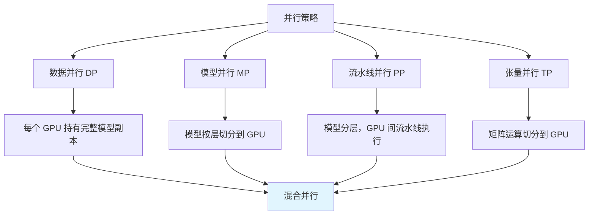
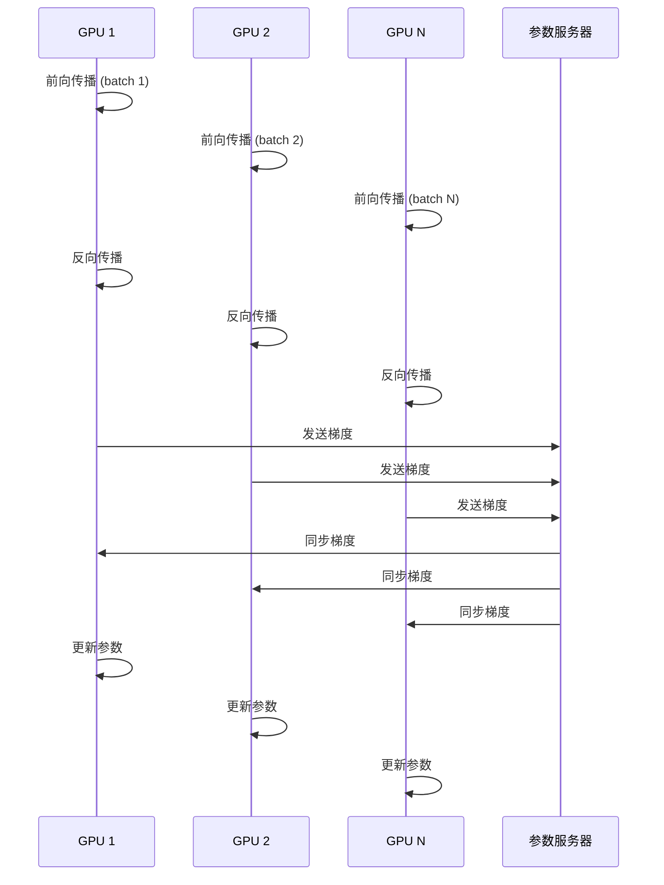
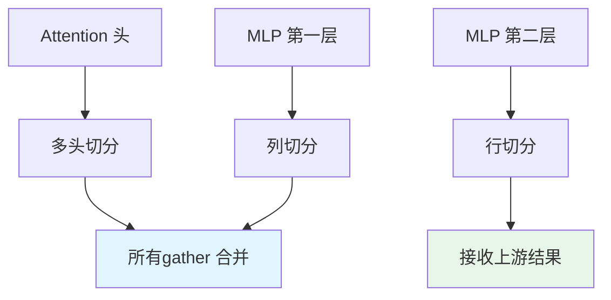

# 🌐 分布式训练

> **一句话总结**：分布式训练将大模型训练任务分配到多个计算节点上，解决单机无法处理的模型规模和训练效率问题。

## 📋 目录

- [并行策略概览](#并行策略概览)
- [数据并行](#数据并行)
- [模型并行](#模型并行)
- [流水线并行](#流水线并行)
- [张量并行](#张量并行)
- [混合并行](#混合并行)
- [通信优化](#通信优化)

## 📊 并行策略概览

### 并行策略矩阵



### 策略对比

| 策略 | 显存节省 | 通信开销 | 计算效率 | 实现难度 |
|------|---------|---------|---------|---------|
| DP | N 倍 | 中（梯度同步） | 高（~100%） | 低 |
| PP | 1/k 倍 | 中（激活传递） | 中（气泡） | 中 |
| TP | 1/k 倍 | 高（all-gather） | 高（~95%） | 中 |
| DP+PP | N/k 倍 | 高 | 中 | 高 |
| DP+TP | N 倍 | 中 | 高 | 中 |
| DP+PP+TP | N/k² 倍 | 很高 | 中 | 很高 |

## 🔄 数据并行

### 工作原理



### DP 实现

```python
import torch.distributed as dist

class DataParallelTrainer:
    def __init__(self, model, devices):
        self.model = model
        self.devices = devices
        dist.init_process_group(backend='nccl')
        self.model = torch.nn.parallel.DistributedDataParallel(
            model,
            device_ids=[devices[0]],
            output_device=devices[0]
        )
    
    def train_step(self, batch):
        # 每个 GPU 获取部分数据
        local_batch = batch.partition(self.global_rank)
        
        # 前向传播
        loss = self.model(local_batch)
        
        # 反向传播 + 梯度同步
        loss.backward()
        
        # 梯度平均（DistributedDataParallel 自动完成）
        return loss.item()
```

### 梯度累积

```python
# 当 batch size 受显存限制时
gradient_accumulation_steps = 4

for i, batch in enumerate(dataloader):
    output = model(batch)
    loss = criterion(output, labels) / gradient_accumulation_steps
    loss.backward()
    
    if (i + 1) % gradient_accumulation_steps == 0:
        optimizer.step()
        optimizer.zero_grad()
```

## 📐 模型并行

### 层间模型并行


### 层内模型并行（按头/通道）

```python
class TensorModelParallel:
    """张量并行：将大矩阵切分到多个 GPU"""
    
    def __init__(self, world_size):
        self.world_size = world_size
        self.rank = dist.get_rank()
    
    def split_column(self, weight, bias=None):
        """列切分：将输出通道切分"""
        shard_size = weight.shape[0] // self.world_size
        start = self.rank * shard_size
        end = start + shard_size
        return weight[start:end, :], bias[start:end] if bias else None
    
    def split_row(self, weight, bias=None):
        """行切分：将输入通道切分"""
        shard_size = weight.shape[1] // self.world_size
        start = self.rank * shard_size
        end = start + shard_size
        return weight[:, start:end], bias
```

## 🔧 流水线并行

### 微流水线

```mermaid
gantt
    title 流水线并行微批次调度
    dateFormat X
    axisFormat %s
    
    section GPU 0
    FB1 :0, 2
    BB2 :2, 3
    FB2 :3, 5
    BB3 :5, 6
    
    section GPU 1
    Bubble :0, 1
    FB2 :1, 3
    BB3 :3, 4
    FB3 :4, 6
    
    section GPU 2
    Bubble :0, 2
    Bubble :2, 3
    FB3 :3, 5
    BB4 :5, 6
```



### 流水线并行实现

```python
class PipelineParallelModel:
    def __init__(self, model, n_stages):
        self.stages = self.split_model(model, n_stages)
        self.n_stages = n_stages
        self.rank = dist.get_rank()
    
    def forward(self, inputs):
        """流水线前向传播"""
        x = inputs.to(self.rank)
        for stage in self.stages:
            if stage.rank == self.rank:
                x = stage(x)
            if dist.get_rank() == 0 and stage.rank == self.rank:
                # 发送下一个 GPU
                dist.send(x, stage.rank + 1)
            else:
                x = dist.recv(x, stage.rank - 1)
        return x
    
    def backward(self, loss):
        """流水线反向传播"""
        loss.backward()
        # 梯度同步
```

## 🔢 张量并行

### Transformer 中的张量并行



### Megatron-LM 张量并行

```python
class ColumnParallelLinear(nn.Module):
    """列并行线性层"""
    def __init__(self, in_features, out_features, tp_size, rank):
        super().__init__()
        self.tp_size = tp_size
        self.rank = rank
        self.out_features_per_gpu = out_features // tp_size
        
        self.weight = nn.Parameter(
            torch.empty(self.out_features_per_gpu, in_features)
        )
        self.bias = nn.Parameter(
            torch.empty(self.out_features_per_gpu)
        )
    
    def forward(self, x):
        output = F.linear(x, self.weight) + self.bias
        # 合并其他 GPU 的输出
        if self.tp_size > 1:
            output = self._all_gather(output)
        return output

class RowParallelLinear(nn.Module):
    """行并行线性层"""
    def __init__(self, in_features, out_features, tp_size, rank):
        super().__init__()
        self.tp_size = tp_size
        self.rank = rank
        self.in_features_per_gpu = in_features // tp_size
        
        self.weight = nn.Parameter(
            torch.empty(out_features, self.in_features_per_gpu)
        )
        self.bias = nn.Parameter(torch.empty(out_features))
    
    def forward(self, x):
        # 接收上游的 all-gather 结果
        if self.tp_size > 1:
            x = self._all_gather(x)
        output = F.linear(x, self.weight) + self.bias
        return output
```

## 🔄 混合并行

### DP+PP+TP 配置

```python
# 32 GPU 上的混合并行配置
config = {
    "data_parallel_size": 4,    # 4 个 DP 组
    "pipeline_parallel_size": 2, # 2 级流水线
    "tensor_parallel_size": 4,   # 4 路张量并行
    # 32 = 4 × 2 × 4
}

# DeepSpeed 配置示例
ds_config = {
    "train_micro_batch_size_per_gpu": 16,
    "gradient_accumulation_steps": 8,
    "steps_per_print": 10,
    "pipeline": {
        "activation_checkpointing": True,
        "partition_activations": True,
        "contiguous_memory_optimization": True
    },
    "zero_optimization": {
        "stage": 3,
        "overlap_comm": True,
        "contiguous_gradients": True,
        "sub_group_size": 1e9,
        "reduce_bucket_size": "auto",
        "stage3_prefetch_bucket_size": "auto",
        "stage3_param_persistence_threshold": "auto"
    }
}
```

## ⚡ 通信优化

### 优化策略

| 策略 | 描述 | 效果 |
|------|------|------|
| NCCL 后端 | 使用 NVIDIA Collective Communications | 快 2-3× |
| 梯度压缩 | 量化梯度（8bit/4bit） | 通信量减少 2-4× |
| 梯度累积 | 减少同步频率 | 通信量减少 k 倍 |
| 重叠通信 | 计算与通信重叠 | 有效利用率提升 20-30% |
| All-Gather 优化 | 预分配 buffer | 延迟降低 |

### 通信-计算重叠

```python
class CommComputeOverlap:
    """通过异步通信重叠计算"""
    def forward_backward(self, batch):
        # 1. 前向传播（开始通信）
        output = self.forward_with_comm(batch)
        
        # 2. 损失计算（与通信重叠）
        loss = self.criterion(output, labels)
        
        # 3. 反向传播（开始梯度通信）
        grads = self.backward_with_comm(loss)
        
        # 4. 等待通信完成
        dist.barrier()
        
        # 5. 参数更新
        self.optimizer.step(grads)
```

## 📚 延伸阅读

- [Megatron-LM](https://arxiv.org/abs/1909.08053) — 张量并行
- [DeepSpeed ZeRO](https://arxiv.org/abs/1910.02054) — 内存优化
- [GPipe](https://arxiv.org/abs/1811.06965) — 流水线并行
- [Colossal-AI](https://arxiv.org/abs/2206.01097) — 统一并行
