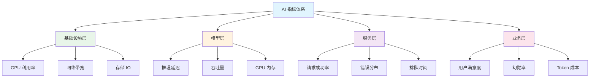

# 📊 指标体系

> **一句话总结**：完善的 AI 指标体系是系统稳定运行的仪表盘，覆盖性能、质量、成本和用户体验全维度。

## 📋 目录

- [指标架构](#指标架构)
- [性能指标](#性能指标)
- [质量指标](#质量指标)
- [成本指标](#成本指标)
- [可观测性](#可观测性)

## 🏗️ 指标架构

### 四层指标体系



## 🚀 性能指标

### 训练性能

| 指标 | 公式 | 说明 | 目标 |
|------|------|------|------|
| TFLOPS | 总 FLOPs / 时间 | 实际算力利用率 | >70% |
| 样本吞吐量 | samples/sec | 数据处理速度 | 持续优化 |
| 迭代时间 | seconds/step | 每步训练时间 | 稳定 |
| 通信占比 | comm_time / total | 通信时间占比 | <30% |
| GPU 利用率 | active_time / total | GPU 忙碌程度 | >85% |

### 推理性能

| 指标 | 说明 | 目标 |
|------|------|------|
| 首 token 延迟 (TTFT) | 第一个 token 输出时间 | <50ms |
| 生成速度 (TPS) | tokens/second | >100 TPS |
| P50 延迟 | 50% 请求的延迟 | <100ms |
| P99 延迟 | 99% 请求的延迟 | <300ms |
| QPS | 每秒请求数 | 按容量规划 |
| 吞吐率 | 总 tokens/second | 按负载 |

### 性能分析

```python
class PerformanceAnalyzer:
    def analyze(self, traces):
        """分析推理性能"""
        latencies = [t.duration for t in traces]
        
        analysis = {
            "p50_latency": np.percentile(latencies, 50),
            "p90_latency": np.percentile(latencies, 90),
            "p99_latency": np.percentile(latencies, 99),
            "throughput": len(traces) / sum(latencies),
            "error_rate": sum(1 for t in traces if t.status != 200) / len(traces),
            "cache_hit_rate": self.calculate_cache_hit(traces),
        }
        
        # 瓶颈分析
        bottlenecks = self.identify_bottlenecks(traces)
        analysis["bottlenecks"] = bottlenecks
        
        return analysis
    
    def identify_bottlenecks(self, traces):
        """识别性能瓶颈"""
        bottlenecks = []
        
        # 分析各阶段耗时
        prep_times = [t.prep_time for t in traces]
        inference_times = [t.inference_time for t in traces]
        postproc_times = [t.postproc_time for t in traces]
        
        avg_prep = np.mean(prep_times)
        avg_infer = np.mean(inference_times)
        avg_post = np.mean(postproc_times)
        
        if avg_prep > avg_infer * 0.3:
            bottlenecks.append("预处理瓶颈")
        if avg_post > avg_infer * 0.2:
            bottlenecks.append("后处理瓶颈")
        
        return bottlenecks
```

## 📏 质量指标

### 输出质量

| 指标 | 评估方式 | 目标 |
|------|---------|------|
| 幻觉率 | 事实核查工具 | <5% |
| 有用性评分 | LLM judge / 人工 | >4/5 |
| 安全性评分 | 安全模型 | >4.5/5 |
| 指令跟随率 | 规则检查 | >95% |
| 一致性 | 多次运行对比 | >90% |

### 模型质量监控

```python
class QualityMonitor:
    def __init__(self, baseline_model):
        self.baseline = baseline_model
    
    def monitor(self, new_model, sample_requests):
        """监控模型质量"""
        results = []
        
        for req in sample_requests:
            baseline_resp = self.baseline.generate(req)
            new_resp = new_model.generate(req)
            
            comparison = self.compare_responses(
                baseline_resp, new_resp, req
            )
            results.append(comparison)
        
        quality_report = self.summarize(results)
        return quality_report
    
    def compare_responses(self, baseline, new_response, request):
        """对比模型输出"""
        return {
            "request": request,
            "similarity": self.cosine_similarity(baseline, new_response),
            "length_ratio": len(new_response) / len(baseline),
            "safety_score": self.safety_check(new_response),
            "factual_score": self.fact_check(new_response),
        }
```

## 💰 成本指标

### 成本核算

| 指标 | 公式 | 说明 |
|------|------|------|
| 训练成本 | $/1T tokens | 每万亿 token 成本 |
| 推理成本 | $/1M tokens | 每百万 token 成本 |
| 单次请求成本 | $/request | 平均每次调用成本 |
| GPU 利用率成本 | $/GPU-hour | 实际产出成本 |

### 成本优化策略

```python
class CostOptimizer:
    def optimize(self, usage_data):
        """优化推理成本"""
        
        strategies = []
        
        # 1. 缓存命中率低 → 增加缓存
        if usage_data.cache_hit_rate < 0.3:
            strategies.append("Increase cache size")
        
        # 2. 批量大小过小 → 增加批量
        if usage_data.avg_batch_size < 16:
            strategies.append("Increase batch size")
        
        # 3. 小模型性能不足 → 切换大模型
        if usage_data.small_model_quality < threshold:
            strategies.append("Upgrade model size")
        
        # 4. 空闲 GPU → 使用 spot instance
        if usage_data.idle_gpu_hours > 100:
            strategies.append("Use spot instances")
        
        return strategies
```

## 🔍 可观测性

### OpenTelemetry 集成

```python
from opentelemetry import trace
from opentelemetry.metrics import get_meter

tracer = trace.get_tracer("ai-service")
meter = get_meter("ai-service")

# 定义指标
request_counter = meter.create_counter(
    "ai.request.total",
    description="Total AI requests"
)
latency_histogram = meter.create_histogram(
    "ai.request.latency",
    description="Request latency in ms"
)

@tracer.start_as_current_span("generate")
def generate_request(prompt):
    with tracer.start_as_current_span("model_inference") as span:
        response = model.generate(prompt)
        span.set_attribute("model.version", "1.0")
        span.set_attribute("tokens.count", len(response))
        return response
```

### 告警规则

| 规则 | 条件 | 等级 | 动作 |
|------|------|------|------|
| 高错误率 | error_rate > 1% | P1 | 自动回滚 |
| 高延迟 | p99 > 500ms | P2 | 扩容 |
| 低吞吐量 | qps < 阈值 | P2 | 扩容 |
| 漂移检测 | drift > 0.2 | P3 | 通知团队 |
| 成本超支 | cost > 预算*1.5 | P3 | 告警 |

## 📚 延伸阅读

- [Google SRE](https://sre.google/sre-book/table-of-contents/) — SRE 实践
- [OpenTelemetry](https://opentelemetry.io/) — 可观测性标准
