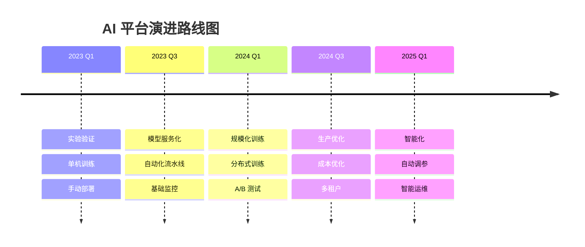
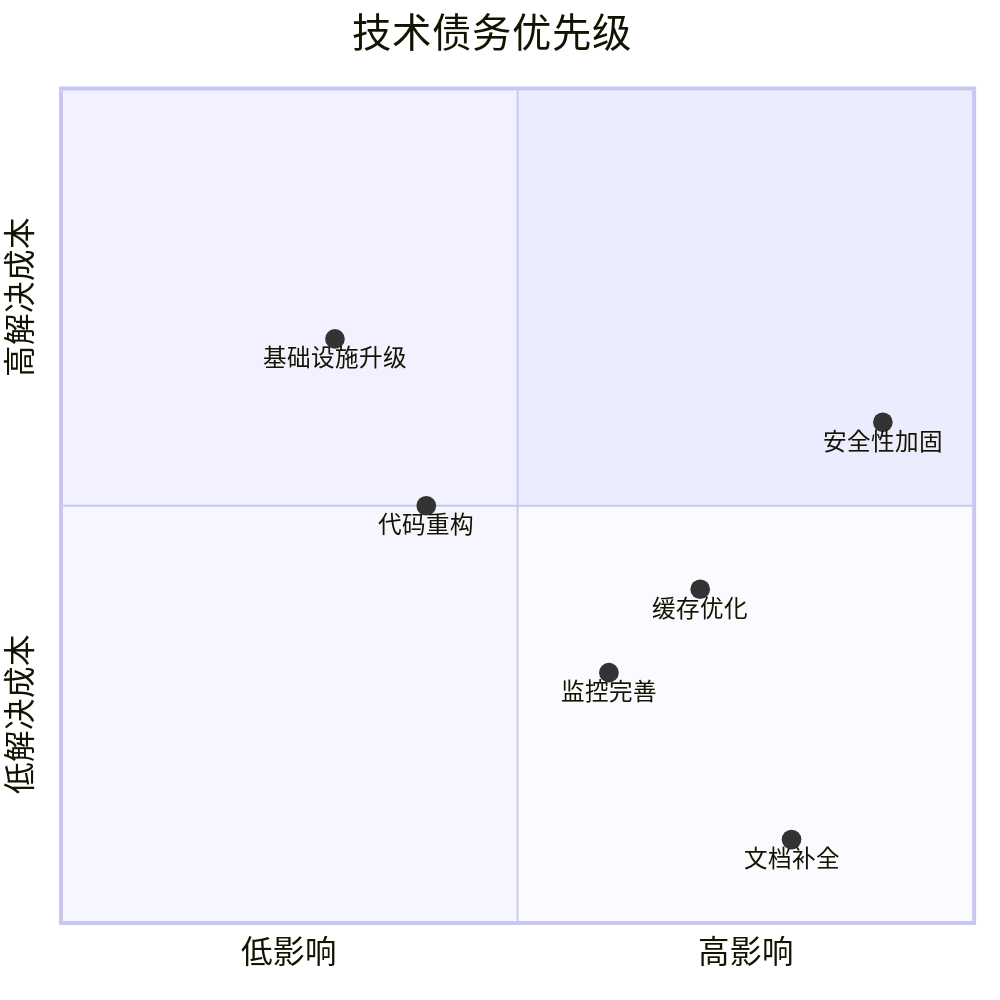

# 🚀 平台演进

> **一句话总结**：AI 平台演进是持续的技术投资过程，需要在创新速度、系统稳定性和技术债务之间取得平衡。

## 📋 目录

- [演进策略](#演进策略)
- [技术债务管理](#技术债务管理)
- [版本策略](#版本策略)
- [迁移路线](#迁移路线)

## 📈 演进策略

### 演进路线图



### 演进优先级矩阵

| 项目 | 价值 | 成本 | 优先级 |
|------|------|------|--------|
| 分布式训练 | 高 | 中 | P0 |
| 自动化部署 | 高 | 中 | P0 |
| 成本监控 | 中 | 低 | P1 |
| 多租户 | 中 | 高 | P1 |
| 自动调参 | 低 | 高 | P2 |

## 🧹 技术债务管理

### 技术债务矩阵



### 债务跟踪

```python
class TechnicalDebtTracker:
    def __init__(self):
        self.debts = []
    
    def register_debt(self, debt):
        """注册技术债务"""
        debt.priority = self.calculate_priority(debt)
        self.debts.append(debt)
    
    def calculate_priority(self, debt):
        """计算优先级"""
        impact_score = debt.impact
        effort_score = 1 / debt.effort  # 逆运算
        return impact_score * effort_score
    
    def get_next_actions(self, n=5):
        """获取下一批要解决的技术债务"""
        sorted_debts = sorted(self.debts, key=lambda x: -x.priority)
        return sorted_debts[:n]
```

## 📦 版本策略

### 版本管理

| 策略 | 描述 | 适用场景 |
|------|------|---------|
| 语义化版本 | MAJOR.MINOR.PATCH | 模型版本 |
| 时间版本 | YYYY.MM.N | 内部迭代 |
| 哈希版本 | sha256 前缀 | 实验追踪 |

### 模型版本策略

```
模型: customer-churn-predictor
版本: 1.2.0
策略: 语义化

v1.0.0 → v1.1.0: 特征工程改进（minor）
v1.1.0 → v1.2.0: 模型架构微调（minor）
v1.2.0 → v2.0.0: 训练框架迁移（major）
```

## 🗺️ 迁移路线

### 模型迁移检查清单

```markdown
## 迁移检查清单

### 迁移前
- [ ] 评估当前模型性能
- [ ] 准备回滚方案
- [ ] 数据格式兼容性验证
- [ ] API 向后兼容性确认

### 迁移中
- [ ] 灰度发布启动
- [ ] 关键指标监控
- [ ] 错误日志检查
- [ ] 用户反馈收集

### 迁移后
- [ ] 性能对比验证
- [ ] 成本分析
- [ ] 用户满意度调查
- [ ] 文档更新
```

## 📚 延伸阅读

- [System Design Interview](https://github.com/checkcheckzz/system-design-interview) — 架构设计
