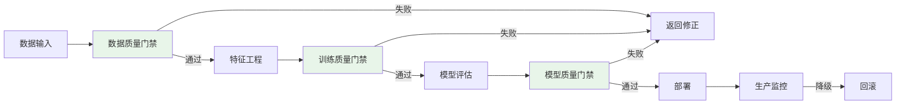
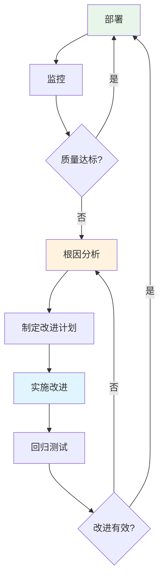

# 🛡️ 质量平台

> **一句话总结**：AI 质量平台为模型提供全生命周期的质量保障，从数据到部署每一环都有质量门禁。

## 📋 目录

- [质量框架](#质量框架)
- [数据质量](#数据质量)
- [模型质量](#模型质量)
- [质量门禁](#质量门禁)
- [持续改进](#持续改进)

## 🏗️ 质量框架

### 质量门架构



### 质量评估维度

| 维度 | 指标 | 工具 |
|------|------|------|
| 数据完整性 | 缺失值率、重复率 | Pandera |
| 数据一致性 | 分布漂移 | Evidently |
| 模型准确性 | 准确率、F1 | sklearn |
| 模型公平性 | 群体公平性 | Fairlearn |
| 模型鲁棒性 | 对抗鲁棒性 | Custom |
| 推理效率 | 延迟、吞吐 | Custom |

## 📊 数据质量

### 数据质量规则

```python
import pandera as pa
from pandera import Column, DataFrameSchema, Check

schema = DataFrameSchema({
    "age": Column(int, Check(lambda x: 0 <= x <= 120)),
    "income": Column(float, Check(lambda x: x >= 0)),
    "category": Column(str, Check.isin(["A", "B", "C"])),
    "label": Column(int, Check.isin([0, 1])),
})

# 验证数据
validated_data = schema.validate(dataframe)
```

### 数据漂移检测

```python
class DataDriftDetector:
    def detect(self, baseline, current):
        """检测数据分布漂移"""
        drifts = {}
        
        for column in baseline.columns:
            baseline_dist = baseline[column]
            current_dist = current[column]
            
            # 数值型：KS 检验
            if baseline_dist.dtype in [np.float64, np.int64]:
                statistic, p_value = ks_2samp(
                    baseline_dist.values, current_dist.values
                )
                drifts[column] = {
                    "type": "ks_test",
                    "statistic": statistic,
                    "p_value": p_value,
                    "is_drifted": p_value < 0.05
                }
            
            # 类别型：卡方检验
            else:
                contingency = pd.crosstab(
                    baseline[column], current[column]
                )
                chi2, p_value, _, _ = chi2_contingency(contingency)
                drifts[column] = {
                    "type": "chi2_test",
                    "statistic": chi2,
                    "p_value": p_value,
                    "is_drifted": p_value < 0.05
                }
        
        return drifts
```

## 📐 模型质量

### 模型评估报告

```python
class ModelQualityReport:
    def generate(self, model, test_data):
        """生成完整质量报告"""
        report = {
            "model_info": self.get_model_info(model),
            "performance_metrics": self.compute_metrics(model, test_data),
            "fairness_analysis": self.analyze_fairness(model, test_data),
            "robustness_test": self.test_robustness(model),
            "error_analysis": self.analyze_errors(model, test_data),
        }
        return report
    
    def compute_metrics(self, model, test_data):
        """计算评估指标"""
        predictions = model.predict(test_data)
        actual = test_data['label']
        
        return {
            "accuracy": accuracy_score(actual, predictions),
            "precision": precision_score(actual, predictions),
            "recall": recall_score(actual, predictions),
            "f1": f1_score(actual, predictions),
            "auc_roc": roc_auc_score(actual, model.predict_proba(test_data)[:, 1]),
            "log_loss": log_loss(actual, model.predict_proba(test_data)),
        }
```

## 🚧 质量门禁

### 门禁规则配置

```yaml
quality_gates:
  data:
    max_missing_rate: 0.01
    max_duplicate_rate: 0.001
    min_sample_size: 10000
    feature_drift_threshold: 0.1
  
  training:
    max_loss: 0.5
    min_accuracy: 0.85
    max_training_time: 7200
    min_batch_accuracy_delta: 0.001
  
  model:
    min_accuracy: 0.85
    max_latency_p99: 200
    min_fairness_score: 0.9
    max_drift_score: 0.15
  
  deployment:
    min_smoke_test_pass: 0.99
    max_error_rate: 0.01
    min_user_satisfaction: 4.0
```

## 🔁 持续改进

### 质量闭环



## 📚 延伸阅读

- [Data Quality Dimensions](https://www-01.ibm.com/support/page/node/623000) — 数据质量
- [Model Cards](https://arxiv.org/abs/1810.03993) — 模型卡
