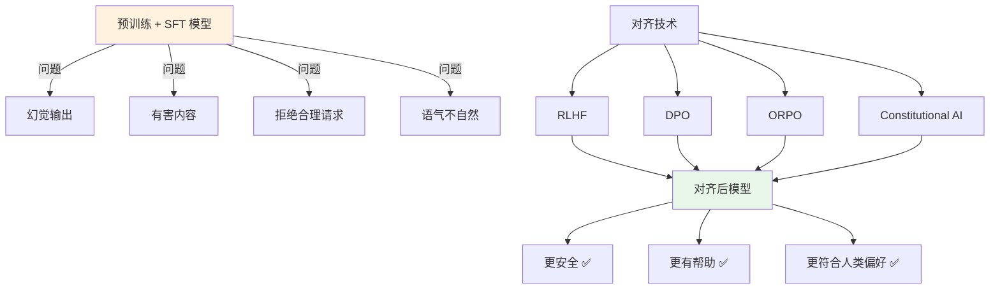
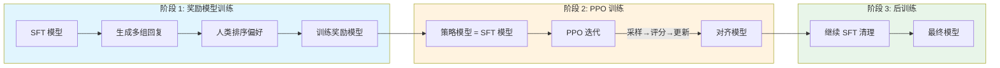
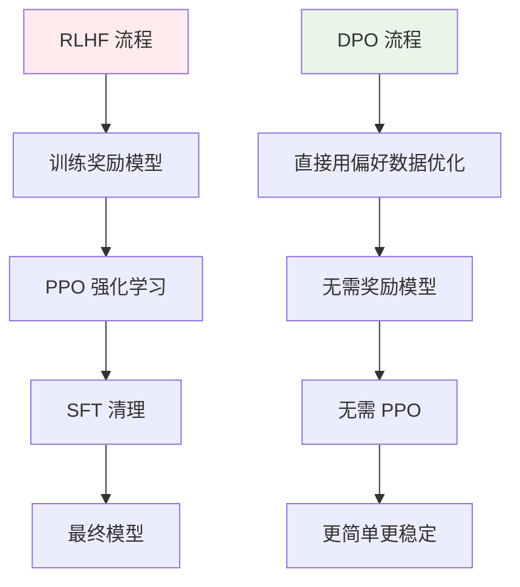
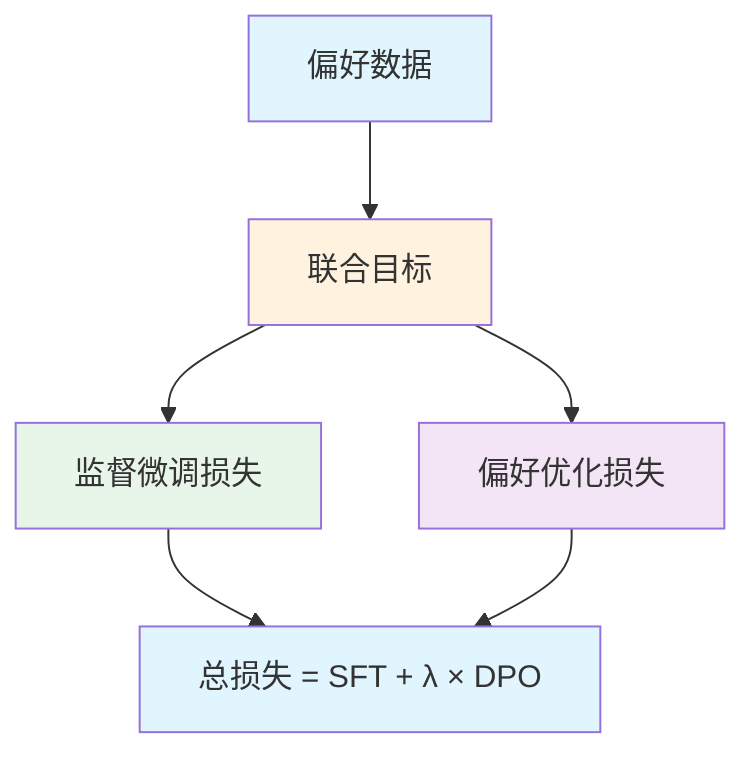
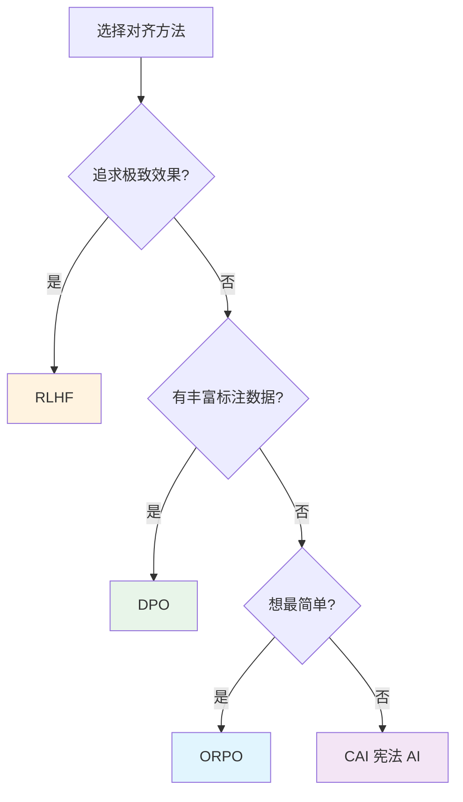

# ⚖️ 偏好对齐（Alignment）

> **一句话总结**：偏好对齐通过人类反馈让模型输出更安全、更有用，是解决模型"会胡说八道"和"输出有害内容"的关键步骤。

## 📋 目录

- [对齐概述](#对齐概述)
- [RLHF 流程](#rlhf-流程)
- [DPO 直接偏好优化](#dpo-直接偏好优化)
- [ORPO 联合优化](#orpo-联合优化)
- [方法对比](#方法对比)
- [实践指南](#实践指南)

## 🎯 对齐概述

### 对齐的必要性



### 对齐数据需求

| 数据类型 | 规模 | 获取方式 |
|---------|------|---------|
| 偏好数据 | 10K - 100K | 人工标注 / AI 生成 |
| 安全数据 | 5K - 50K | 红队测试 / 规则过滤 |
| 拒绝数据 | 1K - 10K | 正面示例 + 边界案例 |

## 🔄 RLHF 流程

### 完整 RLHF 三阶段



### 阶段 1: 奖励模型（Reward Model）

```python
# 奖励模型训练数据格式
reward_data = [
    {
        "prompt": "帮我写一封辞职信",
        "chosen": "好的，请告诉我你的职位和离职原因...",  # 人类偏好
        "rejected": "我不能帮你写辞职信，这可能涉及法律问题。"  # 不被偏好
    }
]

# 奖励模型架构
class RewardModel(nn.Module):
    def __init__(self, base_model):
        super().__init__()
        self.base = base_model          # 共享 SFT 模型 backbone
        self.value_head = nn.Linear()   # 额外输出标量分数
        
    def forward(self, prompt, response):
        combined = tokenize(prompt + response)
        logits = self.base(combined)
        score = self.value_head(logits)  # 标量奖励
        return score
```

### 奖励模型训练目标

```
Loss_RL = -log(σ(r_θ(prompt, chosen) - r_θ(prompt, rejected)))
```

- 最大化偏好回复的奖励分数
- 最小化非偏好回复的奖励分数
- 偏好差值越大，惩罚越大

### 阶段 2: PPO 训练

```mermaid
sequenceDiagram
    participant Policy as 策略模型
    participant Ref as 参考模型
    participant RM as 奖励模型
    participant Crt as 评论模型
    
    Policy->>RM: 采样回复 R
    RM-->>Policy: 奖励分 r
    Policy->>Crt: 估算 V(s)
    Crt-->>Policy: 价值估计 V
    
    Note over Policy,Ref: KL 惩罚
    Ref-->>Policy: 计算 KL 散度
    
    Policy->>Policy: PPO 更新策略
    
    style Policy fill:#e1f5fe
    style RM fill:#fff3e0
    style Ref fill:#e8f5e9
    style Crt fill:#f3e5f5
```

### PPO 关键参数

| 参数 | 推荐值 | 说明 |
|------|--------|------|
| clip_range | 0.2 | PPO 裁剪范围 |
| kl_coef | 0.04 - 0.2 | KL 散度惩罚系数 |
| gamma | 0.995 | 折扣因子 |
| lam | 0.95 | GAE 参数 |
| epochs | 1 - 3 | PPO 迭代轮数 |

### 阶段 3: SFT 清理

> **Pro Tip**：PPO 训练后通常会退化 SFT 能力，需要用少量对齐数据继续 SFT 1-2 步来"清理"。

## 🎯 DPO 直接偏好优化

### DPO vs RLHF



### DPO 核心公式

```
Loss_DPO = -log(σ(β × log(π_θ(y|x)/π_ref(y|x))))
```

关键洞察：**DPO 将奖励函数解析掉了**，直接在策略模型上优化偏好数据。

### DPO 优势

| 维度 | RLHF | DPO |
|------|------|-----|
| 复杂度 | 三阶段，极复杂 | 单阶段，简单 |
| 稳定性 | PPO 训练不稳定 | 更稳定 |
| 显存需求 | 需要 4 个模型 | 仅需 2 个 |
| 调参难度 | 多超参 | 少超参 |
| 效果 | 理论最优 | 接近 RLHF |

### DPO 实现

```python
import torch.nn.functional as F

def dpo_loss(policy_chosen_logps, policy_rejected_logps,
             reference_chosen_logps, reference_rejected_logps, beta):
    """DPO 损失函数实现"""
    pi_logratios = policy_chosen_logps - policy_rejected_logps
    ref_logratios = reference_chosen_logps - reference_rejected_logps
    
    logits = pi_logratios - ref_logratios
    losses = -F.logsigmoid(beta * logits)
    return losses.mean()
```

### DPO 超参

| 参数 | 推荐值 | 说明 |
|------|--------|------|
| β | 0.1 - 0.5 | KL 约束强度，越大越接近参考模型 |
| 学习率 | 5e-7 - 1e-5 | 通常比 SFT 小 10 倍 |
| Epochs | 1 - 2 | 过拟合风险高 |
| Max Length | 2048 | 与 SFT 一致 |

## 🔄 ORPO 联合优化

### ORPO 的创新



ORPO = Supervised Fine-Tuning + Direct Preference Optimization

- **无需参考模型**：在损失函数中隐式包含 KL 约束
- **单阶段训练**：一个损失函数同时优化 SFT 和对齐
- **更少超参**：只需 λ 控制两个损失的权重

## 📊 方法对比

### 综合对比表

| 特性 | RLHF | DPO | ORPO | CAI |
|------|------|-----|------|-----|
| 阶段数 | 3 | 1 | 1 | 1 |
| 需要 RM | ✅ | ❌ | ❌ | ❌ |
| 需要 PPO | ✅ | ❌ | ❌ | ❌ |
| 需要参考模型 | ✅ | ✅ | ❌ | ❌ |
| 实现复杂度 | 高 | 低 | 最低 | 低 |
| 效果上限 | ⭐⭐⭐⭐⭐ | ⭐⭐⭐⭐ | ⭐⭐⭐⭐ | ⭐⭐⭐⭐ |
| 稳定性 | ⭐⭐⭐ | ⭐⭐⭐⭐ | ⭐⭐⭐⭐ | ⭐⭐⭐⭐ |
| 推荐度 | ⭐⭐⭐ | ⭐⭐⭐⭐⭐ | ⭐⭐⭐⭐⭐ | ⭐⭐⭐⭐ |

### 方法选择决策树



## 🛠️ 实践指南

### 偏好数据构建

```python
# 偏好数据示例
alignment_data = [
    {
        "prompt": "如何快速学习编程?",
        "chosen": "建议从 Python 开始，它语法简洁...",
        "rejected": "你可以试试编程，有很多教程..."
    },
    {
        "prompt": "评价这部电影",
        "chosen": "这部电影节奏紧凑，剧情反转令人意外...",
        "rejected": "电影还行吧"
    }
]
```

### 数据质量要求

| 要求 | 说明 |
|------|------|
| 难度适中 | 偏好差异明显，避免模棱两可 |
| 多样性 | 覆盖各任务类型 |
| 真实性 | 来自真实用户 query |
| 无偏见 | 避免文化/政治偏见 |

### 训练监控

| 指标 | 期望趋势 | 异常信号 |
|------|---------|---------|
| DPO Loss | 下降 | 上升或不稳定 |
| 偏好一致性 | 上升 | 不变化 |
| SFT 能力 | 保持或略降 | 显著退化 |
| KL 散度 | 平稳 | 剧烈波动 |

### 常见问题与解决方案

| 问题 | 原因 | 解决方案 |
|------|------|---------|
| 模型拒绝所有回答 | β 过大 | 减小 β |
| SFT 能力退化 | λ 过大或 epoch 过多 | 减少训练轮数 |
| 偏好模型过拟合 | 数据量不足 | 增加数据 / 正则化 |
| 训练不收敛 | 学习率过高 | 降低 LR，增加 Warmup |
| 奖励黑客 | RM 存在漏洞 | 多指标评估 + 人工抽查 |

## 📚 延伸阅读

- [Training Language Models to Follow Instructions (InstructGPT)](https://arxiv.org/abs/2203.02155) — RLHF 开山之作
- [Direct Preference Optimization: Your Language Model is Secretly a Reward Model](https://arxiv.org/abs/2305.18290) — DPO
- [ORPO: Monolithic Reward Modeling](https://arxiv.org/abs/2402.08681) — ORPO
- [Constitutional AI: Harmlessness from AI Feedback](https://arxiv.org/abs/2212.08073) — 宪法 AI
- [DPO vs RLHF: A Practical Comparison](https://kaiyuan.govul.com/blog/dpo-vs-rlhf/) — 实践对比
