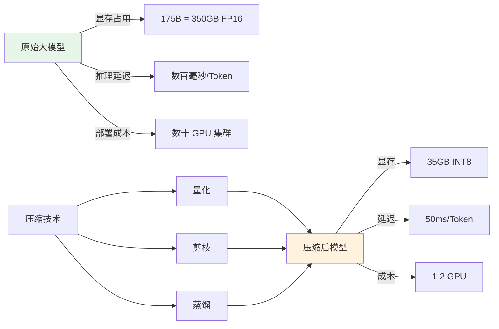
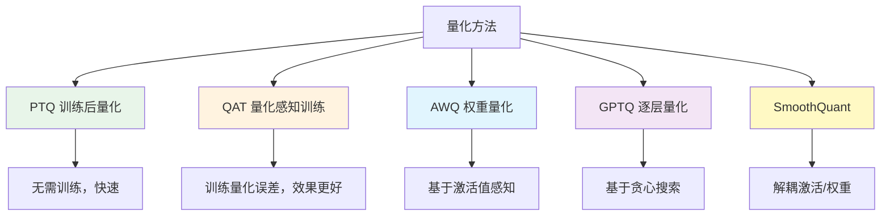
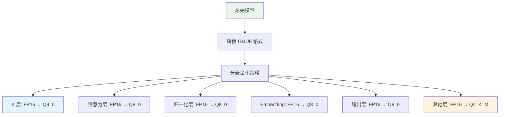
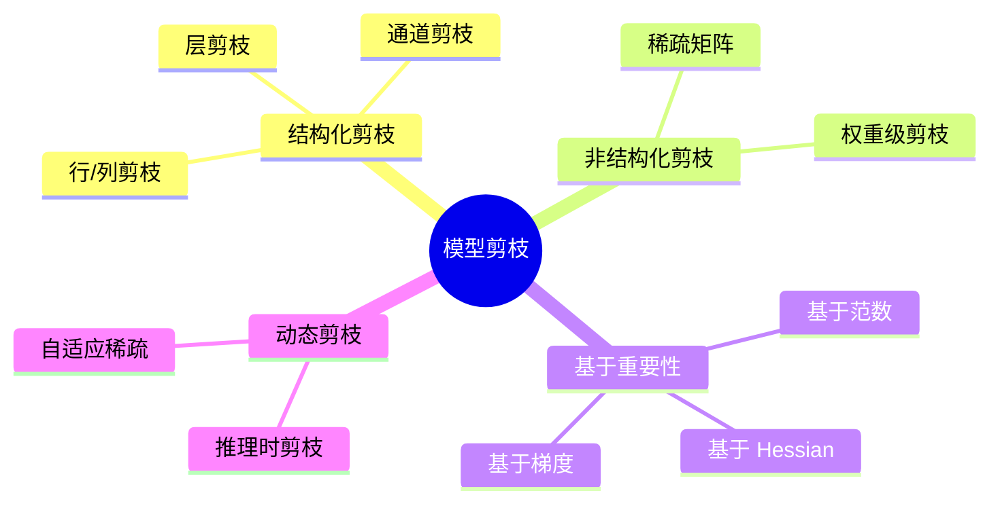
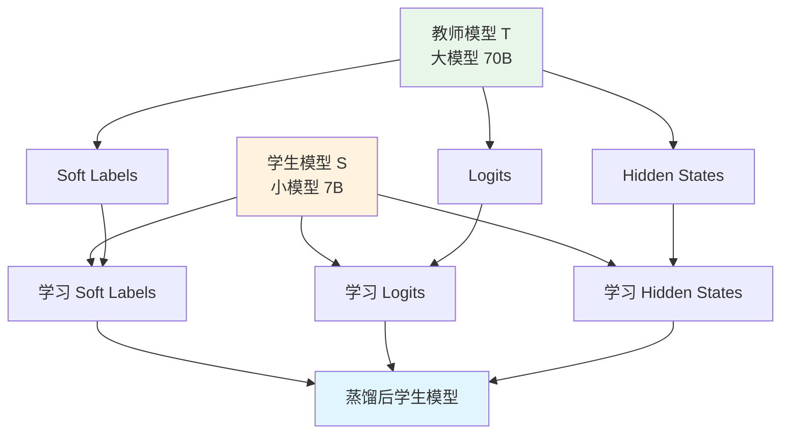
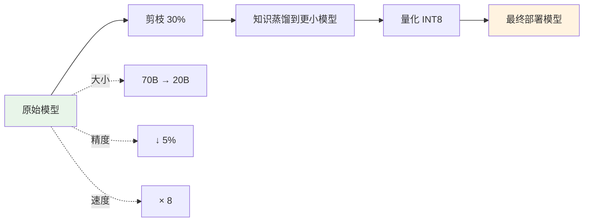

# 📦 模型压缩（Compression）

> **一句话总结**：模型压缩在尽量不损失精度的前提下，减少模型的参数量、计算量和内存占用，让大模型能够部署到资源受限的环境中。

## 📋 目录

- [压缩概述](#压缩概述)
- [量化（Quantization）](#量化quantization)
- [剪枝（Pruning）](#剪枝pruning)
- [知识蒸馏（Knowledge Distillation）](#知识蒸馏knowledge-distillation)
- [综合对比](#综合对比)
- [实践指南](#实践指南)

## 📖 压缩概述

### 为什么需要压缩？



### 压缩效果对比（Llama-3-70B 示例）

| 精度 | 模型大小 | 显存占用 | 推理速度 | 质量损失 |
|------|---------|---------|---------|---------|
| FP16 | 140 GB | 140 GB+ | 基准 | 0% |
| FP8 | 70 GB | 70 GB+ | ×1.5-2 | <1% |
| INT8 | 35 GB | 35 GB+ | ×2-3 | 1-3% |
| INT4 | 17.5 GB | 17.5 GB+ | ×3-4 | 3-8% |
| FP4 | ~12 GB | ~12 GB+ | ×4-5 | 5-15% |

## 🔢 量化（Quantization）

### 量化类型对比



### 量化基础概念

| 概念 | 说明 |
|------|------|
| 线性量化 | `int8 = round(float / scale) + zero_point` |
| per-channel | 每个通道独立 scale（权重常用） |
| per-token | 每个 token 独立 scale（激活常用） |
| 混合精度 | 不同层使用不同精度 |
| 对称量化 | zero_point = 0，范围 [-127, 127] |
| 非对称量化 | 范围 [0, 255] 或自定义 |

### INT8 vs INT4 量化

| 特性 | INT8 | INT4 |
|------|------|------|
| 精度损失 | 小 (1-3%) | 中 (3-8%) |
| 压缩率 | 2× | 4× |
| 硬件支持 | 广泛（TensorRT） | 部分（GGUF/AWQ） |
| 部署难度 | 低 | 中 |
| 推荐场景 | 服务端 | 端侧 / 高并发 |

### GGUF / llama.cpp



### AWQ（Activation-Aware Quantization）

```python
# AWQ 核心思想：保护重要权重的精度
# 通过激活值感知，识别对输出影响大的权重

import awq

quant_config = {
    "zero_point": True,      # 使用 zero_point
    "q_group_size": 128,     # 量化组大小
    "w_bit": 4,              # 权重位宽
    "version": "GEMM",       # 使用 GEMM kernel
}

model = AutoAWQForCausalLM.from_pretrained(
    "model_path",
    quant_config=quant_config
)
model.quantize(tokenizer, quant_config=quant_config)
```

### SmoothQuant

```
问题：激活值的动态范围远大于权重
  激活: [-100, 100] → 量化困难
  权重: [-0.1, 0.1] → 容易量化

SmoothQuant 解法：在矩阵乘法前偏移动态范围
  引入参数 s: out = (X/s) × (W×s)
  让 X/s 和 W×s 的动态范围接近
```

## ✂️ 剪枝（Pruning）

### 剪枝分类



### 结构化 vs 非结构化

| 特性 | 结构化剪枝 | 非结构化剪枝 |
|------|-----------|-------------|
| 粒度 | 通道/层/头 | 单个权重 |
| 速度提升 | 显著（稀疏→稠密） | 不明显（需特殊库） |
| 精度损失 | 较大 | 较小 |
| 实现复杂度 | 简单 | 复杂 |
| 硬件利用 | 好（标准矩阵运算） | 差（需稀疏加速） |

### 通道剪枝

```python
# 基于通道范数的结构化剪枝示例
import torch

def prune_channels(model, ratio=0.2):
    """
    基于权重范数剪枝模型中的冗余通道
    """
    for name, module in model.named_modules():
        if isinstance(module, (torch.nn.Linear,)):
            # 计算每个输出的权重 L2 范数
            weight = module.weight.data
            channel_norm = weight.norm(dim=1)
            
            # 找到需要剪枝的通道（范数最小的）
            num_prune = int(ratio * len(channel_norm))
            prune_indices = torch.topk(channel_norm, num_prune, largest=False).indices
            
            # 掩码化
            mask = torch.ones_like(channel_norm)
            mask[prune_indices] = 0
            module.weight.data *= mask[:, None]
```

### 剪枝效果

| 剪枝率 | 模型大小 | 速度提升 | 精度损失 |
|--------|---------|---------|---------|
| 10% | 90% | ×1.2 | <1% |
| 30% | 70% | ×1.5 | 1-3% |
| 50% | 50% | ×2 | 3-8% |
| 70% | 30% | ×3+ | 8-15% |

## 🧪 知识蒸馏（Knowledge Distillation）

### 蒸馏原理



### 蒸馏损失函数

```
L_total = α × L_hard + β × L_soft + γ × L_feature
```

| 损失项 | 公式 | 作用 |
|--------|------|------|
| L_hard | CE(y_true, y_pred) | 保持原始任务性能 |
| L_soft | KL(T_logit, S_logit/T) | 学习教师知识分布 |
| L_feature | MSE(h_t, h_s) | 中间层特征对齐 |

### 蒸馏策略对比

| 策略 | 描述 | 学生模型 | 效果 |
|------|------|---------|------|
| Logits 蒸馏 | 学习 Soft Labels | 7B-13B | ⭐⭐⭐⭐ |
| Feature 蒸馏 | 中间层对齐 | 3B-7B | ⭐⭐⭐⭐⭐ |
| 交互蒸馏 | 师生交替训练 | 1B-3B | ⭐⭐⭐⭐ |
| 自蒸馏 | 自训练自蒸馏 | 同规模 | ⭐⭐⭐ |
| MoE 蒸馏 | 稠密→稀疏 | 7B MoE | ⭐⭐⭐⭐ |

### 实战：LLaMA-2-70B → LLaMA-2-7B

```python
from transformers import DistillationTrainer, AutoModelForCausalLM

# 教师模型（冻结）
teacher = AutoModelForCausalLM.from_pretrained("meta-llama/Llama-2-70b-hf")
teacher.eval()
teacher.requires_grad_(False)

# 学生模型
student = AutoModelForCausalLM.from_pretrained("meta-llama/Llama-2-7b-hf")

# 蒸馏训练配置
distill_config = {
    "alpha": 0.5,    # hard loss 权重
    "beta": 0.5,     # soft loss 权重
    "temperature": 4.0,  # soft logit 温度
}

trainer = DistillationTrainer(
    model=student,
    teacher=teacher,
    args=training_args,
    distillation_config=distill_config,
    ...
)
```

### 蒸馏效果对比

| 学生模型 | 方法 | MMLU 得分 | HumanEval |
|---------|------|----------|-----------|
| LLaMA-2-7B 基线 | 仅 SFT | 64.3% | 23.2% |
| LLaMA-2-7B | Logits 蒸馏 | 67.1% | 28.5% |
| LLaMA-2-7B | Feature 蒸馏 | 69.8% | 32.1% |
| LLaMA-2-13B 基线 | 仅 SFT | 68.2% | 32.8% |
| LLaMA-2-7B | 特征蒸馏+增强 | 70.5% | 35.2% |

> **Pro Tip**：蒸馏的效果高度依赖训练数据质量。使用 SFT 高质量数据做蒸馏，效果远好于使用预训练数据。

## 📊 综合对比

### 方法选择矩阵

| 场景 | 推荐方法 | 预期效果 |
|------|---------|---------|
| 快速部署，精度优先 | INT8 PTQ + 校准 | ×2 速度，<2% 损失 |
| 极致压缩，可接受损失 | INT4 AWQ | ×4 速度，5% 损失 |
| 移动端部署 | INT4 GGUF | 手机可运行 7B |
| 训练资源充足 | 蒸馏 + 量化 | 小模型接近大模型 |
| 推理成本敏感 | 量化 + 剪枝组合 | 最大化吞吐 |

### 组合压缩策略



## 🛠️ 实践指南

### 量化流程

```python
# 完整量化流程
from optimum.bettertransformer import BetterTransformer
from auto_gptq import AutoGPTQForCausalLM

# 1. 加载模型
model = AutoModelForCausalLM.from_pretrained("model_path")

# 2. 准备校准数据（256-512 条真实 query）
calibration_data = load_calibration_dataset("samples", n_samples=512)

# 3. 执行量化
quantized_model = AutoGPTQForCausalLM.from_pretrained(
    model,
    quantize_config={
        "bits": 4,
        "group_size": 128,
        "damp_percent": 0.01,
        "desc_act": False,
    }
)
quantized_model.quantize(calibration_data)

# 4. 评估效果
eval_results = evaluate(quantized_model, test_dataset)
print(f"MMLU: {eval_results['mmlu']:.1f}%")  # 检查精度损失

# 5. 保存
quantized_model.save_quantized("quantized_model/")
```

### 评估 checklist

| 指标 | 目标 | 检查方法 |
|------|------|---------|
| 模型大小 | 压缩到目标比例 | `du -sh model/` |
| 推理速度 | 提升 2×+ | benchmark latency |
| 吞吐量 | 提升 3×+ | benchmark TPS |
| 精度损失 | <5% (INT8) / <10% (INT4) | MMLU/GSM8K |
| 功能完整性 | 无明显退化 | 人工测试 |

## 📚 延伸阅读

- [AWQ: Activation-Aware Quantization](https://arxiv.org/abs/2306.00978)
- [SmoothQuant: Accurate and Efficient Post-Training Quantization](https://arxiv.org/abs/2211.10090)
- [GPTQ: Accurate Post-Training Quantization](https://arxiv.org/abs/2210.17323)
- [Distilling the Knowledge in a Neural Network](https://arxiv.org/abs/1503.02531) — 蒸馏开山之作
- [LoRA vs Quantization: Which is Better?](https://kaiyuan.govul.com/blog/lora-vs-quant/) — 实践对比
