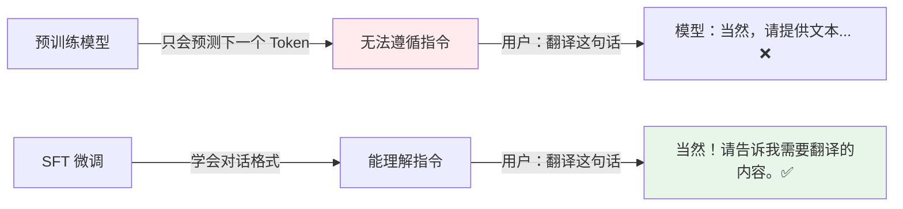
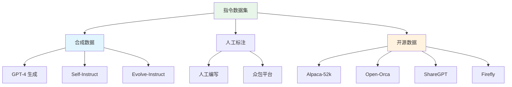
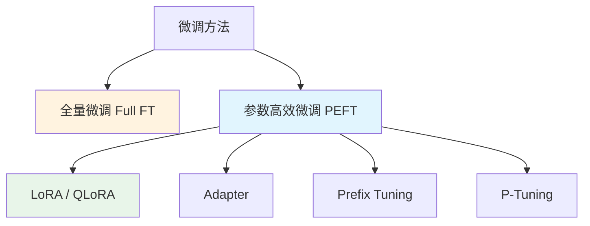
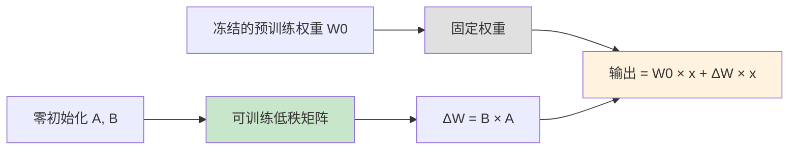
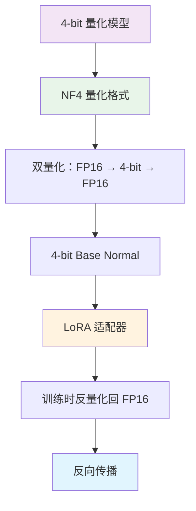
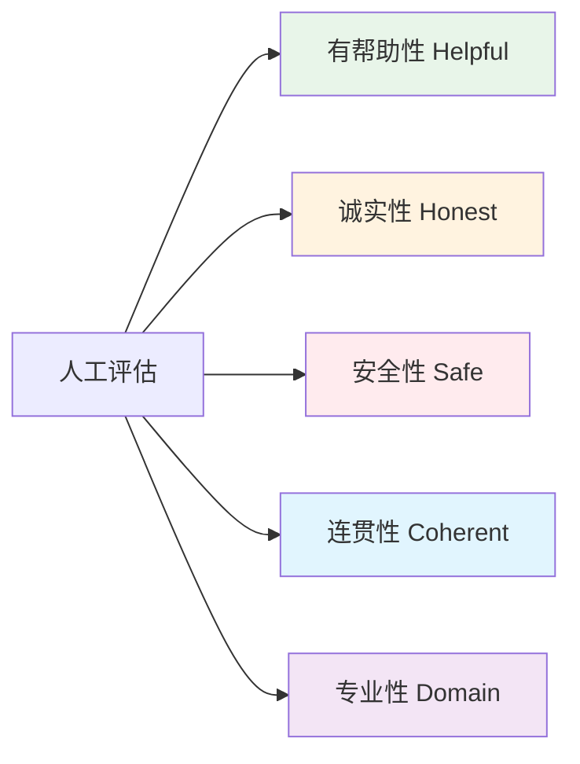

# 🎯 指令微调（SFT）

> **一句话总结**：指令微调（Supervised Fine-Tuning）让通用语言模型学会跟随人类指令，是模型从"会说话"到"好用"的关键一步。

## 📋 目录

- [SFT 概述](#sft-概述)
- [指令数据集构建](#指令数据集构建)
- [微调方法对比](#微调方法对比)
- [LoRA / QLoRA](#lora--qlora)
- [训练实践](#训练实践)
- [评估方法](#评估方法)

## 📖 SFT 概述

### 为什么需要 SFT？



### SFT 数据格式

```json
{
  "messages": [
    {"role": "user", "content": "请总结一下��篇论文的核心观点"},
    {"role": "assistant", "content": "这篇论文提出了..."}
  ]
}
```

### 主流模板

| 模型家族 | 系统消息 | 对话模板 |
|---------|---------|---------|
| LLaMA / Mistral | 可选，简洁 | `[INST] {prompt} [/INST]` |
| ChatGLM | "你是一位有用的助手" | `User: {prompt}\nAssistant: {reply}` |
| Qwen | "你是一个有用的助手" | `<|im_start|>user\n{prompt}<|im_end|>\n<|im_start|>assistant\n{reply}` |
| LLaMA-3 | 可省略 | `<|begin_of_text|><|start_header_id|>user...` |

## 📚 指令数据集构建

### 数据来源



### 数据构建策略

| 策略 | 方法 | 优点 | 缺点 |
|------|------|------|------|
| 人工编写 | 专家撰写指令-回复 | 质量最高 | 成本极高 |
| 大模型合成 | GPT-4/Claude 生成 | 速度快、规模大 | 风格趋同 |
| 自我演化 | Self-Instruct / Evolve | 多样性好 | 需要初始种子 |
| 开源聚合 | 多数据集融合 | 覆盖广 | 噪声多 |

### 数据质量要素

```mermaid
radarDiagram
    title 指令数据质量评估
    多样性 ["任务多样性", 90]
    难度 ["难度分级", 80]
    准确性 ["答案准确性", 95]
    格式 ["格式规范", 85]
    长度 ["长度合理", 75]
    语言 ["语言质量", 90]
```

### 数据配比建议

| 任务类型 | 占比 | 说明 |
|---------|------|------|
| 对话问答 | 30% | 通用对话能力 |
| 指令遵循 | 20% | 分类、总结、改写 |
| 代码生成 | 15% | 编程能力 |
| 数学推理 | 10% | 计算与推理 |
| 知识问答 | 10% | 事实性知识 |
| 多轮对话 | 10% | 上下文理解 |
| 其他 | 5% | 特殊任务 |

## 🔬 微调方法对比

### PEFT vs 全量微调



| 方法 | 可训练参数 | 显存占用 | 效果 | 速度 |
|------|-----------|---------|------|------|
| 全量微调 | 100% | ⭐⭐⭐⭐⭐ | ⭐⭐⭐⭐⭐ | ⭐⭐ |
| LoRA | 0.1-1% | ⭐⭐ | ⭐⭐⭐⭐ | ⭐⭐⭐⭐ |
| QLoRA | 0.1-1% | ⭐⭐⭐ | ⭐⭐⭐⭐ | ⭐⭐⭐⭐⭐ |
| Adapter | 1-5% | ⭐⭐⭐ | ⭐⭐⭐ | ⭐⭐⭐⭐ |
| Prefix Tuning | <1% | ⭐⭐ | ⭐⭐⭐ | ⭐⭐⭐⭐⭐ |

### 适用场景

| 场景 | 推荐方法 | 原因 |
|------|---------|------|
| 资源充足、追求极致效果 | 全量微调 | 上限最高 |
| 消费级 GPU（24GB） | QLoRA | 单卡可跑 7B/13B |
| 快速实验 / 迭代 | LoRA | 训练快、切换灵活 |
| 多任务切换 | LoRA 适配器池 | 按需加载 |
| 超小规模数据 | Prefix Tuning | 不易过拟合 |

## 🚀 LoRA / QLoRA

### LoRA 原理



### LoRA 核心超参

| 超参数 | 推荐值 | 说明 |
|--------|--------|------|
| rank (r) | 8 / 16 / 32 | 低秩维度，越大能力越强但过拟合风险高 |
| alpha | 2 × r 或 r | 缩放系数，控制 LoRA 贡献权重 |
| dropout | 0.05 - 0.1 | 防止过拟合 |
| target_modules | q_proj, v_proj | 注意力的投影层通常最有效 |
| bias | "none" | 一般不加 bias |

### QLoRA 关键创新



### QLoRA 训练配置

```python
from peft import LoraConfig, get_peft_model
from transformers import BitsAndBytesConfig

# 4-bit 量化配置
quantization_config = BitsAndBytesConfig(
    load_in_4bit=True,
    bnb_4bit_quant_type="nf4",  # Normal Float 4
    bnb_4bit_use_double_quant=True,  # 双量化节省 0.4 bit
    bnb_4bit_compute_dtype=torch.bfloat16
)

# LoRA 配置
lora_config = LoraConfig(
    r=16,
    lora_alpha=32,
    lora_dropout=0.05,
    target_modules=["q_proj", "k_proj", "v_proj", "o_proj"],
    bias="none",
    task_type="CAUSAL_LM"
)
```

### 显存对比（7B 模型，batch=8）

| 方法 | 显存需求 | 是否可单卡运行 |
|------|---------|---------------|
| FP16 全量微调 | ~24GB | 勉强（需梯度检查点） |
| LoRA (r=16) | ~14GB | ✅ 是 |
| QLoRA (NF4) | ~8GB | ✅ 是（有余量） |

## 🛠️ 训练实践

### 训练超参推荐

| 超参数 | 推荐范围 | 说明 |
|--------|---------|------|
| 学习率 | 1e-4 - 5e-4 (LoRA) | LoRA 可以用稍大 LR |
| | 2e-5 - 5e-5 (全量) | 全量微调需更保守 |
| Batch Size | 32 - 128（有效） | 累积步数模拟大 Batch |
| Epochs | 1 - 3 | 宁可欠拟合也不要过拟合 |
| Warmup | 3-5% | 学习率预热 |
| LR Scheduler | Cosine | 余弦退火 |
| Weight Decay | 0.01 - 0.1 | L2 正则化 |
| Gradient Clip | 1.0 | 防止梯度爆炸 |
| Max Length | 2048 - 4096 | 根据数据调整 |
| Optimizer | AdamW / PagedAdamW | Paged 节省显存 |

### 训练过程监控

```python
training_metrics = {
    "train_loss": "应逐步下降",
    "eval_loss": "验证集损失，检测过拟合",
    "learning_rate": "Cosine 退火曲线",
    "grad_norm": "异常值检测",
    "perplexity": "2^loss，训练直觉指标",
}
```

### 常见训练曲线

```
Loss 下降阶段：
  初期：快速下降（学习率 Warmup）
  中期：平稳下降（学习率 Cosine 退火）
  后期：平台期（接近收敛）

过拟合信号：
  train_loss ↓ 但 eval_loss ↑ → 减少 Epoch / 增加 Dropout
```

## 📊 评估方法

### 自动化评估基准

| Benchmark | 评估内容 | 典型分数参考 |
|-----------|---------|-------------|
| MMLU | 多学科知识 | 基线 66% → 微调后 70-80% |
| HumanEval | 代码生成 | 基线 15% → 微调后 30-60% |
| GSM8K | 数学推理 | 基线 10% → 微调后 40-70% |
| TruthfulQA | 事实准确性 | 基线 40% → 微调后 50-65% |
| AlpacaEval | 指令遵循 | 基线 20% → 微调后 30-50% |

### 人工评估维度



### A/B 测试

| 指标 | 基线 | 微调后 | 提升 |
|------|------|--------|------|
| 有用率 | 65% | 78% | +13% |
| 拒答率 | 15% | 8% | -7% |
| 平均回复长度 | 45 tokens | 80 tokens | +78% |
| 用户满意度 | 3.2/5 | 4.1/5 | +28% |

## 📚 延伸阅读

- [Instruction Tuning with GPT-4 (Alpaca)](https://github.com/tatsu-lab/stanford_alpaca) — 指令微调开山之作
- [QLoRA: Efficient Finetuning of Quantized LLMs](https://arxiv.org/abs/2305.14314) — QLoRA 核心论文
- [Orca: Progressive Learning from Complex Explanations](https://arxiv.org/abs/2306.02707) — 复杂解释数据
- [Mistral 7B](https://arxiv.org/abs/2310.06825) — 高效训练实践
