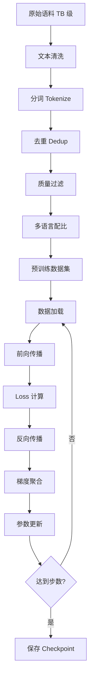
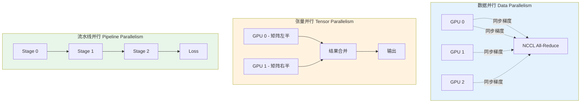
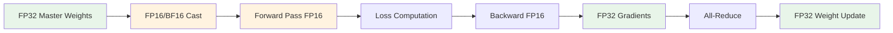
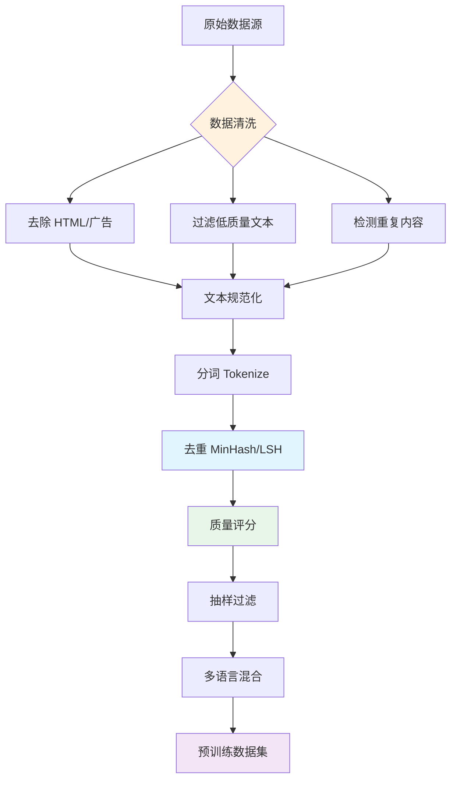

# 🏗️ 预训练（Pre-training）

> **一句话总结**：预训练是在海量文本数据上训练通用语言模型，使其掌握语言的统计规律和世界知识。这是大模型能力的根基。

## 📋 目录

- [训练架构](#训练架构)
- [分布式训练策略](#分布式训练策略)
- [混合精度训练](#混合精度训练)
- [数据预处理流水线](#数据预处理流水线)
- [训练稳定性](#训练稳定性)
- [实践案例](#实践案例)

## 🏛️ 训练架构

### 核心计算流程



### 关键概念

| 概念 | 定义 | 典型值 |
|------|------|--------|
| 模型规模 | 参数量 | 7B ~ 175B |
| 上下文长度 | 最大 Token 数 | 2K ~ 32K |
| 训练数据量 | 总 Token 数 | 1T ~ 30T |
| 算力规模 | GPU 总数 | 1K ~ 10K+ |
| 训练时长 | 实际运行时间 | 数周 ~ 数月 |

## 🌐 分布式训练策略

### 三种并行策略



#### 数据并行（Data Parallelism, DP）

- **原理**：每张 GPU 持有完整模型副本，处理不同数据批次
- **通信开销**：每步一次 All-Reduce（梯度同步）
- **扩展性**：受限于带宽，适合大 Batch 场景
- **实现**：DeepSpeed ZeRO-1 / ZeRO-2

#### 张量并行（Tensor Parallelism, TP）

- **原理**：将单层大矩阵拆分到多张 GPU 上并行计算
- **通信开销**：每层内部需要 All-to-All 通信
- **扩展性**：适合超大模型（单层矩阵超出单卡显存）
- **实现**：Megatron-LM TP=4/8

#### 流水线并行（Pipeline Parallelism, PP）

- **原理**：将模型层拆分到不同 GPU 上，像流水线一样执行
- **通信开销**：阶段间激活值传输
- **气泡问题**：PP 阶段的 GPU 空闲时间
- **优化**：GPipe（微批次）、Interleaved 1F1B

### 3D 并行组合

```
┌─────────────────────────────────────────┐
│         Batch = DP × PP_micro         │
│  Model Parallel Group = TP × PP        │
│                                         │
│  总 GPU 数 = DP × TP × PP              │
│  例：4096 卡 = 64 × 8 × 8             │
└─────────────────────────────────────────┘
```

## 🎨 混合精度训练

### 精度对比

| 精度格式 | 位宽 | 范围 | 适用场景 |
|---------|------|------|---------|
| FP32 | 32-bit | ±3.4×10³⁸ | 基准参考 |
| FP16 | 16-bit | ±65504 | 传统混合精度 |
| BF16 | 16-bit | ±65504（指数相同） | 推荐，更稳定 |
| FP8 | 8-bit | 受限 | 训练后/量化感知 |
| INT8/INT4 | 8/4-bit | 受限 | 推理/量化 |

### BF16 vs FP16

| 特性 | BF16 | FP16 |
|------|------|------|
| 指数位 | 7 bit | 5 bit |
| 尾数位 | 7 bit | 10 bit |
| 溢出风险 | 低 | 较高 |
| 精度 | 略低 | 略高 |
| 硬件支持 | A100/H100 等 | 全支持 |
| 推荐度 | ⭐⭐⭐⭐⭐ | ⭐⭐⭐ |

### 混合精度训练流程



### Loss Scaling

```python
# PyTorch 混合精度训练示例
import torch
import torch.cuda.amp as amp

scaler = amp.GradScaler()  # 自动 loss scaling

with amp.autocast():
    output = model(input)
    loss = loss_fn(output, target)

scaler.scale(loss).backward()
scaler.step(optimizer)
scaler.update()  # 自动检测 overflow
```

## 📊 数据预处理流水线

### 数据处理流程



### 数据配比策略

| 数据类型 | 占比 | 说明 |
|---------|------|------|
| 高质量网页 | 40-50% | CommonCrawl 清洗后 |
| 书籍 | 20-30% | 完整上下文，知识密度高 |
| 代码 | 10-20% | 结构化逻辑，提升推理 |
| 论文/学术 | 5-10% | 专业知识 |
| 其他 | 5-10% | 对话、百科、论坛 |

### 去重技术

- **精确去重**：MinHash + LSH 检测文档级重复
- **模糊去重**：SimHash 检测相似文档
- **序列去重**：相邻重复 N-gram 检测
- **跨语料去重**：多语料库间去重（防止数据污染）

## 🔧 训练稳定性

### 常见问题与对策

| 问题 | 原因 | 解决方案 |
|------|------|---------|
| Loss Spike | 数据噪声 / 学习率过大 | 数据过滤 + 学习率 Warmup |
| NaN 梯度 | 溢出 / 数值不稳定 | Loss Scaling + BF16 |
| 训练不收敛 | 学习率 / Batch 太小 | 调参 + 增加 Batch |
| GPU OOM | 显存不足 | ZeRO / 梯度检查点 |
| 训练太慢 | 通信瓶颈 | 优化拓扑 / 增加 TP |

### 梯度检查点（Gradient Checkpointing）

```python
# 用计算换显存：只保存部分激活值
model.gradient_checkpointing_enable()

# 显存节省：约 40-60%
# 速度代价：约 20-30%
```

### 监控指标

```python
# 关键监控指标
metrics = {
    "loss": "总损失趋势",
    "perplexity": "2^loss，更直观",
    "grad_norm": "梯度范数，检测爆炸",
    "lr": "当前学习率",
    "throughput": "tokens/sec",
    "gpu_util": "GPU 利用率",
    "mem_allocated": "显存分配",
    "loss_sma": "损失移动平均，检测 Spike"
}
```

## 💡 实践案例

### LLaMA 2 预训练要点

```yaml
model_config:
  d_model: 4096        # 隐藏层维度
  n_layers: 32         # 层数
  n_heads: 32          # 注意力头数
  d_ff: 11008          # 前馈层维度
  vocab_size: 32000
    
training_config:
  total_tokens: 2e12   # 2T tokens
  batch_size: 4096     # 全局 batch
  max_seq_len: 4096
  warmup_steps: 2500
  weight_decay: 0.1
  adam_beta2: 0.95     # 不同于传统的 0.999
  clip_grad_norm: 1.0
```

### 训练成本估算

| 模型规模 | 数据量 | 训练成本（USD） |
|---------|--------|----------------|
| 7B | 1T tokens | $400K - $800K |
| 13B | 1T tokens | $800K - $1.6M |
| 70B | 1T tokens | $4M - $8M |
| 175B | 1T tokens | $10M - $20M |

> **成本公式**：`成本 ≈ GPU 数 × 单价/天 × 训练天数`
> A100 80G 约 $2-5/小时，集群含网络/存储/电力需 ×3-5

## 📚 延伸阅读

- [Language Models are Few-Shot Learners (GPT-3)](https://arxiv.org/abs/2005.14165) — GPT-3 预训练
- [LLaMA: Open and Efficient Foundation Language Models](https://arxiv.org/abs/2302.13971) — 开源预训练实践
- [DeepSpeed: Systems Optimization of Machine Learning](https://www.microsoft.com/en-us/research/publication/deepspeed/) — 分布式训练系统
- [Efficient Training of Language Models: Flan 137B](https://arxiv.org/abs/2210.11416) — 大规模训练技巧
