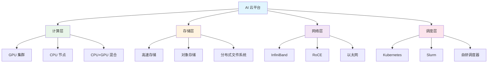
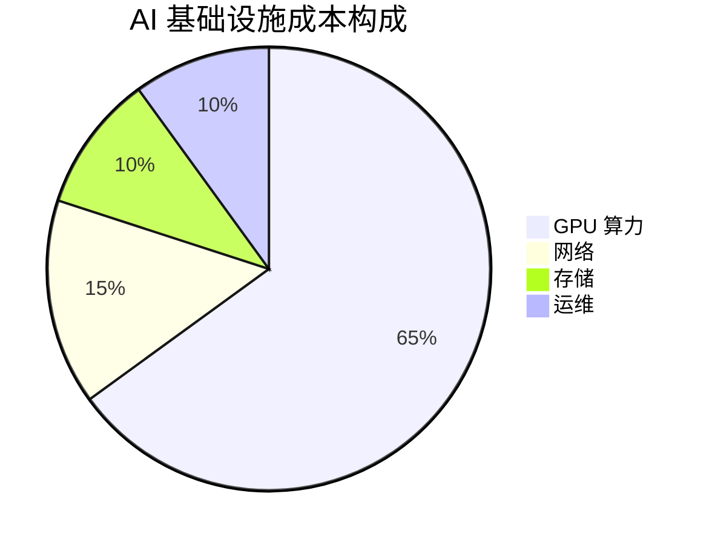

# ☁️ 云平台基础设施

> **一句话总结**：AI 云平台基础设施是支撑大规模模型训练与推理的核心，包括 GPU 集群、资源调度、高速网络和存储系统。

## 📋 目录

- [GPU 集群管理](./cloud-infra/) — GPU 选型、集群规模、故障处理
- [数据存储](./data/) — 数据湖、分布式存储、缓存策略
- [编程范式](./programming/) — CUDA、Triton、算子优化

## 🏗️ 基础设施架构

## 📊 基础设施关键指标

| 指标 | 说明 | 目标 |
|------|------|------|
| GPU 可用性 | 正常 GPU 比例 | >99% |
| 网络带宽利用率 | 实际带宽 / 总带宽 | 60-80% |
| 存储 IO 吞吐 | GB/s | 按需求 |
| 资源利用率 | GPU 时间 / 总时间 | >60% |
| 故障恢复时间 | MTTR | <30min |

## ⚡ 成本优化

### 成本构成

### 优化策略

| 策略 | 节省 | 风险 |
|------|------|------|
| Spot Instance | 60-90% | 中断风险 |
| 预留实例 | 30-40% | 承诺期限 |
| 混合云 | 20-30% | 复杂度增加 |
| 资源池化 | 15-25% | 需要调度器 |
| 自动伸缩 | 10-20% | 配置复杂 |

## 🔗 相关主题

- [架构设计](../03-architecture/) — 系统架构设计
- [稳定性](../06-stability/) — 服务稳定性保障
- [模型训练](../04-model-training/) — 训练基础设施

## 📚 延伸阅读

- [Kubernetes](https://kubernetes.io/) — 容器编排
- [Slurm](https://slurm.schedmd.com/) — HPC 调度器
