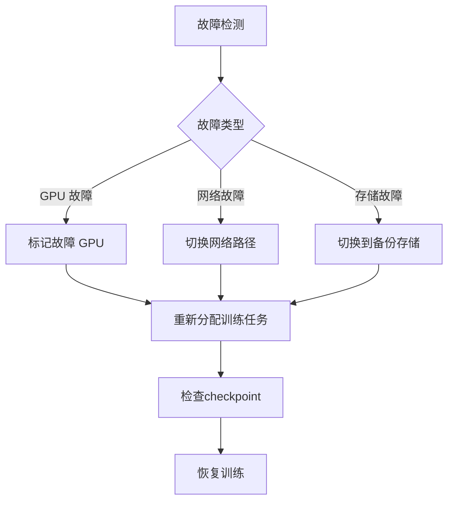

# GPU 集群管理

> **一句话总结**：GPU 集群管理是 AI 基础设施的核心，涉及硬件选型、集群规模规划、故障检测和弹性调度。

## 🖥️ GPU 选型矩阵

| GPU | FP16 算力 | 显存 | 带宽 | 价格/月 | 适用场景 |
|-----|----------|------|------|---------|---------|
| H100 | 989 TFLOPS | 80GB | 3.35TB/s | $20K | 超大规模训练 |
| A100 | 312 TFLOPS | 80GB | 2.0TB/s | $10K | 大规模训练 |
| A6000 | 91 TFLOPS | 48GB | 0.7TB/s | $3K | 中小训练 |
| L40S | 181 TFLOPS | 48GB | 0.9TB/s | $4K | 推理/微调 |

## 📊 集群规模规划

### 扩展策略

| 阶段 | GPU 数 | 规模 | 网络需求 |
|------|--------|------|---------|
| 实验 | 1-4 | <1B 参数 | 标准以太网 |
| 原型 | 8-32 | 1-7B 参数 | 100Gbps |
| 生产 | 64-256 | 7-70B 参数 | 400Gbps IB |
| 超大规模 | 512+ | 100B+ 参数 | 800Gbps IB |

## 🔧 故障检测与处理

## 📈 弹性调度策略

| 策略 | 描述 | 效果 |
|------|------|------|
| 动态调度 | 根据负载调整 | 利用率提升 20% |
| 抢占式实例 | 使用 spot instance | 成本降低 60% |
| 任务迁移 | 故障时迁移任务 | 恢复时间 <5min |
| 资源预留 | 关键任务预留 | 可用率 >99.9% |

## 📚 延伸阅读

- [NVIDIA GPU Management](https://docs.nvidia.com/datacenter/)
- [Slurm Workload Manager](https://slurm.schedmd.com/)
