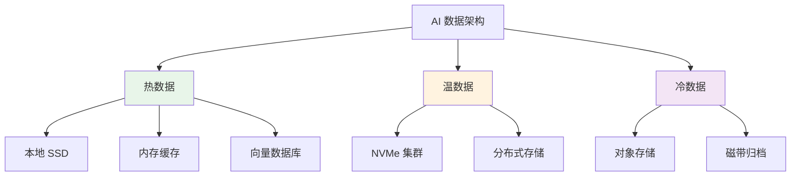
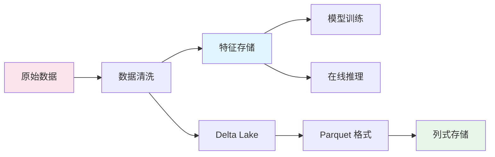
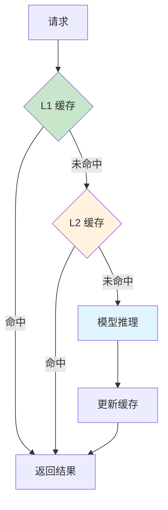

# 💾 数据存储

> **一句话总结**：AI 数据存储需要同时满足大规模预训练的数据吞吐和推理时的低延迟访问。

## 📋 目录

- [存储架构](#存储架构)
- [数据湖](#数据湖)
- [向量数据库](#向量数据库)
- [缓存策略](#缓存策略)

## 🏗️ 存储架构



## 🗄️ 数据湖

### 数据湖架构



### 存储格式对比

| 格式 | 压缩率 | 读取速度 | 随机访问 | 适用场景 |
|------|--------|---------|---------|---------|
| Parquet | 高 | 快 | 中 | 批量训练 |
| Avro | 中 | 中 | 高 | 流式数据 |
| HDF5 | 中 | 快 | 高 | 科学计算 |
| TFRecord | 低 | 快 | 低 | TensorFlow |

## 📐 向量数据库

### 向量检索

```python
import faiss
import numpy as np

# 初始化索引
dimension = 768
index = faiss.IndexFlatIP(dimension)  # 内积检索

# 构建索引
vectors = np.random.random((1000000, dimension)).astype('float32')
index.add(vectors)

# 检索
query = np.random.random((100, dimension)).astype('float32')
distances, indices = index.search(query, k=10)

# 性能指标
# 百万级向量检索 < 1ms
# 千万级向量检索 < 10ms (IVF 索引)
```

### 索引类型

| 索引 | 精度 | 速度 | 内存 | 适用场景 |
|------|------|------|------|---------|
| Flat | 100% | 慢 | 高 | 小数据集 |
| IVF | 95% | 快 | 中 | 百万级 |
| HNSW | 98% | 很快 | 高 | 亿级 |
| DiskANN | 96% | 中 | 低 | 超大规模 |

## ⚡ 缓存策略

### 多级缓存



### 缓存优化

| 策略 | 命中率提升 | 实现复杂度 |
|------|-----------|-----------|
| Prompt 缓存 | 30-50% | 低 |
| 结果缓存 | 20-40% | 低 |
| KV Cache | 40-60% | 中 |
| 模型蒸馏 | - | 高 |

## 📚 延伸阅读

- [Apache Iceberg](https://iceberg.apache.org/) — 数据湖格式
- [FAISS](https://faiss.ai/) — 向量检索库
