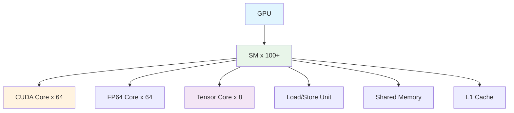
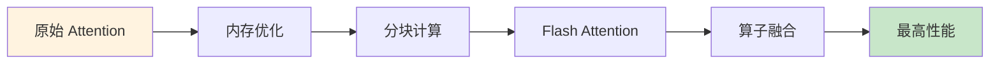

# 💻 编程范式

> **一句话总结**：AI 高性能编程需要深入理解 GPU 架构，掌握 CUDA 和高级框架实现算子级优化。

## 📋 目录

- [GPU 架构](#gpu-架构)
- [CUDA 编程](#cuda-编程)
- [Triton](#triton)
- [算子优化](#算子优化)

## 🖥️ GPU 架构

### GPU 层次结构



### 关键参数

| 参数 | H100 | A100 | V100 |
|------|------|------|------|
| CUDA Cores | 16896 | 6912 | 5120 |
| Tensor Cores | 528 | 432 | 640 |
| 显存 | 80GB HBM2e | 80GB HBM2e | 32GB HBM2 |
| 显存带宽 | 3.35 TB/s | 2.0 TB/s | 900 GB/s |
| 峰值算力（FP8） | 4990 TFLOPS | - | - |
| 峰值算力（FP16） | 989 TFLOPS | 312 TFLOPS | 125 TFLOPS |

## 🔥 CUDA 编程

### 基本 Kernel

```cuda
__global__ void matrix_mul_kernel(float* A, float* B, float* C, int N) {
    int row = blockIdx.y * blockDim.y + threadIdx.y;
    int col = blockIdx.x * blockDim.x + threadIdx.x;
    
    if (row < N && col < N) {
        float sum = 0.0f;
        for (int k = 0; k < N; k++) {
            sum += A[row * N + k] * B[k * N + col];
        }
        C[row * N + col] = sum;
    }
}
```

### 优化技巧

| 优化 | 描述 | 加速比 |
|------|------|--------|
| 共享内存 | 数据复用 | 2-5× |
| 内存合并访问 | 连续内存访问 | 2-3× |
| 循环展开 | 减少循环开销 | 10-20% |
| 指令重叠 | 计算与通信重叠 | 20-30% |
| 寄存器优化 | 减少寄存器溢出 | 10-15% |

## 🌿 Triton

### Triton Kernel 示例

```python
import triton
import triton.language as tl

@triton.jit
def matmul_kernel(
    a_ptr, b_ptr, c_ptr,
    M, N, K,
    stride_am, stride_ak,
    stride_bk, stride_bn,
    stride_cm, stride_cn,
    BLOCK_SIZE_M: tl.constexpr,
    BLOCK_SIZE_N: tl.constexpr,
    BLOCK_SIZE_K: tl.constexpr,
):
    pid_m = tl.program_id(0)
    pid_n = tl.program_id(1)
    
    offs_am = pid_m * BLOCK_SIZE_M + tl.arange(0, BLOCK_SIZE_M)
    offs_bn = pid_n * BLOCK_SIZE_N + tl.arange(0, BLOCK_SIZE_N)
    
    a_ptrs = a_ptr + offs_am[:, None] * stride_am + offs_bn[None, :] * stride_ak
    b_ptrs = b_ptr + offs_bn[:, None] * stride_bk + offs_am[None, :] * stride_bn
    
    accumulator = tl.zeros((BLOCK_SIZE_M, BLOCK_SIZE_N), dtype=tl.float32)
    
    for k in range(0, K, BLOCK_SIZE_K):
        a = tl.load(a_ptrs)
        b = tl.load(b_ptrs)
        accumulator += tl.dot(a, b)
        a_ptrs += BLOCK_SIZE_K * stride_ak
        b_ptrs += BLOCK_SIZE_K * stride_bn
    
    c_ptrs = c_ptr + offs_am[:, None] * stride_cm + offs_bn[None, :] * stride_cn
    tl.store(c_ptrs, accumulator)
```

## ⚡ 算子优化

### Attention 优化



### 优化效果

| 优化 | 显存 | 速度 |
|------|------|------|
| 原始 | 100% | 1× |
| 分块 | 50% | 1.2× |
| Flash Attn | 30% | 2-3× |
| 算子融合 | 20% | 4-5× |

## 📚 延伸阅读

- [CUDA Toolkit](https://developer.nvidia.com/cuda-toolkit)
- [Triton](https://triton-lang.org/) — GPU 编程框架
- [FlashAttention](https://arxiv.org/abs/2205.14135) — 高效 Attention
