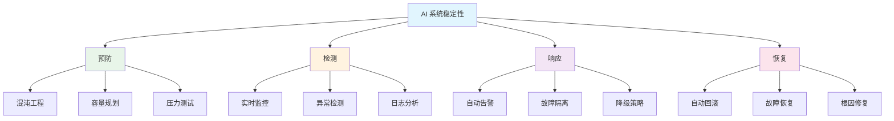
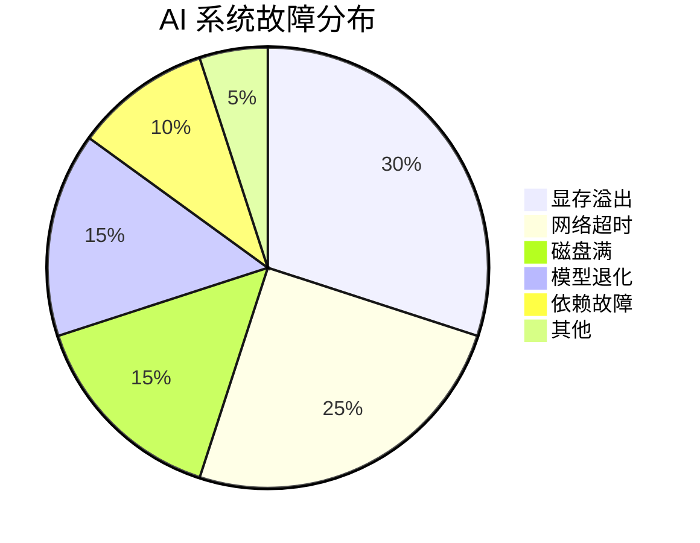

# 🛡️ 稳定性

> **一句话总结**：AI 系统稳定性保障需要覆盖从基础设施到模型服务的全链路监控、快速诊断和自动恢复。

## 📋 目录

- [故障诊断](./diagnosis/) — 根因分析、故障分类、诊断流程
- [日志分析](./log-analysis/) — 日志采集、解析、异常检测
- [性能监控](./performance/) — 指标采集、告警、容量规划

## 🏗️ 稳定性架构

## 📊 稳定性指标

| 指标 | 说明 | 目标 |
|------|------|------|
| MTTR | 平均恢复时间 | <15min |
| MTBF | 平均无故障时间 | >30天 |
| 可用率 | 系统可用时间比 | >99.9% |
| 故障率 | 每月故障次数 | <2 |
| 自愈率 | 自动恢复比例 | >80% |

## ⚡ 常见故障

### AI 系统故障类型

## 🔗 相关主题

- [架构设计](../03-architecture/) — 架构稳定性设计
- [服务端平台](../05-server-platform/) — 基础设施运维
- [AI 安全](../02-ai-security/) — 安全监控与告警

## 📚 延伸阅读

- [Google SRE](https://sre.google/sre-book/table-of-contents/)
- [Chaos Engineering](https://principlesofchaos.org/)
