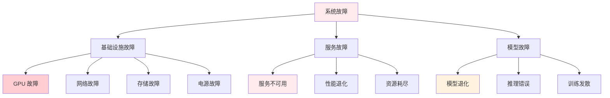
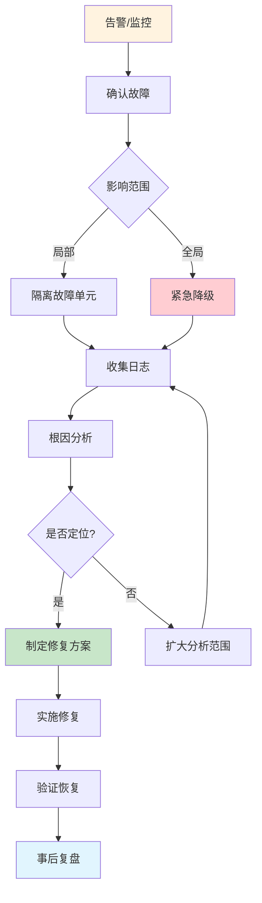
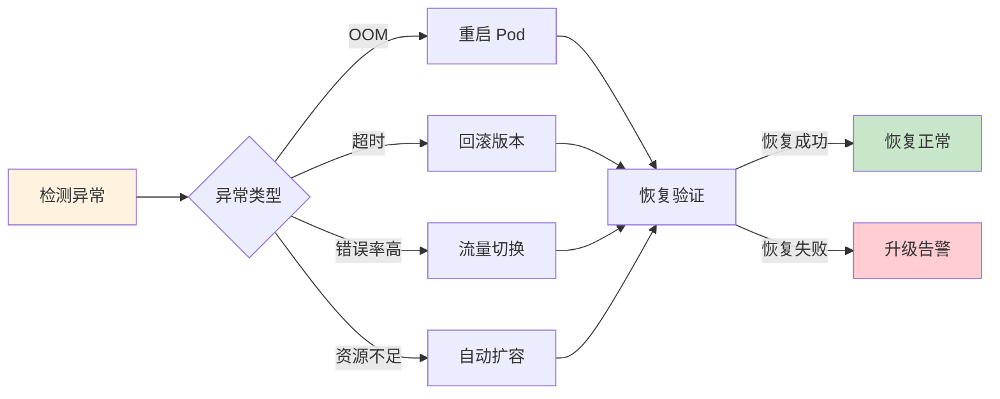

# 🔧 故障诊断

> **一句话总结**：AI 系统故障诊断需要快速定位根因，涵盖从基础设施到模型服务的全链路排查。

## 📋 目录

- [故障分类](#故障分类)
- [诊断流程](#诊断流程)
- [根因分析](#根因分析)
- [自愈策略](#自愈策略)

## 📊 故障分类

### AI 系统故障树



### 故障严重程度

| 等级 | 影响范围 | 恢复时间 | 示例 |
|------|---------|---------|------|
| S1 | 全站不可用 | <5min | 核心服务宕机 |
| S2 | 部分功能 | <15min | 搜索降级 |
| S3 | 性能下降 | <1h | 延迟增加 |
| S4 | 边缘问题 | <24h | 日志异常 |

## 🔄 诊断流程

### 标准诊断流程



## 🔍 根因分析

### 常见故障根因

| 故障现象 | 可能根因 | 排查方向 | 解决方案 |
|---------|---------|---------|---------|
| GPU OOM | 显存不足 | 检查 batch size、模型大小 | 减小 batch、梯度检查点 |
| 推理延迟高 | GPU 排队 | 检查 QPS、并发连接数 | 扩容、限流 |
| 训练损失跳变 | 学习率过大 | 检查 LR 调度器 | 降低 LR、梯度裁剪 |
| 模型输出异常 | 数据分布变化 | 检查输入数据 | 重新训练、数据修复 |
| 服务超时 | 依赖服务慢 | 检查上游依赖 | 添加超时、熔断 |

### 诊断检查清单

```markdown
## GPU OOM 诊断清单

- [ ] 检查显存使用率 `nvidia-smi`
- [ ] 检查当前 batch size
- [ ] 检查模型参数量
- [ ] 检查梯度累积步数
- [ ] 检查激活值大小
- [ ] 检查是否有内存泄漏
- [ ] 检查并发请求数

## 推理延迟高诊断清单

- [ ] 检查 GPU 利用率
- [ ] 检查请求排队时间
- [ ] 检查模型推理时间
- [ ] 检查网络延迟
- [ ] 检查缓存命中率
- [ ] 检查批量大小
```

## 🤖 自愈策略

### 自动恢复



### 自愈规则

```yaml
auto_healing:
  rules:
    - name: gpu_oom_recovery
      condition: gpu_oom_detected
      action: restart_pod
      cooldown: 300  # 5 分钟冷却
    
    - name: high_error_rate_rollback
      condition: error_rate > 5% for 5m
      action: rollback
      max_rollbacks: 3
    
    - name: auto_scale
      condition: cpu_utilization > 80% for 10m
      action: scale_up
      min_replicas: 2
      max_replicas: 20
```

## 📚 延伸阅读

- [Google SRE Incident Response](https://sre.google/sre-book/incident-response/)
- [Postmortem Culture](https://landing.google.com/sre/workbook/chapters/write-no-blamemortems/)
