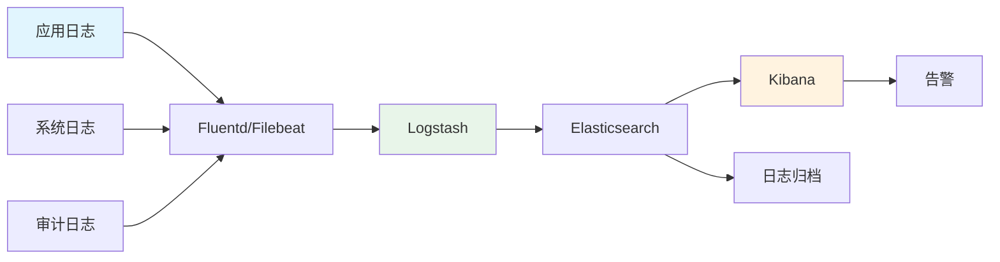
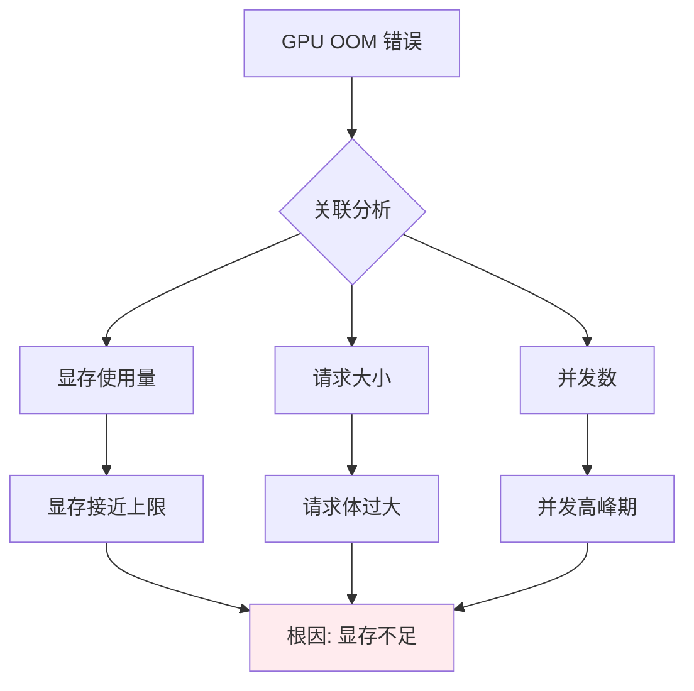

# 📝 日志分析

> **一句话总结**：日志分析是 AI 系统故障排查的第一现场，通过结构化日志和智能分析快速定位问题。

## 📋 目录

- [日志架构](#日志架构)
- [日志采集](#日志采集)
- [日志解析](#日志解析)
- [异常检测](#异常检测)

## 🏗️ 日志架构

### ELK/EFK 架构



## 📊 日志采集

### 日志源

| 日志源 | 格式 | 采集频率 | 保留期 |
|--------|------|---------|--------|
| 训练日志 | JSON | 实时 | 30天 |
| 推理日志 | JSON | 实时 | 7天 |
| 系统日志 | Syslog | 实时 | 90天 |
| 访问日志 | Nginx | 实时 | 30天 |
| GPU 日志 | Text | 定时 | 30天 |

### 日志格式规范

```json
{
    "timestamp": "2024-01-15T10:30:00Z",
    "level": "INFO",
    "service": "inference-api",
    "version": "1.2.0",
    "request_id": "abc-123-xyz",
    "trace_id": "trace-456",
    "user_id": "user-789",
    "event": "request_complete",
    "duration_ms": 45,
    "tokens_generated": 128,
    "model_version": "model-v3",
    "metadata": {
        "gpu_used": "cuda:0",
        "cache_hit": false
    }
}
```

## 🔍 日志解析

### 日志结构化

```python
class LogParser:
    def parse(self, log_line):
        """解析日志行"""
        
        # JSON 格式
        if log_line.startswith('{'):
            return json.loads(log_line)
        
        # 正则表达式解析
        patterns = {
            'inference': r'(\d+\.?\d*)ms.*tokens=(\d+).*model=(\S+)',
            'training': r'epoch=(\d+).*loss=(\d+\.\d+).*lr=(\d+\.\d+)',
            'gpu': r'GPU (\d+).*Util.*: (\d+)%',
        }
        
        for pattern_name, pattern in patterns.items():
            match = re.search(pattern, log_line)
            if match:
                return {'type': pattern_name, 'data': match.groups()}
        
        return {'type': 'unknown', 'raw': log_line}
```

### 异常模式检测

```python
class AnomalyDetector:
    def detect(self, logs):
        """检测日志异常模式"""
        
        anomalies = []
        
        # 错误频率突增
        error_rate = self.calculate_error_rate(logs)
        if error_rate > self.baseline * 2:
            anomalies.append({
                'type': 'error_spike',
                'severity': 'high',
                'rate': error_rate,
            })
        
        # 延迟异常
        latencies = [log.get('duration_ms', 0) for log in logs]
        p99_latency = np.percentile(latencies, 99)
        if p99_latency > self.latency_baseline * 3:
            anomalies.append({
                'type': 'latency_spike',
                'severity': 'high',
                'p99': p99_latency,
            })
        
        # 新错误模式
        new_errors = self.find_new_error_patterns(logs)
        if new_errors:
            anomalies.append({
                'type': 'new_error_pattern',
                'errors': new_errors,
            })
        
        return anomalies
```

## 🚨 异常检测

### 检测策略

| 策略 | 描述 | 适用场景 |
|------|------|---------|
| 阈值告警 | 超过阈值触发 | 已知指标 |
| 趋势告警 | 偏离历史趋势 | 逐步变化 |
| 关联分析 | 多指标关联 | 复杂故障 |
| ML 异常检测 | 学习正常模式 | 未知异常 |

### 关联分析



## 📚 延伸阅读

- [ELK Stack](https://www.elastic.co/elastic-stack/)
- [Fluentd](https://www.fluentd.org/) — 日志收集
