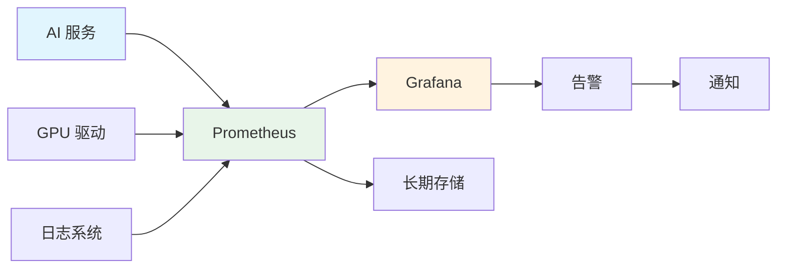

# 📊 性能监控

> **一句话总结**：性能监控是 AI 系统稳定性的眼睛，通过实时指标采集、智能告警和容量规划保障系统高效运行。

## 📋 目录

- [监控架构](#监控架构)
- [关键指标](#关键指标)
- [告警策略](#告警策略)
- [容量规划](#容量规划)
- [性能优化](#性能优化)

## 🏗️ 监控架构

### Prometheus + Grafana 架构



## 📈 关键指标

### GPU 指标

| 指标 | 采集方式 | 告警阈值 | 影响 |
|------|---------|---------|------|
| GPU 利用率 | nvidia-smi | <50% 持续 10min | 资源浪费 |
| 显存使用率 | nvidia-smi | >90% | OOM 风险 |
| GPU 温度 | nvidia-smi | >85°C | 降频 |
| ECC 错误 | nvidia-smi | >0 | 硬件故障 |
| NVLink 带宽 | nvlink | 异常波动 | 通信瓶颈 |

### 推理指标

| 指标 | 采集方式 | 告警阈值 | 影响 |
|------|---------|---------|------|
| 请求延迟 P99 | 应用监控 | >500ms | 用户体验 |
| 错误率 | 应用监控 | >1% | 服务质量 |
| QPS | 应用监控 | 低于预期 | 容量不足 |
| KV Cache 利用率 | 推理引擎 | <30% | 资源浪费 |
| 队列长度 | 服务网格 | >1000 | 背压 |

### 训练指标

| 指标 | 采集方式 | 告警阈值 | 影响 |
|------|---------|---------|------|
| 损失值 | 训练框架 | 异常跳变 | 训练失败 |
| 梯度范数 | 训练框架 | NaN/Inf | 训练发散 |
| 吞吐量 | 训练框架 | 低于预期 | 效率低下 |
| GPU 利用率 | nvidia-smi | <70% | 资源浪费 |
| 通信时间占比 | NCCL | >30% | 扩展瓶颈 |

## 🚨 告警策略

### 告警分级

| 等级 | 响应时间 | 通知方式 | 示例 |
|------|---------|---------|------|
| P0 | 5min | 电话 + 群 | 服务不可用 |
| P1 | 15min | 群 + IM | 性能严重下降 |
| P2 | 1h | 群 | 性能下降 |
| P3 | 4h | IM + 邮件 | 资源不足 |
| P4 | 当天 | 邮件 | 容量规划 |

### 告警规则配置

```yaml
alerts:
  - name: HighGPUMemory
    expr: gpu_memory_usage > 90
    for: 5m
    severity: P1
    action: auto_scale
    
  - name: HighLatency
    expr: request_latency_p99 > 500
    for: 5m
    severity: P1
    action: alert
    
  - name: LowGPUUtilization
    expr: gpu_utilization < 50
    for: 10m
    severity: P3
    action: alert
    
  - name: TrainingLossSpike
    expr: training_loss > baseline * 2
    for: 1m
    severity: P0
    action: stop_training
```

## 📐 容量规划

### 容量预测

```python
class CapacityPlanner:
    def predict(self, usage_history, months_ahead=3):
        """基于历史数据预测容量需求"""
        
        # 趋势分析
        trend = self.analyze_trend(usage_history)
        
        # 季节性分析
        seasonality = self.detect_seasonality(usage_history)
        
        # 预测
        forecast = self.forecast(
            trend=trend,
            seasonality=seasonality,
            periods=months_ahead
        )
        
        # 建议
        recommendations = self.make_recommendations(forecast)
        return recommendations
```

### 扩容策略

| 策略 | 场景 | 实施方式 |
|------|------|---------|
| 垂直扩容 | 单机资源不足 | 升级 GPU/CPU |
| 水平扩容 | 并发请求增加 | 增加实例 |
| 弹性扩容 | 流量波动 | K8s HPA |
| 预留扩容 | 可预测流量 | 预留实例 |

## 🔧 性能优化

### 优化方向

```mermaid
mindmap
    root[(性能优化)]
        推理优化
            KV Cache
            批处理
            量化
            算子融合
        训练优化
            分布式训练
            混合精度
            梯度累积
            通信优化
        存储优化
            数据预取
            缓存
            格式优化
        网络优化
            RDMA
            拓扑优化
            路由优化
```

### 优化效果

| 优化项 | 效果 | 复杂度 |
|--------|------|--------|
| KV Cache 优化 | 吞吐 2-3× | 中 |
| 批量大小调整 | 吞吐 1.5-2× | 低 |
| 模型量化 INT8 | 推理速度 2×，精度降 1% | 中 |
| 算子融合 | 推理速度 1.3-1.5× | 高 |
| FP16/BF16 | 训练速度 2× | 低 |

## 📚 延伸阅读

- [Prometheus](https://prometheus.io/) — 监控系统
- [Grafana](https://grafana.com/) — 可视化
