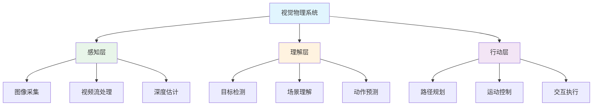

# 👁️ 视觉物理

> **一句话总结**：视觉物理是 AI 从数字世界走向物理世界的桥梁，让机器能够"看见"并理解物理环境。

## 📋 目录

- [计算机视觉](./computer-vision/) — 图像分类、分割、生成
- [目标检测](./detection/) — 目标检测、实例分割、关键点检测
- [机器人视觉](./robotic/) — SLAM、运动控制、环境感知

## 🏗️ 视觉系统架构

## 📊 视觉任务分类

| 任务 | 输入 | 输出 | 延迟要求 |
|------|------|------|---------|
| 图像分类 | 图像 | 类别标签 | <100ms |
| 目标检测 | 图像 | 边界框+类别 | <50ms |
| 语义分割 | 图像 | 像素级类别 | <100ms |
| 实例分割 | 图像 | 实例级掩码 | <100ms |
| 姿态估计 | 图像 | 关键点坐标 | <50ms |
| 深度估计 | 图像/视频 | 深度图 | <50ms |
| 视频理解 | 视频 | 事件描述 | <200ms |

## ⚡ 性能要求

### 边缘设备 vs 云端

| 指标 | 边缘设备 | 云端 |
|------|---------|------|
| 计算资源 | 有限（<10W） | 充足（GPU） |
| 推理延迟 | <50ms | <200ms |
| 模型大小 | <50MB | 无限制 |
| 精度要求 | 高（实时决策） | 高 |
| 典型模型 | MobileNet, YOLO-Nano | ViT-Large |

## 🔗 相关主题

- [模型训练](../04-model-training/) — 视觉模型训练
- [Agent 架构](../01-agent-arch/) — 多模态 Agent
- [架构设计](../03-architecture/) — 边缘部署架构

## 📚 延伸阅读

- [YOLO](https://arxiv.org/abs/2207.22154) — 目标检测
- [SAM](https://arxiv.org/abs/2304.02643) — 分割一切
- [RT-DETR](https://arxiv.org/abs/2304.08069) — 实时检测
