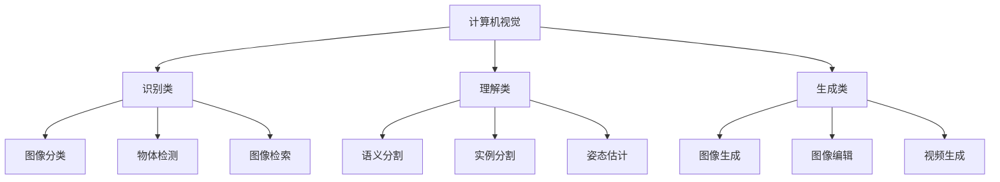

# 计算机视觉

> **一句话总结**：计算机视觉让 AI 理解图像内容，从分类到分割再到生成，覆盖视觉理解的全场景。

## 📋 视觉任务体系



## 📊 主流模型对比

### 分类模型

| 模型 | 参数量 | Top-1 准确率 | 速度 (FPS) |
|------|--------|-------------|-----------|
| ResNet-50 | 25M | 76.1% | 1000+ |
| ViT-B/16 | 86M | 81.8% | 500+ |
| ConvNeXt-L | 200M | 84.8% | 300+ |
| Swin-L | 197M | 86.6% | 200+ |

### 分割模型

| 模型 | 任务 | mAP | 速度 (FPS) |
|------|------|-----|-----------|
| DeepLabV3+ | 语义分割 | 45.4 | 30 |
| Mask R-CNN | 实例分割 | 40.5 | 20 |
| SAM | 零样本分割 | - | 15 |
| YOLOv8-Seg | 实时分割 | 38.2 | 80 |

## 🔧 核心算法

### 图像分类

```python
# 使用 torchvision 训练分类模型
from torchvision import models, transforms
from PIL import Image

# 加载预训练模型
model = models.resnet50(pretrained=True)
model.eval()

# 预处理
preprocess = transforms.Compose([
    transforms.Resize(256),
    transforms.CenterCrop(224),
    transforms.ToTensor(),
    transforms.Normalize(mean=[0.485, 0.456, 0.406],
                        std=[0.229, 0.224, 0.225])
])

# 推理
image = Image.open('input.jpg')
input_tensor = preprocess(image)
output = model(input_tensor.unsqueeze(0))
```

### 语义分割

```python
# 使用 torchseg 进行语义分割
import torch
from torchseg import create_segmentation_model

# 加载分割模型
model = create_segmentation_model(
    arch='deeplabv3+',
    encoder_name='efficientnet-b4',
    classes=21  # PASCAL VOC 类别数
)

# 推理
with torch.no_grad():
    segmentation = model(input_image)
```

## ⚡ 视觉生成

### 图像生成模型

| 模型 | 类型 | 分辨率 | 特点 |
|------|------|--------|------|
| DALL-E 3 | Text-to-Image | 1024² | 高质量文本理解 |
| Stable Diffusion | Text-to-Image | 512² | 开源可定制 |
| Midjourney | Text-to-Image | 1024² | 艺术风格 |
| Sora | Text-to-Video | 1080p | 视频生成 |

## 📚 延伸阅读

- [ImageNet](http://www.image-net.org/) — 大规模视觉识别挑战
- [SAM](https://arxiv.org/abs/2304.02643) — 分割一切模型
- [DALL-E](https://arxiv.org/abs/2102.12092) — 文本生成图像
