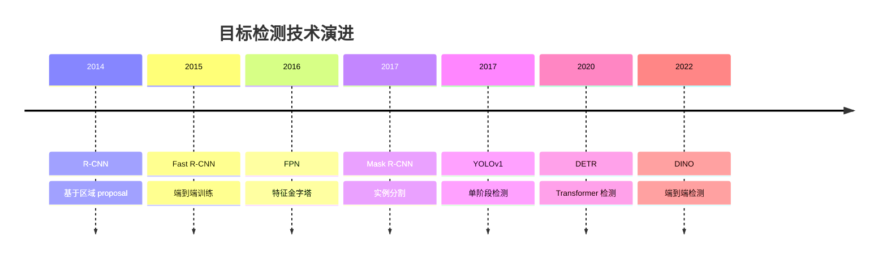
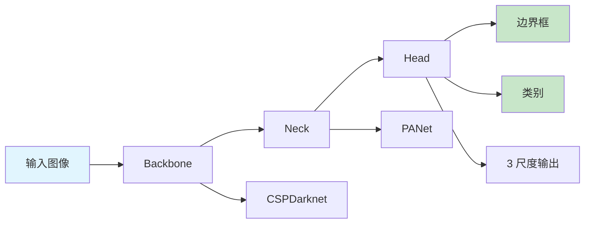
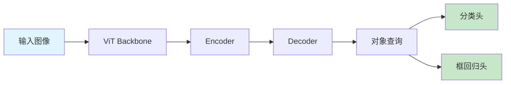

# 目标检测

> **一句话总结**：目标检测在图像中定位并识别物体，是自动驾驶、安防监控等场景的核心技术。

## 📋 检测算法演进



## 📊 主流检测器对比

| 模型 | 类型 | COCO mAP | 速度 (FPS) | 参数量 |
|------|------|---------|-----------|--------|
| Faster R-CNN | 两阶段 | 37.0 | 5 | 42M |
| Mask R-CNN | 两阶段 | 40.5 | 20 | 45M |
| YOLOv3 | 单阶段 | 33.0 | 65 | 62M |
| YOLOv5-L | 单阶段 | 48.3 | 90 | 30M |
| YOLOv8-X | 单阶段 | 53.9 | 100+ | 68M |
| DEtection TRansformer | Transformer | 49.0 | 25 | 106M |
| DINO-DETR | Transformer | 53.6 | 30 | 130M |

## 🔧 核心算法

### YOLO 架构



### DETR 架构



### 检测实现示例

```python
# YOLOv8 检测
from ultralytics import YOLO

# 加载模型
model = YOLO('yolov8n.pt')

# 推理
results = model.predict('image.jpg', conf=0.25)

# 输出格式
for r in results:
    boxes = r.boxes
    for box in boxes:
        print(f"Class: {box.cls}, Confidence: {box.conf:.2f}")
        print(f"Box: {box.xyxy}")
```

## ⚡ 实时检测优化

### 优化策略

| 策略 | 速度提升 | 精度损失 |
|------|---------|---------|
| 模型量化 INT8 | 2-4× | <1% |
| TensorRT 优化 | 2-3× | <0.5% |
| 模型剪枝 | 1.5-2× | 1-3% |
| 知识蒸馏 | 1.5× | <1% |
| 动态分辨率 | 1.3× | 无 |

## 📚 延伸阅读

- [YOLO](https://arxiv.org/abs/2207.22154) — 实时目标检测
- [DETR](https://arxiv.org/abs/2005.12872) — Transformer 检测
- [Faster R-CNN](https://arxiv.org/abs/1506.01497) — 两阶段检测器
