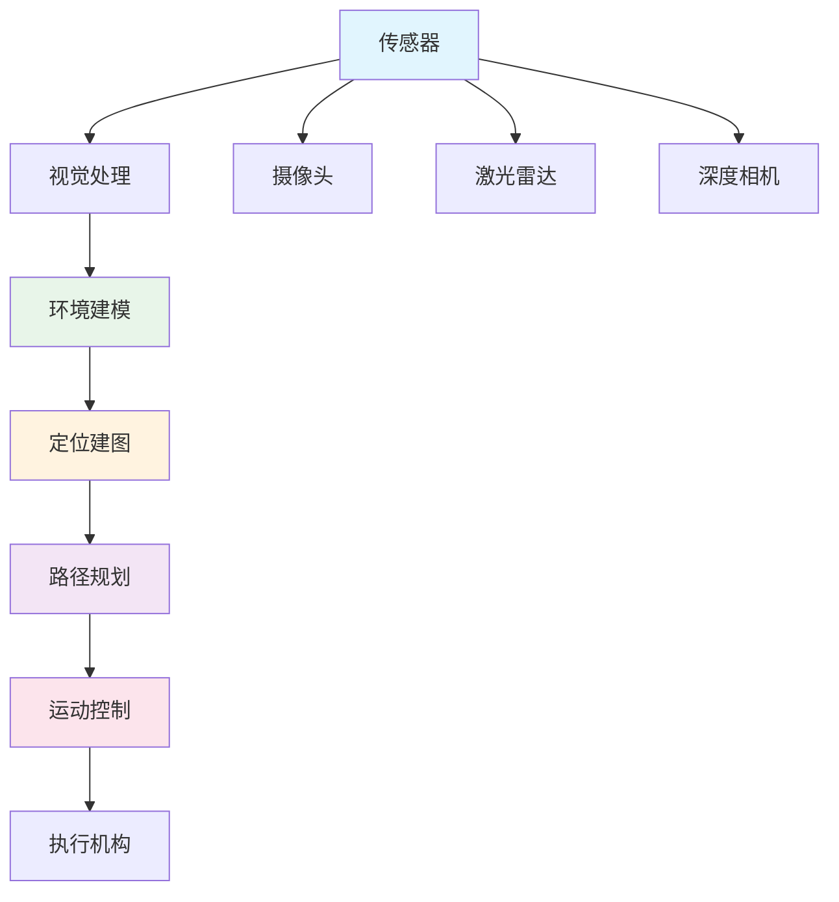
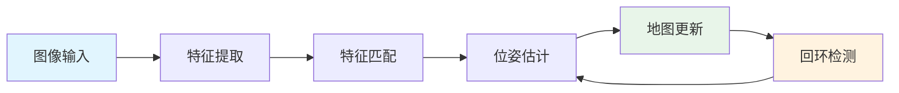
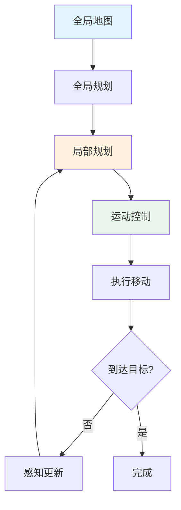

# 机器人视觉

> **一句话总结**：机器人视觉让 AI 驱动的设备理解并适应物理环境，实现自主导航和智能操作。

## 📋 视觉系统架构



## 🗺️ SLAM 技术

### SLAM 流程



### SLAM 算法对比

| 算法 | 类型 | 精度 | 实时性 | 适用场景 |
|------|------|------|--------|---------|
| ORB-SLAM3 | 视觉 SLAM | 高 | 中 | 机器人导航 |
| VINS-Mono | 视觉惯性 | 高 | 高 | 移动机器人 |
| DROID-SLAM | 深度学习 | 中高 | 高 | 大规模场景 |
| RTAB-Map | 视觉 SLAM | 中 | 高 | 室内导航 |
|LIO-SAM | 激光 SLAM | 高 | 高 | 自动驾驶 |

## 🧭 环境感知

### 感知任务

```mermaid
mindmap
    root[(环境感知)]
        障碍物检测
            静态障碍物
            动态障碍物
            可通行区域
        语义理解
            道路类型
            交通标志
            行人检测
        深度估计
            单目深度
            立体深度
            事件相机
        场景重建
            稀疏点云
            稠密重建
            神经渲染
```

### 障碍物检测

```python
class ObstacleDetector:
    def detect(self, camera_frame, lidar_data):
        """多传感器融合障碍物检测"""
        
        # 视觉检测
        visual_objects = self.visual_detector.detect(camera_frame)
        
        # 激光雷达检测
        lidar_points = self.lidar_processor.process(lidar_data)
        
        # 传感器融合
        obstacles = self.sensor_fusion(
            visual_objects, lidar_points
        )
        
        return obstacles
    
    def sensor_fusion(self, visual, lidar):
        """检测融合"""
        # 时空对齐
        aligned = self.align(visual, lidar)
        
        # 融合判断
        fused = []
        for obj in visual:
            if obj.confidence > 0.7:
                fused.append(obj)
            elif self.find_lidar_match(obj, lidar):
                fused.append(obj)
        
        return fused
```

## 🎯 自主导航

### 导航流程



### 路径规划算法

| 算法 | 类型 | 最优性 | 实时性 | 适用场景 |
|------|------|--------|--------|---------|
| A* | 搜索 | 最优 | 高 | 静态地图 |
| Dijkstra | 搜索 | 最优 | 中 | 小地图 |
| RRT* | 采样 | 渐进最优 | 高 | 高维空间 |
| MPC | 控制 | 局部最优 | 高 | 实时控制 |
| Hybrid A* | 混合 | 近似最优 | 高 | 车辆导航 |

## 📚 延伸阅读

- [ORB-SLAM3](https://arxiv.org/abs/2102.06364) — 多地图 SLAM
- [VINS-Mono](https://arxiv.org/abs/1708.03852) — 视觉惯性 SLAM
- [Deep Learning for Visual SLAM](https://arxiv.org/abs/2101.00493)
