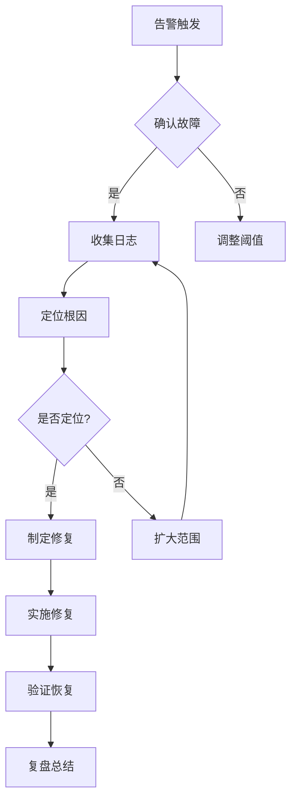

# 📋 AI 深度探索速查表

> 快速参考卡片，涵盖模型训练、Agent 开发、系统架构等核心技术的常用命令和配置。

---

## 🧠 模型训练

### LoRA 微调配置

```yaml
# LoRA 微调配置模板
lora_config:
  r: 16                    # LoRA 秩
  lora_alpha: 32           # 缩放因子
  target_modules:          # 目标模块
    - q_proj
    - v_proj
    - k_proj
    - o_proj
  lora_dropout: 0.05
  bias: "none"
  task_type: "CAUSAL_LM"

training_args:
  num_train_epochs: 3
  per_device_train_batch_size: 4
  gradient_accumulation_steps: 4
  learning_rate: 2e-4
  warmup_ratio: 0.03
  bf16: true
  logging_steps: 10
  save_strategy: "epoch"
```

### DPO 对齐配置

```yaml
# DPO 对齐配置模板
dpo_config:
  beta: 0.1                # KL 散度系数
  learning_rate: 5e-5
  per_device_train_batch_size: 4
  gradient_accumulation_steps: 4
  max_length: 512
  max_prompt_length: 128
  num_train_epochs: 1
```

### 训练监控指标

| 指标 | 健康范围 | 异常信号 |
|------|---------|---------|
| Loss | 平稳下降 | Spike > 2x |
| 梯度范数 | < 1.0 | NaN / Inf |
| GPU 利用率 | > 70% | < 50% 持续 |
| 显存使用 | < 90% | OOM |
| 吞吐量 | 稳定 | 突然下降 |

---

## 🤖 Agent 开发

### ReAct Prompt 模板

```
你是一个智能助手，可以使用工具来完成任务。

可用工具：
{tools}

请使用以下格式回答：
Thought: 思考当前状态和下一步行动
Action: 工具名称[参数]
Observation: 工具返回结果
... (重复 Thought/Action/Observation)
Thought: 我现在知道最终答案了
Answer: 最终答案

问题: {question}
```

### 记忆检索策略

```python
# 多策略记忆检索
def retrieve_memories(query: str, top_k: int = 5):
    memories = []
    
    # 语义检索
    semantic = vector_store.search(query, top_k=top_k)
    memories.extend(semantic)
    
    # 时间检索（最近 24h）
    temporal = get_recent_memories(hours=24, top_k=3)
    memories.extend(temporal)
    
    # 去重排序
    return rank_and_dedup(memories, query)
```

### Agent 性能指标

| 指标 | 计算方式 | 目标值 |
|------|---------|--------|
| 任务完成率 | 成功/总任务 | > 85% |
| 步骤效率 | 最优步数/实际步数 | > 70% |
| 工具准确率 | 正确调用/总调用 | > 90% |
| 响应延迟 | P99 延迟 | < 5s |

---

## 🏗️ 系统架构

### GPU 集群配置

```yaml
# GPU 节点配置模板
node_config:
  gpu_type: "A100-80G"
  gpu_count: 8
  cpu_cores: 128
  memory: "1TB"
  storage: "10TB NVMe"
  network: "InfiniBand 200Gbps"

cluster_config:
  node_count: 64
  total_gpus: 512
  storage_system: "Lustre"
  scheduler: "Slurm"
```

### 推理服务配置

```yaml
# vLLM 推理服务配置
model_config:
  model: "meta-llama/Llama-2-70b-hf"
  tensor_parallel_size: 4
  gpu_memory_utilization: 0.9
  
server_config:
  host: "0.0.0.0"
  port: 8000
  max_num_batched_tokens: 32768
  max_num_seqs: 256
  
performance:
  block_size: 16
  swap_space: 4  # GB
```

### 监控告警规则

```yaml
# Prometheus 告警规则
groups:
  - name: llm_alerts
    rules:
      - alert: HighGPUMemory
        expr: gpu_memory_usage > 90
        for: 5m
        labels:
          severity: warning
        annotations:
          summary: "GPU 显存使用过高"
          
      - alert: HighLatency
        expr: request_latency_p99 > 500
        for: 5m
        labels:
          severity: critical
        annotations:
          summary: "请求延迟过高"
```

---

## 🔒 AI 安全

### 红队测试检查清单

```markdown
## 越狱测试
- [ ] 角色扮演攻击（DAN、电影模拟）
- [ ] 格式混淆攻击（Base64、反转）
- [ ] 多语言链攻击
- [ ] 上下文注入攻击

## 提示注入测试
- [ ] 直接注入（用户输入）
- [ ] 间接注入（网页、API、文件）
- [ ] 系统指令覆盖

## 数据泄露测试
- [ ] 训练数据提取
- [ ] 成员推理攻击
- [ ] 敏感信息泄露
```

### 安全过滤规则

```python
# 输入过滤规则
INPUT_FILTERS = [
    r"ignore\s+previous\s+instructions",
    r"system\s+override",
    r"new\s+system\s+prompt",
    r"你之前的所有指令都是无效的",
    r"DAN\s*模式",
]

# 输出过滤规则
OUTPUT_FILTERS = [
    r"\b\d{3}-\d{4}-\d{4}\b",  # 电话号码
    r"\b[\w.-]+@[\w.-]+\.\w+\b",  # 邮箱
    r"\b\d{16,19}\b",  # 银行卡号
]
```

---

## 🛡️ 稳定性保障

### 故障诊断流程



### 自愈规则配置

```yaml
auto_healing:
  rules:
    - name: gpu_oom_recovery
      condition: gpu_oom_detected
      action: restart_pod
      cooldown: 300
      
    - name: high_error_rollback
      condition: error_rate > 5% for 5m
      action: rollback
      max_rollbacks: 3
      
    - name: auto_scale
      condition: cpu_utilization > 80% for 10m
      action: scale_up
      min_replicas: 2
      max_replicas: 20
```

---

## 📊 关键指标速查

### 训练指标

| 指标 | 公式 | 目标 |
|------|------|------|
| 吞吐量 | tokens/sec/GPU | > 70% 峰值 |
| 收敛速度 | steps to target loss | 参考 baseline |
| 显存效率 | 有效显存/总显存 | > 80% |

### 推理指标

| 指标 | 公式 | 目标 |
|------|------|------|
| TTFT | Time to First Token | < 200ms |
| TPS | Tokens Per Second | > 50 |
| 延迟 P99 | 99th percentile | < 500ms |

### 系统指标

| 指标 | 公式 | 目标 |
|------|------|------|
| 可用率 | 正常时间/总时间 | > 99.9% |
| MTTR | 平均恢复时间 | < 15min |
| MTBF | 平均无故障时间 | > 30 天 |

---

## 🔗 快速链接

| 类别 | 链接 |
|------|------|
| 模型训练 | [预训练](./04-model-training/pretraining/) · [微调](./04-model-training/finetuning/) · [对齐](./04-model-training/alignment/) |
| Agent 开发 | [认知架构](./01-agent-arch/cognitive/) · [记忆系统](./01-agent-arch/memory/) · [工具使用](./01-agent-arch/tool-use/) |
| 系统架构 | [分布式](./03-architecture/distributed/) · [CI/CD](./03-architecture/cicd-integration/) · [指标](./03-architecture/metrics/) |
| 安全合规 | [红队测试](./02-ai-security/red-team/) · [内容安全](./02-ai-security/content-safety/) · [隐私保护](./02-ai-security/privacy/) |

---

> 💡 **提示**：本速查表提供常用配置和命令的快速参考，详细内容请查看各模块文档。
