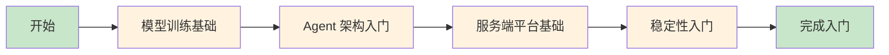
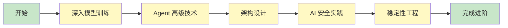
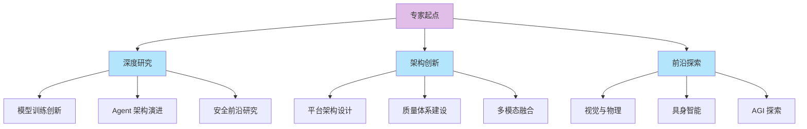

# 🚀 AI 深度探索知识库

> **核心目标**：构建大语言模型从理论到实践的完整知识体系，覆盖模型训练、Agent 架构、服务端平台、稳定性保障、AI 安全、架构演进、视觉物理等全栈技术领域。

## 📖 知识库简介

AI 深度探索知识库是一个面向 AI 工程师和研究人员的技术知识体系，旨在帮助开发者系统性地掌握大语言模型相关技术，从底层训练到上层应用，从单机实验到分布式生产。

### 🎯 核心价值

| 维度 | 说明 |
|------|------|
| **系统性** | 覆盖 AI 全生命周期，从训练到部署到运维 |
| **实践性** | 结合真实场景，提供可落地的技术方案 |
| **前沿性** | 紧跟学术与工业界最新进展 |
| **可操作性** | 提供代码示例、配置模板、最佳实践 |

### 📚 学习目标

- **入门者**：建立 AI 技术全景认知，掌握基础概念与工具链
- **开发者**：具备独立构建 AI 应用的能力，理解核心原理
- **架构师**：设计高可用、可扩展的 AI 系统架构
- **研究者**：深入前沿技术，推动技术创新

---

## 🗂️ 目录结构概览

```mermaid
graph TD
    ROOT[AI 深度探索知识库] --> A[01-🤖 Agent 架构]
    ROOT --> B[02-🔒 AI 安全]
    ROOT --> C[03-🏗️ 架构设计]
    ROOT --> D[04-🧠 模型训练]
    ROOT --> E[05-🖥️ 服务端平台]
    ROOT --> F[06-🛡️ 稳定性]
    ROOT --> G[07-👁️ 视觉与物理]
    
    A --> A1[认知架构]
    A --> A2[记忆系统]
    A --> A3[工具使用]
    A --> A4[多 Agent 协作]
    
    B --> B1[红队测试]
    B --> B2[内容安全]
    B --> B3[隐私保护]
    B --> B4[对齐评估]
    
    C --> C1[分布式架构]
    C --> C2[CI/CD 集成]
    C --> C3[指标体系]
    C --> C4[平台演进]
    C --> C5[质量平台]
    
    D --> D1[预训练]
    D --> D2[指令微调]
    D --> D3[偏好对齐]
    D --> D4[模型压缩]
    
    E --> E1[云基础设施]
    E --> E2[数据处理]
    E --> E3[编程范式]
    
    F --> F1[故障诊断]
    F --> F2[日志分析]
    F --> F3[性能监控]
    
    G --> G1[计算机视觉]
    G --> G2[目标检测]
    G --> G3[机器人视觉]
    
    style ROOT fill:#e3f2fd
    style A fill:#fff3e0
    style B fill:#ffebee
    style C fill:#e8f5e9
    style D fill:#f3e5f5
    style E fill:#e1f5fe
    style F fill:#fce4ec
    style G fill:#f1f8e9
```

---

## 🧭 学习路径指引

### 🌱 入门路径

> 适合：初学者、转行开发者、产品经理

**预计学习周期**：4-6 周

| 阶段 | 学习内容 | 预计时间 | 学习目标 |
|------|---------|---------|---------|
| 第 1 周 | [模型训练](./04-model-training/) 概述、预训练基础概念 | 1 周 | 理解 LLM 训练流程 |
| 第 2 周 | [指令微调](./04-model-training/finetuning/)、LoRA 基础 | 1 周 | 掌握微调基本方法 |
| 第 3 周 | [Agent 架构](./01-agent-arch/)、认知架构基础 | 1 周 | 理解 Agent 工作原理 |
| 第 4 周 | [服务端平台](./05-server-platform/)、API 设计基础 | 1 周 | 了解部署与运维 |
| 第 5-6 周 | [稳定性](./06-stability/) 基础、日志分析入门 | 2 周 | 掌握基础运维能力 |

**入门学习清单**：

- [ ] 理解 Transformer 架构基本原理
- [ ] 了解预训练、微调、对齐的区别
- [ ] 完成一次 LoRA 微调实践
- [ ] 理解 Agent 的认知架构（ReAct）
- [ ] 部署一个简单的 LLM API 服务
- [ ] 学会基本的日志分析和问题排查

---

### 🚀 进阶路径

> 适合：有一定基础的开发者、算法工程师

**预计学习周期**：8-12 周

| 阶段 | 学习内容 | 预计时间 | 学习目标 |
|------|---------|---------|---------|
| 第 1-3 周 | [预训练](./04-model-training/pretraining/)、[对齐](./04-model-training/alignment/)、[压缩](./04-model-training/compression/) | 3 周 | 掌握全流程训练技术 |
| 第 4-5 周 | [记忆系统](./01-agent-arch/memory/)、[工具使用](./01-agent-arch/tool-use/)、[多 Agent](./01-agent-arch/multi-agent/) | 2 周 | 构建复杂 Agent 系统 |
| 第 6-7 周 | [分布式架构](./03-architecture/distributed/)、[CI/CD](./03-architecture/cicd-integration/)、[指标体系](./03-architecture/metrics/) | 2 周 | 设计可扩展系统 |
| 第 8-9 周 | [红队测试](./02-ai-security/red-team/)、[内容安全](./02-ai-security/content-safety/)、[隐私保护](./02-ai-security/privacy/) | 2 周 | 构建安全防护体系 |
| 第 10-12 周 | [故障诊断](./06-stability/diagnosis/)、[性能监控](./06-stability/performance/)、[日志分析](./06-stability/log-analysis/) | 3 周 | 保障系统稳定性 |

**进阶学习清单**：

- [ ] 掌握分布式训练技术（DP/TP/PP）
- [ ] 实现 DPO/RLHF 对齐训练
- [ ] 构建多工具协作的 Agent 系统
- [ ] 设计多 Agent 协作架构
- [ ] 实现完整的 CI/CD 流水线
- [ ] 构建红队测试框架
- [ ] 设计高可用 LLM 服务架构

---

### 🎓 专家路径

> 适合：资深工程师、架构师、研究人员

**预计学习周期**：持续学习

| 研究方向 | 核心内容 | 涉及模块 |
|---------|---------|---------|
| **模型训练创新** | 训练效率优化、新型对齐算法、模型压缩前沿 | [模型训练](./04-model-training/) |
| **Agent 架构演进** | 自主 Agent、长期记忆、世界模型 | [Agent 架构](./01-agent-arch/) |
| **安全前沿研究** | 对齐理论、可解释性、宪法 AI | [AI 安全](./02-ai-security/) |
| **平台架构设计** | 多租户架构、弹性伸缩、成本优化 | [架构设计](./03-architecture/)、[服务端平台](./05-server-platform/) |
| **质量体系建设** | 评估框架、自动化测试、持续监控 | [质量平台](./03-architecture/quality-platform/)、[稳定性](./06-stability/) |
| **多模态融合** | 视觉语言模型、跨模态对齐 | [视觉与物理](./07-vision-physical/) |
| **具身智能** | 机器人视觉、物理世界交互 | [视觉与物理](./07-vision-physical/) |

**专家能力矩阵**：

| 能力维度 | 要求 |
|---------|------|
| 技术深度 | 在至少一个领域达到专家水平，能独立解决复杂问题 |
| 技术广度 | 理解全栈技术体系，能进行跨领域技术决策 |
| 架构能力 | 能设计大规模、高可用、可扩展的 AI 系统 |
| 创新能力 | 能跟踪前沿研究，将新技术应用到实际场景 |
| 工程能力 | 能将研究成果转化为可落地的工程方案 |

---

## 🔍 快速导航索引

### 按技术领域

| 领域 | 模块 | 核心内容 |
|------|------|---------|
| 🧠 **模型训练** | [模型训练与微调](./04-model-training/) | 预训练、微调、对齐、压缩 |
| 🤖 **智能体** | [Agent 架构](./01-agent-arch/) | 认知、记忆、工具、协作 |
| 🔒 **安全** | [AI 安全与对齐](./02-ai-security/) | 红队、内容安全、隐私、评估 |
| 🏗️ **架构** | [架构设计](./03-architecture/) | 分布式、CI/CD、指标、演进 |
| 🖥️ **平台** | [服务端平台](./05-server-platform/) | 云设施、数据、编程 |
| 🛡️ **稳定性** | [稳定性保障](./06-stability/) | 诊断、日志、监控 |
| 👁️ **视觉** | [视觉与物理](./07-vision-physical/) | CV、检测、机器人 |

### 按角色需求

| 角色 | 推荐学习模块 |
|------|-------------|
| 算法工程师 | [模型训练](./04-model-training/) → [Agent 架构](./01-agent-arch/) → [AI 安全](./02-ai-security/) |
| 后端工程师 | [服务端平台](./05-server-platform/) → [架构设计](./03-architecture/) → [稳定性](./06-stability/) |
| 架构师 | [架构设计](./03-architecture/) → [稳定性](./06-stability/) → [AI 安全](./02-ai-security/) |
| 安全工程师 | [AI 安全](./02-ai-security/) → [模型训练/对齐](./04-model-training/alignment/) → [质量平台](./03-architecture/quality-platform/) |
| CV 工程师 | [视觉与物理](./07-vision-physical/) → [模型训练](./04-model-training/) → [Agent 架构](./01-agent-arch/) |

### 按应用场景

| 场景 | 推荐模块 |
|------|---------|
| 构建 AI 应用 | [Agent 架构](./01-agent-arch/) → [服务端平台](./05-server-platform/) |
| 模型定制化 | [模型训练/微调](./04-model-training/finetuning/) → [模型训练/对齐](./04-model-training/alignment/) |
| 生产部署 | [架构设计](./03-architecture/) → [稳定性](./06-stability/) → [服务端平台](./05-server-platform/) |
| 安全合规 | [AI 安全](./02-ai-security/) → [质量平台](./03-architecture/quality-platform/) |
| 多模态应用 | [视觉与物理](./07-vision-physical/) → [Agent 架构/工具使用](./01-agent-arch/tool-use/) |

---

## 🏷️ 关键词索引

### A-C

| 关键词 | 相关模块 |
|--------|---------|
| Agent | [Agent 架构](./01-agent-arch/) |
| Attention | [模型训练/预训练](./04-model-training/pretraining/) |
| CI/CD | [架构设计/CI/CD](./03-architecture/cicd-integration/) |
| DPO | [模型训练/对齐](./04-model-training/alignment/) |
| 分布式训练 | [模型训练/预训练](./04-model-training/pretraining/) |
| 多 Agent | [Agent 架构/多 Agent](./01-agent-arch/multi-agent/) |
| 对齐 | [模型训练/对齐](./04-model-training/alignment/)、[AI 安全/对齐评估](./02-ai-security/alignment-eval/) |

### D-K

| 关键词 | 相关模块 |
|--------|---------|
| 红队测试 | [AI 安全/红队测试](./02-ai-security/red-team/) |
| 记忆系统 | [Agent 架构/记忆](./01-agent-arch/memory/) |
| 监控 | [稳定性/性能监控](./06-stability/performance/) |
| 计算机视觉 | [视觉与物理/计算机视觉](./07-vision-physical/computer-vision/) |
| 剪枝 | [模型训练/压缩](./04-model-training/compression/) |
| 机器人 | [视觉与物理/机器人](./07-vision-physical/robotic/) |

### L-R

| 关键词 | 相关模块 |
|--------|---------|
| LoRA | [模型训练/微调](./04-model-training/finetuning/) |
| RLHF | [模型训练/对齐](./04-model-training/alignment/) |
| 量化 | [模型训练/压缩](./04-model-training/compression/) |
| 日志分析 | [稳定性/日志分析](./06-stability/log-analysis/) |
| 内容安全 | [AI 安全/内容安全](./02-ai-security/content-safety/) |

### S-Z

| 关键词 | 相关模块 |
|--------|---------|
| SFT | [模型训练/微调](./04-model-training/finetuning/) |
| ReAct | [Agent 架构/认知](./01-agent-arch/cognitive/) |
| 工具调用 | [Agent 架构/工具使用](./01-agent-arch/tool-use/) |
| 稳定性 | [稳定性](./06-stability/) |
| 隐私保护 | [AI 安全/隐私](./02-ai-security/privacy/) |
| 预训练 | [模型训练/预训练](./04-model-training/pretraining/) |
| 知识蒸馏 | [模型训练/压缩](./04-model-training/compression/) |
| 目标检测 | [视觉与物理/检测](./07-vision-physical/detection/) |

---

## 📊 知识库统计

| 统计项 | 数量 |
|--------|------|
| 顶级模块 | 7 |
| 子模块 | 24 |
| 技术领域 | 15+ |
| 覆盖技术栈 | 50+ |

---

## 🤝 使用建议

1. **按需学习**：根据当前工作需求选择对应模块，不必按顺序学习
2. **实践导向**：每个模块都包含实践建议，建议边学边做
3. **交叉参考**：模块间有交叉引用，遇到关联概念可跳转学习
4. **持续更新**：技术发展迅速，建议定期回顾更新内容

---

## 📮 反馈与贡献

如有问题或建议，欢迎通过以下方式反馈：

- 提交 Issue
- 发起 Pull Request
- 参与讨论

---

> 💡 **提示**：建议从 [学习路径指引](#🧭-学习路径指引) 开始，根据自身情况选择合适的学习路线。
