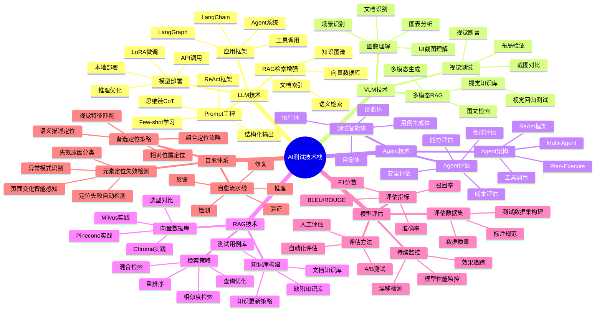
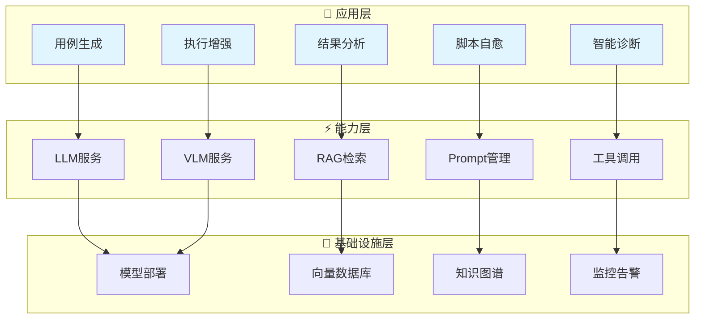
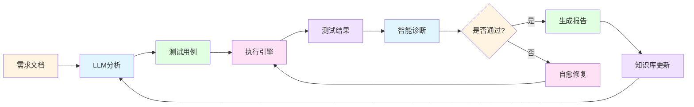

# AI测试技术

AI测试技术栈，涵盖LLM、VLM、Agent、RAG等核心技术及其在测试领域的应用。

## 📊 技术全景脑图

## 🎯 核心价值矩阵

| 价值维度 | 提升指标 | 实现方式 | 应用场景 |
|---------|---------|---------|---------|
| 🚀 **效率提升** | 70%+ | 测试用例自动生成 | 需求驱动测试 |
| 💰 **成本降低** | 50%+ | 脚本自愈能力 | 自动化维护 |
| 📈 **覆盖率提升** | 显著提升 | AI探索性测试 | 边界场景发现 |
| 🔍 **诊断准确率** | 85%+ | 智能根因分析 | 失败原因定位 |

## 🏗️ 技术架构

### 三层架构体系

### 数据流转架构

## 📖 学习路径

### 初级（0-6个月）
1. 掌握Prompt Engineering基础
2. 了解LLM/VLM基本原理
3. 学习LangChain基础应用
4. 实践简单的AI测试场景

### 中级（6-12个月）
1. 深入理解Agent架构
2. 掌握RAG技术实现
3. 实践模型部署与优化
4. 构建复杂测试智能体

### 高级（12个月+）
1. 设计AI测试技术架构
2. 优化模型效果与性能
3. 推动团队AI技术转型
4. 探索AI前沿技术应用

## 🎓 核心技术学习资源

### LLM 核心技术

#### Transformer 架构
- [The Illustrated Transformer](https://jalammar.github.io/illustrated-transformer/) - Transformer 可视化详解
- [Attention Is All You Need 论文](https://arxiv.org/abs/1706.03762) - 原始论文
- [The Annotated Transformer](https://nlp.seas.harvard.edu/annotated-transformer/) - 带注释的 Transformer 实现

#### 大模型架构
- [GPT 系列论文解读](https://jalammar.github.io/illustrated-gpt2/) - GPT 架构详解
- [LLaMA 论文](https://arxiv.org/abs/2302.13971) - Meta 开源模型
- [Mistral 论文](https://arxiv.org/abs/2310.06825) - 高效开源模型

### VLM 多模态模型

#### 核心模型
- [CLIP 论文](https://arxiv.org/abs/2103.00020) - 图文对比学习
- [GPT-4V 技术报告](https://arxiv.org/abs/2309.17421) - GPT-4 视觉能力
- [LLaVA 论文](https://arxiv.org/abs/2304.08485) - 开源多模态模型

### LangChain 开发

#### 官方资源
- [LangChain 官方文档](https://python.langchain.com/docs/get_started/introduction) - 完整开发文档
- [LangChain GitHub](https://github.com/langchain-ai/langchain) - 源码仓库
- [LangChain Cookbook](https://python.langchain.com/docs/cookbook/) - 实战案例

### RAG 检索增强生成

#### 技术文档
- [RAG 最佳实践](https://blog.langchain.dev/deconstructing-rag/) - LangChain 官方指南
- [Advanced RAG Techniques](https://blog.llamaindex.ai/a-cheat-sheet-and-a-roadmap-for-advanced-rag-techniques-4e0e8b2f9c69) - 高级 RAG 技术

#### 向量数据库
- [Milvus 官方文档](https://milvus.io/docs) - 开源向量数据库
- [Pinecone 学习中心](https://www.pinecone.io/learn/) - 向量数据库教程
- [Chroma 文档](https://docs.trychroma.com/) - 轻量级向量数据库

### Prompt Engineering

#### 系统学习
- [Prompt Engineering Guide](https://www.promptingguide.ai/) - 最全面的提示词指南
- [Learn Prompting](https://learnprompting.org/) - 免费课程
- [OpenAI Prompt Engineering](https://platform.openai.com/docs/guides/prompt-engineering) - 官方最佳实践

## 🔗 相关资源

- [LLM技术](/ai-testing-tech/llm-tech/) - Prompt工程、LangChain应用、模型部署
- [VLM技术](/ai-testing-tech/vlm-tech/) - 图像理解、视觉测试、多模态RAG
- [Agent技术](/ai-testing-tech/agent-tech/) - Agent架构、测试智能体、Agent评估
- [RAG技术](/ai-testing-tech/rag-tech/) - 向量数据库、检索策略、知识库构建
- [模型评估](/ai-testing-tech/model-evaluation/) - 评估指标、评估方法、持续监控
- [自愈体系](/ai-testing-tech/self-healing/) - 元素定位失效检测、备选定位策略
