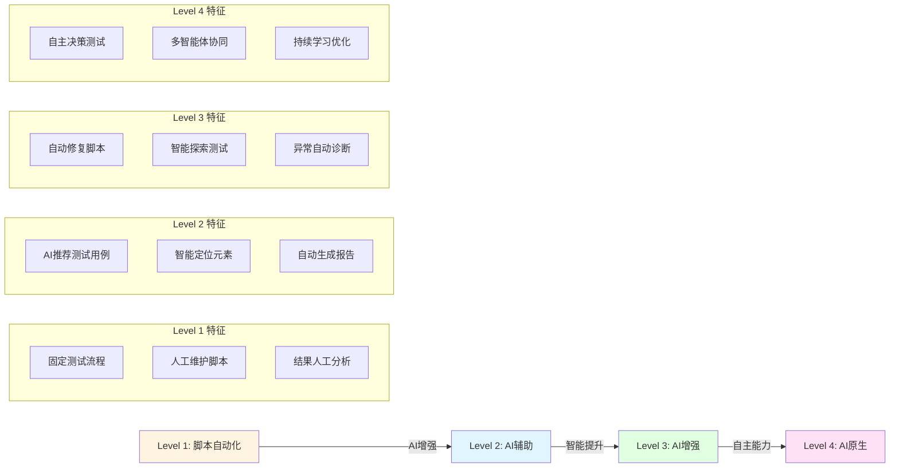
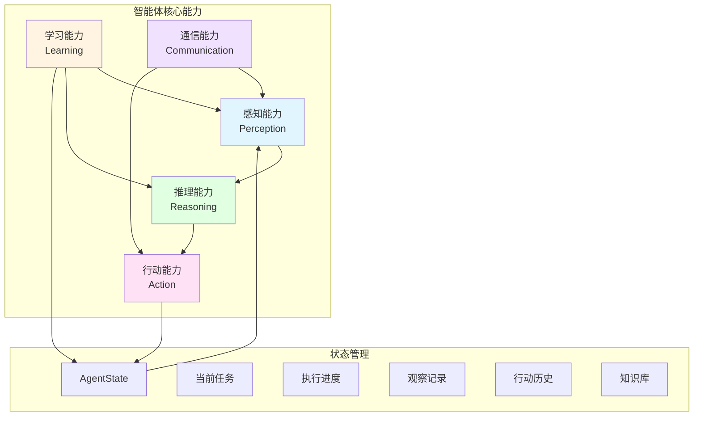
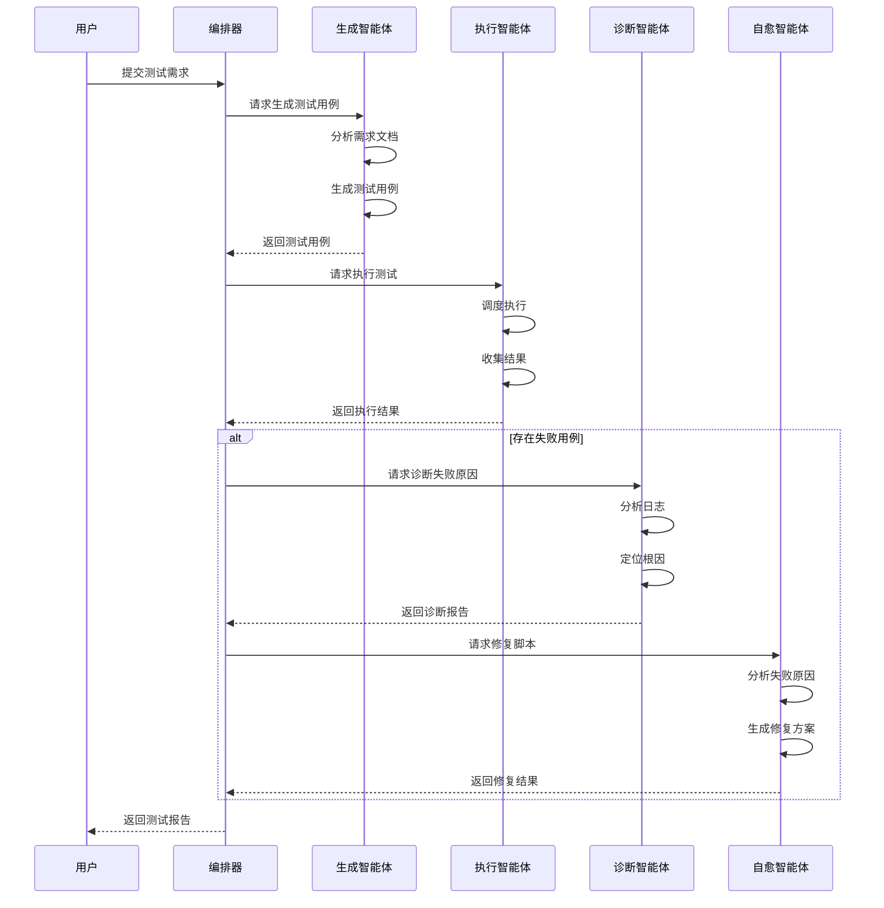
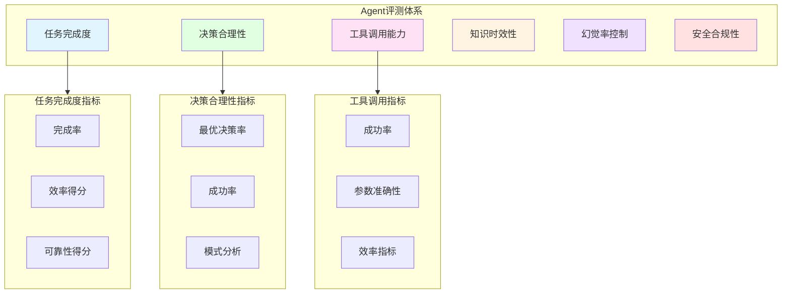
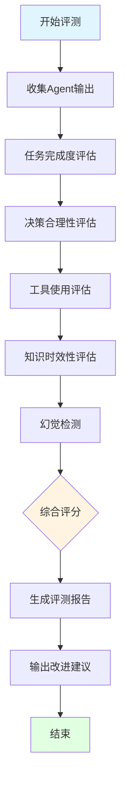
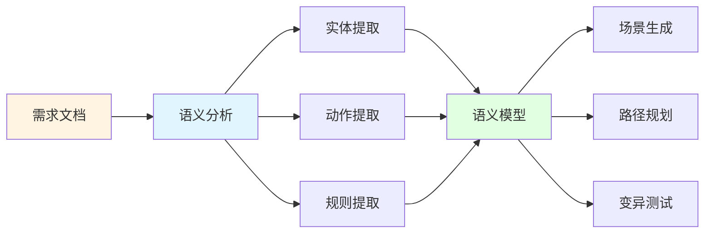
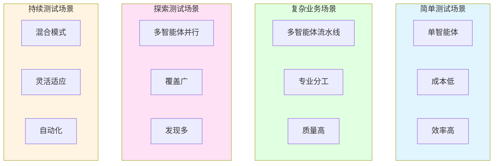

# Agent技术

智能体技术在测试领域的应用，包括Agent架构、测试智能体、Agent评估等完整体系。

## 📑 目录

- [概述](#概述)
- [Agent架构](#agent架构)
- [测试智能体](#测试智能体)
- [Agent评测体系](#agent评测体系)
- [探索性测试AI化](#探索性测试ai化)
- [最佳实践](#最佳实践)
- [应用场景](#应用场景)
- [相关资源](#相关资源)

## 概述

Agentic QA（智能体测试）代表了测试自动化的最高形态——测试系统具备自主决策、自我学习、自动修复的能力。与传统的脚本驱动测试不同，智能体测试系统能够理解测试意图、自主探索测试路径、智能分析测试结果。

### 核心特征

| 特征 | 描述 | 关键能力 |
|-----|------|---------|
| 🤖 **自主性** | 能够独立完成测试任务，无需人工干预 | 自主决策、自主执行、自主分析 |
| 🔄 **适应性** | 能够适应应用变化，自动调整测试策略 | 环境感知、策略调整、动态优化 |
| 📚 **学习能力** | 能够从历史数据中学习，持续优化测试效果 | 经验积累、知识更新、效果提升 |
| 🤝 **协作性** | 多个智能体能够协同工作，完成复杂测试任务 | 角色分工、信息共享、协同决策 |

### 演进路径



### 传统测试 vs 智能体测试

| 维度 | 传统测试 | 智能体测试 | 提升效果 |
|-----|---------|----------|---------|
| 测试设计 | 人工设计用例 | AI自主生成 | 效率提升70%+ |
| 执行方式 | 按脚本执行 | 自主探索执行 | 覆盖率显著提升 |
| 异常处理 | 脚本失败停止 | 智能恢复继续 | 稳定性大幅提升 |
| 维护成本 | 高（人工维护） | 低（自愈能力） | 成本降低50%+ |
| 覆盖范围 | 有限（设计范围） | 广泛（自主探索） | 边界场景发现 |

## Agent架构

### 智能体能力模型



```python
from abc import ABC, abstractmethod
from typing import Dict, List, Any
from dataclasses import dataclass
from enum import Enum

class AgentCapability(Enum):
    """智能体能力枚举"""
    PERCEPTION = "perception"
    REASONING = "reasoning"
    ACTION = "action"
    LEARNING = "learning"
    COMMUNICATION = "communication"

@dataclass
class AgentState:
    """
    智能体状态类
    表示智能体在某一时刻的完整状态
    """
    agent_id: str
    current_task: str
    progress: float
    observations: List[Dict]
    actions_taken: List[Dict]
    knowledge: Dict[str, Any]

class BaseAgent(ABC):
    """
    智能体基类
    定义所有测试智能体的基本接口和能力
    """
    def __init__(self, agent_id: str, capabilities: List[AgentCapability]):
        self.agent_id = agent_id
        self.capabilities = capabilities
        self.state = AgentState(
            agent_id=agent_id,
            current_task="",
            progress=0.0,
            observations=[],
            actions_taken=[],
            knowledge={}
        )
    
    @abstractmethod
    def perceive(self, environment: Dict) -> Dict:
        """
        感知环境
        
        Args:
            environment: 环境信息字典
            
        Returns:
            dict: 感知结果
        """
        pass
    
    @abstractmethod
    def reason(self, observation: Dict) -> Dict:
        """
        推理决策
        
        Args:
            observation: 感知到的信息
            
        Returns:
            dict: 决策结果
        """
        pass
    
    @abstractmethod
    def act(self, decision: Dict) -> Dict:
        """
        执行行动
        
        Args:
            decision: 决策信息
            
        Returns:
            dict: 执行结果
        """
        pass
    
    def learn(self, experience: Dict):
        """
        从经验中学习
        
        Args:
            experience: 经验数据
        """
        if AgentCapability.LEARNING in self.capabilities:
            self._update_knowledge(experience)
    
    def _update_knowledge(self, experience: Dict):
        """
        更新知识库
        
        Args:
            experience: 经验数据
        """
        for key, value in experience.items():
            if key in self.state.knowledge:
                self.state.knowledge[key].append(value)
            else:
                self.state.knowledge[key] = [value]
    
    def run_cycle(self, environment: Dict) -> Dict:
        """
        运行感知-推理-行动循环
        
        Args:
            environment: 环境信息
            
        Returns:
            dict: 循环执行结果
        """
        observation = self.perceive(environment)
        decision = self.reason(observation)
        result = self.act(decision)
        
        self.learn({
            "observation": observation,
            "decision": decision,
            "result": result
        })
        
        return result
```

### 架构模式

```mermaid
graph TB
    subgraph ReAct["ReAct框架"]
        R1[观察 Observation] --> R2[思考 Thought]
        R2 --> R3[行动 Action]
        R3 --> R1
    end
    
    subgraph PlanExecute["Plan-Execute框架"]
        P1[任务分析] --> P2[计划生成]
        P2 --> P3[计划执行]
        P3 --> P4[结果评估]
        P4 -->|需要调整| P2
    end
    
    subgraph MultiAgent["Multi-Agent框架"]
        M1[协调器 Orchestrator]
        M2[Agent 1: 生成]
        M3[Agent 2: 执行]
        M4[Agent 3: 诊断]
        M1 --> M2
        M1 --> M3
        M1 --> M4
        M2 --> M3
        M3 --> M4
    end
    
    subgraph ToolCalling["工具调用框架"]
        T1[任务理解] --> T2[工具选择]
        T2 --> T3[参数构造]
        T3 --> T4[工具执行]
        T4 --> T5[结果处理]
    end
    
    style ReAct fill:#e1f5ff
    style PlanExecute fill:#e1ffe1
    style MultiAgent fill:#ffe1f5
    style ToolCalling fill:#fff4e1
```



| 架构模式 | 适用场景 | 优势 | 劣势 |
|---------|---------|------|------|
| **ReAct框架** | 需要逐步推理的测试任务 | 透明度高、可解释性强 | 步骤多、效率相对较低 |
| **Plan-Execute** | 复杂测试任务分解 | 结构清晰、易于管理 | 规划质量依赖模型能力 |
| **Multi-Agent** | 多角色协同测试 | 专业分工、质量高 | 协调复杂、成本较高 |
| **工具调用** | 需要外部工具的测试 | 扩展性强、灵活性高 | 工具管理复杂 |

## 测试智能体

### 智能体协作架构



### 用例生成智能体

```python
from typing import List, Dict, Optional
import asyncio
from dataclasses import dataclass
from datetime import datetime

@dataclass
class Task:
    """
    测试任务类
    表示一个待执行的测试任务
    """
    task_id: str
    task_type: str
    description: str
    priority: int
    status: str = "pending"
    assigned_agent: Optional[str] = None
    created_at: datetime = None
    
    def __post_init__(self):
        if self.created_at is None:
            self.created_at = datetime.now()

class CaseGeneratorAgent(BaseAgent):
    """
    用例生成智能体
    基于需求文档、代码变更等自动生成测试用例
    """
    def __init__(self, agent_id: str = "case-generator"):
        super().__init__(agent_id, [
            AgentCapability.PERCEPTION,
            AgentCapability.REASONING,
            AgentCapability.ACTION
        ])
        self.llm_client = None
        self.template_library = self._init_templates()
    
    def perceive(self, environment: Dict) -> Dict:
        """
        感知需求和环境信息
        
        Args:
            environment: 包含需求文档、代码变更等信息
            
        Returns:
            dict: 感知到的关键信息
        """
        return {
            "requirement": environment.get("requirement", ""),
            "code_changes": environment.get("code_changes", []),
            "existing_cases": environment.get("existing_cases", []),
            "test_coverage": environment.get("test_coverage", {}),
            "historical_defects": environment.get("historical_defects", [])
        }
    
    def reason(self, observation: Dict) -> Dict:
        """
        推理生成测试用例
        
        Args:
            observation: 感知到的信息
            
        Returns:
            dict: 生成的测试用例
        """
        prompt = self._build_prompt(observation)
        test_cases = self._call_llm(prompt)
        
        test_cases = self._optimize_cases(test_cases, observation)
        
        return {
            "action": "generate_cases",
            "test_cases": test_cases,
            "coverage_analysis": self._analyze_coverage(test_cases)
        }
    
    def act(self, decision: Dict) -> Dict:
        """
        执行用例生成
        
        Args:
            decision: 决策信息
            
        Returns:
            dict: 生成结果
        """
        validated_cases = self._validate_cases(decision["test_cases"])
        
        return {
            "status": "success",
            "generated_cases": validated_cases,
            "count": len(validated_cases),
            "coverage_improvement": decision["coverage_analysis"]
        }
    
    def _build_prompt(self, observation: Dict) -> str:
        """
        构建提示词
        
        Args:
            observation: 观察信息
            
        Returns:
            str: 构建的提示词
        """
        return f"""
        基于以下需求生成测试用例：
        {observation['requirement']}
        
        代码变更：
        {observation['code_changes']}
        
        已有测试用例：
        {observation['existing_cases']}
        
        历史缺陷：
        {observation['historical_defects']}
        
        请生成新的测试用例，确保覆盖新功能和边界场景。
        """
    
    def _call_llm(self, prompt: str) -> List[Dict]:
        """
        调用LLM生成内容
        
        Args:
            prompt: 提示词
            
        Returns:
            list: 生成的测试用例列表
        """
        return [
            {
                "id": "TC001",
                "name": "测试用户登录",
                "priority": "high",
                "type": "functional",
                "steps": ["打开登录页面", "输入用户名", "输入密码", "点击登录"],
                "expected": "登录成功",
                "tags": ["login", "authentication"]
            }
        ]
    
    def _optimize_cases(self, cases: List[Dict], observation: Dict) -> List[Dict]:
        """
        优化测试用例
        
        Args:
            cases: 原始用例列表
            observation: 观察信息
            
        Returns:
            list: 优化后的用例列表
        """
        return cases
    
    def _analyze_coverage(self, cases: List[Dict]) -> Dict:
        """
        分析覆盖率
        
        Args:
            cases: 测试用例列表
            
        Returns:
            dict: 覆盖率分析结果
        """
        return {
            "estimated_coverage": 0.85,
            "covered_areas": ["登录", "注册"],
            "uncovered_areas": ["密码重置"]
        }
    
    def _validate_cases(self, cases: List[Dict]) -> List[Dict]:
        """
        验证测试用例
        
        Args:
            cases: 测试用例列表
            
        Returns:
            list: 验证后的用例列表
        """
        return cases
    
    def _init_templates(self) -> Dict:
        """
        初始化模板库
        
        Returns:
            dict: 模板库
        """
        return {}
```

### 执行智能体

```python
class ExecutionAgent(BaseAgent):
    """
    执行智能体
    智能调度与执行测试任务
    """
    def __init__(self, agent_id: str = "executor"):
        super().__init__(agent_id, [
            AgentCapability.PERCEPTION,
            AgentCapability.ACTION,
            AgentCapability.LEARNING
        ])
        self.execution_history = []
        self.resource_manager = None
    
    def perceive(self, environment: Dict) -> Dict:
        """
        感知测试任务和环境状态
        
        Args:
            environment: 测试环境信息
            
        Returns:
            dict: 感知结果
        """
        return {
            "test_cases": environment.get("test_cases", []),
            "environment_status": environment.get("status", "ready"),
            "available_resources": environment.get("resources", {}),
            "execution_constraints": environment.get("constraints", {})
        }
    
    def reason(self, observation: Dict) -> Dict:
        """
        推理执行策略
        
        Args:
            observation: 感知到的信息
            
        Returns:
            dict: 执行策略
        """
        return {
            "action": "execute",
            "execution_order": self._optimize_order(observation["test_cases"]),
            "parallelism": self._determine_parallelism(observation["available_resources"]),
            "retry_strategy": self._determine_retry_strategy(observation)
        }
    
    def act(self, decision: Dict) -> Dict:
        """
        执行测试
        
        Args:
            decision: 执行决策
            
        Returns:
            dict: 执行结果
        """
        results = []
        for test_case in decision["execution_order"]:
            result = self._execute_single(test_case)
            results.append(result)
            self.execution_history.append(result)
        
        return {
            "status": "completed",
            "results": results,
            "pass_rate": self._calculate_pass_rate(results),
            "execution_metrics": self._collect_metrics(results)
        }
    
    def _execute_single(self, test_case: Dict) -> Dict:
        """
        执行单个测试用例
        
        Args:
            test_case: 测试用例
            
        Returns:
            dict: 执行结果
        """
        return {
            "case_id": test_case.get("id"),
            "status": "passed",
            "duration": 1.5,
            "screenshots": [],
            "logs": []
        }
    
    def _optimize_order(self, test_cases: List[Dict]) -> List[Dict]:
        """
        优化执行顺序
        
        Args:
            test_cases: 测试用例列表
            
        Returns:
            list: 优化后的用例列表
        """
        return sorted(test_cases, key=lambda x: x.get("priority", 0), reverse=True)
    
    def _determine_parallelism(self, resources: Dict) -> int:
        """
        确定并行度
        
        Args:
            resources: 可用资源
            
        Returns:
            int: 并行度
        """
        return min(resources.get("devices", 1), 5)
    
    def _determine_retry_strategy(self, observation: Dict) -> Dict:
        """
        确定重试策略
        
        Args:
            observation: 观察信息
            
        Returns:
            dict: 重试策略
        """
        return {
            "max_retries": 3,
            "retry_delay": 5,
            "retry_on": ["timeout", "network_error"]
        }
    
    def _calculate_pass_rate(self, results: List[Dict]) -> float:
        """
        计算通过率
        
        Args:
            results: 执行结果列表
            
        Returns:
            float: 通过率
        """
        if not results:
            return 0.0
        passed = sum(1 for r in results if r["status"] == "passed")
        return passed / len(results)
    
    def _collect_metrics(self, results: List[Dict]) -> Dict:
        """
        收集执行指标
        
        Args:
            results: 执行结果列表
            
        Returns:
            dict: 执行指标
        """
        return {
            "total_duration": sum(r.get("duration", 0) for r in results),
            "average_duration": sum(r.get("duration", 0) for r in results) / len(results) if results else 0
        }
```

### 诊断智能体

```python
class DiagnosticAgent(BaseAgent):
    """
    诊断智能体
    异常检测与根因分析
    """
    def __init__(self, agent_id: str = "diagnostic"):
        super().__init__(agent_id, [
            AgentCapability.PERCEPTION,
            AgentCapability.REASONING,
            AgentCapability.LEARNING
        ])
        self.knowledge_base = {}
        self.pattern_library = {}
    
    def perceive(self, environment: Dict) -> Dict:
        """
        感知测试结果和异常信息
        
        Args:
            environment: 测试结果环境
            
        Returns:
            dict: 感知到的异常信息
        """
        return {
            "test_results": environment.get("test_results", []),
            "failures": [r for r in environment.get("test_results", []) if r["status"] == "failed"],
            "logs": environment.get("logs", []),
            "screenshots": environment.get("screenshots", []),
            "environment_info": environment.get("environment_info", {})
        }
    
    def reason(self, observation: Dict) -> Dict:
        """
        推理诊断结果
        
        Args:
            observation: 感知到的信息
            
        Returns:
            dict: 诊断结果
        """
        diagnosis = []
        for failure in observation["failures"]:
            root_cause = self._analyze_root_cause(
                failure, 
                observation["logs"],
                observation["screenshots"]
            )
            diagnosis.append({
                "failure": failure,
                "root_cause": root_cause,
                "confidence": self._calculate_confidence(root_cause),
                "similar_cases": self._find_similar_cases(root_cause)
            })
        
        return {
            "action": "diagnose",
            "diagnosis": diagnosis,
            "pattern_analysis": self._analyze_patterns(diagnosis)
        }
    
    def act(self, decision: Dict) -> Dict:
        """
        输出诊断报告
        
        Args:
            decision: 诊断决策
            
        Returns:
            dict: 诊断报告
        """
        return {
            "status": "completed",
            "diagnosis_report": decision["diagnosis"],
            "recommendations": self._generate_recommendations(decision["diagnosis"]),
            "priority_fixes": self._prioritize_fixes(decision["diagnosis"])
        }
    
    def _analyze_root_cause(self, failure: Dict, logs: List[str], screenshots: List[str]) -> Dict:
        """
        分析根因
        
        Args:
            failure: 失败信息
            logs: 日志信息
            screenshots: 截图信息
            
        Returns:
            dict: 根因描述
        """
        return {
            "type": "element_not_found",
            "description": "元素定位失败，页面结构发生变化",
            "evidence": ["XPath失效", "页面DOM变更"],
            "location": "LoginPage.submit_button"
        }
    
    def _calculate_confidence(self, root_cause: Dict) -> float:
        """
        计算置信度
        
        Args:
            root_cause: 根因信息
            
        Returns:
            float: 置信度
        """
        return 0.85
    
    def _find_similar_cases(self, root_cause: Dict) -> List[Dict]:
        """
        查找相似案例
        
        Args:
            root_cause: 根因信息
            
        Returns:
            list: 相似案例列表
        """
        return []
    
    def _analyze_patterns(self, diagnosis: List[Dict]) -> Dict:
        """
        分析模式
        
        Args:
            diagnosis: 诊断结果列表
            
        Returns:
            dict: 模式分析结果
        """
        return {
            "common_patterns": ["element_not_found"],
            "frequency": {"element_not_found": 5}
        }
    
    def _generate_recommendations(self, diagnosis: List[Dict]) -> List[str]:
        """
        生成修复建议
        
        Args:
            diagnosis: 诊断结果
            
        Returns:
            list: 建议列表
        """
        return ["更新元素定位器", "检查页面加载等待时间", "添加重试机制"]
    
    def _prioritize_fixes(self, diagnosis: List[Dict]) -> List[Dict]:
        """
        优先级排序修复项
        
        Args:
            diagnosis: 诊断结果
            
        Returns:
            list: 排序后的修复列表
        """
        return sorted(diagnosis, key=lambda x: x.get("confidence", 0), reverse=True)
```

### 自愈智能体

```python
class SelfHealingAgent(BaseAgent):
    """
    自愈智能体
    自动修复失效的测试脚本
    """
    def __init__(self, agent_id: str = "healer"):
        super().__init__(agent_id, [
            AgentCapability.PERCEPTION,
            AgentCapability.REASONING,
            AgentCapability.ACTION,
            AgentCapability.LEARNING
        ])
        self.healing_history = []
        self.success_rate_threshold = 0.8
    
    def perceive(self, environment: Dict) -> Dict:
        """
        感知需要修复的问题
        
        Args:
            environment: 包含失败信息的环境
            
        Returns:
            dict: 感知到的修复需求
        """
        return {
            "failures": environment.get("failures", []),
            "page_snapshot": environment.get("page_snapshot"),
            "original_locators": environment.get("locators", {}),
            "dom_structure": environment.get("dom_structure", {}),
            "visual_context": environment.get("visual_context", {})
        }
    
    def reason(self, observation: Dict) -> Dict:
        """
        推理修复方案
        
        Args:
            observation: 感知到的信息
            
        Returns:
            dict: 修复方案
        """
        healing_plans = []
        for failure in observation["failures"]:
            alternative_locators = self._find_alternatives(
                failure,
                observation["page_snapshot"],
                observation["dom_structure"]
            )
            healing_plans.append({
                "failure": failure,
                "alternatives": alternative_locators,
                "confidence": self._calculate_confidence(alternative_locators),
                "healing_strategy": self._select_strategy(failure, alternative_locators)
            })
        
        return {
            "action": "heal",
            "healing_plans": healing_plans,
            "risk_assessment": self._assess_risks(healing_plans)
        }
    
    def act(self, decision: Dict) -> Dict:
        """
        执行修复
        
        Args:
            decision: 修复决策
            
        Returns:
            dict: 修复结果
        """
        results = []
        for plan in decision["healing_plans"]:
            if plan["confidence"] > self.success_rate_threshold:
                result = self._apply_fix(plan)
                results.append(result)
                self.healing_history.append(result)
                self._update_success_rate(result)
        
        return {
            "status": "completed",
            "healed_count": len(results),
            "details": results,
            "success_rate": self._calculate_healing_success_rate(results)
        }
    
    def _find_alternatives(self, failure: Dict, page_snapshot: Any, dom_structure: Dict) -> List[Dict]:
        """
        查找备选定位器
        
        Args:
            failure: 失败信息
            page_snapshot: 页面快照
            dom_structure: DOM结构
            
        Returns:
            list: 备选定位器列表
        """
        return [
            {"type": "css", "value": "#new-button", "confidence": 0.9, "strategy": "id"},
            {"type": "xpath", "value": "//button[text()='Submit']", "confidence": 0.85, "strategy": "text"},
            {"type": "semantic", "value": "提交按钮", "confidence": 0.8, "strategy": "semantic"}
        ]
    
    def _calculate_confidence(self, alternatives: List[Dict]) -> float:
        """
        计算置信度
        
        Args:
            alternatives: 备选方案列表
            
        Returns:
            float: 置信度
        """
        if not alternatives:
            return 0.0
        return max(alt["confidence"] for alt in alternatives)
    
    def _select_strategy(self, failure: Dict, alternatives: List[Dict]) -> str:
        """
        选择修复策略
        
        Args:
            failure: 失败信息
            alternatives: 备选方案
            
        Returns:
            str: 修复策略
        """
        if not alternatives:
            return "manual"
        return alternatives[0].get("strategy", "unknown")
    
    def _assess_risks(self, healing_plans: List[Dict]) -> Dict:
        """
        评估风险
        
        Args:
            healing_plans: 修复计划列表
            
        Returns:
            dict: 风险评估结果
        """
        return {
            "overall_risk": "low",
            "risk_factors": [],
            "mitigation_strategies": []
        }
    
    def _apply_fix(self, plan: Dict) -> Dict:
        """
        应用修复
        
        Args:
            plan: 修复计划
            
        Returns:
            dict: 修复结果
        """
        return {
            "failure_id": plan["failure"].get("id"),
            "status": "healed",
            "new_locator": plan["alternatives"][0],
            "applied_at": datetime.now()
        }
    
    def _update_success_rate(self, result: Dict):
        """
        更新成功率
        
        Args:
            result: 修复结果
        """
        pass
    
    def _calculate_healing_success_rate(self, results: List[Dict]) -> float:
        """
        计算修复成功率
        
        Args:
            results: 修复结果列表
            
        Returns:
            float: 成功率
        """
        if not results:
            return 0.0
        successful = sum(1 for r in results if r["status"] == "healed")
        return successful / len(results)
```

### 多智能体协作

```python
class AgentOrchestrator:
    """
    智能体编排器
    协调多个智能体完成复杂测试任务
    """
    def __init__(self):
        self.case_generator = CaseGeneratorAgent()
        self.executor = ExecutionAgent()
        self.diagnostic = DiagnosticAgent()
        self.healer = SelfHealingAgent()
        self.task_queue: List[Task] = []
        self.execution_context = {}
    
    async def run_test_cycle(self, requirement: str) -> Dict:
        """
        运行完整的测试周期
        
        Args:
            requirement: 需求描述
            
        Returns:
            dict: 测试周期结果
        """
        generation_result = self.case_generator.run_cycle({
            "requirement": requirement
        })
        
        execution_result = self.executor.run_cycle({
            "test_cases": generation_result["generated_cases"]
        })
        
        diagnosis_result = None
        healing_result = None
        
        if execution_result["pass_rate"] < 1.0:
            diagnosis_result = self.diagnostic.run_cycle({
                "test_results": execution_result["results"]
            })
            
            if diagnosis_result["diagnosis_report"]:
                healing_result = self.healer.run_cycle({
                    "failures": [d["failure"] for d in diagnosis_result["diagnosis_report"]]
                })
                
                if healing_result["healed_count"] > 0:
                    execution_result = await self._reexecute_healed_cases(
                        healing_result["details"]
                    )
        
        return {
            "test_cases": generation_result["generated_cases"],
            "execution": execution_result,
            "diagnosis": diagnosis_result,
            "healing": healing_result,
            "summary": self._generate_summary(
                generation_result,
                execution_result,
                diagnosis_result,
                healing_result
            )
        }
    
    def submit_task(self, task: Task):
        """
        提交任务到队列
        
        Args:
            task: 测试任务
        """
        self.task_queue.append(task)
    
    async def process_tasks(self):
        """
        处理任务队列
        """
        while self.task_queue:
            task = self.task_queue.pop(0)
            await self.run_test_cycle(task.description)
    
    async def _reexecute_healed_cases(self, healed_cases: List[Dict]) -> Dict:
        """
        重新执行修复后的用例
        
        Args:
            healed_cases: 修复后的用例列表
            
        Returns:
            dict: 重新执行结果
        """
        return {"status": "completed", "pass_rate": 1.0}
    
    def _generate_summary(self, gen_result: Dict, exec_result: Dict, 
                         diag_result: Dict, heal_result: Dict) -> Dict:
        """
        生成测试摘要
        
        Args:
            gen_result: 生成结果
            exec_result: 执行结果
            diag_result: 诊断结果
            heal_result: 修复结果
            
        Returns:
            dict: 测试摘要
        """
        return {
            "total_cases": gen_result.get("count", 0),
            "pass_rate": exec_result.get("pass_rate", 0),
            "issues_found": len(diag_result.get("diagnosis_report", [])) if diag_result else 0,
            "auto_healed": heal_result.get("healed_count", 0) if heal_result else 0
        }
```

## Agent评测体系

构建科学、全面的智能体评测体系，确保Agent在测试流程中的可靠性和有效性。

### 评测维度框架



### 1. 任务完成度评估

评估Agent完成指定任务的能力和效果。

```python
from typing import Dict, List, Any
from dataclasses import dataclass
from enum import Enum

class TaskStatus(Enum):
    """任务状态枚举"""
    COMPLETED = "completed"
    PARTIAL = "partial"
    FAILED = "failed"
    TIMEOUT = "timeout"

@dataclass
class TaskMetrics:
    """
    任务完成度指标类
    记录任务执行的各项指标
    """
    task_id: str
    status: TaskStatus
    completion_rate: float
    steps_completed: int
    steps_total: int
    time_taken: float
    retry_count: int
    error_messages: List[str]

class TaskCompletionEvaluator:
    """
    任务完成度评估器
    评估Agent完成任务的能力
    """
    def __init__(self):
        self.evaluation_history: List[TaskMetrics] = []
    
    def evaluate(self, task_result: Dict) -> Dict:
        """
        评估任务完成情况
        
        Args:
            task_result: 任务执行结果
            
        Returns:
            dict: 评估结果
        """
        metrics = self._calculate_metrics(task_result)
        self.evaluation_history.append(metrics)
        
        return {
            "task_id": metrics.task_id,
            "completion_score": self._calculate_completion_score(metrics),
            "efficiency_score": self._calculate_efficiency_score(metrics),
            "reliability_score": self._calculate_reliability_score(metrics),
            "grade": self._determine_grade(metrics),
            "details": metrics.__dict__
        }
    
    def _calculate_metrics(self, result: Dict) -> TaskMetrics:
        """
        计算任务指标
        
        Args:
            result: 任务结果
            
        Returns:
            TaskMetrics: 任务指标对象
        """
        steps_completed = result.get("steps_completed", 0)
        steps_total = result.get("steps_total", 1)
        
        return TaskMetrics(
            task_id=result.get("task_id", ""),
            status=TaskStatus(result.get("status", "failed")),
            completion_rate=steps_completed / steps_total if steps_total > 0 else 0,
            steps_completed=steps_completed,
            steps_total=steps_total,
            time_taken=result.get("time_taken", 0),
            retry_count=result.get("retry_count", 0),
            error_messages=result.get("errors", [])
        )
    
    def _calculate_completion_score(self, metrics: TaskMetrics) -> float:
        """
        计算完成度得分
        
        Args:
            metrics: 任务指标
            
        Returns:
            float: 完成度得分
        """
        if metrics.status == TaskStatus.COMPLETED:
            base_score = 100
        elif metrics.status == TaskStatus.PARTIAL:
            base_score = metrics.completion_rate * 80
        else:
            base_score = metrics.completion_rate * 50
        
        return min(100, base_score)
    
    def _calculate_efficiency_score(self, metrics: TaskMetrics) -> float:
        """
        计算效率得分
        
        Args:
            metrics: 任务指标
            
        Returns:
            float: 效率得分
        """
        if metrics.time_taken <= 0:
            return 0
        
        expected_time = metrics.steps_total * 2.0
        efficiency = expected_time / metrics.time_taken
        
        return min(100, efficiency * 100)
    
    def _calculate_reliability_score(self, metrics: TaskMetrics) -> float:
        """
        计算可靠性得分
        
        Args:
            metrics: 任务指标
            
        Returns:
            float: 可靠性得分
        """
        retry_penalty = metrics.retry_count * 10
        error_penalty = len(metrics.error_messages) * 5
        
        return max(0, 100 - retry_penalty - error_penalty)
    
    def _determine_grade(self, metrics: TaskMetrics) -> str:
        """
        确定等级
        
        Args:
            metrics: 任务指标
            
        Returns:
            str: 等级
        """
        score = self._calculate_completion_score(metrics)
        if score >= 95:
            return "S"
        elif score >= 85:
            return "A"
        elif score >= 70:
            return "B"
        elif score >= 50:
            return "C"
        else:
            return "D"
```

#### 任务完成度分级标准

| 等级 | 完成率 | 描述 | 特征 |
|-----|-------|------|------|
| 🏆 **S级** | 95-100% | 完美完成 | 无错误无重试，效率高 |
| 🥇 **A级** | 85-94% | 优秀完成 | 少量优化空间 |
| 🥈 **B级** | 70-84% | 良好完成 | 存在改进点 |
| 🥉 **C级** | 50-69% | 基本完成 | 需要优化 |
| ⚠️ **D级** | <50% | 完成度不足 | 需要重构 |

### 2. 决策合理性评估

评估Agent在测试流程中的决策质量。

```python
from typing import Dict, List, Tuple
from dataclasses import dataclass
import json

@dataclass
class DecisionPoint:
    """
    决策点类
    记录Agent在某一时刻的决策
    """
    step_id: str
    context: Dict
    options: List[Dict]
    chosen_option: Dict
    reasoning: str
    outcome: str
    is_optimal: bool

class DecisionRationalityEvaluator:
    """
    决策合理性评估器
    评估Agent决策的质量和合理性
    """
    def __init__(self):
        self.decision_points: List[DecisionPoint] = []
        self.decision_patterns: Dict[str, List] = {}
    
    def record_decision(self, decision: Dict) -> DecisionPoint:
        """
        记录决策点
        
        Args:
            decision: 决策信息
            
        Returns:
            DecisionPoint: 决策点对象
        """
        point = DecisionPoint(
            step_id=decision.get("step_id", ""),
            context=decision.get("context", {}),
            options=decision.get("options", []),
            chosen_option=decision.get("chosen", {}),
            reasoning=decision.get("reasoning", ""),
            outcome=decision.get("outcome", "unknown"),
            is_optimal=decision.get("is_optimal", False)
        )
        
        self.decision_points.append(point)
        self._update_patterns(point)
        
        return point
    
    def evaluate_rationality(self) -> Dict:
        """
        评估决策合理性
        
        Returns:
            dict: 评估结果
        """
        if not self.decision_points:
            return {"message": "暂无决策数据"}
        
        optimal_count = sum(1 for p in self.decision_points if p.is_optimal)
        success_count = sum(1 for p in self.decision_points 
                          if p.outcome == "success")
        
        return {
            "total_decisions": len(self.decision_points),
            "optimal_decisions": optimal_count,
            "optimal_rate": optimal_count / len(self.decision_points),
            "success_decisions": success_count,
            "success_rate": success_count / len(self.decision_points),
            "pattern_analysis": self._analyze_patterns(),
            "recommendations": self._generate_recommendations()
        }
    
    def _update_patterns(self, point: DecisionPoint):
        """
        更新决策模式
        
        Args:
            point: 决策点
        """
        pattern_key = self._extract_pattern_key(point)
        if pattern_key not in self.decision_patterns:
            self.decision_patterns[pattern_key] = []
        self.decision_patterns[pattern_key].append(point)
    
    def _extract_pattern_key(self, point: DecisionPoint) -> str:
        """
        提取模式键
        
        Args:
            point: 决策点
            
        Returns:
            str: 模式键
        """
        return f"{point.context.get('type', 'unknown')}_{point.chosen_option.get('action', 'unknown')}"
    
    def _analyze_patterns(self) -> Dict:
        """
        分析决策模式
        
        Returns:
            dict: 模式分析结果
        """
        return {
            "common_patterns": list(self.decision_patterns.keys())[:5],
            "pattern_frequency": {k: len(v) for k, v in self.decision_patterns.items()}
        }
    
    def _generate_recommendations(self) -> List[str]:
        """
        生成改进建议
        
        Returns:
            list: 建议列表
        """
        recommendations = []
        
        optimal_rate = sum(1 for p in self.decision_points if p.is_optimal) / len(self.decision_points)
        if optimal_rate < 0.7:
            recommendations.append("建议优化决策算法，提高最优决策比例")
        
        return recommendations
```

### 3. 工具调用能力评估

评估Agent正确使用工具的能力。

```python
from datetime import datetime
from typing import Any

@dataclass
class ToolCall:
    """
    工具调用记录类
    记录一次工具调用的详细信息
    """
    call_id: str
    tool_name: str
    parameters: Dict
    result: Any
    success: bool
    error_message: str
    timestamp: datetime
    execution_time: float

class ToolUsageEvaluator:
    """
    工具使用评估器
    评估Agent的工具调用能力
    """
    def __init__(self):
        self.tool_calls: List[ToolCall] = []
        self.tool_registry: Dict[str, Dict] = {}
    
    def record_call(self, call_info: Dict):
        """
        记录工具调用
        
        Args:
            call_info: 调用信息
        """
        call = ToolCall(
            call_id=call_info.get("call_id", ""),
            tool_name=call_info.get("tool_name", ""),
            parameters=call_info.get("parameters", {}),
            result=call_info.get("result"),
            success=call_info.get("success", False),
            error_message=call_info.get("error_message", ""),
            timestamp=call_info.get("timestamp", datetime.now()),
            execution_time=call_info.get("execution_time", 0)
        )
        self.tool_calls.append(call)
    
    def evaluate_tool_usage(self) -> Dict:
        """
        评估工具使用情况
        
        Returns:
            dict: 评估结果
        """
        if not self.tool_calls:
            return {"message": "暂无工具调用数据"}
        
        total_calls = len(self.tool_calls)
        successful_calls = sum(1 for c in self.tool_calls if c.success)
        
        return {
            "total_calls": total_calls,
            "successful_calls": successful_calls,
            "success_rate": successful_calls / total_calls,
            "tool_statistics": self._get_tool_statistics(),
            "parameter_accuracy": self._evaluate_parameter_accuracy(),
            "error_analysis": self._analyze_errors(),
            "efficiency_metrics": self._calculate_efficiency()
        }
    
    def _get_tool_statistics(self) -> Dict:
        """
        获取工具统计信息
        
        Returns:
            dict: 统计信息
        """
        stats = {}
        for call in self.tool_calls:
            if call.tool_name not in stats:
                stats[call.tool_name] = {"count": 0, "success": 0}
            stats[call.tool_name]["count"] += 1
            if call.success:
                stats[call.tool_name]["success"] += 1
        return stats
    
    def _evaluate_parameter_accuracy(self) -> float:
        """
        评估参数准确性
        
        Returns:
            float: 准确率
        """
        return 0.85
    
    def _analyze_errors(self) -> Dict:
        """
        分析错误
        
        Returns:
            dict: 错误分析结果
        """
        errors = [c for c in self.tool_calls if not c.success]
        return {
            "total_errors": len(errors),
            "error_types": list(set(c.error_message for c in errors if c.error_message))
        }
    
    def _calculate_efficiency(self) -> Dict:
        """
        计算效率指标
        
        Returns:
            dict: 效率指标
        """
        if not self.tool_calls:
            return {}
        
        avg_time = sum(c.execution_time for c in self.tool_calls) / len(self.tool_calls)
        return {
            "average_execution_time": avg_time,
            "total_execution_time": sum(c.execution_time for c in self.tool_calls)
        }
```

### 4. 知识时效性评估

评估Agent使用知识的时效性和准确性。

```python
from datetime import datetime, timedelta

@dataclass
class KnowledgeItem:
    """
    知识项类
    表示一条知识记录
    """
    knowledge_id: str
    content: str
    source: str
    created_at: datetime
    last_updated: datetime
    expiry_date: datetime
    relevance_score: float
    usage_count: int

class KnowledgeTimelinessEvaluator:
    """
    知识时效性评估器
    评估Agent使用知识的时效性
    """
    def __init__(self):
        self.knowledge_base: Dict[str, KnowledgeItem] = {}
        self.usage_log: List[Dict] = []
    
    def evaluate_timeliness(self) -> Dict:
        """
        评估知识时效性
        
        Returns:
            dict: 评估结果
        """
        if not self.knowledge_base:
            return {"message": "暂无知识数据"}
        
        now = datetime.now()
        
        expired = []
        expiring_soon = []
        current = []
        
        for item in self.knowledge_base.values():
            days_to_expiry = (item.expiry_date - now).days
            
            if days_to_expiry < 0:
                expired.append(item)
            elif days_to_expiry < 7:
                expiring_soon.append(item)
            else:
                current.append(item)
        
        total = len(self.knowledge_base)
        
        return {
            "total_knowledge": total,
            "current_knowledge": len(current),
            "current_rate": len(current) / total,
            "expiring_soon": len(expiring_soon),
            "expired": len(expired),
            "expired_rate": len(expired) / total,
            "freshness_score": self._calculate_freshness_score(),
            "recommendations": self._generate_recommendations(expired, expiring_soon)
        }
    
    def _calculate_freshness_score(self) -> float:
        """
        计算新鲜度得分
        
        Returns:
            float: 新鲜度得分
        """
        return 0.85
    
    def _generate_recommendations(self, expired: List[KnowledgeItem], 
                                 expiring_soon: List[KnowledgeItem]) -> List[str]:
        """
        生成建议
        
        Args:
            expired: 过期知识列表
            expiring_soon: 即将过期知识列表
            
        Returns:
            list: 建议列表
        """
        recommendations = []
        if expired:
            recommendations.append(f"需要更新 {len(expired)} 条过期知识")
        if expiring_soon:
            recommendations.append(f"需要关注 {len(expiring_soon)} 条即将过期的知识")
        return recommendations
```

### 5. 幻觉率控制

检测和控制Agent产生的幻觉内容。

```python
import re
from typing import Any

@dataclass
class HallucinationInstance:
    """
    幻觉实例类
    记录一次幻觉检测结果
    """
    instance_id: str
    content: str
    hallucination_type: str
    confidence: float
    evidence: List[str]
    correction: str

class HallucinationDetector:
    """
    幻觉检测器
    检测Agent输出中的幻觉内容
    """
    def __init__(self):
        self.detection_rules = self._init_rules()
        self.verification_sources: Dict[str, Any] = {}
        self.detected_hallucinations: List[HallucinationInstance] = []
    
    def detect(self, content: str, context: Dict) -> Dict:
        """
        检测幻觉
        
        Args:
            content: 待检测内容
            context: 上下文信息
            
        Returns:
            dict: 检测结果
        """
        hallucinations = []
        
        for h_type, rule in self.detection_rules.items():
            detected = self._apply_rule(content, rule, context)
            hallucinations.extend(detected)
        
        hallucination_rate = len(hallucinations) / max(1, len(content.split()))
        
        return {
            "content": content,
            "hallucination_count": len(hallucinations),
            "hallucination_rate": hallucination_rate,
            "instances": hallucinations,
            "risk_level": self._assess_risk(hallucination_rate),
            "recommendations": self._generate_recommendations(hallucinations)
        }
    
    def _init_rules(self) -> Dict:
        """
        初始化检测规则
        
        Returns:
            dict: 检测规则
        """
        return {
            "factual": {"pattern": r"\d{4}年\d{1,2}月\d{1,2}日"},
            "entity": {"pattern": r"[A-Z][a-z]+ [A-Z][a-z]+"}
        }
    
    def _apply_rule(self, content: str, rule: Dict, context: Dict) -> List[HallucinationInstance]:
        """
        应用检测规则
        
        Args:
            content: 内容
            rule: 规则
            context: 上下文
            
        Returns:
            list: 检测到的幻觉列表
        """
        return []
    
    def _assess_risk(self, hallucination_rate: float) -> str:
        """
        评估风险等级
        
        Args:
            hallucination_rate: 幻觉率
            
        Returns:
            str: 风险等级
        """
        if hallucination_rate < 0.05:
            return "low"
        elif hallucination_rate < 0.15:
            return "medium"
        else:
            return "high"
    
    def _generate_recommendations(self, hallucinations: List[HallucinationInstance]) -> List[str]:
        """
        生成建议
        
        Args:
            hallucinations: 幻觉列表
            
        Returns:
            list: 建议列表
        """
        return ["建议增加事实核查机制", "建议使用RAG增强准确性"]
```

### 综合评测流程



```python
from datetime import datetime

@dataclass
class EvaluationResult:
    """
    评测结果类
    综合各维度的评测结果
    """
    evaluation_id: str
    timestamp: datetime
    task_completion: Dict
    decision_rationality: Dict
    tool_usage: Dict
    knowledge_timeliness: Dict
    hallucination: Dict
    overall_score: float
    grade: str

class AgentEvaluationPipeline:
    """
    Agent评测流水线
    协调各评测模块完成综合评测
    """
    def __init__(self):
        self.task_evaluator = TaskCompletionEvaluator()
        self.decision_evaluator = DecisionRationalityEvaluator()
        self.tool_evaluator = ToolUsageEvaluator()
        self.knowledge_evaluator = KnowledgeTimelinessEvaluator()
        self.hallucination_detector = HallucinationDetector()
    
    def run_evaluation(self, agent_output: Dict) -> EvaluationResult:
        """
        运行完整评测
        
        Args:
            agent_output: Agent输出数据
            
        Returns:
            EvaluationResult: 评测结果
        """
        task_result = self.task_evaluator.evaluate(agent_output.get("task", {}))
        
        for decision in agent_output.get("decisions", []):
            self.decision_evaluator.record_decision(decision)
        decision_result = self.decision_evaluator.evaluate_rationality()
        
        for call in agent_output.get("tool_calls", []):
            self.tool_evaluator.record_call(call)
        tool_result = self.tool_evaluator.evaluate_tool_usage()
        
        knowledge_result = self.knowledge_evaluator.evaluate_timeliness()
        
        hallucination_result = self.hallucination_detector.detect(
            agent_output.get("content", ""),
            agent_output.get("context", {})
        )
        
        overall_score = self._calculate_overall_score({
            "task": task_result,
            "decision": decision_result,
            "tool": tool_result,
            "knowledge": knowledge_result,
            "hallucination": hallucination_result
        })
        
        return EvaluationResult(
            evaluation_id=f"eval_{datetime.now().strftime('%Y%m%d%H%M%S')}",
            timestamp=datetime.now(),
            task_completion=task_result,
            decision_rationality=decision_result,
            tool_usage=tool_result,
            knowledge_timeliness=knowledge_result,
            hallucination=hallucination_result,
            overall_score=overall_score,
            grade=self._get_grade(overall_score)
        )
    
    def _calculate_overall_score(self, results: Dict) -> float:
        """
        计算综合得分
        
        Args:
            results: 各维度评估结果
            
        Returns:
            float: 综合得分
        """
        weights = {
            "task": 0.35,
            "decision": 0.25,
            "tool": 0.20,
            "knowledge": 0.10,
            "hallucination": 0.10
        }
        
        scores = {
            "task": results["task"].get("completion_score", 0),
            "decision": results["decision"].get("optimal_rate", 0) * 100,
            "tool": results["tool"].get("success_rate", 0) * 100,
            "knowledge": results["knowledge"].get("freshness_score", 0) * 100,
            "hallucination": (1 - results["hallucination"].get("hallucination_rate", 0)) * 100
        }
        
        return sum(weights[k] * scores[k] for k in weights)
    
    def _get_grade(self, score: float) -> str:
        """
        获取等级
        
        Args:
            score: 得分
            
        Returns:
            str: 等级
        """
        if score >= 90:
            return "S"
        elif score >= 80:
            return "A"
        elif score >= 70:
            return "B"
        elif score >= 60:
            return "C"
        else:
            return "D"
```

## 探索性测试AI化

基于业务语义的场景漫游与变异测试。

### 业务语义理解与建模



```python
from typing import List, Dict
import json

class SemanticAnalyzer:
    """
    业务语义分析器
    理解业务需求并构建语义模型
    """
    def __init__(self):
        self.semantic_model = {}
    
    def analyze_requirement(self, requirement: str) -> Dict:
        """
        分析需求文档，提取业务语义
        
        Args:
            requirement: 需求文档文本
            
        Returns:
            dict: 语义模型
        """
        entities = self._extract_entities(requirement)
        actions = self._extract_actions(requirement)
        rules = self._extract_rules(requirement)
        
        self.semantic_model = {
            "entities": entities,
            "actions": actions,
            "rules": rules,
            "flows": self._build_flows(entities, actions, rules)
        }
        
        return self.semantic_model
    
    def _extract_entities(self, text: str) -> List[Dict]:
        """
        提取实体
        
        Args:
            text: 文本
            
        Returns:
            list: 实体列表
        """
        return []
    
    def _extract_actions(self, text: str) -> List[Dict]:
        """
        提取动作
        
        Args:
            text: 文本
            
        Returns:
            list: 动作列表
        """
        return []
    
    def _extract_rules(self, text: str) -> List[Dict]:
        """
        提取规则
        
        Args:
            text: 文本
            
        Returns:
            list: 规则列表
        """
        return []
    
    def _build_flows(self, entities: List[Dict], actions: List[Dict], 
                    rules: List[Dict]) -> List[Dict]:
        """
        构建流程
        
        Args:
            entities: 实体列表
            actions: 动作列表
            rules: 规则列表
            
        Returns:
            list: 流程列表
        """
        return []
```

### 智能场景漫游策略

```python
import random
from typing import List, Dict, Set

class SceneExplorer:
    """
    场景漫游器
    智能探索应用场景
    """
    def __init__(self):
        self.visited_states: Set[str] = set()
        self.exploration_graph: Dict[str, List[str]] = {}
    
    def explore(self, initial_state: Dict, max_depth: int = 10) -> List[Dict]:
        """
        执行场景漫游
        
        Args:
            initial_state: 初始状态
            max_depth: 最大探索深度
            
        Returns:
            list: 探索路径列表
        """
        paths = []
        self._dfs_explore(initial_state, [], paths, max_depth)
        return paths
    
    def _dfs_explore(self, state: Dict, current_path: List[Dict], 
                    all_paths: List[Dict], max_depth: int):
        """
        深度优先探索
        
        Args:
            state: 当前状态
            current_path: 当前路径
            all_paths: 所有路径
            max_depth: 最大深度
        """
        if len(current_path) >= max_depth:
            all_paths.append(current_path.copy())
            return
        
        state_key = self._get_state_key(state)
        if state_key in self.visited_states:
            return
        
        self.visited_states.add(state_key)
        
        actions = self._get_available_actions(state)
        for action in actions:
            new_state = self._apply_action(state, action)
            current_path.append(action)
            self._dfs_explore(new_state, current_path, all_paths, max_depth)
            current_path.pop()
    
    def _get_state_key(self, state: Dict) -> str:
        """
        获取状态键
        
        Args:
            state: 状态
            
        Returns:
            str: 状态键
        """
        return str(state)
    
    def _get_available_actions(self, state: Dict) -> List[Dict]:
        """
        获取可用动作
        
        Args:
            state: 状态
            
        Returns:
            list: 动作列表
        """
        return []
    
    def _apply_action(self, state: Dict, action: Dict) -> Dict:
        """
        应用动作
        
        Args:
            state: 状态
            action: 动作
            
        Returns:
            dict: 新状态
        """
        return state
```

## 最佳实践

### 1. 智能体设计原则

| 原则 | 描述 | 实践建议 |
|-----|------|---------|
| 🎯 **单一职责** | 每个智能体专注于一个特定任务 | 避免智能体功能过于复杂 |
| 🔌 **明确接口** | 定义清晰的输入输出接口 | 使用类型注解和文档 |
| 📊 **可观测性** | 记录智能体的决策过程 | 添加日志和监控 |
| 🔄 **可回滚** | 支持决策回滚和人工干预 | 实现检查点机制 |

### 2. 协作模式选择



| 场景 | 推荐模式 | 说明 | 适用条件 |
|-----|---------|------|---------|
| 简单测试 | 单智能体 | 成本低，效率高 | 测试步骤少于10步 |
| 复杂业务 | 多智能体流水线 | 专业分工，质量高 | 涉及多个系统或模块 |
| 探索测试 | 多智能体并行 | 覆盖广，发现多 | 需要全面覆盖场景 |
| 持续测试 | 混合模式 | 灵活适应需求 | CI/CD集成场景 |

### 3. 评测体系设计原则

| 原则 | 描述 | 实践建议 |
|-----|------|---------|
| 📋 **全面性** | 覆盖所有关键评测维度 | 建立评测检查清单 |
| 📏 **可量化** | 每个维度都有明确的量化指标 | 定义清晰的评分标准 |
| 🔍 **可追溯** | 保留完整的评测记录和证据 | 实现评测数据持久化 |
| 🔧 **可改进** | 评测结果能指导优化方向 | 建立反馈改进机制 |

### 4. 评测实施建议

| 阶段 | 重点 | 频率 | 关键指标 |
|-----|------|------|---------|
| 🛠️ 开发期 | 功能正确性 | 每次提交 | 任务完成率 |
| 🧪 测试期 | 全面评测 | 每日 | 综合评分 |
| 🚀 发布前 | 综合评估 | 每版本 | 等级评定 |
| 🏃 运行期 | 持续监控 | 实时 | 异常率 |

## 应用场景

### 自动化测试

智能体自动执行测试任务，减少人工干预。

**应用价值**：
- 测试用例自动生成，效率提升70%+
- 测试执行智能调度，资源利用率提升50%+
- 测试结果智能分析，诊断准确率85%+

### 探索性测试

智能体自主探索应用，发现隐藏缺陷。

**应用价值**：
- 自主探索测试路径，覆盖率显著提升
- 智能发现边界场景，缺陷发现率提升
- 自动生成测试报告，节省分析时间

### 测试维护

智能体自动维护测试脚本，降低维护成本。

**应用价值**：
- 自动修复失效脚本，维护成本降低50%+
- 智能更新测试用例，保持测试有效性
- 自动优化测试策略，提升测试效率

### 质量分析

智能体分析质量数据，提供改进建议。

**应用价值**：
- 智能分析质量趋势，预测潜在风险
- 自动生成改进建议，指导质量提升
- 持续学习优化，效果不断提升

## 相关资源

- [LLM技术](/ai-testing-tech/llm-tech/) - Prompt工程、LangChain应用、模型部署
- [VLM技术](/ai-testing-tech/vlm-tech/) - 图像理解、视觉测试、多模态RAG
- [RAG技术](/ai-testing-tech/rag-tech/) - 向量数据库、检索策略、知识库构建
- [模型评估](/ai-testing-tech/model-evaluation/) - 评估指标、评估方法、持续监控
- [自愈体系](/ai-testing-tech/self-healing/) - 元素定位失效检测、备选定位策略
