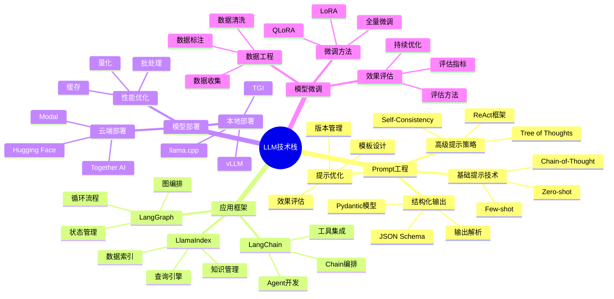
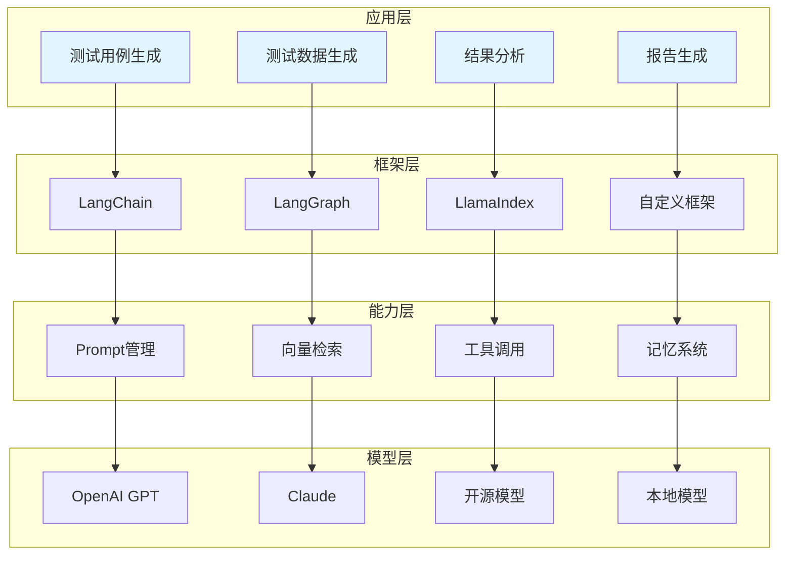

# LLM技术

大语言模型在测试领域的工程化实践，包括Prompt工程、LangChain应用、模型部署与微调。

## 📊 技术架构全景



## 🏗️ 技术分层架构



## 📚 核心技术详解

### Prompt工程

Prompt工程是与大语言模型交互的核心技术，通过精心设计的提示词引导模型生成高质量输出。

#### 基础提示技术

| 技术 | 说明 | 适用场景 |
|-----|------|---------|
| **Zero-shot** | 无示例直接提问 | 简单任务、通用问题 |
| **Few-shot** | 提供少量示例 | 特定格式输出、专业领域 |
| **Chain-of-Thought** | 引导逐步推理 | 复杂推理、数学问题 |
| **ReAct** | 推理与行动结合 | 工具调用、多步任务 |

#### 高级提示策略

```python
from typing import List, Dict, Any
from dataclasses import dataclass

@dataclass
class PromptTemplate:
    """
    提示词模板类
    支持变量插值和条件渲染
    """
    template: str
    input_variables: List[str]
    
    def format(self, **kwargs) -> str:
        """
        格式化提示词
        
        Args:
            **kwargs: 变量值
            
        Returns:
            str: 格式化后的提示词
        """
        return self.template.format(**kwargs)

class ChainOfThoughtPrompt:
    """
    思维链提示词模板
    引导模型逐步推理
    """
    def __init__(self, template: str, input_variables: List[str]):
        cot_suffix = """
让我们一步步思考：
1. 首先，分析问题的核心
2. 然后，考虑可能的解决方案
3. 接着，评估每个方案的优缺点
4. 最后，给出最优答案

请展示你的完整思考过程。
"""
        self.template = PromptTemplate(
            template + cot_suffix,
            input_variables
        )
    
    def format(self, **kwargs) -> str:
        """
        格式化思维链提示词
        
        Args:
            **kwargs: 变量值
            
        Returns:
            str: 格式化后的提示词
        """
        return self.template.format(**kwargs)
```

#### 结构化输出

```python
from pydantic import BaseModel, Field
from typing import List, Optional
import json

class TestCase(BaseModel):
    """
    测试用例模型
    用于结构化LLM输出
    """
    test_id: str = Field(description="测试用例ID")
    test_name: str = Field(description="测试用例名称")
    preconditions: List[str] = Field(description="前置条件")
    test_steps: List[str] = Field(description="测试步骤")
    expected_results: List[str] = Field(description="预期结果")
    priority: str = Field(description="优先级：P0/P1/P2/P3")

class TestSuite(BaseModel):
    """
    测试套件模型
    """
    suite_name: str = Field(description="测试套件名称")
    test_cases: List[TestCase] = Field(description="测试用例列表")
    total_cases: int = Field(description="总用例数")

def parse_llm_output(response: str, model_class: type) -> BaseModel:
    """
    解析LLM输出为结构化对象
    
    Args:
        response: LLM响应文本
        model_class: Pydantic模型类
        
    Returns:
        BaseModel: 解析后的结构化对象
    """
    try:
        data = json.loads(response)
        return model_class(**data)
    except json.JSONDecodeError:
        raise ValueError("无法解析JSON输出")
```

### LangChain应用

LangChain是构建LLM应用的核心框架，提供链式调用、Agent开发、工具集成等能力。

#### Chain编排

```python
from typing import Dict, List, Any
from abc import ABC, abstractmethod

class BaseChain(ABC):
    """
    链基类
    """
    @abstractmethod
    def run(self, inputs: Dict) -> Dict:
        """
        执行链
        
        Args:
            inputs: 输入字典
            
        Returns:
            dict: 输出字典
        """
        pass

class SequentialChain(BaseChain):
    """
    顺序链
    按顺序执行多个步骤
    """
    def __init__(self, chains: List[BaseChain]):
        self.chains = chains
    
    def run(self, inputs: Dict) -> Dict:
        """
        顺序执行所有链
        
        Args:
            inputs: 输入字典
            
        Returns:
            dict: 输出字典
        """
        current_input = inputs.copy()
        
        for chain in self.chains:
            current_input = chain.run(current_input)
        
        return current_input

class TestGenerationChain:
    """
    测试用例生成链
    完整的测试用例生成流程
    """
    def __init__(self, llm_client):
        self.llm = llm_client
        self._build_chain()
    
    def _build_chain(self):
        """
        构建生成链
        """
        pass
    
    def generate(self, requirement: str) -> Dict:
        """
        生成测试用例
        
        Args:
            requirement: 需求描述
            
        Returns:
            dict: 生成结果
        """
        return {"requirement": requirement, "test_cases": []}
```

#### Agent开发

```python
from typing import Dict, List, Any, Optional
from dataclasses import dataclass
from enum import Enum

class AgentAction(Enum):
    """智能体动作类型"""
    THINK = "think"
    ACT = "act"
    OBSERVE = "observe"
    FINISH = "finish"

@dataclass
class AgentStep:
    """智能体步骤"""
    action: AgentAction
    content: str
    tool_name: Optional[str] = None
    tool_input: Optional[Dict] = None
    observation: Optional[str] = None

class ReActAgent:
    """
    ReAct智能体
    推理-行动循环
    """
    def __init__(self, llm_client, tools: Dict[str, Any]):
        self.llm = llm_client
        self.tools = tools
        self.memory: List[AgentStep] = []
    
    def run(self, task: str, max_iterations: int = 10) -> Dict:
        """
        运行智能体
        
        Args:
            task: 任务描述
            max_iterations: 最大迭代次数
            
        Returns:
            dict: 运行结果
        """
        return {
            "status": "completed",
            "result": "",
            "steps": self.memory
        }
```

### 模型部署

#### 本地部署方案对比

| 方案 | 优势 | 劣势 | 适用场景 |
|-----|------|------|---------|
| **vLLM** | 高吞吐量、PagedAttention | 显存要求高 | 高并发生产环境 |
| **TGI** | HuggingFace生态、易用 | 功能相对简单 | 快速部署、原型开发 |
| **llama.cpp** | 轻量级、CPU友好 | 性能较低 | 边缘设备、资源受限 |

#### 部署示例

```python
from typing import Dict, List, Optional
import requests

class VLLMClient:
    """
    vLLM客户端
    用于与vLLM服务交互
    """
    def __init__(self, base_url: str):
        self.base_url = base_url
    
    def generate(
        self,
        prompt: str,
        max_tokens: int = 512,
        temperature: float = 0.7,
        top_p: float = 0.9
    ) -> str:
        """
        生成文本
        
        Args:
            prompt: 输入提示词
            max_tokens: 最大生成token数
            temperature: 温度参数
            top_p: Top-p采样参数
            
        Returns:
            str: 生成的文本
        """
        response = requests.post(
            f"{self.base_url}/generate",
            json={
                "prompt": prompt,
                "max_tokens": max_tokens,
                "temperature": temperature,
                "top_p": top_p
            }
        )
        return response.json()["text"]

class ModelLoadBalancer:
    """
    模型负载均衡器
    管理多个模型实例的请求分发
    """
    def __init__(self, model_instances: List[str]):
        self.instances = model_instances
        self.current_index = 0
    
    def get_next_instance(self) -> str:
        """
        获取下一个可用实例
        
        Returns:
            str: 实例URL
        """
        instance = self.instances[self.current_index]
        self.current_index = (self.current_index + 1) % len(self.instances)
        return instance
```

### 模型微调

#### 微调方法对比

| 方法 | 参数量 | 显存需求 | 训练速度 | 效果 |
|-----|--------|---------|---------|------|
| **全量微调** | 100% | 极高 | 慢 | 最佳 |
| **LoRA** | <1% | 中等 | 快 | 良好 |
| **QLoRA** | <1% | 低 | 较快 | 良好 |

#### LoRA微调示例

```python
from typing import Dict, List, Optional
from dataclasses import dataclass

@dataclass
class LoRAConfig:
    """
    LoRA配置
    """
    r: int = 8
    lora_alpha: int = 32
    lora_dropout: float = 0.1
    target_modules: List[str] = None
    
    def __post_init__(self):
        if self.target_modules is None:
            self.target_modules = ["q_proj", "v_proj"]

class LoRATrainer:
    """
    LoRA训练器
    用于模型微调
    """
    def __init__(self, model, config: LoRAConfig):
        self.model = model
        self.config = config
    
    def prepare_model(self):
        """
        准备模型进行LoRA微调
        """
        pass
    
    def train(
        self,
        train_data: List[Dict],
        epochs: int = 3,
        batch_size: int = 4
    ) -> Dict:
        """
        训练模型
        
        Args:
            train_data: 训练数据
            epochs: 训练轮数
            batch_size: 批次大小
            
        Returns:
            dict: 训练结果
        """
        return {
            "status": "completed",
            "epochs": epochs,
            "final_loss": 0.1
        }
```

## 🎯 应用场景

### 测试用例生成

使用LLM自动生成测试用例，提升测试覆盖率。

```python
class TestCaseGenerator:
    """
    测试用例生成器
    使用LLM自动生成测试用例
    """
    def __init__(self, llm_client):
        self.llm = llm_client
    
    def generate_from_requirement(
        self,
        requirement: str,
        test_types: List[str] = None
    ) -> List[TestCase]:
        """
        从需求生成测试用例
        
        Args:
            requirement: 需求描述
            test_types: 测试类型列表
            
        Returns:
            list: 测试用例列表
        """
        if test_types is None:
            test_types = ["功能测试", "边界测试", "异常测试"]
        
        prompt = f"""
根据以下需求生成测试用例：

需求：{requirement}

请生成以下类型的测试用例：
{chr(10).join(f'- {t}' for t in test_types)}

输出格式为JSON，包含以下字段：
- test_id: 测试用例ID
- test_name: 测试用例名称
- preconditions: 前置条件列表
- test_steps: 测试步骤列表
- expected_results: 预期结果列表
- priority: 优先级(P0/P1/P2/P3)
"""
        
        response = self.llm.generate(prompt)
        return self._parse_test_cases(response)
    
    def _parse_test_cases(self, response: str) -> List[TestCase]:
        """
        解析测试用例
        
        Args:
            response: LLM响应
            
        Returns:
            list: 测试用例列表
        """
        import json
        data = json.loads(response)
        return [TestCase(**tc) for tc in data.get("test_cases", [])]
```

### 测试数据生成

智能生成测试数据，包括边界数据、异常数据等。

```python
class TestDataGenerator:
    """
    测试数据生成器
    智能生成各类测试数据
    """
    def __init__(self, llm_client):
        self.llm = llm_client
    
    def generate_boundary_data(
        self,
        field_name: str,
        field_type: str,
        constraints: Dict
    ) -> List[Any]:
        """
        生成边界测试数据
        
        Args:
            field_name: 字段名称
            field_type: 字段类型
            constraints: 约束条件
            
        Returns:
            list: 边界数据列表
        """
        prompt = f"""
为以下字段生成边界测试数据：

字段名称：{field_name}
字段类型：{field_type}
约束条件：{constraints}

请生成以下类型的边界数据：
1. 最小值
2. 最大值
3. 最小值-1
4. 最大值+1
5. 空值
6. 特殊字符

输出JSON数组格式。
"""
        
        response = self.llm.generate(prompt)
        return self._parse_data(response)
    
    def _parse_data(self, response: str) -> List[Any]:
        """
        解析数据
        
        Args:
            response: LLM响应
            
        Returns:
            list: 数据列表
        """
        import json
        return json.loads(response)
```

### 测试结果分析

自动分析测试结果，识别缺陷模式，提供修复建议。

```python
class TestResultAnalyzer:
    """
    测试结果分析器
    自动分析测试结果并提供洞察
    """
    def __init__(self, llm_client):
        self.llm = llm_client
    
    def analyze_failures(
        self,
        failed_tests: List[Dict]
    ) -> Dict:
        """
        分析失败测试
        
        Args:
            failed_tests: 失败测试列表
            
        Returns:
            dict: 分析结果
        """
        prompt = f"""
分析以下失败的测试用例，识别缺陷模式：

失败测试：
{self._format_tests(failed_tests)}

请提供：
1. 缺陷分类
2. 根因分析
3. 修复建议
4. 预防措施

输出JSON格式。
"""
        
        response = self.llm.generate(prompt)
        return self._parse_analysis(response)
    
    def _format_tests(self, tests: List[Dict]) -> str:
        """
        格式化测试数据
        
        Args:
            tests: 测试列表
            
        Returns:
            str: 格式化后的字符串
        """
        import json
        return json.dumps(tests, ensure_ascii=False, indent=2)
    
    def _parse_analysis(self, response: str) -> Dict:
        """
        解析分析结果
        
        Args:
            response: LLM响应
            
        Returns:
            dict: 分析结果
        """
        import json
        return json.loads(response)
```

### 测试报告生成

自动生成测试报告，提供可视化分析和改进建议。

```python
class TestReportGenerator:
    """
    测试报告生成器
    自动生成测试报告
    """
    def __init__(self, llm_client):
        self.llm = llm_client
    
    def generate_report(
        self,
        test_results: Dict,
        format: str = "markdown"
    ) -> str:
        """
        生成测试报告
        
        Args:
            test_results: 测试结果
            format: 报告格式
            
        Returns:
            str: 测试报告
        """
        prompt = f"""
根据以下测试结果生成测试报告：

测试结果：
{self._format_results(test_results)}

请生成包含以下内容的报告：
1. 执行摘要
2. 测试统计
3. 失败分析
4. 风险评估
5. 改进建议

输出Markdown格式。
"""
        
        return self.llm.generate(prompt)
    
    def _format_results(self, results: Dict) -> str:
        """
        格式化测试结果
        
        Args:
            results: 测试结果
            
        Returns:
            str: 格式化后的字符串
        """
        import json
        return json.dumps(results, ensure_ascii=False, indent=2)
```

## 📈 最佳实践

### 1. Prompt设计原则

| 原则 | 说明 | 示例 |
|-----|------|------|
| **清晰性** | 表达明确，避免歧义 | "生成5个测试用例" |
| **结构化** | 使用结构化格式 | 使用JSON、Markdown |
| **示例引导** | 提供示例 | Few-shot learning |
| **约束条件** | 明确限制 | "不超过100字" |

### 2. 成本优化策略

```python
class CostOptimizer:
    """
    成本优化器
    控制LLM调用成本
    """
    def __init__(self, cache_enabled: bool = True):
        self.cache_enabled = cache_enabled
        self.cache: Dict[str, str] = {}
    
    def get_cached_response(self, prompt: str) -> Optional[str]:
        """
        获取缓存的响应
        
        Args:
            prompt: 提示词
            
        Returns:
            str: 缓存的响应，无缓存返回None
        """
        if not self.cache_enabled:
            return None
        
        import hashlib
        key = hashlib.md5(prompt.encode()).hexdigest()
        return self.cache.get(key)
    
    def cache_response(self, prompt: str, response: str):
        """
        缓存响应
        
        Args:
            prompt: 提示词
            response: 响应
        """
        if not self.cache_enabled:
            return
        
        import hashlib
        key = hashlib.md5(prompt.encode()).hexdigest()
        self.cache[key] = response
```

### 3. 质量保障

- 输出验证机制
- 人工审核流程
- A/B测试对比
- 持续监控优化

## 🔗 相关资源

- [Prompt工程最佳实践](/ai-testing-tech/llm-tech/prompt-engineering/) - 高级提示词技术
- [LangChain应用开发](/ai-testing-tech/llm-tech/langchain/) - 框架深度应用
- [模型部署实践](/ai-testing-tech/llm-tech/model-deployment/) - 部署方案详解
- [模型微调指南](/ai-testing-tech/llm-tech/model-finetuning/) - 微调技术实践
