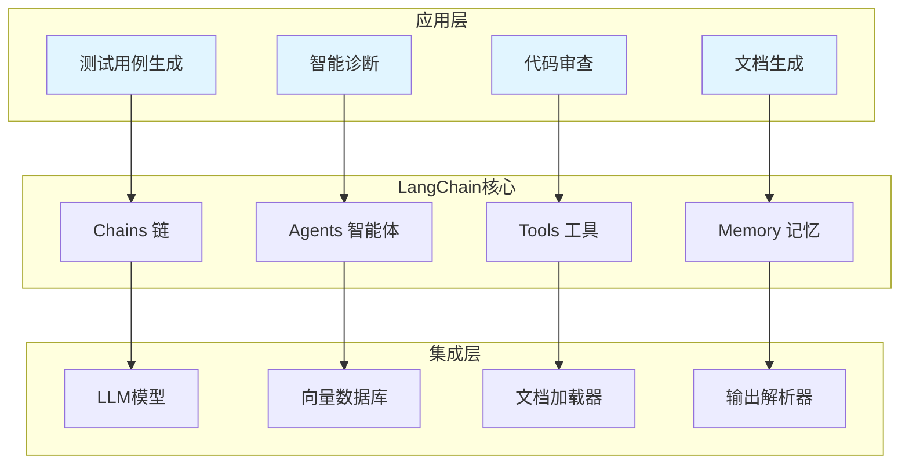
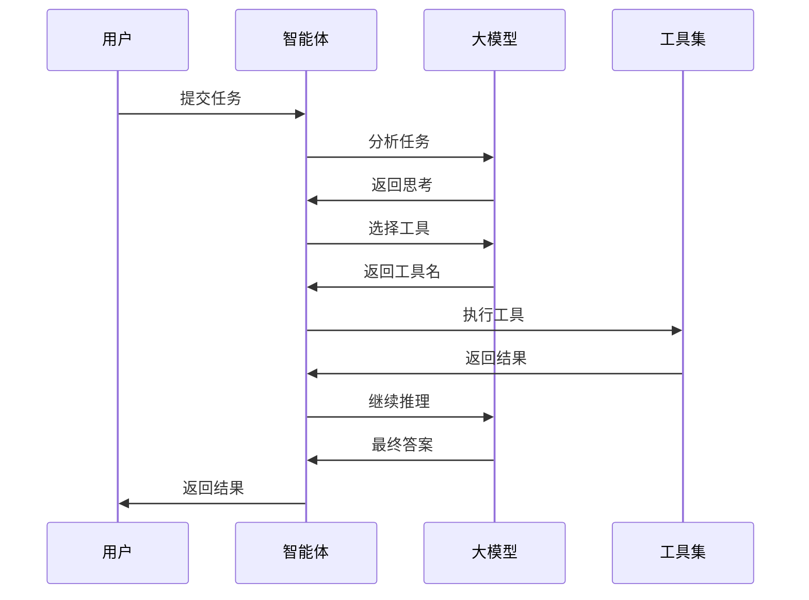

# LangChain应用开发

LangChain是构建大语言模型应用的核心框架，提供链式调用、Agent开发、工具集成、RAG实现等能力。

## 📊 架构概览



## 🏗️ 核心组件

### 1. Chains（链）

链是LangChain的核心概念，用于将多个组件按顺序或条件组合执行。

#### 链的类型

| 类型 | 说明 | 适用场景 |
|-----|------|---------|
| **LLMChain** | 单次LLM调用 | 简单的提示-响应场景 |
| **SequentialChain** | 顺序执行 | 多步骤流程 |
| **RouterChain** | 条件路由 | 动态选择执行路径 |
| **TransformChain** | 数据转换 | 输入/输出预处理 |

#### 链的实现

```python
from typing import Dict, List, Any
from abc import ABC, abstractmethod

class BaseChain(ABC):
    """
    链基类
    所有自定义链的基类
    """
    @abstractmethod
    def run(self, inputs: Dict) -> Dict:
        """
        执行链
        
        Args:
            inputs: 输入字典
            
        Returns:
            dict: 输出字典
        """
        pass

class SequentialChain(BaseChain):
    """
    顺序链
    按顺序执行多个步骤
    """
    def __init__(self, chains: List[BaseChain]):
        self.chains = chains
    
    def run(self, inputs: Dict) -> Dict:
        """
        顺序执行所有链
        
        Args:
            inputs: 输入字典
            
        Returns:
            dict: 输出字典
        """
        current_input = inputs.copy()
        
        for chain in self.chains:
            current_input = chain.run(current_input)
        
        return current_input

class ParallelChain(BaseChain):
    """
    并行链
    并行执行多个步骤
    """
    def __init__(self, chains: Dict[str, BaseChain]):
        self.chains = chains
    
    def run(self, inputs: Dict) -> Dict:
        """
        并行执行所有链
        
        Args:
            inputs: 输入字典
            
        Returns:
            dict: 输出字典
        """
        import concurrent.futures
        
        results = {}
        
        with concurrent.futures.ThreadPoolExecutor() as executor:
            futures = {
                executor.submit(chain.run, inputs): name
                for name, chain in self.chains.items()
            }
            
            for future in concurrent.futures.as_completed(futures):
                name = futures[future]
                results[name] = future.result()
        
        return results

class ConditionalChain(BaseChain):
    """
    条件链
    根据条件选择执行路径
    """
    def __init__(
        self, 
        condition_func: callable,
        true_chain: BaseChain,
        false_chain: BaseChain
    ):
        self.condition_func = condition_func
        self.true_chain = true_chain
        self.false_chain = false_chain
    
    def run(self, inputs: Dict) -> Dict:
        """
        根据条件执行
        
        Args:
            inputs: 输入字典
            
        Returns:
            dict: 输出字典
        """
        if self.condition_func(inputs):
            return self.true_chain.run(inputs)
        else:
            return self.false_chain.run(inputs)

class LLMChain(BaseChain):
    """
    LLM链
    调用大语言模型
    """
    def __init__(
        self, 
        llm_client, 
        prompt_template, 
        output_key: str = "output"
    ):
        self.llm = llm_client
        self.prompt_template = prompt_template
        self.output_key = output_key
    
    def run(self, inputs: Dict) -> Dict:
        """
        执行LLM调用
        
        Args:
            inputs: 输入字典
            
        Returns:
            dict: 包含LLM输出的字典
        """
        prompt = self.prompt_template.format(**inputs)
        response = self.llm.generate(prompt)
        
        return {**inputs, self.output_key: response}
```

### 2. Agents（智能体）

智能体是能够自主决策和执行任务的组件，通过工具调用实现复杂任务。

#### Agent架构



#### Agent实现

```python
from typing import Dict, List, Any, Optional
from dataclasses import dataclass
from enum import Enum

class AgentAction(Enum):
    """智能体动作类型"""
    THINK = "think"
    ACT = "act"
    OBSERVE = "observe"
    FINISH = "finish"

@dataclass
class AgentStep:
    """智能体步骤"""
    action: AgentAction
    content: str
    tool_name: Optional[str] = None
    tool_input: Optional[Dict] = None
    observation: Optional[str] = None

class BaseAgent:
    """
    智能体基类
    """
    def __init__(self, llm_client, tools: Dict[str, Any]):
        self.llm = llm_client
        self.tools = tools
        self.memory: List[AgentStep] = []
    
    def run(self, task: str, max_iterations: int = 10) -> Dict:
        """
        运行智能体
        
        Args:
            task: 任务描述
            max_iterations: 最大迭代次数
            
        Returns:
            dict: 运行结果
        """
        steps = self.plan(task)
        
        for i, step in enumerate(steps[:max_iterations]):
            result = self.execute(step)
            self.memory.append(step)
            
            if step.action == AgentAction.FINISH:
                return {
                    "status": "completed",
                    "result": result,
                    "steps": self.memory
                }
        
        return {
            "status": "max_iterations_reached",
            "steps": self.memory
        }
    
    def plan(self, task: str) -> List[AgentStep]:
        """
        规划任务
        
        Args:
            task: 任务描述
            
        Returns:
            list: 步骤列表
        """
        raise NotImplementedError
    
    def execute(self, step: AgentStep) -> str:
        """
        执行步骤
        
        Args:
            step: 步骤对象
            
        Returns:
            str: 执行结果
        """
        raise NotImplementedError

class ReActAgent(BaseAgent):
    """
    ReAct智能体
    推理-行动循环
    """
    def plan(self, task: str) -> List[AgentStep]:
        """
        规划任务
        
        Args:
            task: 任务描述
            
        Returns:
            list: 步骤列表
        """
        prompt = f"""
任务：{task}

可用工具：
{self._format_tools()}

请规划如何完成这个任务。使用以下格式：
Thought: 思考下一步
Action: 工具名
Action Input: {{"参数": "值"}}
"""
        
        response = self.llm.generate(prompt)
        return self._parse_response(response)
    
    def execute(self, step: AgentStep) -> str:
        """
        执行步骤
        
        Args:
            step: 步骤对象
            
        Returns:
            str: 执行结果
        """
        if step.action == AgentAction.ACT and step.tool_name:
            tool = self.tools.get(step.tool_name)
            if tool:
                return tool.execute(**step.tool_input)
        return step.content
    
    def _format_tools(self) -> str:
        """
        格式化工具描述
        
        Returns:
            str: 工具描述
        """
        return "\n".join([
            f"- {name}: {tool.description}"
            for name, tool in self.tools.items()
        ])
    
    def _parse_response(self, response: str) -> List[AgentStep]:
        """
        解析响应
        
        Args:
            response: 响应文本
            
        Returns:
            list: 步骤列表
        """
        steps = []
        lines = response.split("\n")
        
        for line in lines:
            if line.startswith("Thought:"):
                steps.append(AgentStep(
                    action=AgentAction.THINK,
                    content=line.replace("Thought:", "").strip()
                ))
            elif line.startswith("Action:"):
                action_name = line.replace("Action:", "").strip()
                steps.append(AgentStep(
                    action=AgentAction.ACT,
                    content=action_name,
                    tool_name=action_name
                ))
        
        return steps

class PlanAndExecuteAgent(BaseAgent):
    """
    规划执行智能体
    先规划后执行
    """
    def __init__(self, llm_client, tools: Dict[str, Any]):
        super().__init__(llm_client, tools)
        self.plan_steps: List[str] = []
    
    def plan(self, task: str) -> List[AgentStep]:
        """
        规划任务
        
        Args:
            task: 任务描述
            
        Returns:
            list: 步骤列表
        """
        prompt = f"""
任务：{task}

请将任务分解为具体的执行步骤，每行一个步骤。
"""
        
        response = self.llm.generate(prompt)
        self.plan_steps = [
            line.strip() for line in response.split("\n")
            if line.strip()
        ]
        
        return [
            AgentStep(action=AgentAction.ACT, content=step)
            for step in self.plan_steps
        ]
    
    def execute(self, step: AgentStep) -> str:
        """
        执行步骤
        
        Args:
            step: 步骤对象
            
        Returns:
            str: 执行结果
        """
        prompt = f"""
执行以下步骤：
{step.content}

可用工具：
{self._format_tools()}

请选择合适的工具执行，并返回结果。
"""
        
        return self.llm.generate(prompt)
    
    def _format_tools(self) -> str:
        """
        格式化工具描述
        
        Returns:
            str: 工具描述
        """
        return "\n".join([
            f"- {name}: {tool.description}"
            for name, tool in self.tools.items()
        ])
```

### 3. Tools（工具）

工具是Agent可以调用的外部能力，如API、数据库、浏览器等。

#### 工具定义

```python
from typing import Dict, Any, Optional, List
from abc import ABC, abstractmethod

class BaseTool(ABC):
    """
    工具基类
    """
    @property
    @abstractmethod
    def name(self) -> str:
        """工具名称"""
        pass
    
    @property
    @abstractmethod
    def description(self) -> str:
        """工具描述"""
        pass
    
    @abstractmethod
    def execute(self, **kwargs) -> str:
        """
        执行工具
        
        Args:
            **kwargs: 工具参数
            
        Returns:
            str: 执行结果
        """
        pass

class APITool(BaseTool):
    """
    API调用工具
    """
    def __init__(self, name: str, base_url: str, description: str):
        self._name = name
        self._description = description
        self.base_url = base_url
    
    @property
    def name(self) -> str:
        return self._name
    
    @property
    def description(self) -> str:
        return self._description
    
    def execute(self, endpoint: str, method: str = "GET", **kwargs) -> str:
        """
        执行API调用
        
        Args:
            endpoint: API端点
            method: HTTP方法
            **kwargs: 请求参数
            
        Returns:
            str: API响应
        """
        import requests
        
        url = f"{self.base_url}/{endpoint}"
        
        if method.upper() == "GET":
            response = requests.get(url, params=kwargs)
        else:
            response = requests.post(url, json=kwargs)
        
        return response.text

class DatabaseTool(BaseTool):
    """
    数据库查询工具
    """
    def __init__(self, name: str, connection_string: str, description: str):
        self._name = name
        self._description = description
        self.connection_string = connection_string
    
    @property
    def name(self) -> str:
        return self._name
    
    @property
    def description(self) -> str:
        return self._description
    
    def execute(self, query: str) -> str:
        """
        执行数据库查询
        
        Args:
            query: SQL查询语句
            
        Returns:
            str: 查询结果
        """
        import sqlite3
        
        conn = sqlite3.connect(self.connection_string)
        cursor = conn.cursor()
        
        cursor.execute(query)
        results = cursor.fetchall()
        
        conn.close()
        
        return str(results)

class BrowserTool(BaseTool):
    """
    浏览器工具
    """
    def __init__(self, name: str, description: str):
        self._name = name
        self._description = description
    
    @property
    def name(self) -> str:
        return self._name
    
    @property
    def description(self) -> str:
        return self._description
    
    def execute(self, url: str, action: str = "visit") -> str:
        """
        执行浏览器操作
        
        Args:
            url: 目标URL
            action: 操作类型
            
        Returns:
            str: 操作结果
        """
        if action == "visit":
            return f"访问页面: {url}"
        elif action == "screenshot":
            return f"截图保存: {url}.png"
        else:
            return f"未知操作: {action}"

class ToolRegistry:
    """
    工具注册表
    管理所有可用工具
    """
    def __init__(self):
        self.tools: Dict[str, BaseTool] = {}
    
    def register(self, tool: BaseTool):
        """
        注册工具
        
        Args:
            tool: 工具实例
        """
        self.tools[tool.name] = tool
    
    def get(self, name: str) -> Optional[BaseTool]:
        """
        获取工具
        
        Args:
            name: 工具名称
            
        Returns:
            BaseTool: 工具实例
        """
        return self.tools.get(name)
    
    def list_tools(self) -> List[Dict[str, str]]:
        """
        列出所有工具
        
        Returns:
            list: 工具列表
        """
        return [
            {"name": name, "description": tool.description}
            for name, tool in self.tools.items()
        ]
```

### 4. Memory（记忆）

记忆系统用于存储和检索对话历史、上下文信息等。

```python
from typing import Dict, List, Any
from collections import deque

class BaseMemory:
    """
    记忆基类
    """
    def __init__(self, max_size: int = 100):
        self.max_size = max_size
    
    def save(self, key: str, value: Any):
        """
        保存记忆
        
        Args:
            key: 键
            value: 值
        """
        raise NotImplementedError
    
    def load(self, key: str) -> Any:
        """
        加载记忆
        
        Args:
            key: 键
            
        Returns:
            Any: 记忆值
        """
        raise NotImplementedError
    
    def clear(self):
        """清空记忆"""
        raise NotImplementedError

class ConversationMemory(BaseMemory):
    """
    对话记忆
    存储对话历史
    """
    def __init__(self, max_size: int = 100):
        super().__init__(max_size)
        self.history: deque = deque(maxlen=max_size)
    
    def save(self, role: str, content: str):
        """
        保存对话
        
        Args:
            role: 角色（user/assistant）
            content: 内容
        """
        self.history.append({
            "role": role,
            "content": content
        })
    
    def load(self, last_n: int = None) -> List[Dict[str, str]]:
        """
        加载对话历史
        
        Args:
            last_n: 最近N条
            
        Returns:
            list: 对话历史
        """
        if last_n is None:
            return list(self.history)
        return list(self.history)[-last_n:]
    
    def clear(self):
        """清空对话历史"""
        self.history.clear()
    
    def get_context(self, max_tokens: int = 2000) -> str:
        """
        获取上下文
        
        Args:
            max_tokens: 最大token数
            
        Returns:
            str: 上下文字符串
        """
        context = []
        current_length = 0
        
        for msg in reversed(self.history):
            msg_length = len(msg["content"])
            if current_length + msg_length > max_tokens:
                break
            
            context.insert(0, f"{msg['role']}: {msg['content']}")
            current_length += msg_length
        
        return "\n".join(context)

class EntityMemory(BaseMemory):
    """
    实体记忆
    存储关键实体信息
    """
    def __init__(self, max_size: int = 100):
        super().__init__(max_size)
        self.entities: Dict[str, Any] = {}
    
    def save(self, entity_name: str, entity_info: Any):
        """
        保存实体信息
        
        Args:
            entity_name: 实体名称
            entity_info: 实体信息
        """
        self.entities[entity_name] = entity_info
    
    def load(self, entity_name: str) -> Any:
        """
        加载实体信息
        
        Args:
            entity_name: 实体名称
            
        Returns:
            Any: 实体信息
        """
        return self.entities.get(entity_name)
    
    def clear(self):
        """清空实体记忆"""
        self.entities.clear()
    
    def list_entities(self) -> List[str]:
        """
        列出所有实体
        
        Returns:
            list: 实体名称列表
        """
        return list(self.entities.keys())
```

## 🎯 测试场景应用

### 测试用例生成链

```python
class TestGenerationChain:
    """
    测试用例生成链
    完整的测试用例生成流程
    """
    def __init__(self, llm_client):
        self.llm = llm_client
        self._build_chain()
    
    def _build_chain(self):
        """
        构建生成链
        """
        self.analyze_chain = LLMChain(
            self.llm,
            PromptTemplate(
                "分析以下需求，提取关键测试点：\n{requirement}",
                ["requirement"]
            ),
            "analysis"
        )
        
        self.generate_chain = LLMChain(
            self.llm,
            PromptTemplate(
                "基于以下分析生成测试用例：\n{analysis}",
                ["analysis"]
            ),
            "test_cases"
        )
        
        self.optimize_chain = LLMChain(
            self.llm,
            PromptTemplate(
                "优化以下测试用例：\n{test_cases}",
                ["test_cases"]
            ),
            "optimized_cases"
        )
        
        self.chain = SequentialChain([
            self.analyze_chain,
            self.generate_chain,
            self.optimize_chain
        ])
    
    def generate(self, requirement: str) -> Dict:
        """
        生成测试用例
        
        Args:
            requirement: 需求描述
            
        Returns:
            dict: 生成结果
        """
        return self.chain.run({"requirement": requirement})
```

### 智能诊断Agent

```python
class DiagnosticAgent(ReActAgent):
    """
    智能诊断智能体
    用于分析测试失败原因
    """
    def __init__(self, llm_client):
        tools = {
            "log_analyzer": LogAnalyzerTool(),
            "code_search": CodeSearchTool(),
            "stack_trace": StackTraceTool()
        }
        super().__init__(llm_client, tools)
    
    def diagnose(self, failure_info: Dict) -> Dict:
        """
        诊断失败原因
        
        Args:
            failure_info: 失败信息
            
        Returns:
            dict: 诊断结果
        """
        task = f"""
分析以下测试失败信息，找出根本原因：

失败信息：
{failure_info}

请使用可用工具进行分析。
"""
        
        result = self.run(task)
        
        return {
            "root_cause": result.get("result"),
            "analysis_steps": result.get("steps")
        }
```

## 📖 最佳实践

### 1. 链设计原则

- **单一职责**：每个链只负责一个明确的任务
- **可组合性**：设计可复用的链组件
- **错误处理**：添加适当的错误处理和重试机制
- **可观测性**：记录链的执行过程和中间结果

### 2. Agent设计原则

- **明确目标**：清晰定义Agent的任务边界
- **工具选择**：提供合适且足够的工具
- **迭代限制**：设置合理的最大迭代次数
- **结果验证**：验证Agent输出的有效性

### 3. 性能优化

- 使用并行链提高执行效率
- 实现缓存机制减少重复调用
- 选择合适的模型大小
- 批量处理请求

## 🎯 应用场景

### 自动化测试流程编排

使用LangChain的链式调用实现复杂的测试流程自动化。

```python
class AutomatedTestPipeline:
    """
    自动化测试流水线
    使用LangChain编排测试流程
    """
    def __init__(self, llm_client):
        self.llm = llm_client
        self.pipeline = self._build_pipeline()
    
    def _build_pipeline(self) -> SequentialChain:
        """
        构建测试流水线
        
        Returns:
            SequentialChain: 测试流水线链
        """
        requirement_analysis = LLMChain(
            self.llm,
            PromptTemplate(
                "分析以下需求，提取测试要点：\n{requirement}",
                ["requirement"]
            ),
            "analysis"
        )
        
        test_design = LLMChain(
            self.llm,
            PromptTemplate(
                "基于分析结果设计测试方案：\n{analysis}",
                ["analysis"]
            ),
            "test_design"
        )
        
        test_implementation = LLMChain(
            self.llm,
            PromptTemplate(
                "根据测试方案生成测试代码：\n{test_design}",
                ["test_design"]
            ),
            "test_code"
        )
        
        return SequentialChain([
            requirement_analysis,
            test_design,
            test_implementation
        ])
    
    def run(self, requirement: str) -> Dict:
        """
        执行测试流水线
        
        Args:
            requirement: 需求描述
            
        Returns:
            dict: 执行结果
        """
        return self.pipeline.run({"requirement": requirement})
```

### 智能测试报告生成

使用Agent技术自动收集测试数据并生成报告。

```python
class ReportGenerationAgent:
    """
    报告生成智能体
    自动收集数据并生成测试报告
    """
    def __init__(self, llm_client):
        tools = {
            "test_result_fetcher": TestResultFetcherTool(),
            "metrics_calculator": MetricsCalculatorTool(),
            "chart_generator": ChartGeneratorTool()
        }
        self.agent = ReActAgent(llm_client, tools)
    
    def generate_report(
        self,
        test_run_id: str,
        report_type: str = "summary"
    ) -> str:
        """
        生成测试报告
        
        Args:
            test_run_id: 测试运行ID
            report_type: 报告类型
            
        Returns:
            str: 测试报告
        """
        task = f"""
请生成测试报告：
- 测试运行ID：{test_run_id}
- 报告类型：{report_type}

步骤：
1. 使用test_result_fetcher获取测试结果
2. 使用metrics_calculator计算指标
3. 使用chart_generator生成图表
4. 汇总生成最终报告
"""
        
        result = self.agent.run(task)
        return result.get("result", "")
```

### 测试数据智能生成

使用LangChain工具集成实现测试数据的智能生成。

```python
class TestDataGenerator:
    """
    测试数据生成器
    使用LangChain工具生成测试数据
    """
    def __init__(self, llm_client):
        self.llm = llm_client
        self.tools = {
            "schema_analyzer": SchemaAnalyzerTool(),
            "data_factory": DataFactoryTool(),
            "validator": DataValidatorTool()
        }
    
    def generate_test_data(
        self,
        schema: Dict,
        count: int = 100,
        constraints: Dict = None
    ) -> List[Dict]:
        """
        生成测试数据
        
        Args:
            schema: 数据模式
            count: 生成数量
            constraints: 约束条件
            
        Returns:
            list: 测试数据列表
        """
        analyze_chain = LLMChain(
            self.llm,
            PromptTemplate(
                "分析以下数据模式，确定生成策略：\n{schema}",
                ["schema"]
            ),
            "strategy"
        )
        
        generate_chain = LLMChain(
            self.llm,
            PromptTemplate(
                "根据策略生成{count}条测试数据：\n{strategy}",
                ["strategy", "count"]
            ),
            "data"
        )
        
        pipeline = SequentialChain([analyze_chain, generate_chain])
        
        result = pipeline.run({
            "schema": str(schema),
            "count": count
        })
        
        return self._parse_data(result.get("data", ""))
    
    def _parse_data(self, data_str: str) -> List[Dict]:
        """
        解析生成的数据
        
        Args:
            data_str: 数据字符串
            
        Returns:
            list: 数据列表
        """
        import json
        try:
            return json.loads(data_str)
        except:
            return []
```

### 测试失败智能诊断

使用多Agent协作进行测试失败的智能诊断。

```python
class DiagnosticMultiAgent:
    """
    诊断多智能体系统
    多个Agent协作诊断测试失败
    """
    def __init__(self, llm_client):
        self.llm = llm_client
        
        self.log_analyzer = ReActAgent(
            llm_client,
            {"log_reader": LogReaderTool(), "error_parser": ErrorParserTool()}
        )
        
        self.code_analyzer = ReActAgent(
            llm_client,
            {"code_search": CodeSearchTool(), "diff_checker": DiffCheckerTool()}
        )
        
        self.root_cause_analyzer = ReActAgent(
            llm_client,
            {"knowledge_base": KnowledgeBaseTool()}
        )
    
    def diagnose(self, failure_info: Dict) -> Dict:
        """
        诊断测试失败
        
        Args:
            failure_info: 失败信息
            
        Returns:
            dict: 诊断结果
        """
        log_task = f"分析日志，找出错误模式：{failure_info.get('logs')}"
        log_result = self.log_analyzer.run(log_task)
        
        code_task = f"检查相关代码变更：{failure_info.get('test_case')}"
        code_result = self.code_analyzer.run(code_task)
        
        diagnosis_task = f"""
综合分析：
- 日志分析结果：{log_result.get('result')}
- 代码分析结果：{code_result.get('result')}

请确定根本原因并提供修复建议。
"""
        diagnosis = self.root_cause_analyzer.run(diagnosis_task)
        
        return {
            "log_analysis": log_result,
            "code_analysis": code_result,
            "diagnosis": diagnosis.get("result"),
            "suggestions": self._extract_suggestions(diagnosis)
        }
    
    def _extract_suggestions(self, diagnosis: Dict) -> List[str]:
        """
        提取修复建议
        
        Args:
            diagnosis: 诊断结果
            
        Returns:
            list: 建议列表
        """
        result = diagnosis.get("result", "")
        return [line.strip() for line in result.split("\n") if line.strip()]
```

## 📚 学习资源

### 官方文档

| 资源 | 描述 | 链接 |
|-----|------|------|
| **LangChain Python Docs** | LangChain Python官方文档 | [python.langchain.com](https://python.langchain.com/docs/get_started/introduction) |
| **LangChain JS Docs** | LangChain JavaScript官方文档 | [js.langchain.com](https://js.langchain.com/docs/) |
| **LangSmith Docs** | LangSmith调试和监控平台文档 | [docs.smith.langchain.com](https://docs.smith.langchain.com/) |
| **LangGraph Docs** | LangGraph状态管理框架文档 | [langchain-ai.github.io/langgraph](https://langchain-ai.github.io/langgraph/) |

### 教程与课程

| 课程 | 平台 | 描述 |
|-----|------|------|
| **LangChain for LLM Application Development** | DeepLearning.AI | LangChain应用开发入门课程 |
| **LangChain: Chat with Your Data** | DeepLearning.AI | 使用LangChain构建数据对话应用 |
| **Building Applications with LangChain** | Udemy | LangChain实战开发课程 |
| **LangChain Crash Course** | YouTube | 快速入门视频教程 |

### 开源项目与示例

| 项目 | 描述 | 链接 |
|-----|------|------|
| **LangChain Templates** | 官方模板集合 | [github.com/langchain-ai/langchain/tree/master/templates](https://github.com/langchain-ai/langchain/tree/master/templates) |
| **LangChain Cookbook** | 官方示例代码库 | [github.com/langchain-ai/langchain/blob/master/cookbook](https://github.com/langchain-ai/langchain/blob/master/cookbook) |
| **LangChain Examples** | 社区示例集合 | [github.com/langchain-ai/langchain/tree/master/docs/docs_skeleton/docs/use_cases](https://github.com/langchain-ai/langchain/tree/master/docs/docs_skeleton/docs/use_cases) |

### 核心概念深入

| 概念 | 描述 | 文档链接 |
|-----|------|---------|
| **Chains** | 链式调用核心概念 | [Chains文档](https://python.langchain.com/docs/modules/chains/) |
| **Agents** | 智能体架构详解 | [Agents文档](https://python.langchain.com/docs/modules/agents/) |
| **Tools** | 工具集成指南 | [Tools文档](https://python.langchain.com/docs/modules/tools/) |
| **Memory** | 记忆系统实现 | [Memory文档](https://python.langchain.com/docs/modules/memory/) |
| **RAG** | 检索增强生成 | [RAG文档](https://python.langchain.com/docs/use_cases/question_answering/) |

### 社区与支持

| 社区 | 描述 | 链接 |
|-----|------|------|
| **LangChain Discord** | 官方Discord社区 | [discord.gg/langchain](https://discord.gg/langchain) |
| **LangChain Twitter** | 官方Twitter账号 | [twitter.com/langchainai](https://twitter.com/langchainai) |
| **GitHub Discussions** | GitHub讨论区 | [github.com/langchain-ai/langchain/discussions](https://github.com/langchain-ai/langchain/discussions) |
| **LangChain Blog** | 官方博客 | [blog.langchain.dev](https://blog.langchain.dev/) |

## 🔗 相关资源

- [Prompt工程](/ai-testing-tech/llm-tech/prompt-engineering/) - 提示词技术
- [模型部署](/ai-testing-tech/llm-tech/model-deployment/) - 部署实践
- [模型微调](/ai-testing-tech/llm-tech/model-finetuning/) - 微调技术
- [Agent技术](/ai-testing-tech/agent-tech/) - Agent架构
- [RAG技术](/ai-testing-tech/rag-tech/) - 检索增强生成
