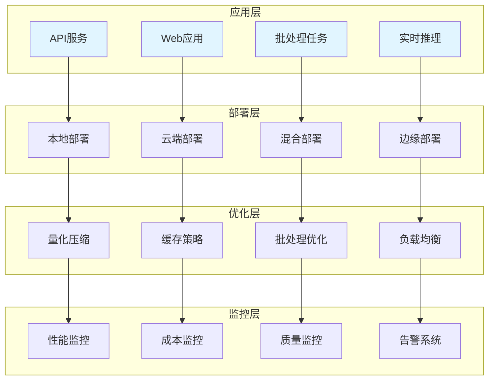

# 模型部署实践

大语言模型的部署方案与实践，涵盖本地部署、云端部署、性能优化和成本控制。

## 📊 部署架构概览



## 🏗️ 部署方案对比

### 本地部署方案

| 方案 | 优势 | 劣势 | 适用场景 |
|-----|------|------|---------|
| **vLLM** | 高吞吐量、PagedAttention | 显存要求高 | 高并发生产环境 |
| **TGI** | HuggingFace生态、易用 | 功能相对简单 | 快速部署、原型开发 |
| **llama.cpp** | 轻量级、CPU友好 | 性能较低 | 边缘设备、资源受限 |
| **Ollama** | 简单易用、模型管理 | 扩展性有限 | 个人开发、测试环境 |

### 云端部署方案

| 方案 | 优势 | 劣势 | 适用场景 |
|-----|------|------|---------|
| **OpenAI API** | 高质量、稳定 | 成本高、数据安全 | 快速原型、通用场景 |
| **Azure OpenAI** | 企业级、合规 | 成本高 | 企业应用、合规要求 |
| **Together AI** | 开源模型、灵活 | 相对较新 | 开源模型部署 |
| **Modal** | 弹性伸缩、按需付费 | 学习曲线 | 变动负载、实验项目 |

## 🔧 本地部署实践

### vLLM部署

```python
from typing import Dict, List, Optional
import requests
import json

class VLLMClient:
    """
    vLLM客户端
    用于与vLLM服务交互
    """
    def __init__(self, base_url: str, api_key: str = None):
        self.base_url = base_url
        self.api_key = api_key
    
    def generate(
        self,
        prompt: str,
        max_tokens: int = 512,
        temperature: float = 0.7,
        top_p: float = 0.9,
        stop: List[str] = None
    ) -> str:
        """
        生成文本
        
        Args:
            prompt: 输入提示词
            max_tokens: 最大生成token数
            temperature: 温度参数
            top_p: Top-p采样参数
            stop: 停止词列表
            
        Returns:
            str: 生成的文本
        """
        headers = {"Content-Type": "application/json"}
        if self.api_key:
            headers["Authorization"] = f"Bearer {self.api_key}"
        
        payload = {
            "prompt": prompt,
            "max_tokens": max_tokens,
            "temperature": temperature,
            "top_p": top_p
        }
        
        if stop:
            payload["stop"] = stop
        
        response = requests.post(
            f"{self.base_url}/v1/completions",
            headers=headers,
            json=payload
        )
        
        result = response.json()
        return result["choices"][0]["text"]
    
    def chat(
        self,
        messages: List[Dict[str, str]],
        max_tokens: int = 512,
        temperature: float = 0.7
    ) -> str:
        """
        对话生成
        
        Args:
            messages: 对话消息列表
            max_tokens: 最大生成token数
            temperature: 温度参数
            
        Returns:
            str: 生成的回复
        """
        headers = {"Content-Type": "application/json"}
        if self.api_key:
            headers["Authorization"] = f"Bearer {self.api_key}"
        
        payload = {
            "model": "default",
            "messages": messages,
            "max_tokens": max_tokens,
            "temperature": temperature
        }
        
        response = requests.post(
            f"{self.base_url}/v1/chat/completions",
            headers=headers,
            json=payload
        )
        
        result = response.json()
        return result["choices"][0]["message"]["content"]

class VLLMServer:
    """
    vLLM服务器配置
    """
    def __init__(
        self,
        model_name: str,
        tensor_parallel_size: int = 1,
        gpu_memory_utilization: float = 0.9,
        max_model_len: int = 4096
    ):
        self.model_name = model_name
        self.tensor_parallel_size = tensor_parallel_size
        self.gpu_memory_utilization = gpu_memory_utilization
        self.max_model_len = max_model_len
    
    def get_launch_command(self, port: int = 8000) -> str:
        """
        获取启动命令
        
        Args:
            port: 服务端口
            
        Returns:
            str: 启动命令
        """
        return f"""
python -m vllm.entrypoints.openai.api_server \\
    --model {self.model_name} \\
    --tensor-parallel-size {self.tensor_parallel_size} \\
    --gpu-memory-utilization {self.gpu_memory_utilization} \\
    --max-model-len {self.max_model_len} \\
    --port {port}
"""
```

### TGI部署

```python
from typing import Dict, List, Optional
import requests

class TGIClient:
    """
    TGI客户端
    用于与Text Generation Inference服务交互
    """
    def __init__(self, base_url: str):
        self.base_url = base_url
    
    def generate(
        self,
        prompt: str,
        max_new_tokens: int = 100,
        temperature: float = 0.7,
        top_p: float = 0.9,
        do_sample: bool = True
    ) -> str:
        """
        生成文本
        
        Args:
            prompt: 输入提示词
            max_new_tokens: 最大新生成token数
            temperature: 温度参数
            top_p: Top-p采样参数
            do_sample: 是否采样
            
        Returns:
            str: 生成的文本
        """
        payload = {
            "inputs": prompt,
            "parameters": {
                "max_new_tokens": max_new_tokens,
                "temperature": temperature,
                "top_p": top_p,
                "do_sample": do_sample
            }
        }
        
        response = requests.post(
            f"{self.base_url}/generate",
            json=payload
        )
        
        result = response.json()
        return result["generated_text"]
    
    def generate_stream(
        self,
        prompt: str,
        max_new_tokens: int = 100
    ):
        """
        流式生成文本
        
        Args:
            prompt: 输入提示词
            max_new_tokens: 最大新生成token数
            
        Yields:
            str: 生成的文本片段
        """
        payload = {
            "inputs": prompt,
            "parameters": {
                "max_new_tokens": max_new_tokens
            },
            "stream": True
        }
        
        response = requests.post(
            f"{self.base_url}/generate_stream",
            json=payload,
            stream=True
        )
        
        for line in response.iter_lines():
            if line:
                yield line.decode("utf-8")
```

### llama.cpp部署

```python
from typing import Dict, List, Optional
import subprocess
import json

class LlamaCppClient:
    """
    llama.cpp客户端
    用于与llama.cpp服务交互
    """
    def __init__(self, base_url: str):
        self.base_url = base_url
    
    def generate(
        self,
        prompt: str,
        n_predict: int = 128,
        temperature: float = 0.7,
        top_p: float = 0.9,
        top_k: int = 40
    ) -> str:
        """
        生成文本
        
        Args:
            prompt: 输入提示词
            n_predict: 预测token数
            temperature: 温度参数
            top_p: Top-p采样参数
            top_k: Top-k采样参数
            
        Returns:
            str: 生成的文本
        """
        payload = {
            "prompt": prompt,
            "n_predict": n_predict,
            "temperature": temperature,
            "top_p": top_p,
            "top_k": top_k
        }
        
        response = requests.post(
            f"{self.base_url}/completion",
            json=payload
        )
        
        result = response.json()
        return result["content"]

class LlamaCppServer:
    """
    llama.cpp服务器配置
    """
    def __init__(
        self,
        model_path: str,
        n_ctx: int = 4096,
        n_gpu_layers: int = -1,
        n_threads: int = 4
    ):
        self.model_path = model_path
        self.n_ctx = n_ctx
        self.n_gpu_layers = n_gpu_layers
        self.n_threads = n_threads
    
    def get_launch_command(self, port: int = 8080) -> str:
        """
        获取启动命令
        
        Args:
            port: 服务端口
            
        Returns:
            str: 启动命令
        """
        return f"""
./llama-server \\
    --model {self.model_path} \\
    --ctx-size {self.n_ctx} \\
    --n-gpu-layers {self.n_gpu_layers} \\
    --threads {self.n_threads} \\
    --port {port}
"""
```

## ☁️ 云端部署实践

### OpenAI API集成

```python
from typing import Dict, List, Optional
import openai

class OpenAIClient:
    """
    OpenAI客户端
    """
    def __init__(self, api_key: str, model: str = "gpt-4"):
        self.client = openai.OpenAI(api_key=api_key)
        self.model = model
    
    def chat(
        self,
        messages: List[Dict[str, str]],
        temperature: float = 0.7,
        max_tokens: int = 1000
    ) -> str:
        """
        对话生成
        
        Args:
            messages: 对话消息列表
            temperature: 温度参数
            max_tokens: 最大token数
            
        Returns:
            str: 生成的回复
        """
        response = self.client.chat.completions.create(
            model=self.model,
            messages=messages,
            temperature=temperature,
            max_tokens=max_tokens
        )
        
        return response.choices[0].message.content
    
    def chat_stream(
        self,
        messages: List[Dict[str, str]],
        temperature: float = 0.7
    ):
        """
        流式对话生成
        
        Args:
            messages: 对话消息列表
            temperature: 温度参数
            
        Yields:
            str: 生成的文本片段
        """
        stream = self.client.chat.completions.create(
            model=self.model,
            messages=messages,
            temperature=temperature,
            stream=True
        )
        
        for chunk in stream:
            if chunk.choices[0].delta.content:
                yield chunk.choices[0].delta.content
```

### Together AI集成

```python
from typing import Dict, List, Optional
import requests

class TogetherAIClient:
    """
    Together AI客户端
    """
    def __init__(self, api_key: str, model: str = "mistralai/Mixtral-8x7B-Instruct-v0.1"):
        self.api_key = api_key
        self.model = model
        self.base_url = "https://api.together.xyz/inference"
    
    def generate(
        self,
        prompt: str,
        max_tokens: int = 512,
        temperature: float = 0.7,
        top_p: float = 0.9
    ) -> str:
        """
        生成文本
        
        Args:
            prompt: 输入提示词
            max_tokens: 最大token数
            temperature: 温度参数
            top_p: Top-p采样参数
            
        Returns:
            str: 生成的文本
        """
        headers = {
            "Authorization": f"Bearer {self.api_key}",
            "Content-Type": "application/json"
        }
        
        payload = {
            "model": self.model,
            "prompt": prompt,
            "max_tokens": max_tokens,
            "temperature": temperature,
            "top_p": top_p
        }
        
        response = requests.post(
            self.base_url,
            headers=headers,
            json=payload
        )
        
        result = response.json()
        return result["output"]["choices"][0]["text"]
```

## ⚡ 性能优化

### 量化压缩

```python
from typing import Dict, Any
from enum import Enum

class QuantizationType(Enum):
    """量化类型"""
    FP16 = "fp16"
    FP32 = "fp32"
    INT8 = "int8"
    INT4 = "int4"
    GPTQ = "gptq"
    AWQ = "awq"

class ModelQuantizer:
    """
    模型量化器
    """
    def __init__(self, model_path: str):
        self.model_path = model_path
    
    def quantize(
        self,
        quantization_type: QuantizationType,
        output_path: str
    ) -> Dict[str, Any]:
        """
        量化模型
        
        Args:
            quantization_type: 量化类型
            output_path: 输出路径
            
        Returns:
            dict: 量化结果
        """
        quantization_config = self._get_quantization_config(quantization_type)
        
        return {
            "original_size": self._get_model_size(),
            "quantized_size": self._estimate_quantized_size(quantization_type),
            "quantization_type": quantization_type.value,
            "output_path": output_path
        }
    
    def _get_quantization_config(self, quant_type: QuantizationType) -> Dict:
        """
        获取量化配置
        
        Args:
            quant_type: 量化类型
            
        Returns:
            dict: 量化配置
        """
        configs = {
            QuantizationType.INT8: {"bits": 8},
            QuantizationType.INT4: {"bits": 4},
            QuantizationType.GPTQ: {"bits": 4, "groupsize": 128},
            QuantizationType.AWQ: {"bits": 4, "groupsize": 128}
        }
        return configs.get(quant_type, {})
    
    def _get_model_size(self) -> int:
        """
        获取模型大小
        
        Returns:
            int: 模型大小（字节）
        """
        import os
        return os.path.getsize(self.model_path)
    
    def _estimate_quantized_size(self, quant_type: QuantizationType) -> int:
        """
        估算量化后大小
        
        Args:
            quant_type: 量化类型
            
        Returns:
            int: 估算大小
        """
        original_size = self._get_model_size()
        
        size_factors = {
            QuantizationType.FP32: 1.0,
            QuantizationType.FP16: 0.5,
            QuantizationType.INT8: 0.25,
            QuantizationType.INT4: 0.125,
            QuantizationType.GPTQ: 0.15,
            QuantizationType.AWQ: 0.15
        }
        
        factor = size_factors.get(quant_type, 1.0)
        return int(original_size * factor)
```

### 缓存策略

```python
from typing import Dict, Optional, Any
import hashlib
import time

class ResponseCache:
    """
    响应缓存
    减少重复调用
    """
    def __init__(
        self,
        max_size: int = 1000,
        ttl: int = 3600
    ):
        self.max_size = max_size
        self.ttl = ttl
        self.cache: Dict[str, Dict[str, Any]] = {}
    
    def get(self, prompt: str, model: str) -> Optional[str]:
        """
        获取缓存的响应
        
        Args:
            prompt: 提示词
            model: 模型名称
            
        Returns:
            str: 缓存的响应，无缓存返回None
        """
        key = self._generate_key(prompt, model)
        
        if key not in self.cache:
            return None
        
        cached = self.cache[key]
        
        if time.time() - cached["timestamp"] > self.ttl:
            del self.cache[key]
            return None
        
        return cached["response"]
    
    def set(self, prompt: str, model: str, response: str):
        """
        设置缓存
        
        Args:
            prompt: 提示词
            model: 模型名称
            response: 响应
        """
        if len(self.cache) >= self.max_size:
            self._evict_oldest()
        
        key = self._generate_key(prompt, model)
        self.cache[key] = {
            "response": response,
            "timestamp": time.time()
        }
    
    def _generate_key(self, prompt: str, model: str) -> str:
        """
        生成缓存键
        
        Args:
            prompt: 提示词
            model: 模型名称
            
        Returns:
            str: 缓存键
        """
        content = f"{model}:{prompt}"
        return hashlib.md5(content.encode()).hexdigest()
    
    def _evict_oldest(self):
        """淘汰最旧的缓存"""
        if not self.cache:
            return
        
        oldest_key = min(
            self.cache.keys(),
            key=lambda k: self.cache[k]["timestamp"]
        )
        del self.cache[oldest_key]
```

### 批处理优化

```python
from typing import List, Dict, Any
import asyncio

class BatchProcessor:
    """
    批处理器
    优化批量请求
    """
    def __init__(
        self,
        llm_client,
        batch_size: int = 10,
        max_concurrent: int = 5
    ):
        self.llm = llm_client
        self.batch_size = batch_size
        self.max_concurrent = max_concurrent
        self.semaphore = asyncio.Semaphore(max_concurrent)
    
    async def process_batch(
        self,
        prompts: List[str],
        **kwargs
    ) -> List[str]:
        """
        批量处理提示词
        
        Args:
            prompts: 提示词列表
            **kwargs: 其他参数
            
        Returns:
            list: 响应列表
        """
        tasks = [
            self._process_single(prompt, **kwargs)
            for prompt in prompts
        ]
        
        return await asyncio.gather(*tasks)
    
    async def _process_single(
        self,
        prompt: str,
        **kwargs
    ) -> str:
        """
        处理单个请求
        
        Args:
            prompt: 提示词
            **kwargs: 其他参数
            
        Returns:
            str: 响应
        """
        async with self.semaphore:
            return await self.llm.generate_async(prompt, **kwargs)
```

## 💰 成本控制

### 成本监控

```python
from typing import Dict, List
from dataclasses import dataclass
from datetime import datetime

@dataclass
class UsageRecord:
    """使用记录"""
    timestamp: datetime
    model: str
    prompt_tokens: int
    completion_tokens: int
    cost: float

class CostMonitor:
    """
    成本监控器
    跟踪API调用成本
    """
    def __init__(self):
        self.records: List[UsageRecord] = []
        self.pricing: Dict[str, Dict[str, float]] = {
            "gpt-4": {
                "prompt": 0.03 / 1000,
                "completion": 0.06 / 1000
            },
            "gpt-3.5-turbo": {
                "prompt": 0.0015 / 1000,
                "completion": 0.002 / 1000
            }
        }
    
    def record_usage(
        self,
        model: str,
        prompt_tokens: int,
        completion_tokens: int
    ):
        """
        记录使用情况
        
        Args:
            model: 模型名称
            prompt_tokens: 提示词token数
            completion_tokens: 完成token数
        """
        cost = self._calculate_cost(
            model,
            prompt_tokens,
            completion_tokens
        )
        
        record = UsageRecord(
            timestamp=datetime.now(),
            model=model,
            prompt_tokens=prompt_tokens,
            completion_tokens=completion_tokens,
            cost=cost
        )
        
        self.records.append(record)
    
    def _calculate_cost(
        self,
        model: str,
        prompt_tokens: int,
        completion_tokens: int
    ) -> float:
        """
        计算成本
        
        Args:
            model: 模型名称
            prompt_tokens: 提示词token数
            completion_tokens: 完成token数
            
        Returns:
            float: 成本（美元）
        """
        pricing = self.pricing.get(model, {})
        
        prompt_cost = prompt_tokens * pricing.get("prompt", 0)
        completion_cost = completion_tokens * pricing.get("completion", 0)
        
        return prompt_cost + completion_cost
    
    def get_total_cost(self, days: int = 30) -> float:
        """
        获取总成本
        
        Args:
            days: 统计天数
            
        Returns:
            float: 总成本
        """
        cutoff = datetime.now() - timedelta(days=days)
        
        return sum(
            record.cost
            for record in self.records
            if record.timestamp >= cutoff
        )
    
    def get_usage_report(self, days: int = 30) -> Dict:
        """
        获取使用报告
        
        Args:
            days: 统计天数
            
        Returns:
            dict: 使用报告
        """
        cutoff = datetime.now() - timedelta(days=days)
        
        filtered_records = [
            r for r in self.records
            if r.timestamp >= cutoff
        ]
        
        return {
            "total_cost": sum(r.cost for r in filtered_records),
            "total_requests": len(filtered_records),
            "total_tokens": sum(
                r.prompt_tokens + r.completion_tokens
                for r in filtered_records
            ),
            "by_model": self._group_by_model(filtered_records)
        }
    
    def _group_by_model(self, records: List[UsageRecord]) -> Dict:
        """
        按模型分组统计
        
        Args:
            records: 使用记录列表
            
        Returns:
            dict: 分组统计结果
        """
        from collections import defaultdict
        
        grouped = defaultdict(lambda: {
            "requests": 0,
            "tokens": 0,
            "cost": 0.0
        })
        
        for record in records:
            grouped[record.model]["requests"] += 1
            grouped[record.model]["tokens"] += (
                record.prompt_tokens + record.completion_tokens
            )
            grouped[record.model]["cost"] += record.cost
        
        return dict(grouped)
```

### 负载均衡

```python
from typing import List, Dict, Optional
import random

class ModelLoadBalancer:
    """
    模型负载均衡器
    管理多个模型实例的请求分发
    """
    def __init__(self, instances: List[Dict[str, Any]]):
        self.instances = instances
        self.current_index = 0
        self.health_status = {
            i: True for i in range(len(instances))
        }
    
    def get_next_instance(self) -> Optional[Dict[str, Any]]:
        """
        获取下一个可用实例（轮询）
        
        Returns:
            dict: 实例配置
        """
        for _ in range(len(self.instances)):
            if self.health_status[self.current_index]:
                instance = self.instances[self.current_index]
                self.current_index = (self.current_index + 1) % len(self.instances)
                return instance
            
            self.current_index = (self.current_index + 1) % len(self.instances)
        
        return None
    
    def get_random_instance(self) -> Optional[Dict[str, Any]]:
        """
        随机获取可用实例
        
        Returns:
            dict: 实例配置
        """
        available = [
            i for i, healthy in self.health_status.items()
            if healthy
        ]
        
        if not available:
            return None
        
        return self.instances[random.choice(available)]
    
    def get_least_loaded_instance(self) -> Optional[Dict[str, Any]]:
        """
        获取负载最低的实例
        
        Returns:
            dict: 实例配置
        """
        available = [
            (i, self.instances[i])
            for i, healthy in self.health_status.items()
            if healthy
        ]
        
        if not available:
            return None
        
        return min(
            available,
            key=lambda x: x[1].get("current_load", 0)
        )[1]
    
    def mark_unhealthy(self, instance_index: int):
        """
        标记实例为不健康
        
        Args:
            instance_index: 实例索引
        """
        self.health_status[instance_index] = False
    
    def mark_healthy(self, instance_index: int):
        """
        标记实例为健康
        
        Args:
            instance_index: 实例索引
        """
        self.health_status[instance_index] = True
```

## 📖 最佳实践

### 1. 部署选择

- **开发环境**：使用云端API，快速迭代
- **测试环境**：本地部署小模型，降低成本
- **生产环境**：根据性能需求选择本地或云端

### 2. 性能优化

- 启用量化压缩减少显存占用
- 实现缓存策略减少重复调用
- 使用批处理提高吞吐量
- 配置负载均衡应对高并发

### 3. 成本控制

- 监控API调用成本
- 选择合适的模型大小
- 实现请求缓存
- 设置预算告警

## 🎯 应用场景

### 企业级测试平台集成

将LLM能力集成到企业测试平台，提供智能测试服务。

```python
class EnterpriseTestPlatform:
    """
    企业级测试平台
    集成LLM能力提供智能测试服务
    """
    def __init__(self, config: Dict):
        self.llm_client = self._init_llm_client(config)
        self.cache = ResponseCache()
        self.monitor = CostMonitor()
    
    def _init_llm_client(self, config: Dict):
        """
        初始化LLM客户端
        
        Args:
            config: 配置信息
            
        Returns:
            LLM客户端实例
        """
        deployment_type = config.get("deployment_type", "cloud")
        
        if deployment_type == "local":
            return VLLMClient(config.get("base_url"))
        else:
            return OpenAIClient(config.get("api_key"))
    
    def generate_test_cases(
        self,
        requirement: str,
        options: Dict = None
    ) -> Dict:
        """
        生成测试用例
        
        Args:
            requirement: 需求描述
            options: 生成选项
            
        Returns:
            dict: 生成结果
        """
        cached = self.cache.get(requirement, "test_generation")
        if cached:
            return {"test_cases": cached, "cached": True}
        
        prompt = f"根据以下需求生成测试用例：\n{requirement}"
        response = self.llm_client.generate(prompt)
        
        self.cache.set(requirement, "test_generation", response)
        
        return {"test_cases": response, "cached": False}
```

### CI/CD流水线集成

将LLM服务集成到CI/CD流水线，实现自动化测试增强。

```python
class CICDIntegration:
    """
    CI/CD流水线集成
    将LLM服务集成到持续集成流程
    """
    def __init__(self, llm_client):
        self.llm = llm_client
    
    def analyze_pr_changes(
        self,
        pr_diff: str,
        code_context: str
    ) -> Dict:
        """
        分析PR变更，生成测试建议
        
        Args:
            pr_diff: PR差异
            code_context: 代码上下文
            
        Returns:
            dict: 分析结果
        """
        prompt = f"""
分析以下代码变更，提供测试建议：

代码差异：
{pr_diff}

上下文：
{code_context}

请提供：
1. 影响范围分析
2. 建议测试用例
3. 风险评估
"""
        
        return {"analysis": self.llm.generate(prompt)}
    
    def generate_regression_tests(
        self,
        changed_files: List[str],
        test_history: List[Dict]
    ) -> List[Dict]:
        """
        生成回归测试用例
        
        Args:
            changed_files: 变更文件列表
            test_history: 测试历史
            
        Returns:
            list: 回归测试用例
        """
        prompt = f"""
根据以下变更生成回归测试用例：

变更文件：{changed_files}
历史失败用例：{test_history}

请生成针对性的回归测试用例。
"""
        
        response = self.llm.generate(prompt)
        return self._parse_test_cases(response)
    
    def _parse_test_cases(self, response: str) -> List[Dict]:
        """
        解析测试用例
        
        Args:
            response: LLM响应
            
        Returns:
            list: 测试用例列表
        """
        import json
        try:
            return json.loads(response)
        except:
            return []
```

### 多模型负载均衡部署

实现多模型实例的负载均衡，提高服务可用性。

```python
class MultiModelDeployment:
    """
    多模型部署
    实现模型间的负载均衡和故障转移
    """
    def __init__(self, model_configs: List[Dict]):
        self.models = self._init_models(model_configs)
        self.load_balancer = ModelLoadBalancer(model_configs)
        self.health_checker = HealthChecker()
    
    def _init_models(self, configs: List[Dict]) -> Dict[str, Any]:
        """
        初始化模型实例
        
        Args:
            configs: 模型配置列表
            
        Returns:
            dict: 模型实例字典
        """
        models = {}
        for config in configs:
            name = config["name"]
            if config["type"] == "vllm":
                models[name] = VLLMClient(config["base_url"])
            elif config["type"] == "openai":
                models[name] = OpenAIClient(config["api_key"])
        return models
    
    def generate(
        self,
        prompt: str,
        fallback_models: List[str] = None
    ) -> str:
        """
        生成响应，支持故障转移
        
        Args:
            prompt: 提示词
            fallback_models: 备选模型列表
            
        Returns:
            str: 生成结果
        """
        instance = self.load_balancer.get_least_loaded_instance()
        
        if instance is None:
            raise Exception("无可用模型实例")
        
        model_name = instance["name"]
        
        try:
            model = self.models[model_name]
            return model.generate(prompt)
        except Exception as e:
            self.load_balancer.mark_unhealthy(
                list(self.models.keys()).index(model_name)
            )
            
            if fallback_models:
                return self._fallback_generate(prompt, fallback_models)
            
            raise e
    
    def _fallback_generate(
        self,
        prompt: str,
        fallback_models: List[str]
    ) -> str:
        """
        故障转移生成
        
        Args:
            prompt: 提示词
            fallback_models: 备选模型列表
            
        Returns:
            str: 生成结果
        """
        for model_name in fallback_models:
            if model_name in self.models:
                try:
                    return self.models[model_name].generate(prompt)
                except:
                    continue
        
        raise Exception("所有备选模型均不可用")
```

### 边缘设备部署

在资源受限的边缘设备上部署轻量级模型。

```python
class EdgeDeployment:
    """
    边缘设备部署
    在资源受限环境部署模型
    """
    def __init__(self, model_path: str, config: Dict = None):
        self.model_path = model_path
        self.config = config or {}
        self.quantizer = ModelQuantizer(model_path)
    
    def deploy_quantized(
        self,
        quantization: str = "int4",
        output_dir: str = "./quantized"
    ) -> Dict:
        """
        部署量化模型
        
        Args:
            quantization: 量化类型
            output_dir: 输出目录
            
        Returns:
            dict: 部署结果
        """
        quant_type = QuantizationType(quantization)
        
        result = self.quantizer.quantize(quant_type, output_dir)
        
        return {
            "original_size": result["original_size"],
            "quantized_size": result["quantized_size"],
            "compression_ratio": result["original_size"] / result["quantized_size"],
            "model_path": output_dir
        }
    
    def get_resource_requirements(self) -> Dict:
        """
        获取资源需求
        
        Returns:
            dict: 资源需求
        """
        return {
            "min_ram": "4GB",
            "recommended_ram": "8GB",
            "min_storage": "2GB",
            "gpu_required": False,
            "cpu_threads": 4
        }
```

## 📚 学习资源

### 官方文档

| 资源 | 描述 | 链接 |
|-----|------|------|
| **vLLM Documentation** | vLLM官方文档 | [vllm.readthedocs.io](https://vllm.readthedocs.io/) |
| **TGI Documentation** | Text Generation Inference文档 | [huggingface.co/docs/text-generation-inference](https://huggingface.co/docs/text-generation-inference/) |
| **llama.cpp Wiki** | llama.cpp部署指南 | [github.com/ggerganov/llama.cpp/wiki](https://github.com/ggerganov/llama.cpp/wiki) |
| **Ollama Documentation** | Ollama官方文档 | [github.com/ollama/ollama](https://github.com/ollama/ollama) |

### 云服务文档

| 服务 | 描述 | 链接 |
|-----|------|------|
| **OpenAI API Docs** | OpenAI API文档 | [platform.openai.com/docs](https://platform.openai.com/docs/) |
| **Azure OpenAI** | Azure OpenAI服务文档 | [learn.microsoft.com/azure/ai-services/openai](https://learn.microsoft.com/azure/ai-services/openai/) |
| **Together AI Docs** | Together AI文档 | [docs.together.ai](https://docs.together.ai/) |
| **Modal Docs** | Modal部署平台文档 | [modal.com/docs](https://modal.com/docs/) |

### 量化与优化

| 资源 | 描述 | 链接 |
|-----|------|------|
| **GPTQ Paper** | GPTQ量化论文 | [arxiv.org/abs/2210.17323](https://arxiv.org/abs/2210.17323) |
| **AWQ Paper** | AWQ量化论文 | [arxiv.org/abs/2306.00978](https://arxiv.org/abs/2306.00978) |
| **AutoGPTQ** | GPTQ量化工具 | [github.com/PanQiWei/AutoGPTQ](https://github.com/PanQiWei/AutoGPTQ) |
| **AutoAWQ** | AWQ量化工具 | [github.com/casper-hansen/AutoAWQ](https://github.com/casper-hansen/AutoAWQ) |

### 性能优化

| 资源 | 描述 | 链接 |
|-----|------|------|
| **Flash Attention** | 高效注意力实现 | [github.com/Dao-AILab/flash-attention](https://github.com/Dao-AILab/flash-attention) |
| **PagedAttention** | vLLM核心技术 | [vllm.ai](https://vllm.ai/) |
| **DeepSpeed Inference** | 深度学习推理优化 | [deepspeed.ai](https://www.deepspeed.ai/) |

### 教程与课程

| 课程 | 平台 | 描述 |
|-----|------|------|
| **LLM Engineering** | DeepLearning.AI | LLM工程化实践课程 |
| **Building LLM Apps** | Coursera | 构建LLM应用课程 |
| **Deploying LLMs** | Hugging Face | 模型部署教程 |

### 社区资源

| 社区 | 描述 | 链接 |
|-----|------|------|
| **r/LocalLLaMA** | Reddit本地模型社区 | [reddit.com/r/LocalLLaMA](https://www.reddit.com/r/LocalLLaMA/) |
| **Hugging Face Discord** | HF官方Discord | [hf.co/join/discord](https://huggingface.co/join/discord) |
| **vLLM Discord** | vLLM社区 | [discord.gg/vllm](https://discord.gg/vllm) |

## 🔗 相关资源

- [Prompt工程](/ai-testing-tech/llm-tech/prompt-engineering/) - 提示词技术
- [LangChain应用](/ai-testing-tech/llm-tech/langchain/) - 框架应用
- [模型微调](/ai-testing-tech/llm-tech/model-finetuning/) - 微调技术
- [RAG技术](/ai-testing-tech/rag-tech/) - 检索增强生成
