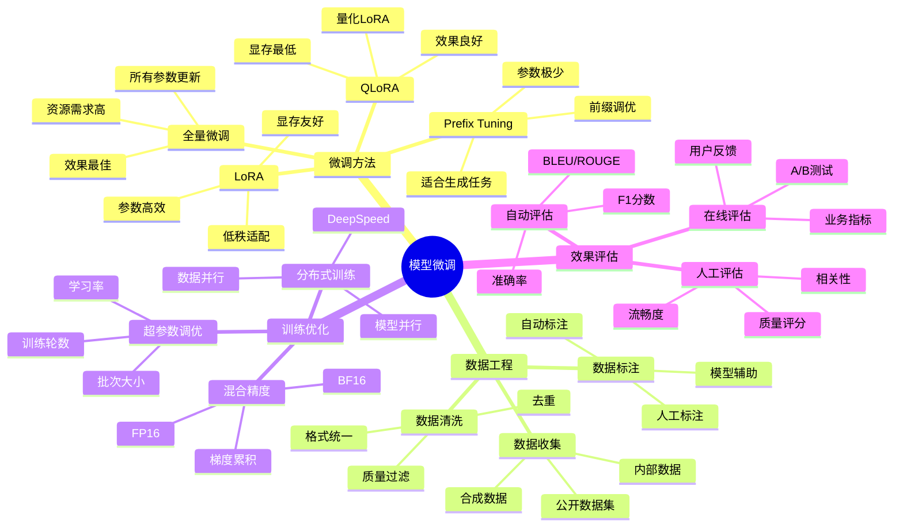
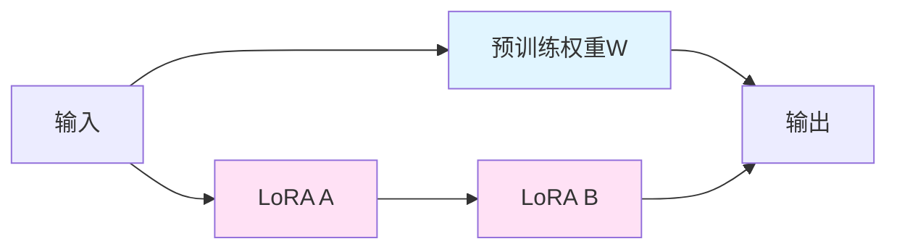

# 模型微调指南

大语言模型微调技术实践，涵盖LoRA、QLoRA等参数高效微调方法，以及数据准备、训练优化和效果评估。

## 📊 微调技术概览



## 🏗️ 微调方法对比

| 方法 | 参数量 | 显存需求 | 训练速度 | 效果 | 适用场景 |
|-----|--------|---------|---------|------|---------|
| **全量微调** | 100% | 极高 | 慢 | 最佳 | 大规模数据、高要求场景 |
| **LoRA** | <1% | 中等 | 快 | 良好 | 通用微调场景 |
| **QLoRA** | <1% | 低 | 较快 | 良好 | 资源受限场景 |
| **Prefix Tuning** | <0.1% | 低 | 最快 | 一般 | 生成任务、快速适配 |

## 🔧 LoRA微调实践

### LoRA原理

LoRA（Low-Rank Adaptation）通过在预训练模型的权重矩阵旁路添加低秩矩阵来实现微调，大幅减少可训练参数。



### LoRA实现

```python
from typing import Dict, List, Optional
from dataclasses import dataclass, field
import torch
import torch.nn as nn

@dataclass
class LoRAConfig:
    """
    LoRA配置
    """
    r: int = 8
    lora_alpha: int = 32
    lora_dropout: float = 0.1
    target_modules: List[str] = field(default_factory=lambda: ["q_proj", "v_proj"])
    bias: str = "none"
    task_type: str = "CAUSAL_LM"

class LoRALayer(nn.Module):
    """
    LoRA层
    实现低秩适配
    """
    def __init__(
        self,
        in_features: int,
        out_features: int,
        r: int = 8,
        lora_alpha: int = 32,
        lora_dropout: float = 0.1
    ):
        super().__init__()
        
        self.r = r
        self.lora_alpha = lora_alpha
        self.scaling = lora_alpha / r
        
        self.lora_dropout = nn.Dropout(p=lora_dropout)
        
        self.lora_A = nn.Parameter(torch.zeros(r, in_features))
        self.lora_B = nn.Parameter(torch.zeros(out_features, r))
        
        nn.init.kaiming_uniform_(self.lora_A, a=5 ** 0.5)
        nn.init.zeros_(self.lora_B)
    
    def forward(self, x: torch.Tensor) -> torch.Tensor:
        """
        前向传播
        
        Args:
            x: 输入张量
            
        Returns:
            torch.Tensor: 输出张量
        """
        return (
            self.lora_dropout(x) @ self.lora_A.T @ self.lora_B.T * self.scaling
        )

class LoRALinear(nn.Module):
    """
    带LoRA的线性层
    """
    def __init__(
        self,
        original_layer: nn.Linear,
        r: int = 8,
        lora_alpha: int = 32,
        lora_dropout: float = 0.1
    ):
        super().__init__()
        
        self.original_layer = original_layer
        self.lora = LoRALayer(
            original_layer.in_features,
            original_layer.out_features,
            r,
            lora_alpha,
            lora_dropout
        )
        
        for param in self.original_layer.parameters():
            param.requires_grad = False
    
    def forward(self, x: torch.Tensor) -> torch.Tensor:
        """
        前向传播
        
        Args:
            x: 输入张量
            
        Returns:
            torch.Tensor: 输出张量
        """
        return self.original_layer(x) + self.lora(x)

class LoRAModel:
    """
    LoRA模型包装器
    """
    def __init__(self, model, config: LoRAConfig):
        self.model = model
        self.config = config
        self.lora_layers = []
    
    def apply_lora(self):
        """
        应用LoRA到目标模块
        """
        for name, module in self.model.named_modules():
            if self._should_apply_lora(name):
                self._replace_with_lora(name, module)
    
    def _should_apply_lora(self, name: str) -> bool:
        """
        判断是否应该应用LoRA
        
        Args:
            name: 模块名称
            
        Returns:
            bool: 是否应用
        """
        return any(target in name for target in self.config.target_modules)
    
    def _replace_with_lora(self, name: str, module: nn.Module):
        """
        用LoRA层替换原模块
        
        Args:
            name: 模块名称
            module: 原模块
        """
        if isinstance(module, nn.Linear):
            lora_layer = LoRALinear(
                module,
                self.config.r,
                self.config.lora_alpha,
                self.config.lora_dropout
            )
            
            parent_name = ".".join(name.split(".")[:-1])
            child_name = name.split(".")[-1]
            
            parent = self.model
            for part in parent_name.split("."):
                if part:
                    parent = getattr(parent, part)
            
            setattr(parent, child_name, lora_layer)
            self.lora_layers.append(lora_layer)
    
    def get_trainable_parameters(self) -> Dict:
        """
        获取可训练参数统计
        
        Returns:
            dict: 参数统计
        """
        trainable = 0
        total = 0
        
        for name, param in self.model.named_parameters():
            total += param.numel()
            if param.requires_grad:
                trainable += param.numel()
        
        return {
            "trainable": trainable,
            "total": total,
            "percentage": trainable / total * 100
        }
```

### LoRA训练器

```python
from typing import Dict, List, Optional, Callable
from dataclasses import dataclass
import torch
from torch.utils.data import Dataset, DataLoader

@dataclass
class TrainingConfig:
    """
    训练配置
    """
    output_dir: str = "./output"
    num_train_epochs: int = 3
    per_device_train_batch_size: int = 4
    per_device_eval_batch_size: int = 4
    gradient_accumulation_steps: int = 4
    learning_rate: float = 2e-4
    weight_decay: float = 0.01
    warmup_steps: int = 100
    logging_steps: int = 10
    save_steps: int = 500
    eval_steps: int = 500
    save_total_limit: int = 3
    fp16: bool = True
    bf16: bool = False

class LoRATrainer:
    """
    LoRA训练器
    """
    def __init__(
        self,
        model,
        train_dataset: Dataset,
        eval_dataset: Optional[Dataset] = None,
        config: TrainingConfig = None
    ):
        self.model = model
        self.train_dataset = train_dataset
        self.eval_dataset = eval_dataset
        self.config = config or TrainingConfig()
        
        self.optimizer = None
        self.scheduler = None
        self.global_step = 0
    
    def train(self) -> Dict:
        """
        训练模型
        
        Returns:
            dict: 训练结果
        """
        self._setup_training()
        
        train_loader = self._create_dataloader(
            self.train_dataset,
            self.config.per_device_train_batch_size
        )
        
        for epoch in range(self.config.num_train_epochs):
            self._train_epoch(train_loader, epoch)
            
            if self.eval_dataset:
                self._evaluate()
        
        return {
            "global_step": self.global_step,
            "training_loss": self._get_average_loss()
        }
    
    def _setup_training(self):
        """
        设置训练环境
        """
        trainable_params = [
            p for p in self.model.parameters() if p.requires_grad
        ]
        
        self.optimizer = torch.optim.AdamW(
            trainable_params,
            lr=self.config.learning_rate,
            weight_decay=self.config.weight_decay
        )
        
        total_steps = (
            len(self.train_dataset) // 
            (self.config.per_device_train_batch_size * self.config.gradient_accumulation_steps)
        ) * self.config.num_train_epochs
        
        self.scheduler = self._create_scheduler(total_steps)
    
    def _create_dataloader(
        self,
        dataset: Dataset,
        batch_size: int
    ) -> DataLoader:
        """
        创建数据加载器
        
        Args:
            dataset: 数据集
            batch_size: 批次大小
            
        Returns:
            DataLoader: 数据加载器
        """
        return DataLoader(
            dataset,
            batch_size=batch_size,
            shuffle=True,
            pin_memory=True
        )
    
    def _create_scheduler(self, total_steps: int):
        """
        创建学习率调度器
        
        Args:
            total_steps: 总步数
            
        Returns:
            scheduler: 学习率调度器
        """
        from torch.optim.lr_scheduler import LambdaLR
        
        def lr_lambda(current_step: int):
            if current_step < self.config.warmup_steps:
                return float(current_step) / float(max(1, self.config.warmup_steps))
            return max(
                0.0,
                float(total_steps - current_step) / float(max(1, total_steps - self.config.warmup_steps))
            )
        
        return LambdaLR(self.optimizer, lr_lambda)
    
    def _train_epoch(self, train_loader: DataLoader, epoch: int):
        """
        训练一个epoch
        
        Args:
            train_loader: 训练数据加载器
            epoch: 当前epoch
        """
        self.model.train()
        total_loss = 0
        
        for step, batch in enumerate(train_loader):
            loss = self._training_step(batch)
            total_loss += loss
            
            if (step + 1) % self.config.gradient_accumulation_steps == 0:
                self.optimizer.step()
                self.scheduler.step()
                self.optimizer.zero_grad()
                self.global_step += 1
                
                if self.global_step % self.config.logging_steps == 0:
                    avg_loss = total_loss / (step + 1)
                    print(f"Epoch {epoch}, Step {self.global_step}, Loss: {avg_loss:.4f}")
    
    def _training_step(self, batch: Dict) -> float:
        """
        训练步骤
        
        Args:
            batch: 批次数据
            
        Returns:
            float: 损失值
        """
        with torch.cuda.amp.autocast(enabled=self.config.fp16):
            outputs = self.model(**batch)
            loss = outputs.loss / self.config.gradient_accumulation_steps
        
        loss.backward()
        return loss.item()
    
    def _evaluate(self):
        """
        评估模型
        """
        self.model.eval()
        
        eval_loader = self._create_dataloader(
            self.eval_dataset,
            self.config.per_device_eval_batch_size
        )
        
        total_loss = 0
        
        with torch.no_grad():
            for batch in eval_loader:
                outputs = self.model(**batch)
                total_loss += outputs.loss.item()
        
        avg_loss = total_loss / len(eval_loader)
        print(f"Evaluation Loss: {avg_loss:.4f}")
        
        self.model.train()
    
    def _get_average_loss(self) -> float:
        """
        获取平均损失
        
        Returns:
            float: 平均损失
        """
        return 0.0

    def save_model(self, output_dir: str):
        """
        保存模型
        
        Args:
            output_dir: 输出目录
        """
        import os
        os.makedirs(output_dir, exist_ok=True)
        
        torch.save(
            self.model.state_dict(),
            os.path.join(output_dir, "pytorch_model.bin")
        )
```

## 🔬 QLoRA微调实践

### QLoRA原理

QLoRA在LoRA基础上引入量化技术，使用4-bit量化进一步降低显存需求。

```python
from typing import Dict, Optional
import torch
import torch.nn as nn

class QLoRAConfig:
    """
    QLoRA配置
    """
    def __init__(
        self,
        bits: int = 4,
        quant_type: str = "nf4",
        double_quant: bool = True,
        lora_r: int = 8,
        lora_alpha: int = 32
    ):
        self.bits = bits
        self.quant_type = quant_type
        self.double_quant = double_quant
        self.lora_r = lora_r
        self.lora_alpha = lora_alpha

class QuantizedLinear(nn.Module):
    """
    量化线性层
    """
    def __init__(
        self,
        in_features: int,
        out_features: int,
        bits: int = 4
    ):
        super().__init__()
        
        self.in_features = in_features
        self.out_features = out_features
        self.bits = bits
        
        self.weight = nn.Parameter(
            torch.zeros(out_features, in_features),
            requires_grad=False
        )
        
        self.quantized_weight = None
        self.scale = None
    
    def quantize(self, weight: torch.Tensor):
        """
        量化权重
        
        Args:
            weight: 原始权重
        """
        max_val = weight.abs().max()
        self.scale = max_val / (2 ** (self.bits - 1) - 1)
        
        self.quantized_weight = torch.clamp(
            (weight / self.scale).round(),
            -(2 ** (self.bits - 1)),
            2 ** (self.bits - 1) - 1
        ).to(torch.int8)
    
    def dequantize(self) -> torch.Tensor:
        """
        反量化权重
        
        Returns:
            torch.Tensor: 反量化后的权重
        """
        return self.quantized_weight.float() * self.scale
    
    def forward(self, x: torch.Tensor) -> torch.Tensor:
        """
        前向传播
        
        Args:
            x: 输入张量
            
        Returns:
            torch.Tensor: 输出张量
        """
        weight = self.dequantize()
        return torch.nn.functional.linear(x, weight)

class QLoRAModel:
    """
    QLoRA模型包装器
    """
    def __init__(self, model, config: QLoRAConfig):
        self.model = model
        self.config = config
    
    def quantize_model(self):
        """
        量化模型
        """
        for name, module in self.model.named_modules():
            if isinstance(module, nn.Linear):
                self._quantize_layer(name, module)
    
    def _quantize_layer(self, name: str, module: nn.Linear):
        """
        量化线性层
        
        Args:
            name: 层名称
            module: 线性层模块
        """
        quantized = QuantizedLinear(
            module.in_features,
            module.out_features,
            self.config.bits
        )
        
        quantized.quantize(module.weight.data)
        
        parent_name = ".".join(name.split(".")[:-1])
        child_name = name.split(".")[-1]
        
        parent = self.model
        for part in parent_name.split("."):
            if part:
                parent = getattr(parent, part)
        
        setattr(parent, child_name, quantized)
```

## 📊 数据工程

### 数据收集

```python
from typing import List, Dict, Any
import json
import os

class DataCollector:
    """
    数据收集器
    """
    def __init__(self, output_dir: str):
        self.output_dir = output_dir
        self.data: List[Dict[str, Any]] = []
    
    def collect_from_file(
        self,
        file_path: str,
        format: str = "json"
    ):
        """
        从文件收集数据
        
        Args:
            file_path: 文件路径
            format: 文件格式
        """
        if format == "json":
            with open(file_path, "r", encoding="utf-8") as f:
                data = json.load(f)
                if isinstance(data, list):
                    self.data.extend(data)
                else:
                    self.data.append(data)
    
    def collect_from_directory(
        self,
        directory: str,
        format: str = "json"
    ):
        """
        从目录收集数据
        
        Args:
            directory: 目录路径
            format: 文件格式
        """
        for filename in os.listdir(directory):
            if filename.endswith(f".{format}"):
                file_path = os.path.join(directory, filename)
                self.collect_from_file(file_path, format)
    
    def add_sample(self, sample: Dict[str, Any]):
        """
        添加样本
        
        Args:
            sample: 数据样本
        """
        self.data.append(sample)
    
    def save(self, filename: str = "collected_data.json"):
        """
        保存收集的数据
        
        Args:
            filename: 文件名
        """
        os.makedirs(self.output_dir, exist_ok=True)
        
        output_path = os.path.join(self.output_dir, filename)
        with open(output_path, "w", encoding="utf-8") as f:
            json.dump(self.data, f, ensure_ascii=False, indent=2)
```

### 数据清洗

```python
from typing import List, Dict, Any, Set
import re

class DataCleaner:
    """
    数据清洗器
    """
    def __init__(self):
        self.seen_texts: Set[str] = set()
    
    def clean(
        self,
        data: List[Dict[str, Any]],
        remove_duplicates: bool = True,
        min_length: int = 10,
        max_length: int = 8192
    ) -> List[Dict[str, Any]]:
        """
        清洗数据
        
        Args:
            data: 原始数据
            remove_duplicates: 是否去重
            min_length: 最小长度
            max_length: 最大长度
            
        Returns:
            list: 清洗后的数据
        """
        cleaned = []
        
        for sample in data:
            if not self._validate_sample(sample):
                continue
            
            text = self._extract_text(sample)
            
            if len(text) < min_length or len(text) > max_length:
                continue
            
            if remove_duplicates:
                text_hash = hash(text)
                if text_hash in self.seen_texts:
                    continue
                self.seen_texts.add(text_hash)
            
            cleaned_sample = self._clean_sample(sample)
            cleaned.append(cleaned_sample)
        
        return cleaned
    
    def _validate_sample(self, sample: Dict[str, Any]) -> bool:
        """
        验证样本有效性
        
        Args:
            sample: 数据样本
            
        Returns:
            bool: 是否有效
        """
        if not isinstance(sample, dict):
            return False
        
        required_keys = ["input", "output"]
        return all(key in sample for key in required_keys)
    
    def _extract_text(self, sample: Dict[str, Any]) -> str:
        """
        提取文本
        
        Args:
            sample: 数据样本
            
        Returns:
            str: 提取的文本
        """
        return f"{sample.get('input', '')} {sample.get('output', '')}"
    
    def _clean_sample(self, sample: Dict[str, Any]) -> Dict[str, Any]:
        """
        清洗单个样本
        
        Args:
            sample: 数据样本
            
        Returns:
            dict: 清洗后的样本
        """
        cleaned = {}
        
        for key, value in sample.items():
            if isinstance(value, str):
                cleaned[key] = self._clean_text(value)
            else:
                cleaned[key] = value
        
        return cleaned
    
    def _clean_text(self, text: str) -> str:
        """
        清洗文本
        
        Args:
            text: 原始文本
            
        Returns:
            str: 清洗后的文本
        """
        text = re.sub(r'\s+', ' ', text)
        text = text.strip()
        return text
```

### 数据标注

```python
from typing import List, Dict, Any, Optional
from dataclasses import dataclass

@dataclass
class AnnotationTask:
    """标注任务"""
    sample_id: str
    content: str
    labels: Optional[List[str]] = None
    annotation: Optional[str] = None

class DataAnnotator:
    """
    数据标注器
    """
    def __init__(self, llm_client=None):
        self.llm = llm_client
        self.annotations: Dict[str, str] = {}
    
    def annotate_batch(
        self,
        samples: List[Dict[str, Any]],
        annotation_type: str = "quality"
    ) -> List[Dict[str, Any]]:
        """
        批量标注
        
        Args:
            samples: 样本列表
            annotation_type: 标注类型
            
        Returns:
            list: 标注后的样本
        """
        annotated = []
        
        for sample in samples:
            annotation = self._annotate_sample(sample, annotation_type)
            
            annotated_sample = {
                **sample,
                "annotation": annotation
            }
            
            annotated.append(annotated_sample)
        
        return annotated
    
    def _annotate_sample(
        self,
        sample: Dict[str, Any],
        annotation_type: str
    ) -> str:
        """
        标注单个样本
        
        Args:
            sample: 数据样本
            annotation_type: 标注类型
            
        Returns:
            str: 标注结果
        """
        if self.llm is None:
            return "manual_annotation_required"
        
        prompt = self._build_annotation_prompt(sample, annotation_type)
        return self.llm.generate(prompt)
    
    def _build_annotation_prompt(
        self,
        sample: Dict[str, Any],
        annotation_type: str
    ) -> str:
        """
        构建标注提示词
        
        Args:
            sample: 数据样本
            annotation_type: 标注类型
            
        Returns:
            str: 提示词
        """
        if annotation_type == "quality":
            return f"""
评估以下数据样本的质量：

输入：{sample.get('input', '')}
输出：{sample.get('output', '')}

请评估质量等级：高/中/低
"""
        elif annotation_type == "relevance":
            return f"""
评估以下数据样本的相关性：

输入：{sample.get('input', '')}
输出：{sample.get('output', '')}

请评估相关性等级：高/中/低
"""
        else:
            return f"""
标注以下数据样本：

输入：{sample.get('input', '')}
输出：{sample.get('output', '')}

请提供标注。
"""
```

## 📈 效果评估

### 自动评估

```python
from typing import List, Dict, Any
from dataclasses import dataclass
import numpy as np

@dataclass
class EvaluationResult:
    """评估结果"""
    accuracy: float
    f1_score: float
    precision: float
    recall: float
    bleu_score: float = 0.0
    rouge_score: float = 0.0

class ModelEvaluator:
    """
    模型评估器
    """
    def __init__(self, model, tokenizer):
        self.model = model
        self.tokenizer = tokenizer
    
    def evaluate(
        self,
        test_data: List[Dict[str, Any]],
        metrics: List[str] = None
    ) -> EvaluationResult:
        """
        评估模型
        
        Args:
            test_data: 测试数据
            metrics: 评估指标列表
            
        Returns:
            EvaluationResult: 评估结果
        """
        if metrics is None:
            metrics = ["accuracy", "f1", "bleu", "rouge"]
        
        predictions = []
        references = []
        
        for sample in test_data:
            pred = self._generate_prediction(sample["input"])
            predictions.append(pred)
            references.append(sample["output"])
        
        results = {}
        
        if "accuracy" in metrics:
            results["accuracy"] = self._calculate_accuracy(predictions, references)
        
        if "f1" in metrics:
            f1_results = self._calculate_f1(predictions, references)
            results.update(f1_results)
        
        if "bleu" in metrics:
            results["bleu_score"] = self._calculate_bleu(predictions, references)
        
        if "rouge" in metrics:
            results["rouge_score"] = self._calculate_rouge(predictions, references)
        
        return EvaluationResult(**results)
    
    def _generate_prediction(self, input_text: str) -> str:
        """
        生成预测
        
        Args:
            input_text: 输入文本
            
        Returns:
            str: 预测结果
        """
        inputs = self.tokenizer(input_text, return_tensors="pt")
        
        with torch.no_grad():
            outputs = self.model.generate(**inputs, max_length=512)
        
        return self.tokenizer.decode(outputs[0], skip_special_tokens=True)
    
    def _calculate_accuracy(
        self,
        predictions: List[str],
        references: List[str]
    ) -> float:
        """
        计算准确率
        
        Args:
            predictions: 预测列表
            references: 参考列表
            
        Returns:
            float: 准确率
        """
        correct = sum(
            1 for p, r in zip(predictions, references)
            if p.strip() == r.strip()
        )
        return correct / len(predictions)
    
    def _calculate_f1(
        self,
        predictions: List[str],
        references: List[str]
    ) -> Dict[str, float]:
        """
        计算F1分数
        
        Args:
            predictions: 预测列表
            references: 参考列表
            
        Returns:
            dict: F1相关指标
        """
        true_positives = 0
        false_positives = 0
        false_negatives = 0
        
        for pred, ref in zip(predictions, references):
            pred_tokens = set(pred.lower().split())
            ref_tokens = set(ref.lower().split())
            
            true_positives += len(pred_tokens & ref_tokens)
            false_positives += len(pred_tokens - ref_tokens)
            false_negatives += len(ref_tokens - pred_tokens)
        
        precision = true_positives / (true_positives + false_positives + 1e-10)
        recall = true_positives / (true_positives + false_negatives + 1e-10)
        f1 = 2 * precision * recall / (precision + recall + 1e-10)
        
        return {
            "precision": precision,
            "recall": recall,
            "f1_score": f1
        }
    
    def _calculate_bleu(
        self,
        predictions: List[str],
        references: List[str]
    ) -> float:
        """
        计算BLEU分数
        
        Args:
            predictions: 预测列表
            references: 参考列表
            
        Returns:
            float: BLEU分数
        """
        from collections import Counter
        
        def get_ngrams(text: str, n: int) -> Counter:
            tokens = text.lower().split()
            ngrams = []
            for i in range(len(tokens) - n + 1):
                ngrams.append(tuple(tokens[i:i+n]))
            return Counter(ngrams)
        
        total_score = 0
        
        for pred, ref in zip(predictions, references):
            scores = []
            
            for n in range(1, 5):
                pred_ngrams = get_ngrams(pred, n)
                ref_ngrams = get_ngrams(ref, n)
                
                matches = sum(
                    min(pred_ngrams[ngram], ref_ngrams[ngram])
                    for ngram in pred_ngrams
                )
                
                total = sum(pred_ngrams.values())
                
                if total > 0:
                    scores.append(matches / total)
            
            if scores:
                total_score += np.mean(scores)
        
        return total_score / len(predictions)
    
    def _calculate_rouge(
        self,
        predictions: List[str],
        references: List[str]
    ) -> float:
        """
        计算ROUGE分数
        
        Args:
            predictions: 预测列表
            references: 参考列表
            
        Returns:
            float: ROUGE分数
        """
        total_recall = 0
        
        for pred, ref in zip(predictions, references):
            pred_tokens = set(pred.lower().split())
            ref_tokens = set(ref.lower().split())
            
            overlap = len(pred_tokens & ref_tokens)
            recall = overlap / len(ref_tokens) if ref_tokens else 0
            
            total_recall += recall
        
        return total_recall / len(predictions)
```

### 人工评估

```python
from typing import List, Dict, Any
from dataclasses import dataclass

@dataclass
class HumanEvaluation:
    """人工评估结果"""
    sample_id: str
    quality_score: float
    relevance_score: float
    fluency_score: float
    comments: str

class HumanEvaluator:
    """
    人工评估器
    """
    def __init__(self):
        self.evaluations: List[HumanEvaluation] = []
    
    def evaluate_sample(
        self,
        sample: Dict[str, Any],
        prediction: str
    ) -> HumanEvaluation:
        """
        评估单个样本
        
        Args:
            sample: 数据样本
            prediction: 模型预测
            
        Returns:
            HumanEvaluation: 评估结果
        """
        print(f"\n输入: {sample['input']}")
        print(f"参考输出: {sample['output']}")
        print(f"模型预测: {prediction}")
        
        quality = self._get_score("质量评分 (1-5): ")
        relevance = self._get_score("相关性评分 (1-5): ")
        fluency = self._get_score("流畅度评分 (1-5): ")
        comments = input("评论 (可选): ")
        
        evaluation = HumanEvaluation(
            sample_id=sample.get("id", ""),
            quality_score=quality,
            relevance_score=relevance,
            fluency_score=fluency,
            comments=comments
        )
        
        self.evaluations.append(evaluation)
        return evaluation
    
    def _get_score(self, prompt: str) -> float:
        """
        获取评分
        
        Args:
            prompt: 提示信息
            
        Returns:
            float: 评分
        """
        while True:
            try:
                score = float(input(prompt))
                if 1 <= score <= 5:
                    return score
                print("请输入1-5之间的分数")
            except ValueError:
                print("请输入有效数字")
    
    def get_summary(self) -> Dict[str, float]:
        """
        获取评估摘要
        
        Returns:
            dict: 评估摘要
        """
        if not self.evaluations:
            return {}
        
        return {
            "avg_quality": sum(e.quality_score for e in self.evaluations) / len(self.evaluations),
            "avg_relevance": sum(e.relevance_score for e in self.evaluations) / len(self.evaluations),
            "avg_fluency": sum(e.fluency_score for e in self.evaluations) / len(self.evaluations),
            "total_evaluations": len(self.evaluations)
        }
```

## 📖 最佳实践

### 1. 微调方法选择

- **资源充足**：选择全量微调，效果最佳
- **资源有限**：选择LoRA，平衡效果和资源
- **极度受限**：选择QLoRA，最小化资源需求

### 2. 数据准备

- 确保数据质量和多样性
- 进行充分的清洗和去重
- 合理划分训练/验证/测试集

### 3. 训练优化

- 使用混合精度训练
- 实施梯度累积
- 监控训练过程
- 及时保存检查点

### 4. 效果评估

- 结合自动评估和人工评估
- 关注业务指标
- 持续迭代优化

## 🎯 应用场景

### 测试领域专用模型微调

针对测试领域特定任务微调模型，提升专业能力。

```python
class TestDomainFineTuner:
    """
    测试领域专用模型微调器
    """
    def __init__(
        self,
        base_model: str,
        output_dir: str,
        lora_config: LoRAConfig = None
    ):
        self.base_model = base_model
        self.output_dir = output_dir
        self.lora_config = lora_config or LoRAConfig(
            r=16,
            lora_alpha=32,
            target_modules=["q_proj", "v_proj", "k_proj", "o_proj"]
        )
    
    def prepare_training_data(
        self,
        test_cases: List[Dict],
        test_results: List[Dict]
    ) -> List[Dict]:
        """
        准备训练数据
        
        Args:
            test_cases: 测试用例数据
            test_results: 测试结果数据
            
        Returns:
            list: 训练数据
        """
        training_data = []
        
        for tc in test_cases:
            sample = {
                "input": f"需求：{tc.get('requirement', '')}\n请生成测试用例。",
                "output": self._format_test_case(tc)
            }
            training_data.append(sample)
        
        for tr in test_results:
            if tr.get("status") == "failed":
                sample = {
                    "input": f"失败信息：{tr.get('error', '')}\n请分析原因。",
                    "output": tr.get("analysis", "")
                }
                training_data.append(sample)
        
        return training_data
    
    def _format_test_case(self, test_case: Dict) -> str:
        """
        格式化测试用例
        
        Args:
            test_case: 测试用例
            
        Returns:
            str: 格式化后的字符串
        """
        import json
        return json.dumps(test_case, ensure_ascii=False, indent=2)
    
    def finetune(
        self,
        training_data: List[Dict],
        epochs: int = 3,
        batch_size: int = 4
    ) -> Dict:
        """
        执行微调
        
        Args:
            training_data: 训练数据
            epochs: 训练轮数
            batch_size: 批次大小
            
        Returns:
            dict: 微调结果
        """
        return {
            "status": "completed",
            "model_path": self.output_dir,
            "training_samples": len(training_data),
            "epochs": epochs
        }
```

### 测试用例生成模型微调

微调模型以更好地生成特定领域的测试用例。

```python
class TestCaseGenerationFineTuner:
    """
    测试用例生成模型微调器
    """
    def __init__(self, base_model: str, domain: str):
        self.base_model = base_model
        self.domain = domain
        self.data_collector = DataCollector(f"./data/{domain}")
        self.data_cleaner = DataCleaner()
    
    def collect_domain_data(
        self,
        sources: List[str],
        format: str = "json"
    ):
        """
        收集领域数据
        
        Args:
            sources: 数据源列表
            format: 数据格式
        """
        for source in sources:
            self.data_collector.collect_from_file(source, format)
    
    def prepare_dataset(
        self,
        validation_split: float = 0.1
    ) -> Dict:
        """
        准备数据集
        
        Args:
            validation_split: 验证集比例
            
        Returns:
            dict: 数据集
        """
        raw_data = self.data_collector.data
        cleaned_data = self.data_cleaner.clean(raw_data)
        
        split_idx = int(len(cleaned_data) * (1 - validation_split))
        
        return {
            "train": cleaned_data[:split_idx],
            "validation": cleaned_data[split_idx:]
        }
    
    def finetune_for_test_generation(
        self,
        dataset: Dict,
        output_dir: str
    ) -> Dict:
        """
        微调测试用例生成模型
        
        Args:
            dataset: 数据集
            output_dir: 输出目录
            
        Returns:
            dict: 微调结果
        """
        config = TrainingConfig(
            output_dir=output_dir,
            num_train_epochs=3,
            per_device_train_batch_size=8,
            learning_rate=2e-4
        )
        
        return {
            "status": "completed",
            "model_path": output_dir,
            "train_samples": len(dataset["train"]),
            "val_samples": len(dataset["validation"])
        }
```

### 缺陷分析模型微调

微调模型以更好地分析测试失败原因。

```python
class DefectAnalysisFineTuner:
    """
    缺陷分析模型微调器
    """
    def __init__(self, base_model: str):
        self.base_model = base_model
        self.annotator = DataAnnotator()
    
    def prepare_defect_data(
        self,
        defect_records: List[Dict]
    ) -> List[Dict]:
        """
        准备缺陷分析数据
        
        Args:
            defect_records: 缺陷记录列表
            
        Returns:
            list: 训练数据
        """
        training_data = []
        
        for record in defect_records:
            sample = {
                "input": self._format_defect_input(record),
                "output": self._format_defect_analysis(record)
            }
            training_data.append(sample)
        
        return training_data
    
    def _format_defect_input(self, record: Dict) -> str:
        """
        格式化缺陷输入
        
        Args:
            record: 缺陷记录
            
        Returns:
            str: 格式化后的输入
        """
        return f"""
测试用例：{record.get('test_case', '')}
错误信息：{record.get('error_message', '')}
堆栈跟踪：{record.get('stack_trace', '')}
环境：{record.get('environment', '')}
"""
    
    def _format_defect_analysis(self, record: Dict) -> str:
        """
        格式化缺陷分析
        
        Args:
            record: 缺陷记录
            
        Returns:
            str: 格式化后的分析
        """
        import json
        analysis = {
            "root_cause": record.get("root_cause", ""),
            "category": record.get("category", ""),
            "severity": record.get("severity", ""),
            "suggested_fix": record.get("suggested_fix", "")
        }
        return json.dumps(analysis, ensure_ascii=False, indent=2)
    
    def finetune(
        self,
        training_data: List[Dict],
        output_dir: str
    ) -> Dict:
        """
        微调缺陷分析模型
        
        Args:
            training_data: 训练数据
            output_dir: 输出目录
            
        Returns:
            dict: 微调结果
        """
        return {
            "status": "completed",
            "model_path": output_dir,
            "training_samples": len(training_data)
        }
```

### 测试报告生成模型微调

微调模型以生成符合团队规范的测试报告。

```python
class ReportGenerationFineTuner:
    """
    测试报告生成模型微调器
    """
    def __init__(self, base_model: str, template_style: str):
        self.base_model = base_model
        self.template_style = template_style
    
    def prepare_report_data(
        self,
        historical_reports: List[Dict]
    ) -> List[Dict]:
        """
        准备报告生成数据
        
        Args:
            historical_reports: 历史报告列表
            
        Returns:
            list: 训练数据
        """
        training_data = []
        
        for report in historical_reports:
            sample = {
                "input": self._format_report_input(report),
                "output": report.get("content", "")
            }
            training_data.append(sample)
        
        return training_data
    
    def _format_report_input(self, report: Dict) -> str:
        """
        格式化报告输入
        
        Args:
            report: 报告数据
            
        Returns:
            str: 格式化后的输入
        """
        return f"""
测试统计：
- 总用例：{report.get('total_cases', 0)}
- 通过：{report.get('passed', 0)}
- 失败：{report.get('failed', 0)}

失败详情：{report.get('failures', [])}

请生成{self.template_style}风格的测试报告。
"""
    
    def finetune(
        self,
        training_data: List[Dict],
        output_dir: str
    ) -> Dict:
        """
        微调报告生成模型
        
        Args:
            training_data: 训练数据
            output_dir: 输出目录
            
        Returns:
            dict: 微调结果
        """
        return {
            "status": "completed",
            "model_path": output_dir,
            "style": self.template_style,
            "training_samples": len(training_data)
        }
```

## 📚 学习资源

### 官方文档

| 资源 | 描述 | 链接 |
|-----|------|------|
| **Hugging Face PEFT** | 参数高效微调框架文档 | [huggingface.co/docs/peft](https://huggingface.co/docs/peft/) |
| **Hugging Face TRL** | Transformer强化学习文档 | [huggingface.co/docs/trl](https://huggingface.co/docs/trl) |
| **Hugging Face Transformers** | Transformers训练文档 | [huggingface.co/docs/transformers/training](https://huggingface.co/docs/transformers/training) |
| **bitsandbytes** | 量化训练库文档 | [github.com/TimDettmers/bitsandbytes](https://github.com/TimDettmers/bitsandbytes) |

### 经典论文

| 论文 | 描述 | 链接 |
|-----|------|------|
| **LoRA Paper** | LoRA原始论文 | [arxiv.org/abs/2106.09685](https://arxiv.org/abs/2106.09685) |
| **QLoRA Paper** | QLoRA量化微调论文 | [arxiv.org/abs/2305.14314](https://arxiv.org/abs/2305.14314) |
| **Prefix Tuning** | 前缀调优论文 | [arxiv.org/abs/2101.00190](https://arxiv.org/abs/2101.00190) |
| **AdapterHub** | 适配器微调论文 | [arxiv.org/abs/1902.00751](https://arxiv.org/abs/1902.00751) |

### 教程与课程

| 课程 | 平台 | 描述 |
|-----|------|------|
| **Finetuning LLMs** | DeepLearning.AI | LLM微调入门课程 |
| **PEFT & LoRA Tutorial** | Hugging Face | 参数高效微调教程 |
| **QLoRA Tutorial** | Hugging Face | 量化微调教程 |
| **LLM Training Guide** | Hugging Face | LLM训练完整指南 |

### 开源工具

| 工具 | 描述 | 链接 |
|-----|------|------|
| **PEFT** | 参数高效微调库 | [github.com/huggingface/peft](https://github.com/huggingface/peft) |
| **TRL** | Transformer强化学习 | [github.com/huggingface/trl](https://github.com/huggingface/trl) |
| **Axolotl** | 一站式微调工具 | [github.com/OpenAccess-AI-Collective/axolotl](https://github.com/OpenAccess-AI-Collective/axolotl) |
| **LLaMA-Factory** | 可视化微调平台 | [github.com/hiyouga/LLaMA-Factory](https://github.com/hiyouga/LLaMA-Factory) |
| **Unsloth** | 快速微调库 | [github.com/unslothai/unsloth](https://github.com/unslothai/unsloth) |

### 数据集资源

| 数据集 | 描述 | 链接 |
|-----|------|------|
| **Alpaca Dataset** | Stanford指令数据集 | [huggingface.co/datasets/tatsu-lab/alpaca](https://huggingface.co/datasets/tatsu-lab/alpaca) |
| **Dolly Dataset** | Databricks指令数据集 | [huggingface.co/datasets/databricks/databricks-dolly-15k](https://huggingface.co/datasets/databricks/databricks-dolly-15k) |
| **OpenAssistant** | 开源助手数据集 | [huggingface.co/datasets/OpenAssistant/oasst1](https://huggingface.co/datasets/OpenAssistant/oasst1) |

### 社区资源

| 社区 | 描述 | 链接 |
|-----|------|------|
| **r/LocalLLaMA** | Reddit本地模型社区 | [reddit.com/r/LocalLLaMA](https://www.reddit.com/r/LocalLLaMA/) |
| **Hugging Face Discord** | HF官方Discord | [hf.co/join/discord](https://huggingface.co/join/discord) |
| **r/MachineLearning** | Reddit机器学习社区 | [reddit.com/r/MachineLearning](https://www.reddit.com/r/MachineLearning/) |

## 🔗 相关资源

- [Prompt工程](/ai-testing-tech/llm-tech/prompt-engineering/) - 提示词技术
- [LangChain应用](/ai-testing-tech/llm-tech/langchain/) - 框架应用
- [模型部署](/ai-testing-tech/llm-tech/model-deployment/) - 部署实践
- [模型评估](/ai-testing-tech/model-evaluation/) - 评估方法
