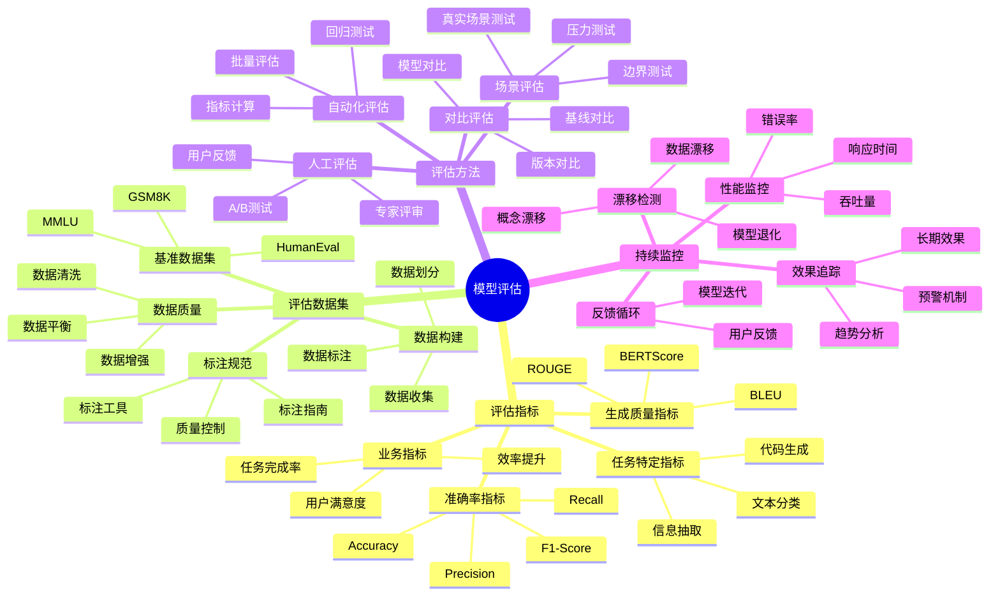
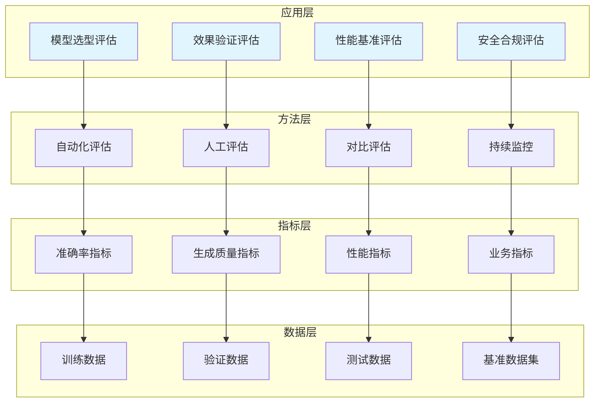

# 模型评估

AI模型评估体系，包括评估指标、评估数据集、评估方法、持续监控等。

## 📊 评估体系架构



## 🏗️ 技术分层架构



## 📚 核心技术详解

### 评估指标

评估指标是衡量模型效果的核心标准，不同任务需要选择合适的指标。

#### 指标分类

| 类别 | 指标 | 适用场景 |
|-----|------|---------|
| **准确率指标** | Accuracy、Precision、Recall、F1 | 分类任务 |
| **生成质量指标** | BLEU、ROUGE、BERTScore | 文本生成任务 |
| **语义相似度** | Cosine Similarity、Semantic Similarity | 语义匹配任务 |
| **代码质量指标** | Pass@k、CodeBLEU | 代码生成任务 |

#### 指标计算实现

```python
from typing import Dict, List, Any
from dataclasses import dataclass
from enum import Enum

class MetricType(Enum):
    """指标类型枚举"""
    ACCURACY = "accuracy"
    PRECISION = "precision"
    RECALL = "recall"
    F1 = "f1"
    BLEU = "bleu"
    ROUGE = "rouge"

@dataclass
class EvaluationMetric:
    """
    评估指标类
    定义一个评估指标的完整信息
    """
    name: str
    metric_type: MetricType
    description: str
    weight: float
    threshold: float
    is_higher_better: bool = True

class MetricsCalculator:
    """
    指标计算器
    计算各类评估指标
    """
    def __init__(self):
        self.metrics: Dict[str, EvaluationMetric] = {}
    
    def add_metric(self, metric: EvaluationMetric):
        """
        添加指标
        
        Args:
            metric: 评估指标对象
        """
        self.metrics[metric.name] = metric
    
    def calculate_all(
        self,
        predictions: List[Any],
        ground_truths: List[Any]
    ) -> Dict[str, float]:
        """
        计算所有指标
        
        Args:
            predictions: 预测结果列表
            ground_truths: 真实标签列表
            
        Returns:
            dict: 指标计算结果
        """
        results = {}
        
        for name, metric in self.metrics.items():
            if metric.metric_type == MetricType.ACCURACY:
                results[name] = self._calculate_accuracy(predictions, ground_truths)
            elif metric.metric_type == MetricType.PRECISION:
                results[name] = self._calculate_precision(predictions, ground_truths)
            elif metric.metric_type == MetricType.RECALL:
                results[name] = self._calculate_recall(predictions, ground_truths)
            elif metric.metric_type == MetricType.F1:
                results[name] = self._calculate_f1(predictions, ground_truths)
        
        return results
    
    def _calculate_accuracy(self, predictions: List, ground_truths: List) -> float:
        """
        计算准确率
        
        Args:
            predictions: 预测结果
            ground_truths: 真实标签
            
        Returns:
            float: 准确率
        """
        if not predictions:
            return 0.0
        
        correct = sum(1 for p, g in zip(predictions, ground_truths) if p == g)
        return correct / len(predictions)
    
    def _calculate_precision(self, predictions: List, ground_truths: List) -> float:
        """
        计算精确率
        
        Args:
            predictions: 预测结果
            ground_truths: 真实标签
            
        Returns:
            float: 精确率
        """
        true_positives = sum(1 for p, g in zip(predictions, ground_truths) if p == 1 and g == 1)
        predicted_positives = sum(1 for p in predictions if p == 1)
        
        return true_positives / predicted_positives if predicted_positives > 0 else 0.0
    
    def _calculate_recall(self, predictions: List, ground_truths: List) -> float:
        """
        计算召回率
        
        Args:
            predictions: 预测结果
            ground_truths: 真实标签
            
        Returns:
            float: 召回率
        """
        true_positives = sum(1 for p, g in zip(predictions, ground_truths) if p == 1 and g == 1)
        actual_positives = sum(1 for g in ground_truths if g == 1)
        
        return true_positives / actual_positives if actual_positives > 0 else 0.0
    
    def _calculate_f1(self, predictions: List, ground_truths: List) -> float:
        """
        计算F1分数
        
        Args:
            predictions: 预测结果
            ground_truths: 真实标签
            
        Returns:
            float: F1分数
        """
        precision = self._calculate_precision(predictions, ground_truths)
        recall = self._calculate_recall(predictions, ground_truths)
        
        if precision + recall == 0:
            return 0.0
        
        return 2 * (precision * recall) / (precision + recall)
```

### 评估数据集

高质量的评估数据集是确保评估有效性的基础。

```python
from typing import Dict, List, Optional
from dataclasses import dataclass, field
from datetime import datetime

@dataclass
class DataSample:
    """
    数据样本类
    表示评估数据集中的一个样本
    """
    sample_id: str
    input_text: str
    expected_output: str
    task_type: str
    difficulty: str = "medium"
    metadata: Dict = field(default_factory=dict)
    tags: List[str] = field(default_factory=list)

@dataclass
class EvaluationDataset:
    """
    评估数据集类
    管理评估数据集
    """
    dataset_id: str
    name: str
    description: str
    version: str
    samples: List[DataSample] = field(default_factory=list)
    created_at: datetime = field(default_factory=datetime.now)

class DatasetBuilder:
    """
    数据集构建器
    构建和管理评估数据集
    """
    def __init__(self):
        self.datasets: Dict[str, EvaluationDataset] = {}
    
    def create_dataset(
        self,
        name: str,
        description: str,
        version: str = "1.0.0"
    ) -> EvaluationDataset:
        """
        创建数据集
        
        Args:
            name: 数据集名称
            description: 数据集描述
            version: 版本号
            
        Returns:
            EvaluationDataset: 创建的数据集
        """
        import hashlib
        timestamp = datetime.now().strftime("%Y%m%d%H%M%S")
        dataset_id = hashlib.md5(f"{name}_{timestamp}".encode()).hexdigest()[:12]
        
        dataset = EvaluationDataset(
            dataset_id=dataset_id,
            name=name,
            description=description,
            version=version
        )
        
        self.datasets[dataset_id] = dataset
        return dataset
    
    def add_sample(
        self,
        dataset_id: str,
        input_text: str,
        expected_output: str,
        task_type: str,
        difficulty: str = "medium",
        metadata: Dict = None,
        tags: List[str] = None
    ) -> DataSample:
        """
        添加样本到数据集
        
        Args:
            dataset_id: 数据集ID
            input_text: 输入文本
            expected_output: 期望输出
            task_type: 任务类型
            difficulty: 难度级别
            metadata: 元数据
            tags: 标签列表
            
        Returns:
            DataSample: 添加的样本
        """
        if dataset_id not in self.datasets:
            raise ValueError(f"数据集 {dataset_id} 不存在")
        
        import hashlib
        sample_id = f"sample_{hashlib.md5(f'{dataset_id}_{input_text}'.encode()).hexdigest()[:8]}"
        
        sample = DataSample(
            sample_id=sample_id,
            input_text=input_text,
            expected_output=expected_output,
            task_type=task_type,
            difficulty=difficulty,
            metadata=metadata or {},
            tags=tags or []
        )
        
        self.datasets[dataset_id].samples.append(sample)
        return sample
    
    def split_dataset(
        self,
        dataset_id: str,
        train_ratio: float = 0.8,
        val_ratio: float = 0.1,
        test_ratio: float = 0.1
    ) -> Dict[str, List[DataSample]]:
        """
        划分数据集
        
        Args:
            dataset_id: 数据集ID
            train_ratio: 训练集比例
            val_ratio: 验证集比例
            test_ratio: 测试集比例
            
        Returns:
            dict: 划分后的数据集
        """
        import random
        
        if dataset_id not in self.datasets:
            raise ValueError(f"数据集 {dataset_id} 不存在")
        
        samples = self.datasets[dataset_id].samples.copy()
        random.shuffle(samples)
        
        total = len(samples)
        train_size = int(total * train_ratio)
        val_size = int(total * val_ratio)
        
        return {
            "train": samples[:train_size],
            "val": samples[train_size:train_size + val_size],
            "test": samples[train_size + val_size:]
        }
```

### 评估方法

#### 自动化评估流程

```python
from typing import Dict, List, Callable, Any
from dataclasses import dataclass
from datetime import datetime

@dataclass
class EvaluationTask:
    """
    评估任务类
    表示一个评估任务
    """
    task_id: str
    model_name: str
    dataset_id: str
    metrics: List[str]
    status: str = "pending"
    results: Dict = None
    created_at: datetime = None
    
    def __post_init__(self):
        if self.created_at is None:
            self.created_at = datetime.now()

class EvaluationPipeline:
    """
    评估流水线
    自动化评估流程管理
    """
    def __init__(self):
        self.metrics_calculator = MetricsCalculator()
        self.dataset_builder = DatasetBuilder()
        self.tasks: Dict[str, EvaluationTask] = {}
        self.model_registry: Dict[str, Callable] = {}
    
    def register_model(self, model_name: str, model_callable: Callable):
        """
        注册模型
        
        Args:
            model_name: 模型名称
            model_callable: 模型调用函数
        """
        self.model_registry[model_name] = model_callable
    
    def create_evaluation_task(
        self,
        model_name: str,
        dataset_id: str,
        metrics: List[str] = None
    ) -> EvaluationTask:
        """
        创建评估任务
        
        Args:
            model_name: 模型名称
            dataset_id: 数据集ID
            metrics: 评估指标列表
            
        Returns:
            EvaluationTask: 评估任务
        """
        task_id = f"eval_{datetime.now().strftime('%Y%m%d%H%M%S')}"
        
        task = EvaluationTask(
            task_id=task_id,
            model_name=model_name,
            dataset_id=dataset_id,
            metrics=metrics or ["accuracy", "f1"]
        )
        
        self.tasks[task_id] = task
        return task
    
    def run_evaluation(self, task_id: str) -> Dict:
        """
        运行评估任务
        
        Args:
            task_id: 任务ID
            
        Returns:
            dict: 评估结果
        """
        if task_id not in self.tasks:
            raise ValueError(f"任务 {task_id} 不存在")
        
        task = self.tasks[task_id]
        task.status = "running"
        
        try:
            model = self.model_registry.get(task.model_name)
            if not model:
                raise ValueError(f"模型 {task.model_name} 未注册")
            
            dataset = self.dataset_builder.datasets.get(task.dataset_id)
            if not dataset:
                raise ValueError(f"数据集 {task.dataset_id} 不存在")
            
            predictions = []
            ground_truths = []
            
            for sample in dataset.samples:
                prediction = model(sample.input_text)
                predictions.append(prediction)
                ground_truths.append(sample.expected_output)
            
            metrics_results = self.metrics_calculator.calculate_all(
                predictions,
                ground_truths
            )
            
            task.results = {
                "metrics": metrics_results,
                "sample_count": len(predictions),
                "completed_at": datetime.now().isoformat()
            }
            task.status = "completed"
            
            return task.results
            
        except Exception as e:
            task.status = "failed"
            task.results = {"error": str(e)}
            raise
    
    def generate_comparison_report(self, task_ids: List[str]) -> str:
        """
        生成对比报告
        
        Args:
            task_ids: 任务ID列表
            
        Returns:
            str: 对比报告
        """
        report_lines = ["# 模型评估对比报告\n"]
        report_lines.append(f"生成时间: {datetime.now().strftime('%Y-%m-%d %H:%M:%S')}\n")
        report_lines.append("\n## 评估结果对比\n")
        report_lines.append("| 模型 | 状态 | 准确率 | F1分数 |")
        report_lines.append("|------|------|--------|--------|")
        
        for task_id in task_ids:
            if task_id not in self.tasks:
                continue
            
            task = self.tasks[task_id]
            
            if task.results:
                metrics = task.results.get("metrics", {})
                
                report_lines.append(
                    f"| {task.model_name} | {task.status} | "
                    f"{metrics.get('accuracy', 0):.2%} | "
                    f"{metrics.get('f1', 0):.2%} |"
                )
            else:
                report_lines.append(f"| {task.model_name} | {task.status} | - | - |")
        
        return "\n".join(report_lines)
```

## 🎯 应用场景

### 模型选型评估

评估不同模型，选择最适合的模型。

```python
class ModelSelectionEvaluator:
    """
    模型选型评估器
    """
    def __init__(self):
        self.pipeline = EvaluationPipeline()
    
    def compare_models(
        self,
        models: Dict[str, Callable],
        test_dataset_id: str,
        metrics: List[str] = None
    ) -> Dict:
        """
        对比多个模型
        
        Args:
            models: 模型字典 {名称: 模型函数}
            test_dataset_id: 测试数据集ID
            metrics: 评估指标列表
            
        Returns:
            dict: 对比结果
        """
        for name, model in models.items():
            self.pipeline.register_model(name, model)
        
        task_ids = []
        for name in models:
            task = self.pipeline.create_evaluation_task(
                name, test_dataset_id, metrics
            )
            task_ids.append(task.task_id)
            self.pipeline.run_evaluation(task.task_id)
        
        return {
            "report": self.pipeline.generate_comparison_report(task_ids),
            "task_ids": task_ids
        }
```

### 效果验证评估

验证模型效果是否满足业务需求。

```python
class EffectValidationEvaluator:
    """
    效果验证评估器
    """
    def __init__(self, thresholds: Dict[str, float]):
        self.thresholds = thresholds
        self.calculator = MetricsCalculator()
    
    def validate(
        self,
        predictions: List,
        ground_truths: List
    ) -> Dict:
        """
        验证效果
        
        Args:
            predictions: 预测结果
            ground_truths: 真实标签
            
        Returns:
            dict: 验证结果
        """
        results = self.calculator.calculate_all(predictions, ground_truths)
        
        validation = {}
        all_passed = True
        
        for metric, threshold in self.thresholds.items():
            value = results.get(metric, 0)
            passed = value >= threshold
            validation[metric] = {
                "value": value,
                "threshold": threshold,
                "passed": passed
            }
            if not passed:
                all_passed = False
        
        return {
            "metrics": results,
            "validation": validation,
            "all_passed": all_passed
        }
```

## 📈 最佳实践

### 1. 评估指标选择

| 任务类型 | 推荐指标 | 说明 |
|---------|---------|------|
| 文本分类 | Accuracy、F1 | 平衡准确率和召回率 |
| 文本生成 | BLEU、ROUGE | 评估生成质量 |
| 语义匹配 | Semantic Similarity | 评估语义相似度 |
| 代码生成 | Pass@k、CodeBLEU | 评估代码正确性 |

### 2. 数据集构建规范

| 要素 | 要求 | 说明 |
|-----|------|------|
| 样本数量 | >=1000 | 确保统计显著性 |
| 标注质量 | >=95% | 人工审核准确率 |
| 覆盖度 | 全面 | 覆盖各类场景 |
| 平衡性 | 均衡 | 类别分布合理 |

### 3. 评估实施流程

1. **准备阶段**：构建数据集、定义指标
2. **执行阶段**：运行评估、收集数据
3. **分析阶段**：分析结果、定位问题
4. **优化阶段**：改进模型、迭代评估

## 📚 学习资源

### 官方文档

| 资源 | 描述 | 链接 |
|-----|------|------|
| **Hugging Face Evaluate** | HF评估库文档 | [huggingface.co/docs/evaluate](https://huggingface.co/docs/evaluate/) |
| **RAGAS** | RAG评估框架 | [docs.ragas.io](https://docs.ragas.io/) |
| **lm-evaluation-harness** | LLM评估框架 | [github.com/EleutherAI/lm-evaluation-harness](https://github.com/EleutherAI/lm-evaluation-harness) |

### 基准数据集

| 数据集 | 描述 | 链接 |
|-----|------|------|
| **MMLU** | 多任务语言理解 | [github.com/hendrycks/test](https://github.com/hendrycks/test) |
| **HumanEval** | 代码生成评估 | [github.com/openai/human-eval](https://github.com/openai/human-eval) |
| **GSM8K** | 数学推理评估 | [github.com/openai/grade-school-math](https://github.com/openai/grade-school-math) |

### 开源工具

| 工具 | 描述 | 链接 |
|-----|------|------|
| **Weights & Biases** | 实验追踪平台 | [wandb.ai](https://wandb.ai/) |
| **MLflow** | 模型生命周期管理 | [mlflow.org](https://mlflow.org/) |
| **Promptfoo** | 提示词评估工具 | [github.com/promptfoo/promptfoo](https://github.com/promptfoo/promptfoo) |

## 🔗 相关资源

- [评估指标体系](/ai-testing-tech/model-evaluation/evaluation-metrics/) - 评估指标详解
- [评估数据集构建](/ai-testing-tech/model-evaluation/evaluation-datasets/) - 数据集构建指南
- [评估方法实践](/ai-testing-tech/model-evaluation/evaluation-methods/) - 评估方法详解
- [持续监控方案](/ai-testing-tech/model-evaluation/continuous-monitoring/) - 持续监控实践
- [LLM评测体系](/ai-testing-tech/model-evaluation/llm-evaluation/) - 大模型评测详解
- [LLM技术](/ai-testing-tech/llm-tech/) - 大语言模型技术
