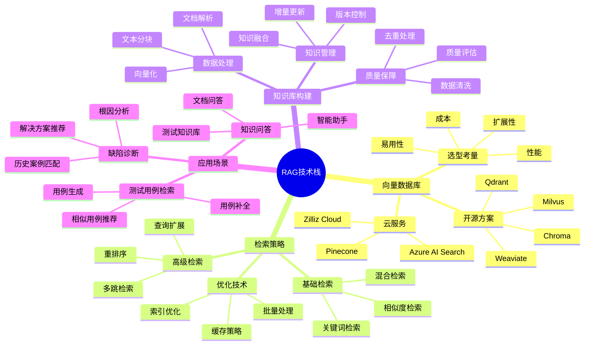
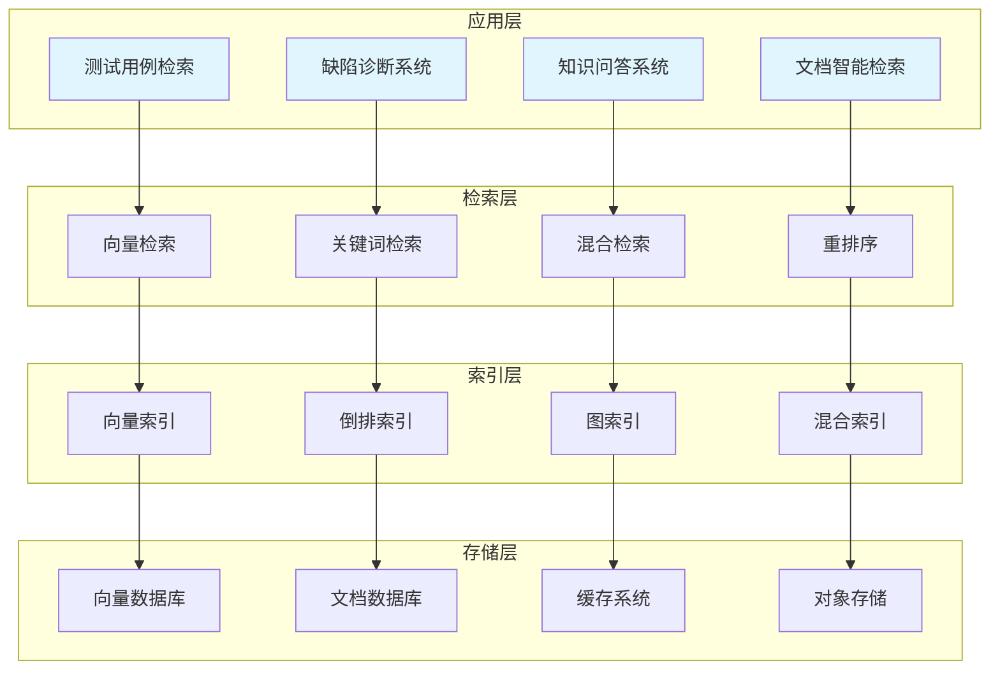

# RAG技术

检索增强生成技术在测试领域的应用，包括向量数据库、检索策略、知识库构建等。

## 📊 技术架构全景



## 🏗️ 技术分层架构



## 📚 核心技术详解

### 向量数据库

向量数据库是RAG系统的核心组件，负责存储和检索向量化的知识。

#### 数据库选型对比

| 数据库 | 类型 | 优势 | 劣势 | 适用场景 |
|-------|------|------|------|---------|
| **Milvus** | 开源 | 高性能、可扩展 | 部署复杂 | 大规模生产环境 |
| **Chroma** | 开源 | 轻量级、易用 | 功能有限 | 开发测试、小规模应用 |
| **Qdrant** | 开源 | 高效、Rust实现 | 生态较小 | 性能敏感场景 |
| **Pinecone** | 云服务 | 全托管、易用 | 成本高 | 快速部署、无运维需求 |
| **Weaviate** | 开源 | 语义搜索强 | 资源消耗大 | 语义搜索场景 |

#### 向量数据库客户端

```python
from typing import Dict, List, Optional, Any
from abc import ABC, abstractmethod
from dataclasses import dataclass

@dataclass
class Document:
    """
    文档类
    表示知识库中的一个文档
    """
    doc_id: str
    content: str
    embedding: List[float]
    metadata: Dict[str, Any]

class VectorDatabaseClient(ABC):
    """
    向量数据库客户端基类
    """
    @abstractmethod
    def create_collection(self, name: str, dimension: int):
        """
        创建集合
        
        Args:
            name: 集合名称
            dimension: 向量维度
        """
        pass
    
    @abstractmethod
    def insert(self, documents: List[Document]):
        """
        插入文档
        
        Args:
            documents: 文档列表
        """
        pass
    
    @abstractmethod
    def search(
        self,
        query_vector: List[float],
        top_k: int = 10,
        filter: Dict = None
    ) -> List[Dict]:
        """
        搜索相似文档
        
        Args:
            query_vector: 查询向量
            top_k: 返回数量
            filter: 过滤条件
            
        Returns:
            list: 搜索结果
        """
        pass
    
    @abstractmethod
    def delete(self, doc_ids: List[str]):
        """
        删除文档
        
        Args:
            doc_ids: 文档ID列表
        """
        pass

class MilvusClient(VectorDatabaseClient):
    """
    Milvus客户端
    """
    def __init__(self, host: str, port: int = 19530):
        self.host = host
        self.port = port
        self.collections = {}
    
    def create_collection(self, name: str, dimension: int):
        """
        创建集合
        
        Args:
            name: 集合名称
            dimension: 向量维度
        """
        self.collections[name] = {
            "dimension": dimension,
            "documents": []
        }
    
    def insert(self, documents: List[Document]):
        """
        插入文档
        
        Args:
            documents: 文档列表
        """
        for doc in documents:
            self.collections.setdefault("default", {"documents": []})
            self.collections["default"]["documents"].append(doc)
    
    def search(
        self,
        query_vector: List[float],
        top_k: int = 10,
        filter: Dict = None
    ) -> List[Dict]:
        """
        搜索相似文档
        
        Args:
            query_vector: 查询向量
            top_k: 返回数量
            filter: 过滤条件
            
        Returns:
            list: 搜索结果
        """
        import numpy as np
        
        results = []
        collection = self.collections.get("default", {"documents": []})
        
        for doc in collection["documents"]:
            similarity = self._cosine_similarity(query_vector, doc.embedding)
            results.append({
                "doc_id": doc.doc_id,
                "content": doc.content,
                "score": similarity,
                "metadata": doc.metadata
            })
        
        results.sort(key=lambda x: x["score"], reverse=True)
        return results[:top_k]
    
    def delete(self, doc_ids: List[str]):
        """
        删除文档
        
        Args:
            doc_ids: 文档ID列表
        """
        collection = self.collections.get("default", {"documents": []})
        collection["documents"] = [
            doc for doc in collection["documents"]
            if doc.doc_id not in doc_ids
        ]
    
    def _cosine_similarity(self, vec1: List[float], vec2: List[float]) -> float:
        """
        计算余弦相似度
        
        Args:
            vec1: 向量1
            vec2: 向量2
            
        Returns:
            float: 相似度
        """
        import numpy as np
        
        arr1 = np.array(vec1)
        arr2 = np.array(vec2)
        
        dot = np.dot(arr1, arr2)
        norm1 = np.linalg.norm(arr1)
        norm2 = np.linalg.norm(arr2)
        
        if norm1 == 0 or norm2 == 0:
            return 0.0
        
        return float(dot / (norm1 * norm2))

class ChromaClient(VectorDatabaseClient):
    """
    Chroma客户端
    """
    def __init__(self, persist_directory: str = None):
        self.persist_directory = persist_directory
        self.collections = {}
    
    def create_collection(self, name: str, dimension: int):
        """
        创建集合
        
        Args:
            name: 集合名称
            dimension: 向量维度
        """
        self.collections[name] = {
            "dimension": dimension,
            "documents": [],
            "ids": [],
            "metadatas": []
        }
    
    def insert(self, documents: List[Document]):
        """
        插入文档
        
        Args:
            documents: 文档列表
        """
        collection = self.collections.setdefault("default", {
            "documents": [],
            "ids": [],
            "metadatas": []
        })
        
        for doc in documents:
            collection["documents"].append(doc.content)
            collection["ids"].append(doc.doc_id)
            collection["metadatas"].append(doc.metadata)
    
    def search(
        self,
        query_vector: List[float],
        top_k: int = 10,
        filter: Dict = None
    ) -> List[Dict]:
        """
        搜索相似文档
        
        Args:
            query_vector: 查询向量
            top_k: 返回数量
            filter: 过滤条件
            
        Returns:
            list: 搜索结果
        """
        return []
    
    def delete(self, doc_ids: List[str]):
        """
        删除文档
        
        Args:
            doc_ids: 文档ID列表
        """
        pass
```

### 检索策略

#### 混合检索

```python
from typing import Dict, List, Tuple
from dataclasses import dataclass

@dataclass
class SearchResult:
    """
    搜索结果类
    """
    doc_id: str
    content: str
    score: float
    source: str
    metadata: Dict

class HybridRetriever:
    """
    混合检索器
    结合向量检索和关键词检索
    """
    def __init__(
        self,
        vector_client: VectorDatabaseClient,
        embedding_model,
        alpha: float = 0.5
    ):
        self.vector_client = vector_client
        self.embedding_model = embedding_model
        self.alpha = alpha
    
    def retrieve(
        self,
        query: str,
        top_k: int = 10
    ) -> List[SearchResult]:
        """
        混合检索
        
        Args:
            query: 查询文本
            top_k: 返回数量
            
        Returns:
            list: 搜索结果
        """
        vector_results = self._vector_search(query, top_k * 2)
        
        keyword_results = self._keyword_search(query, top_k * 2)
        
        combined = self._combine_results(
            vector_results,
            keyword_results,
            top_k
        )
        
        return combined
    
    def _vector_search(
        self,
        query: str,
        top_k: int
    ) -> List[Tuple[str, float]]:
        """
        向量检索
        
        Args:
            query: 查询文本
            top_k: 返回数量
            
        Returns:
            list: (doc_id, score) 列表
        """
        query_vector = self.embedding_model.embed(query)
        results = self.vector_client.search(query_vector, top_k)
        
        return [(r["doc_id"], r["score"]) for r in results]
    
    def _keyword_search(
        self,
        query: str,
        top_k: int
    ) -> List[Tuple[str, float]]:
        """
        关键词检索
        
        Args:
            query: 查询文本
            top_k: 返回数量
            
        Returns:
            list: (doc_id, score) 列表
        """
        return []
    
    def _combine_results(
        self,
        vector_results: List[Tuple[str, float]],
        keyword_results: List[Tuple[str, float]],
        top_k: int
    ) -> List[SearchResult]:
        """
        组合检索结果
        
        Args:
            vector_results: 向量检索结果
            keyword_results: 关键词检索结果
            top_k: 返回数量
            
        Returns:
            list: 组合后的结果
        """
        scores = {}
        
        for doc_id, score in vector_results:
            scores[doc_id] = scores.get(doc_id, 0) + self.alpha * score
        
        for doc_id, score in keyword_results:
            scores[doc_id] = scores.get(doc_id, 0) + (1 - self.alpha) * score
        
        sorted_results = sorted(
            scores.items(),
            key=lambda x: x[1],
            reverse=True
        )
        
        return [
            SearchResult(
                doc_id=doc_id,
                content="",
                score=score,
                source="hybrid",
                metadata={}
            )
            for doc_id, score in sorted_results[:top_k]
        ]
```

#### 重排序

```python
from typing import Dict, List
from abc import ABC, abstractmethod

class Reranker(ABC):
    """
    重排序器基类
    """
    @abstractmethod
    def rerank(
        self,
        query: str,
        results: List[SearchResult],
        top_k: int = None
    ) -> List[SearchResult]:
        """
        重排序
        
        Args:
            query: 查询文本
            results: 初始结果
            top_k: 返回数量
            
        Returns:
            list: 重排序后的结果
        """
        pass

class CrossEncoderReranker(Reranker):
    """
    Cross-Encoder重排序器
    使用交叉编码器进行精确重排序
    """
    def __init__(self, model):
        self.model = model
    
    def rerank(
        self,
        query: str,
        results: List[SearchResult],
        top_k: int = None
    ) -> List[SearchResult]:
        """
        重排序
        
        Args:
            query: 查询文本
            results: 初始结果
            top_k: 返回数量
            
        Returns:
            list: 重排序后的结果
        """
        pairs = [(query, r.content) for r in results]
        
        scores = self.model.predict(pairs)
        
        for i, result in enumerate(results):
            result.score = float(scores[i])
        
        results.sort(key=lambda x: x.score, reverse=True)
        
        if top_k:
            results = results[:top_k]
        
        return results

class LLMReranker(Reranker):
    """
    LLM重排序器
    使用大语言模型进行重排序
    """
    def __init__(self, llm_client):
        self.llm = llm_client
    
    def rerank(
        self,
        query: str,
        results: List[SearchResult],
        top_k: int = None
    ) -> List[SearchResult]:
        """
        重排序
        
        Args:
            query: 查询文本
            results: 初始结果
            top_k: 返回数量
            
        Returns:
            list: 重排序后的结果
        """
        prompt = f"""
请对以下搜索结果与查询的相关性进行评分（0-10分）：

查询：{query}

搜索结果：
{self._format_results(results)}

请返回每个结果的ID和相关性分数。
"""
        
        response = self.llm.generate(prompt)
        
        return self._parse_response(response, results, top_k)
    
    def _format_results(self, results: List[SearchResult]) -> str:
        """
        格式化结果
        
        Args:
            results: 结果列表
            
        Returns:
            str: 格式化后的字符串
        """
        formatted = []
        for i, r in enumerate(results):
            formatted.append(f"[{i}] ID: {r.doc_id}\n内容: {r.content[:200]}...")
        return "\n\n".join(formatted)
    
    def _parse_response(
        self,
        response: str,
        results: List[SearchResult],
        top_k: int
    ) -> List[SearchResult]:
        """
        解析响应
        
        Args:
            response: LLM响应
            results: 原始结果
            top_k: 返回数量
            
        Returns:
            list: 解析后的结果
        """
        return results[:top_k] if top_k else results
```

### 知识库构建

#### 文档处理

```python
from typing import Dict, List, Optional
from dataclasses import dataclass

@dataclass
class TextChunk:
    """
    文本块类
    """
    chunk_id: str
    content: str
    source: str
    metadata: Dict
    embedding: Optional[List[float]] = None

class DocumentProcessor:
    """
    文档处理器
    处理文档并生成文本块
    """
    def __init__(
        self,
        chunk_size: int = 512,
        chunk_overlap: int = 50
    ):
        self.chunk_size = chunk_size
        self.chunk_overlap = chunk_overlap
    
    def process(
        self,
        content: str,
        source: str,
        metadata: Dict = None
    ) -> List[TextChunk]:
        """
        处理文档
        
        Args:
            content: 文档内容
            source: 来源
            metadata: 元数据
            
        Returns:
            list: 文本块列表
        """
        chunks = self._split_text(content)
        
        text_chunks = []
        for i, chunk_content in enumerate(chunks):
            chunk = TextChunk(
                chunk_id=f"{source}_chunk_{i}",
                content=chunk_content,
                source=source,
                metadata=metadata or {}
            )
            text_chunks.append(chunk)
        
        return text_chunks
    
    def _split_text(self, text: str) -> List[str]:
        """
        分割文本
        
        Args:
            text: 原始文本
            
        Returns:
            list: 文本块列表
        """
        words = text.split()
        chunks = []
        
        for i in range(0, len(words), self.chunk_size - self.chunk_overlap):
            chunk_words = words[i:i + self.chunk_size]
            chunks.append(" ".join(chunk_words))
        
        return chunks

class KnowledgeBaseBuilder:
    """
    知识库构建器
    构建和管理知识库
    """
    def __init__(
        self,
        vector_client: VectorDatabaseClient,
        embedding_model,
        processor: DocumentProcessor = None
    ):
        self.vector_client = vector_client
        self.embedding_model = embedding_model
        self.processor = processor or DocumentProcessor()
    
    def add_document(
        self,
        content: str,
        source: str,
        metadata: Dict = None
    ):
        """
        添加文档
        
        Args:
            content: 文档内容
            source: 来源
            metadata: 元数据
        """
        chunks = self.processor.process(content, source, metadata)
        
        for chunk in chunks:
            chunk.embedding = self.embedding_model.embed(chunk.content)
        
        documents = [
            Document(
                doc_id=chunk.chunk_id,
                content=chunk.content,
                embedding=chunk.embedding,
                metadata={
                    **chunk.metadata,
                    "source": chunk.source
                }
            )
            for chunk in chunks
        ]
        
        self.vector_client.insert(documents)
    
    def add_documents_batch(
        self,
        documents: List[Dict]
    ):
        """
        批量添加文档
        
        Args:
            documents: 文档列表
        """
        for doc in documents:
            self.add_document(
                content=doc["content"],
                source=doc["source"],
                metadata=doc.get("metadata")
            )
    
    def update_document(
        self,
        doc_id: str,
        content: str,
        metadata: Dict = None
    ):
        """
        更新文档
        
        Args:
            doc_id: 文档ID
            content: 新内容
            metadata: 新元数据
        """
        self.vector_client.delete([doc_id])
        
        self.add_document(content, doc_id, metadata)
    
    def remove_document(self, doc_id: str):
        """
        删除文档
        
        Args:
            doc_id: 文档ID
        """
        self.vector_client.delete([doc_id])
```

## 🎯 应用场景

### 测试用例检索

快速检索历史测试用例，提升用例编写效率。

```python
class TestCaseRetriever:
    """
    测试用例检索器
    """
    def __init__(
        self,
        vector_client: VectorDatabaseClient,
        embedding_model
    ):
        self.vector_client = vector_client
        self.embedding_model = embedding_model
        self.retriever = HybridRetriever(vector_client, embedding_model)
    
    def find_similar_cases(
        self,
        requirement: str,
        top_k: int = 5
    ) -> List[Dict]:
        """
        查找相似测试用例
        
        Args:
            requirement: 需求描述
            top_k: 返回数量
            
        Returns:
            list: 相似用例列表
        """
        results = self.retriever.retrieve(requirement, top_k)
        
        return [
            {
                "case_id": r.doc_id,
                "content": r.content,
                "similarity": r.score,
                "metadata": r.metadata
            }
            for r in results
        ]
    
    def recommend_test_types(
        self,
        requirement: str
    ) -> List[str]:
        """
        推荐测试类型
        
        Args:
            requirement: 需求描述
            
        Returns:
            list: 推荐的测试类型
        """
        similar_cases = self.find_similar_cases(requirement, 10)
        
        type_counts = {}
        for case in similar_cases:
            test_type = case["metadata"].get("test_type", "unknown")
            type_counts[test_type] = type_counts.get(test_type, 0) + 1
        
        sorted_types = sorted(
            type_counts.items(),
            key=lambda x: x[1],
            reverse=True
        )
        
        return [t[0] for t in sorted_types[:3]]
```

### 缺陷诊断

基于历史缺陷知识，辅助诊断新缺陷。

```python
class DefectDiagnoser:
    """
    缺陷诊断器
    """
    def __init__(
        self,
        vector_client: VectorDatabaseClient,
        embedding_model,
        llm_client
    ):
        self.vector_client = vector_client
        self.embedding_model = embedding_model
        self.llm = llm_client
    
    def diagnose(
        self,
        defect_description: str,
        error_info: str = None
    ) -> Dict:
        """
        诊断缺陷
        
        Args:
            defect_description: 缺陷描述
            error_info: 错误信息
            
        Returns:
            dict: 诊断结果
        """
        query = f"{defect_description}\n{error_info or ''}"
        
        query_vector = self.embedding_model.embed(query)
        similar_defects = self.vector_client.search(query_vector, top_k=5)
        
        prompt = f"""
基于以下历史缺陷信息，诊断新缺陷：

新缺陷描述：{defect_description}
错误信息：{error_info or '无'}

历史相似缺陷：
{self._format_similar_defects(similar_defects)}

请提供：
1. 根因分析
2. 解决方案建议
3. 相关历史案例
"""
        
        diagnosis = self.llm.generate(prompt)
        
        return {
            "diagnosis": diagnosis,
            "similar_cases": similar_defects,
            "confidence": self._calculate_confidence(similar_defects)
        }
    
    def _format_similar_defects(self, defects: List[Dict]) -> str:
        """
        格式化相似缺陷
        
        Args:
            defects: 缺陷列表
            
        Returns:
            str: 格式化后的字符串
        """
        formatted = []
        for i, d in enumerate(defects, 1):
            formatted.append(
                f"[{i}] {d['content'][:200]}... (相似度: {d['score']:.2f})"
            )
        return "\n".join(formatted)
    
    def _calculate_confidence(self, defects: List[Dict]) -> float:
        """
        计算置信度
        
        Args:
            defects: 缺陷列表
            
        Returns:
            float: 置信度
        """
        if not defects:
            return 0.0
        
        return sum(d["score"] for d in defects) / len(defects)
```

### 知识问答

构建测试知识问答系统，快速获取测试知识。

```python
class KnowledgeQA:
    """
    知识问答系统
    """
    def __init__(
        self,
        vector_client: VectorDatabaseClient,
        embedding_model,
        llm_client
    ):
        self.vector_client = vector_client
        self.embedding_model = embedding_model
        self.llm = llm_client
    
    def ask(
        self,
        question: str,
        top_k: int = 5
    ) -> Dict:
        """
        提问
        
        Args:
            question: 问题
            top_k: 检索数量
            
        Returns:
            dict: 回答结果
        """
        query_vector = self.embedding_model.embed(question)
        context_docs = self.vector_client.search(query_vector, top_k)
        
        context = "\n\n".join([d["content"] for d in context_docs])
        
        prompt = f"""
基于以下上下文回答问题：

上下文：
{context}

问题：{question}

请提供准确、详细的回答。如果上下文中没有相关信息，请明确说明。
"""
        
        answer = self.llm.generate(prompt)
        
        return {
            "answer": answer,
            "sources": [
                {
                    "doc_id": d["doc_id"],
                    "content": d["content"][:200],
                    "score": d["score"]
                }
                for d in context_docs
            ],
            "confidence": self._calculate_confidence(context_docs)
        }
    
    def _calculate_confidence(self, docs: List[Dict]) -> float:
        """
        计算置信度
        
        Args:
            docs: 文档列表
            
        Returns:
            float: 置信度
        """
        if not docs:
            return 0.0
        
        return sum(d["score"] for d in docs) / len(docs)
```

## 📈 最佳实践

### 1. 向量数据库选型

| 场景 | 推荐方案 | 说明 |
|-----|---------|------|
| 开发测试 | Chroma | 轻量级，快速部署 |
| 中小规模生产 | Qdrant | 性能好，易运维 |
| 大规模生产 | Milvus | 高性能，可扩展 |
| 无运维需求 | Pinecone | 全托管服务 |

### 2. 检索策略选择

| 场景 | 推荐策略 | 说明 |
|-----|---------|------|
| 精确匹配 | 关键词检索 | 快速准确 |
| 语义搜索 | 向量检索 | 理解语义 |
| 综合场景 | 混合检索 | 兼顾精确和语义 |
| 高质量要求 | 重排序 | 提升精度 |

### 3. 知识库构建

- 合理设置分块大小
- 保持分块语义完整
- 添加丰富的元数据
- 定期更新和维护

## 📚 学习资源

### 官方文档

| 资源 | 描述 | 链接 |
|-----|------|------|
| **Milvus Documentation** | Milvus官方文档 | [milvus.io/docs](https://milvus.io/docs/) |
| **Pinecone Documentation** | Pinecone官方文档 | [docs.pinecone.io](https://docs.pinecone.io/) |
| **Chroma Documentation** | Chroma官方文档 | [docs.trychroma.com](https://docs.trychroma.com/) |
| **LangChain RAG** | LangChain RAG指南 | [python.langchain.com/docs/use_cases/question_answering](https://python.langchain.com/docs/use_cases/question_answering/) |

### 经典论文

| 论文 | 描述 | 链接 |
|-----|------|------|
| **Retrieval-Augmented Generation** | RAG原论文 | [arxiv.org/abs/2005.11401](https://arxiv.org/abs/2005.11401) |
| **Dense Passage Retrieval** | DPR检索方法 | [arxiv.org/abs/2004.04906](https://arxiv.org/abs/2004.04906) |
| **REALM** | 知识检索增强 | [arxiv.org/abs/2002.08909](https://arxiv.org/abs/2002.08909) |

### 开源工具

| 工具 | 描述 | 链接 |
|-----|------|------|
| **LlamaIndex** | RAG框架 | [github.com/run-llama/llama_index](https://github.com/run-llama/llama_index) |
| **Haystack** | NLP框架 | [github.com/deepset-ai/haystack](https://github.com/deepset-ai/haystack) |
| **RAGAS** | RAG评估框架 | [github.com/explodinggradients/ragas](https://github.com/explodinggradients/ragas) |

### 社区资源

| 社区 | 描述 | 链接 |
|-----|------|------|
| **r/LangChain** | Reddit LangChain社区 | [reddit.com/r/LangChain](https://www.reddit.com/r/LangChain/) |
| **r/LocalLLaMA** | Reddit本地模型社区 | [reddit.com/r/LocalLLaMA](https://www.reddit.com/r/LocalLLaMA/) |
| **Hugging Face Discord** | HF官方Discord | [hf.co/join/discord](https://huggingface.co/join/discord) |

## 🔗 相关资源

- [向量数据库实践](/ai-testing-tech/rag-tech/vector-database/) - 向量数据库详解
- [检索策略优化](/ai-testing-tech/rag-tech/retrieval-strategy/) - 检索策略详解
- [知识库构建指南](/ai-testing-tech/rag-tech/knowledge-base/) - 知识库构建详解
- [LLM技术](/ai-testing-tech/llm-tech/) - 大语言模型技术
- [VLM技术](/ai-testing-tech/vlm-tech/) - 视觉语言模型技术
