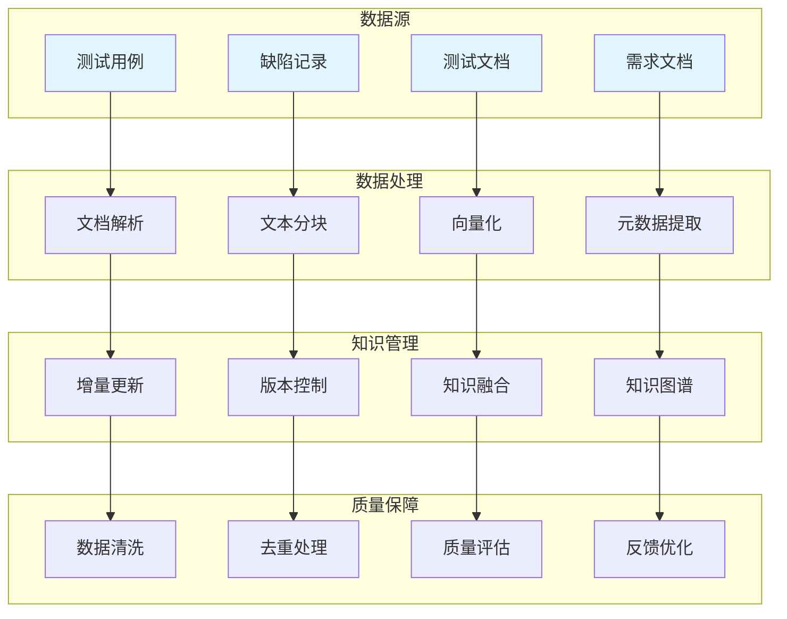

# 知识库构建指南

构建高质量的测试知识库，包括数据处理、知识管理、质量保障等。

## 📊 知识库架构



## 🏗️ 核心组件

### 文档处理器

```python
from typing import Dict, List, Optional
from dataclasses import dataclass
from abc import ABC, abstractmethod

@dataclass
class ProcessedDocument:
    """
    处理后的文档
    """
    doc_id: str
    chunks: List[str]
    metadata: Dict
    embeddings: Optional[List[List[float]]] = None

class DocumentParser(ABC):
    """
    文档解析器基类
    """
    @abstractmethod
    def parse(self, file_path: str) -> str:
        """
        解析文档
        
        Args:
            file_path: 文件路径
            
        Returns:
            str: 文档内容
        """
        pass

class TextChunker:
    """
    文本分块器
    """
    def __init__(
        self,
        chunk_size: int = 512,
        chunk_overlap: int = 50,
        separator: str = "\n"
    ):
        self.chunk_size = chunk_size
        self.chunk_overlap = chunk_overlap
        self.separator = separator
    
    def chunk(self, text: str) -> List[str]:
        """
        分块文本
        
        Args:
            text: 原始文本
            
        Returns:
            list: 文本块列表
        """
        paragraphs = text.split(self.separator)
        
        chunks = []
        current_chunk = []
        current_size = 0
        
        for para in paragraphs:
            para_size = len(para.split())
            
            if current_size + para_size > self.chunk_size and current_chunk:
                chunks.append(self.separator.join(current_chunk))
                
                overlap_start = max(0, len(current_chunk) - self._get_overlap_paras())
                current_chunk = current_chunk[overlap_start:]
                current_size = sum(len(p.split()) for p in current_chunk)
            
            current_chunk.append(para)
            current_size += para_size
        
        if current_chunk:
            chunks.append(self.separator.join(current_chunk))
        
        return chunks
    
    def _get_overlap_paras(self) -> int:
        """
        获取重叠段落数
        
        Returns:
            int: 重叠段落数
        """
        return max(1, self.chunk_overlap // 50)

class MetadataExtractor:
    """
    元数据提取器
    """
    def extract(self, text: str, source: str) -> Dict:
        """
        提取元数据
        
        Args:
            text: 文本内容
            source: 来源
            
        Returns:
            dict: 元数据
        """
        return {
            "source": source,
            "word_count": len(text.split()),
            "char_count": len(text),
            "line_count": len(text.split("\n")),
            "has_code": "```" in text or "def " in text,
            "has_table": "|" in text and "---" in text
        }
```

### 知识库构建器

```python
from typing import Dict, List, Optional
from dataclasses import dataclass
import hashlib

@dataclass
class KnowledgeEntry:
    """
    知识条目
    """
    entry_id: str
    content: str
    embedding: List[float]
    metadata: Dict
    version: int = 1

class KnowledgeBaseBuilder:
    """
    知识库构建器
    """
    def __init__(
        self,
        vector_store,
        embedding_model,
        chunker: TextChunker = None
    ):
        self.vector_store = vector_store
        self.embedding_model = embedding_model
        self.chunker = chunker or TextChunker()
        self.metadata_extractor = MetadataExtractor()
    
    def add_document(
        self,
        content: str,
        source: str,
        metadata: Dict = None
    ) -> List[str]:
        """
        添加文档
        
        Args:
            content: 文档内容
            source: 来源
            metadata: 元数据
            
        Returns:
            list: 条目ID列表
        """
        chunks = self.chunker.chunk(content)
        
        base_metadata = self.metadata_extractor.extract(content, source)
        if metadata:
            base_metadata.update(metadata)
        
        entry_ids = []
        
        for i, chunk in enumerate(chunks):
            entry_id = self._generate_id(source, i)
            embedding = self.embedding_model.embed(chunk)
            
            entry = KnowledgeEntry(
                entry_id=entry_id,
                content=chunk,
                embedding=embedding,
                metadata={
                    **base_metadata,
                    "chunk_index": i,
                    "total_chunks": len(chunks)
                }
            )
            
            self.vector_store.insert([entry])
            entry_ids.append(entry_id)
        
        return entry_ids
    
    def update_document(
        self,
        source: str,
        new_content: str,
        metadata: Dict = None
    ) -> List[str]:
        """
        更新文档
        
        Args:
            source: 来源
            new_content: 新内容
            metadata: 新元数据
            
        Returns:
            list: 新条目ID列表
        """
        self.delete_document(source)
        
        return self.add_document(new_content, source, metadata)
    
    def delete_document(self, source: str):
        """
        删除文档
        
        Args:
            source: 来源
        """
        pass
    
    def _generate_id(self, source: str, chunk_index: int) -> str:
        """
        生成ID
        
        Args:
            source: 来源
            chunk_index: 块索引
            
        Returns:
            str: 生成的ID
        """
        content = f"{source}_{chunk_index}"
        return hashlib.md5(content.encode()).hexdigest()
```

### 知识管理器

```python
from typing import Dict, List, Optional
from datetime import datetime

class KnowledgeManager:
    """
    知识管理器
    """
    def __init__(self, vector_store):
        self.vector_store = vector_store
        self.version_history: Dict[str, List[Dict]] = {}
    
    def add_version(
        self,
        entry_id: str,
        content: str,
        metadata: Dict
    ):
        """
        添加版本
        
        Args:
            entry_id: 条目ID
            content: 内容
            metadata: 元数据
        """
        version = {
            "content": content,
            "metadata": metadata,
            "timestamp": datetime.now().isoformat(),
            "version": len(self.version_history.get(entry_id, [])) + 1
        }
        
        if entry_id not in self.version_history:
            self.version_history[entry_id] = []
        
        self.version_history[entry_id].append(version)
    
    def get_version_history(self, entry_id: str) -> List[Dict]:
        """
        获取版本历史
        
        Args:
            entry_id: 条目ID
            
        Returns:
            list: 版本历史
        """
        return self.version_history.get(entry_id, [])
    
    def rollback(self, entry_id: str, version: int):
        """
        回滚到指定版本
        
        Args:
            entry_id: 条目ID
            version: 版本号
        """
        history = self.version_history.get(entry_id, [])
        
        for v in history:
            if v["version"] == version:
                return v
        
        return None

class KnowledgeFusion:
    """
    知识融合器
    """
    def __init__(self, llm_client):
        self.llm = llm_client
    
    def merge_duplicates(
        self,
        entries: List[Dict]
    ) -> Dict:
        """
        合并重复条目
        
        Args:
            entries: 条目列表
            
        Returns:
            dict: 合并后的条目
        """
        if len(entries) <= 1:
            return entries[0] if entries else None
        
        contents = [e["content"] for e in entries]
        
        prompt = f"""
请合并以下相似的知识条目，保留所有关键信息：

条目列表：
{chr(10).join([f'{i+1}. {c}' for i, c in enumerate(contents)])}

请返回合并后的内容。
"""
        
        merged_content = self.llm.generate(prompt)
        
        merged_metadata = {}
        for entry in entries:
            merged_metadata.update(entry.get("metadata", {}))
        
        return {
            "content": merged_content,
            "metadata": merged_metadata
        }
```

### 质量保障

```python
from typing import Dict, List
from dataclasses import dataclass

@dataclass
class QualityReport:
    """
    质量报告
    """
    total_entries: int
    duplicate_count: int
    low_quality_count: int
    missing_metadata_count: int
    recommendations: List[str]

class QualityAssurance:
    """
    质量保障器
    """
    def __init__(self, vector_store, similarity_threshold: float = 0.95):
        self.vector_store = vector_store
        self.similarity_threshold = similarity_threshold
    
    def assess_quality(self) -> QualityReport:
        """
        评估质量
        
        Returns:
            QualityReport: 质量报告
        """
        entries = self.vector_store.get_all()
        
        duplicate_count = self._count_duplicates(entries)
        low_quality_count = self._count_low_quality(entries)
        missing_metadata_count = self._count_missing_metadata(entries)
        
        recommendations = self._generate_recommendations(
            duplicate_count,
            low_quality_count,
            missing_metadata_count
        )
        
        return QualityReport(
            total_entries=len(entries),
            duplicate_count=duplicate_count,
            low_quality_count=low_quality_count,
            missing_metadata_count=missing_metadata_count,
            recommendations=recommendations
        )
    
    def _count_duplicates(self, entries: List[Dict]) -> int:
        """
        统计重复条目
        
        Args:
            entries: 条目列表
            
        Returns:
            int: 重复数量
        """
        seen = set()
        duplicates = 0
        
        for entry in entries:
            content_hash = hashlib.md5(
                entry["content"].encode()
            ).hexdigest()
            
            if content_hash in seen:
                duplicates += 1
            else:
                seen.add(content_hash)
        
        return duplicates
    
    def _count_low_quality(self, entries: List[Dict]) -> int:
        """
        统计低质量条目
        
        Args:
            entries: 条目列表
            
        Returns:
            int: 低质量数量
        """
        low_quality = 0
        
        for entry in entries:
            content = entry["content"]
            
            if len(content.split()) < 10:
                low_quality += 1
            elif len(content) < 50:
                low_quality += 1
        
        return low_quality
    
    def _count_missing_metadata(self, entries: List[Dict]) -> int:
        """
        统计缺失元数据的条目
        
        Args:
            entries: 条目列表
            
        Returns:
            int: 缺失数量
        """
        required_fields = ["source", "timestamp"]
        missing = 0
        
        for entry in entries:
            metadata = entry.get("metadata", {})
            
            if not all(field in metadata for field in required_fields):
                missing += 1
        
        return missing
    
    def _generate_recommendations(
        self,
        duplicates: int,
        low_quality: int,
        missing_metadata: int
    ) -> List[str]:
        """
        生成改进建议
        
        Args:
            duplicates: 重复数量
            low_quality: 低质量数量
            missing_metadata: 缺失元数据数量
            
        Returns:
            list: 建议列表
        """
        recommendations = []
        
        if duplicates > 0:
            recommendations.append(f"发现{duplicates}个重复条目，建议进行去重处理")
        
        if low_quality > 0:
            recommendations.append(f"发现{low_quality}个低质量条目，建议进行内容增强")
        
        if missing_metadata > 0:
            recommendations.append(f"发现{missing_metadata}个缺失元数据的条目，建议补充元数据")
        
        return recommendations
```

## 🎯 应用场景

### 测试用例知识库

```python
class TestCaseKnowledgeBase:
    """
    测试用例知识库
    """
    def __init__(self, builder: KnowledgeBaseBuilder):
        self.builder = builder
    
    def add_test_case(
        self,
        case_id: str,
        content: str,
        test_type: str,
        priority: str
    ):
        """
        添加测试用例
        
        Args:
            case_id: 用例ID
            content: 内容
            test_type: 测试类型
            priority: 优先级
        """
        metadata = {
            "case_id": case_id,
            "test_type": test_type,
            "priority": priority,
            "category": "test_case"
        }
        
        self.builder.add_document(content, case_id, metadata)
    
    def search_similar_cases(
        self,
        query: str,
        test_type: str = None,
        top_k: int = 5
    ) -> List[Dict]:
        """
        搜索相似用例
        
        Args:
            query: 查询文本
            test_type: 测试类型过滤
            top_k: 返回数量
            
        Returns:
            list: 相似用例列表
        """
        pass
```

### 缺陷知识库

```python
class DefectKnowledgeBase:
    """
    缺陷知识库
    """
    def __init__(self, builder: KnowledgeBaseBuilder):
        self.builder = builder
    
    def add_defect(
        self,
        defect_id: str,
        description: str,
        root_cause: str,
        solution: str
    ):
        """
        添加缺陷记录
        
        Args:
            defect_id: 缺陷ID
            description: 描述
            root_cause: 根因
            solution: 解决方案
        """
        content = f"""
缺陷描述：{description}
根因分析：{root_cause}
解决方案：{solution}
"""
        
        metadata = {
            "defect_id": defect_id,
            "category": "defect",
            "has_solution": bool(solution)
        }
        
        self.builder.add_document(content, defect_id, metadata)
```

## 📈 最佳实践

### 分块策略

| 文档类型 | 掻荐分块大小 | 说明 |
|---------|------------|------|
| 测试用例 | 256-512 | 保持用例完整性 |
| 需求文档 | 512-1024 | 保持段落完整 |
| 技术文档 | 512 | 平衡上下文和精度 |
| 缺陷记录 | 256-512 | 包含完整描述 |

### 元数据规范

```python
STANDARD_METADATA = {
    "source": "来源标识",
    "timestamp": "创建时间",
    "category": "分类",
    "version": "版本号",
    "author": "作者",
    "tags": "标签列表"
}
```

## 📚 学习资源

### 官方文档

| 资源 | 描述 | 链接 |
|-----|------|------|
| **LlamaIndex Index** | LlamaIndex索引文档 | [docs.llamaindex.ai/en/stable/module_guides/indexing](https://docs.llamaindex.ai/en/stable/module_guides/indexing/) |
| **LangChain Docstore** | LangChain文档存储 | [python.langchain.com/docs/modules/data_connection](https://python.langchain.com/docs/modules/data_connection/) |

### 开源工具

| 工具 | 描述 | 链接 |
|-----|------|------|
| **Unstructured** | 文档解析库 | [github.com/Unstructured-IO/unstructured](https://github.com/Unstructured-IO/unstructured) |
| **LangChain Document Loaders** | 文档加载器 | [python.langchain.com/docs/modules/data_connection/document_loaders](https://python.langchain.com/docs/modules/data_connection/document_loaders/) |

## 🔗 相关资源

- [向量数据库实践](/ai-testing-tech/rag-tech/vector-database/) - 向量数据库详解
- [检索策略优化](/ai-testing-tech/rag-tech/retrieval-strategy/) - 检索策略详解
- [LLM技术](/ai-testing-tech/llm-tech/) - 大语言模型技术
