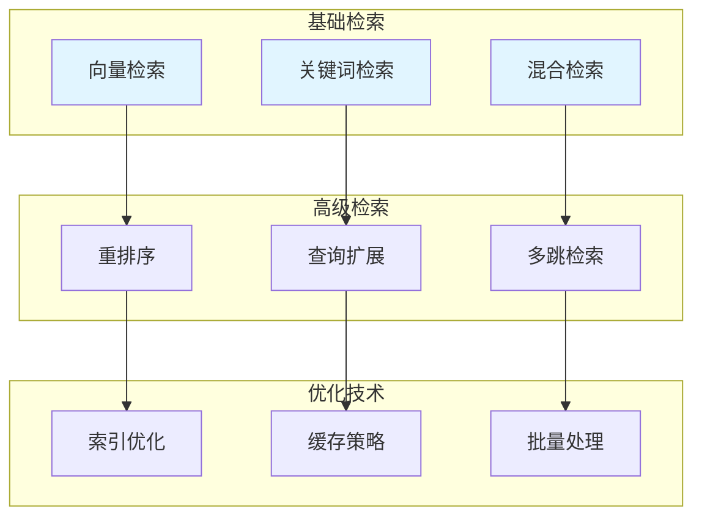

# 检索策略优化

RAG系统中的检索策略优化，包括混合检索、重排序、查询优化等技术。

## 📊 检索策略概览



## 🏗️ 核心策略

### 混合检索

结合向量检索和关键词检索的优势。

```python
from typing import Dict, List, Tuple
from dataclasses import dataclass

@dataclass
class HybridConfig:
    """
    混合检索配置
    """
    vector_weight: float = 0.7
    keyword_weight: float = 0.3
    top_k: int = 10

class HybridSearchEngine:
    """
    混合搜索引擎
    """
    def __init__(
        self,
        vector_searcher,
        keyword_searcher,
        config: HybridConfig = None
    ):
        self.vector_searcher = vector_searcher
        self.keyword_searcher = keyword_searcher
        self.config = config or HybridConfig()
    
    def search(self, query: str, top_k: int = None) -> List[Dict]:
        """
        混合搜索
        
        Args:
            query: 查询文本
            top_k: 返回数量
            
        Returns:
            list: 搜索结果
        """
        top_k = top_k or self.config.top_k
        
        vector_results = self.vector_searcher.search(query, top_k * 2)
        keyword_results = self.keyword_searcher.search(query, top_k * 2)
        
        combined = self._combine_results(
            vector_results,
            keyword_results
        )
        
        return combined[:top_k]
    
    def _combine_results(
        self,
        vector_results: List[Dict],
        keyword_results: List[Dict]
    ) -> List[Dict]:
        """
        组合结果
        
        Args:
            vector_results: 向量检索结果
            keyword_results: 关键词检索结果
            
        Returns:
            list: 组合后的结果
        """
        scores = {}
        
        for result in vector_results:
            doc_id = result["doc_id"]
            scores[doc_id] = {
                "vector_score": result["score"],
                "keyword_score": 0,
                "content": result["content"],
                "metadata": result.get("metadata", {})
            }
        
        for result in keyword_results:
            doc_id = result["doc_id"]
            if doc_id in scores:
                scores[doc_id]["keyword_score"] = result["score"]
            else:
                scores[doc_id] = {
                    "vector_score": 0,
                    "keyword_score": result["score"],
                    "content": result["content"],
                    "metadata": result.get("metadata", {})
                }
        
        combined_scores = []
        for doc_id, score_data in scores.items():
            combined = (
                self.config.vector_weight * score_data["vector_score"] +
                self.config.keyword_weight * score_data["keyword_score"]
            )
            combined_scores.append({
                "doc_id": doc_id,
                "score": combined,
                "content": score_data["content"],
                "metadata": score_data["metadata"]
            })
        
        combined_scores.sort(key=lambda x: x["score"], reverse=True)
        
        return combined_scores
```

### 重排序策略

```python
from typing import Dict, List
from abc import ABC, abstractmethod

class RerankerBase(ABC):
    """
    重排序器基类
    """
    @abstractmethod
    def rerank(
        self,
        query: str,
        results: List[Dict],
        top_k: int = None
    ) -> List[Dict]:
        """
        重排序
        
        Args:
            query: 查询文本
            results: 初始结果
            top_k: 返回数量
            
        Returns:
            list: 重排序后的结果
        """
        pass

class CrossEncoderReranker(RerankerBase):
    """
    Cross-Encoder重排序器
    """
    def __init__(self, model):
        self.model = model
    
    def rerank(
        self,
        query: str,
        results: List[Dict],
        top_k: int = None
    ) -> List[Dict]:
        """
        重排序
        
        Args:
            query: 查询文本
            results: 初始结果
            top_k: 返回数量
            
        Returns:
            list: 重排序后的结果
        """
        pairs = [(query, r["content"]) for r in results]
        scores = self.model.predict(pairs)
        
        for i, result in enumerate(results):
            result["rerank_score"] = float(scores[i])
        
        results.sort(key=lambda x: x["rerank_score"], reverse=True)
        
        return results[:top_k] if top_k else results

class LLMReranker(RerankerBase):
    """
    LLM重排序器
    """
    def __init__(self, llm_client):
        self.llm = llm_client
    
    def rerank(
        self,
        query: str,
        results: List[Dict],
        top_k: int = None
    ) -> List[Dict]:
        """
        重排序
        
        Args:
            query: 查询文本
            results: 初始结果
            top_k: 返回数量
            
        Returns:
            list: 重排序后的结果
        """
        prompt = self._build_prompt(query, results)
        response = self.llm.generate(prompt)
        
        return self._parse_response(response, results, top_k)
    
    def _build_prompt(self, query: str, results: List[Dict]) -> str:
        """
        构建提示词
        
        Args:
            query: 查询文本
            results: 结果列表
            
        Returns:
            str: 提示词
        """
        results_text = "\n".join([
            f"[{i}] {r['content'][:200]}"
            for i, r in enumerate(results)
        ])
        
        return f"""
请对以下搜索结果与查询的相关性进行评分（0-10分）：

查询：{query}

搜索结果：
{results_text}

请返回每个结果的编号和相关性分数，格式：编号:分数
"""
    
    def _parse_response(
        self,
        response: str,
        results: List[Dict],
        top_k: int
    ) -> List[Dict]:
        """
        解析响应
        
        Args:
            response: LLM响应
            results: 原始结果
            top_k: 返回数量
            
        Returns:
            list: 解析后的结果
        """
        return results[:top_k] if top_k else results
```

### 查询优化

```python
from typing import Dict, List
from dataclasses import dataclass

@dataclass
class QueryExpansionConfig:
    """
    查询扩展配置
    """
    expansion_count: int = 3
    use_synonyms: bool = True
    use_related: bool = True

class QueryOptimizer:
    """
    查询优化器
    """
    def __init__(self, llm_client, config: QueryExpansionConfig = None):
        self.llm = llm_client
        self.config = config or QueryExpansionConfig()
    
    def expand_query(self, query: str) -> List[str]:
        """
        扩展查询
        
        Args:
            query: 原始查询
            
        Returns:
            list: 扩展后的查询列表
        """
        prompt = f"""
请为以下查询生成{self.config.expansion_count}个语义相关的扩展查询：

原始查询：{query}

要求：
1. 保持原始查询的核心意图
2. 使用不同的表达方式
3. 添加相关的关键词

返回格式：每行一个扩展查询
"""
        
        response = self.llm.generate(prompt)
        expanded = [line.strip() for line in response.split("\n") if line.strip()]
        
        return [query] + expanded[:self.config.expansion_count]
    
    def rewrite_query(self, query: str, context: str = None) -> str:
        """
        改写查询
        
        Args:
            query: 原始查询
            context: 上下文
            
        Returns:
            str: 改写后的查询
        """
        prompt = f"""
请改写以下查询，使其更加清晰和具体：

原始查询：{query}
{f'上下文：{context}' if context else ''}

要求：
1. 保持原始意图
2. 添加必要的细节
3. 使用更精确的表达

返回改写后的查询。
"""
        
        return self.llm.generate(prompt)
    
    def decompose_query(self, query: str) -> List[str]:
        """
        分解查询
        
        Args:
            query: 原始查询
            
        Returns:
            list: 分解后的子查询列表
        """
        prompt = f"""
请将以下复杂查询分解为多个简单的子查询：

原始查询：{query}

要求：
1. 每个子查询独立完整
2. 子查询之间互不重叠
3. 子查询的答案组合起来能回答原始查询

返回格式：每行一个子查询
"""
        
        response = self.llm.generate(prompt)
        return [line.strip() for line in response.split("\n") if line.strip()]
```

## 🎯 应用场景

### 测试用例检索优化

```python
class TestCaseRetrievalOptimizer:
    """
    测试用例检索优化器
    """
    def __init__(
        self,
        search_engine: HybridSearchEngine,
        reranker: RerankerBase,
        query_optimizer: QueryOptimizer
    ):
        self.search_engine = search_engine
        self.reranker = reranker
        self.query_optimizer = query_optimizer
    
    def retrieve_optimized(
        self,
        query: str,
        top_k: int = 5
    ) -> List[Dict]:
        """
        优化检索
        
        Args:
            query: 查询文本
            top_k: 返回数量
            
        Returns:
            list: 优化后的检索结果
        """
        expanded_queries = self.query_optimizer.expand_query(query)
        
        all_results = []
        for q in expanded_queries:
            results = self.search_engine.search(q, top_k * 2)
            all_results.extend(results)
        
        unique_results = self._deduplicate(all_results)
        
        reranked = self.reranker.rerank(query, unique_results, top_k)
        
        return reranked
    
    def _deduplicate(self, results: List[Dict]) -> List[Dict]:
        """
        去重
        
        Args:
            results: 结果列表
            
        Returns:
            list: 去重后的结果
        """
        seen = set()
        unique = []
        
        for result in results:
            if result["doc_id"] not in seen:
                seen.add(result["doc_id"])
                unique.append(result)
        
        return unique
```

## 📈 性能指标

| 策略 | 召回率 | 精确率 | 延迟 |
|-----|--------|--------|------|
| 向量检索 | 85% | 75% | 低 |
| 混合检索 | 90% | 80% | 中 |
| 重排序 | 92% | 88% | 高 |
| 查询扩展 | 95% | 82% | 高 |

## 📚 学习资源

### 官方文档

| 资源 | 描述 | 链接 |
|-----|------|------|
| **LangChain Retrieval** | LangChain检索文档 | [python.langchain.com/docs/modules/retrieval](https://python.langchain.com/docs/modules/retrieval/) |
| **LlamaIndex Retrieval** | LlamaIndex检索文档 | [docs.llamaindex.ai/en/stable/module_guides/querying retrieval](https://docs.llamaindex.ai/en/stable/module_guides/querying/retrieval/) |

### 经典论文

| 论文 | 描述 | 链接 |
|-----|------|------|
| **ColBERT** | 延迟交互检索 | [arxiv.org/abs/2004.12832](https://arxiv.org/abs/2004.12832) |
| **BGE Reranker** | BGE重排序模型 | [huggingface.co/BAAI/bge-reranker-base](https://huggingface.co/BAAI/bge-reranker-base) |

## 🔗 相关资源

- [向量数据库实践](/ai-testing-tech/rag-tech/vector-database/) - 向量数据库详解
- [知识库构建指南](/ai-testing-tech/rag-tech/knowledge-base/) - 知识库构建详解
- [LLM技术](/ai-testing-tech/llm-tech/) - 大语言模型技术
