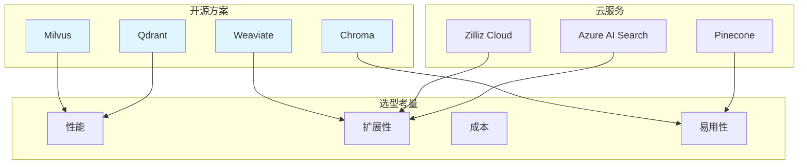

# 向量数据库实践

向量数据库是RAG系统的核心组件，负责存储和检索向量化的知识数据。

## 📊 数据库选型对比



## 🏗️ 核心概念

### 向量索引类型

| 索引类型 | 描述 | 适用场景 |
|---------|------|---------|
| **FLAT** | 暴力搜索 | 小规模数据、高精度要求 |
| **IVF** | 倒排文件索引 | 中等规模数据 |
| **HNSW** | 层次导航小世界 | 大规模数据、高召回率 |
| **PQ** | 乘积量化 | 内存受限场景 |

### 相似度度量

```python
from typing import List
import numpy as np

class SimilarityMetrics:
    """
    相似度度量方法
    """
    @staticmethod
    def cosine_similarity(vec1: List[float], vec2: List[float]) -> float:
        """
        余弦相似度
        
        Args:
            vec1: 向量1
            vec2: 向量2
            
        Returns:
            float: 相似度值
        """
        arr1 = np.array(vec1)
        arr2 = np.array(vec2)
        
        dot = np.dot(arr1, arr2)
        norm1 = np.linalg.norm(arr1)
        norm2 = np.linalg.norm(arr2)
        
        if norm1 == 0 or norm2 == 0:
            return 0.0
        
        return float(dot / (norm1 * norm2))
    
    @staticmethod
    def euclidean_distance(vec1: List[float], vec2: List[float]) -> float:
        """
        欧氏距离
        
        Args:
            vec1: 向量1
            vec2: 向量2
            
        Returns:
            float: 距离值
        """
        arr1 = np.array(vec1)
        arr2 = np.array(vec2)
        
        return float(np.linalg.norm(arr1 - arr2))
    
    @staticmethod
    def dot_product(vec1: List[float], vec2: List[float]) -> float:
        """
        点积
        
        Args:
            vec1: 向量1
            vec2: 向量2
            
        Returns:
            float: 点积值
        """
        arr1 = np.array(vec1)
        arr2 = np.array(vec2)
        
        return float(np.dot(arr1, arr2))
```

## 📚 数据库实践

### Milvus实践

```python
from typing import Dict, List, Optional, Any
from dataclasses import dataclass

@dataclass
class MilvusConfig:
    """
    Milvus配置
    """
    host: str = "localhost"
    port: int = 19530
    collection_name: str = "test_knowledge"
    dimension: int = 768
    index_type: str = "HNSW"
    metric_type: str = "COSINE"

class MilvusManager:
    """
    Milvus管理器
    """
    def __init__(self, config: MilvusConfig):
        self.config = config
        self.collection = None
    
    def create_collection(self):
        """
        创建集合
        """
        pass
    
    def insert_vectors(
        self,
        ids: List[str],
        vectors: List[List[float]],
        metadata: List[Dict] = None
    ):
        """
        插入向量
        
        Args:
            ids: ID列表
            vectors: 向量列表
            metadata: 元数据列表
        """
        pass
    
    def search(
        self,
        query_vector: List[float],
        top_k: int = 10,
        filter_expr: str = None
    ) -> List[Dict]:
        """
        搜索向量
        
        Args:
            query_vector: 查询向量
            top_k: 返回数量
            filter_expr: 过滤表达式
            
        Returns:
            list: 搜索结果
        """
        pass
    
    def delete_by_ids(self, ids: List[str]):
        """
        根据ID删除
        
        Args:
            ids: ID列表
        """
        pass
```

### Chroma实践

```python
from typing import Dict, List, Optional
import chromadb
from chromadb.config import Settings

class ChromaManager:
    """
    Chroma管理器
    """
    def __init__(self, persist_directory: str = "./chroma_db"):
        self.client = chromadb.Client(Settings(
            persist_directory=persist_directory,
            anonymized_telemetry=False
        ))
        self.collection = None
    
    def get_or_create_collection(self, name: str):
        """
        获取或创建集合
        
        Args:
            name: 集合名称
        """
        self.collection = self.client.get_or_create_collection(name=name)
    
    def add_documents(
        self,
        ids: List[str],
        documents: List[str],
        embeddings: List[List[float]] = None,
        metadatas: List[Dict] = None
    ):
        """
        添加文档
        
        Args:
            ids: ID列表
            documents: 文档列表
            embeddings: 嵌入列表
            metadatas: 元数据列表
        """
        self.collection.add(
            ids=ids,
            documents=documents,
            embeddings=embeddings,
            metadatas=metadatas
        )
    
    def query(
        self,
        query_embeddings: List[List[float]] = None,
        query_texts: List[str] = None,
        n_results: int = 10,
        where: Dict = None
    ) -> Dict:
        """
        查询
        
        Args:
            query_embeddings: 查询嵌入
            query_texts: 查询文本
            n_results: 返回数量
            where: 过滤条件
            
        Returns:
            dict: 查询结果
        """
        return self.collection.query(
            query_embeddings=query_embeddings,
            query_texts=query_texts,
            n_results=n_results,
            where=where
        )
    
    def delete(self, ids: List[str] = None, where: Dict = None):
        """
        删除文档
        
        Args:
            ids: ID列表
            where: 过滤条件
        """
        self.collection.delete(ids=ids, where=where)
```

### Qdrant实践

```python
from typing import Dict, List, Optional
from qdrant_client import QdrantClient
from qdrant_client.models import Distance, VectorParams, PointStruct

class QdrantManager:
    """
    Qdrant管理器
    """
    def __init__(self, host: str = "localhost", port: int = 6333):
        self.client = QdrantClient(host=host, port=port)
    
    def create_collection(
        self,
        collection_name: str,
        vector_size: int = 768,
        distance: Distance = Distance.COSINE
    ):
        """
        创建集合
        
        Args:
            collection_name: 集合名称
            vector_size: 向量维度
            distance: 距离度量
        """
        self.client.create_collection(
            collection_name=collection_name,
            vectors_config=VectorParams(
                size=vector_size,
                distance=distance
            )
        )
    
    def upsert_vectors(
        self,
        collection_name: str,
        points: List[PointStruct]
    ):
        """
        插入/更新向量
        
        Args:
            collection_name: 集合名称
            points: 点列表
        """
        self.client.upsert(
            collection_name=collection_name,
            points=points
        )
    
    def search(
        self,
        collection_name: str,
        query_vector: List[float],
        limit: int = 10,
        query_filter: Dict = None
    ) -> List[Dict]:
        """
        搜索向量
        
        Args:
            collection_name: 集合名称
            query_vector: 查询向量
            limit: 返回数量
            query_filter: 过滤条件
            
        Returns:
            list: 搜索结果
        """
        return self.client.search(
            collection_name=collection_name,
            query_vector=query_vector,
            limit=limit,
            query_filter=query_filter
        )
```

## 🎯 应用场景

### 测试知识库存储

```python
class TestKnowledgeStore:
    """
    测试知识库存储
    """
    def __init__(self, db_manager):
        self.db = db_manager
    
    def store_test_case(
        self,
        case_id: str,
        content: str,
        embedding: List[float],
        metadata: Dict
    ):
        """
        存储测试用例
        
        Args:
            case_id: 用例ID
            content: 内容
            embedding: 嵌入向量
            metadata: 元数据
        """
        pass
    
    def find_similar_cases(
        self,
        query_embedding: List[float],
        top_k: int = 5
    ) -> List[Dict]:
        """
        查找相似用例
        
        Args:
            query_embedding: 查询嵌入
            top_k: 返回数量
            
        Returns:
            list: 相似用例列表
        """
        pass
```

## 📚 学习资源

### 官方文档

| 资源 | 描述 | 链接 |
|-----|------|------|
| **Milvus Docs** | Milvus官方文档 | [milvus.io/docs](https://milvus.io/docs/) |
| **Chroma Docs** | Chroma官方文档 | [docs.trychroma.com](https://docs.trychroma.com/) |
| **Qdrant Docs** | Qdrant官方文档 | [qdrant.tech/documentation](https://qdrant.tech/documentation/) |
| **Pinecone Docs** | Pinecone官方文档 | [docs.pinecone.io](https://docs.pinecone.io/) |

### 性能基准

| 数据库 | 百万级查询延迟 | 内存占用 | 扩展性 |
|-------|--------------|---------|--------|
| Milvus | ~10ms | 中 | 高 |
| Qdrant | ~5ms | 低 | 中 |
| Chroma | ~50ms | 低 | 低 |
| Pinecone | ~20ms | N/A | 高 |

## 🔗 相关资源

- [检索策略优化](/ai-testing-tech/rag-tech/retrieval-strategy/) - 检索策略详解
- [知识库构建指南](/ai-testing-tech/rag-tech/knowledge-base/) - 知识库构建详解
- [LLM技术](/ai-testing-tech/llm-tech/) - 大语言模型技术
