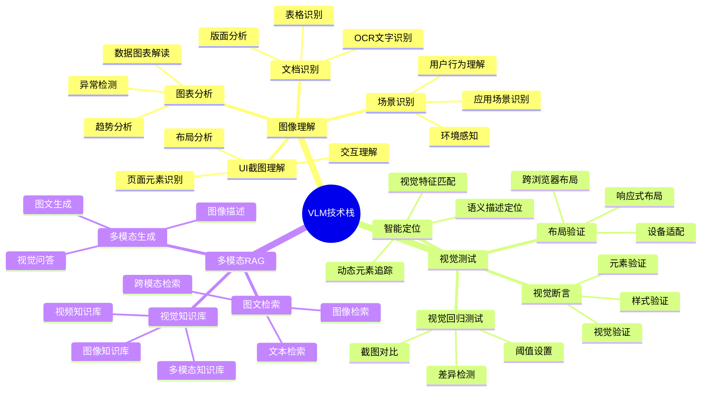
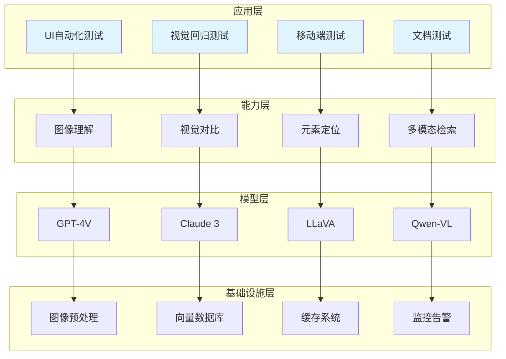

# VLM技术

视觉语言模型在测试领域的应用，包括图像理解、视觉测试、多模态RAG等。

## 📊 技术架构全景



## 🏗️ 技术分层架构



## 📚 核心技术详解

### 图像理解

图像理解是VLM的核心能力，通过视觉模型分析图像内容。

#### UI截图理解

```python
from typing import Dict, List, Tuple
from dataclasses import dataclass
import base64

@dataclass
class UIElement:
    """
    UI元素类
    表示界面中的一个可识别元素
    """
    element_type: str
    text: str
    location: Tuple[int, int]
    size: Tuple[int, int]
    confidence: float
    description: str

class VLMUIAnalyzer:
    """
    VLM UI分析器
    使用视觉语言模型分析UI界面
    """
    def __init__(self, vlm_client):
        self.vlm = vlm_client
    
    def analyze_screenshot(self, image_path: str) -> Dict:
        """
        分析UI截图
        
        Args:
            image_path: 截图路径
            
        Returns:
            dict: 分析结果
        """
        with open(image_path, "rb") as f:
            image_data = base64.b64encode(f.read()).decode()
        
        prompt = """
分析这个UI界面截图，识别以下内容：
1. 界面类型（登录页、列表页、详情页等）
2. 主要UI元素（按钮、输入框、文本、图片等）
3. 元素的位置和功能
4. 用户可能的操作流程

请以JSON格式返回结果。
"""
        
        response = self.vlm.analyze_image(image_data, prompt)
        
        return {
            "ui_type": response.get("ui_type"),
            "elements": response.get("elements", []),
            "user_flows": response.get("user_flows", []),
            "accessibility_issues": response.get("accessibility_issues", [])
        }
    
    def identify_interactive_elements(self, image_path: str) -> List[UIElement]:
        """
        识别可交互元素
        
        Args:
            image_path: 截图路径
            
        Returns:
            list: 可交互元素列表
        """
        with open(image_path, "rb") as f:
            image_data = base64.b64encode(f.read()).decode()
        
        prompt = """
识别这个界面中所有可交互的元素（按钮、链接、输入框等）。
对于每个元素，提供：
- 类型
- 显示文本
- 大致位置（左上角坐标和尺寸）
- 功能描述
- 置信度

以JSON数组格式返回。
"""
        
        response = self.vlm.analyze_image(image_data, prompt)
        
        elements = []
        for item in response.get("elements", []):
            elements.append(UIElement(
                element_type=item.get("type"),
                text=item.get("text", ""),
                location=tuple(item.get("location", [0, 0])),
                size=tuple(item.get("size", [0, 0])),
                confidence=item.get("confidence", 0.0),
                description=item.get("description", "")
            ))
        
        return elements
```

#### 图表分析

```python
from typing import Dict, List, Any
from dataclasses import dataclass

@dataclass
class ChartData:
    """
    图表数据类
    """
    chart_type: str
    title: str
    data_points: List[Dict]
    trends: List[str]
    anomalies: List[Dict]

class ChartAnalyzer:
    """
    图表分析器
    使用VLM分析数据图表
    """
    def __init__(self, vlm_client):
        self.vlm = vlm_client
    
    def analyze_chart(self, image_path: str) -> ChartData:
        """
        分析图表
        
        Args:
            image_path: 图表图片路径
            
        Returns:
            ChartData: 图表分析结果
        """
        with open(image_path, "rb") as f:
            image_data = base64.b64encode(f.read()).decode()
        
        prompt = """
分析这个数据图表：
1. 图表类型（折线图、柱状图、饼图等）
2. 图表标题
3. 数据点和数值
4. 趋势分析
5. 异常点识别

返回JSON格式的分析结果。
"""
        
        response = self.vlm.analyze_image(image_data, prompt)
        
        return ChartData(
            chart_type=response.get("chart_type", "unknown"),
            title=response.get("title", ""),
            data_points=response.get("data_points", []),
            trends=response.get("trends", []),
            anomalies=response.get("anomalies", [])
        )
    
    def extract_data_table(self, image_path: str) -> List[Dict]:
        """
        从图表提取数据表格
        
        Args:
            image_path: 图表图片路径
            
        Returns:
            list: 数据表格
        """
        with open(image_path, "rb") as f:
            image_data = base64.b64encode(f.read()).decode()
        
        prompt = """
从图表中提取所有数据点，以表格形式返回。
包含列名和对应数值。
"""
        
        response = self.vlm.analyze_image(image_data, prompt)
        return response.get("table", [])
```

### 视觉测试

视觉测试使用VLM实现智能化的UI验证。

#### 视觉回归测试

```python
from typing import Dict, List, Tuple
from dataclasses import dataclass

@dataclass
class VisualDiff:
    """
    视觉差异类
    """
    diff_type: str
    location: Tuple[int, int, int, int]
    description: str
    severity: str

class VisualRegressionTester:
    """
    视觉回归测试器
    检测UI变化和视觉缺陷
    """
    def __init__(self, vlm_client):
        self.vlm = vlm_client
    
    def compare_screenshots(
        self,
        baseline_path: str,
        current_path: str,
        threshold: float = 0.95
    ) -> Dict:
        """
        对比截图
        
        Args:
            baseline_path: 基准截图路径
            current_path: 当前截图路径
            threshold: 相似度阈值
            
        Returns:
            dict: 对比结果
        """
        with open(baseline_path, "rb") as f:
            baseline_data = base64.b64encode(f.read()).decode()
        
        with open(current_path, "rb") as f:
            current_data = base64.b64encode(f.read()).decode()
        
        prompt = """
对比这两张UI截图：
1. 识别所有视觉差异
2. 分析差异类型（布局、颜色、文字、元素等）
3. 评估差异严重程度
4. 判断是否为预期变化

返回详细的差异分析。
"""
        
        response = self.vlm.compare_images(baseline_data, current_data, prompt)
        
        diffs = []
        for diff in response.get("differences", []):
            diffs.append(VisualDiff(
                diff_type=diff.get("type"),
                location=tuple(diff.get("location", [0, 0, 0, 0])),
                description=diff.get("description"),
                severity=diff.get("severity", "low")
            ))
        
        similarity = response.get("similarity", 1.0)
        
        return {
            "passed": similarity >= threshold,
            "similarity": similarity,
            "differences": diffs,
            "recommendation": response.get("recommendation", "")
        }
```

### 多模态RAG

多模态RAG实现图文混合检索和生成。

```python
from typing import Dict, List, Any, Optional
from dataclasses import dataclass

@dataclass
class MultimodalDocument:
    """
    多模态文档类
    """
    doc_id: str
    text_content: str
    image_paths: List[str]
    metadata: Dict

class MultimodalRAG:
    """
    多模态RAG系统
    实现图文混合检索
    """
    def __init__(self, vlm_client, vector_store):
        self.vlm = vlm_client
        self.vector_store = vector_store
    
    def index_document(self, document: MultimodalDocument):
        """
        索引多模态文档
        
        Args:
            document: 多模态文档
        """
        text_embedding = self._get_text_embedding(document.text_content)
        
        image_embeddings = []
        for image_path in document.image_paths:
            embedding = self._get_image_embedding(image_path)
            image_embeddings.append(embedding)
        
        self.vector_store.store(
            doc_id=document.doc_id,
            text_embedding=text_embedding,
            image_embeddings=image_embeddings,
            metadata=document.metadata
        )
    
    def search(
        self,
        query: str,
        image_query: str = None,
        top_k: int = 5
    ) -> List[Dict]:
        """
        多模态搜索
        
        Args:
            query: 文本查询
            image_query: 图像查询路径
            top_k: 返回数量
            
        Returns:
            list: 搜索结果
        """
        query_embedding = self._get_text_embedding(query)
        
        if image_query:
            image_embedding = self._get_image_embedding(image_query)
            results = self.vector_store.hybrid_search(
                text_embedding=query_embedding,
                image_embedding=image_embedding,
                top_k=top_k
            )
        else:
            results = self.vector_store.search(
                embedding=query_embedding,
                top_k=top_k
            )
        
        return results
    
    def _get_text_embedding(self, text: str) -> List[float]:
        """
        获取文本嵌入
        
        Args:
            text: 文本内容
            
        Returns:
            list: 嵌入向量
        """
        return self.vlm.get_text_embedding(text)
    
    def _get_image_embedding(self, image_path: str) -> List[float]:
        """
        获取图像嵌入
        
        Args:
            image_path: 图像路径
            
        Returns:
            list: 嵌入向量
        """
        with open(image_path, "rb") as f:
            image_data = base64.b64encode(f.read()).decode()
        
        return self.vlm.get_image_embedding(image_data)
```

## 🎯 应用场景

### UI自动化测试

使用VLM理解UI界面，实现智能化的元素定位和交互。

```python
class VLMUITestAutomation:
    """
    VLM UI测试自动化
    基于视觉理解的智能测试
    """
    def __init__(self, vlm_client, browser):
        self.vlm = vlm_client
        self.browser = browser
        self.analyzer = VLMUIAnalyzer(vlm_client)
    
    def click_by_description(self, description: str):
        """
        根据描述点击元素
        
        Args:
            description: 元素描述
        """
        screenshot = self.browser.take_screenshot()
        elements = self.analyzer.identify_interactive_elements(screenshot)
        
        for element in elements:
            if description.lower() in element.description.lower():
                center_x = element.location[0] + element.size[0] // 2
                center_y = element.location[1] + element.size[1] // 2
                self.browser.click_at(center_x, center_y)
                return True
        
        return False
    
    def verify_page_state(self, expected_state: str) -> bool:
        """
        验证页面状态
        
        Args:
            expected_state: 预期状态描述
            
        Returns:
            bool: 是否匹配
        """
        screenshot = self.browser.take_screenshot()
        analysis = self.analyzer.analyze_screenshot(screenshot)
        
        return expected_state.lower() in str(analysis).lower()
```

### 视觉回归测试

自动检测UI变化，识别视觉缺陷。

```python
class AutomatedVisualRegression:
    """
    自动化视觉回归测试
    """
    def __init__(self, vlm_client, baseline_dir: str):
        self.vlm = vlm_client
        self.baseline_dir = baseline_dir
        self.tester = VisualRegressionTester(vlm_client)
    
    def run_regression_test(
        self,
        page_name: str,
        current_screenshot: str
    ) -> Dict:
        """
        运行回归测试
        
        Args:
            page_name: 页面名称
            current_screenshot: 当前截图路径
            
        Returns:
            dict: 测试结果
        """
        import os
        baseline_path = os.path.join(self.baseline_dir, f"{page_name}.png")
        
        if not os.path.exists(baseline_path):
            return {
                "status": "no_baseline",
                "message": "基准截图不存在"
            }
        
        result = self.tester.compare_screenshots(
            baseline_path,
            current_screenshot
        )
        
        return {
            "status": "passed" if result["passed"] else "failed",
            "similarity": result["similarity"],
            "differences": [d.__dict__ for d in result["differences"]]
        }
```

### 移动端测试

跨设备兼容性测试，视觉一致性验证。

```python
class MobileVisualTester:
    """
    移动端视觉测试器
    """
    def __init__(self, vlm_client):
        self.vlm = vlm_client
    
    def test_cross_device(
        self,
        screenshots: Dict[str, str]
    ) -> Dict:
        """
        跨设备测试
        
        Args:
            screenshots: {设备名: 截图路径} 字典
            
        Returns:
            dict: 测试结果
        """
        results = {}
        devices = list(screenshots.keys())
        
        for i, device1 in enumerate(devices):
            for device2 in devices[i+1:]:
                comparison = self._compare_devices(
                    screenshots[device1],
                    screenshots[device2],
                    device1,
                    device2
                )
                results[f"{device1}_vs_{device2}"] = comparison
        
        return results
    
    def _compare_devices(
        self,
        screenshot1: str,
        screenshot2: str,
        device1: str,
        device2: str
    ) -> Dict:
        """
        对比两个设备的截图
        
        Args:
            screenshot1: 设备1截图
            screenshot2: 设备2截图
            device1: 设备1名称
            device2: 设备2名称
            
        Returns:
            dict: 对比结果
        """
        with open(screenshot1, "rb") as f:
            data1 = base64.b64encode(f.read()).decode()
        
        with open(screenshot2, "rb") as f:
            data2 = base64.b64encode(f.read()).decode()
        
        prompt = f"""
对比{device1}和{device2}上的界面截图：
1. 布局一致性
2. 功能完整性
3. 视觉差异
4. 用户体验一致性

返回详细的对比分析。
"""
        
        return self.vlm.compare_images(data1, data2, prompt)
```

### 文档测试

自动识别和验证文档内容。

```python
class DocumentTester:
    """
    文档测试器
    使用VLM验证文档内容
    """
    def __init__(self, vlm_client):
        self.vlm = vlm_client
    
    def verify_document_content(
        self,
        document_path: str,
        expected_content: Dict
    ) -> Dict:
        """
        验证文档内容
        
        Args:
            document_path: 文档路径
            expected_content: 预期内容
            
        Returns:
            dict: 验证结果
        """
        with open(document_path, "rb") as f:
            image_data = base64.b64encode(f.read()).decode()
        
        prompt = f"""
分析这个文档，验证以下内容：
{expected_content}

返回验证结果，指出哪些内容匹配，哪些不匹配。
"""
        
        response = self.vlm.analyze_image(image_data, prompt)
        
        return {
            "verified": response.get("verified", False),
            "matches": response.get("matches", []),
            "mismatches": response.get("mismatches", []),
            "details": response.get("details", "")
        }
    
    def extract_text_from_document(self, document_path: str) -> str:
        """
        从文档提取文本
        
        Args:
            document_path: 文档路径
            
        Returns:
            str: 提取的文本
        """
        with open(document_path, "rb") as f:
            image_data = base64.b64encode(f.read()).decode()
        
        prompt = "提取文档中的所有文字内容，保持原有格式。"
        
        return self.vlm.analyze_image(image_data, prompt).get("text", "")
```

## 📈 最佳实践

### 1. 模型选择

| 场景 | 推荐模型 | 说明 |
|-----|---------|------|
| 复杂UI分析 | GPT-4V、Claude 3 | 高精度理解 |
| 快速验证 | LLaVA、Qwen-VL | 成本效益高 |
| 批量处理 | 本地部署VLM | 隐私和成本 |
| 实时分析 | 轻量级模型 | 响应速度快 |

### 2. 性能优化

- 缓存VLM分析结果
- 批量处理截图
- 使用轻量级模型
- 异步执行分析

### 3. 成本控制

- 合理选择模型
- 优化提示词长度
- 复用分析结果
- 设置调用限制

## 📚 学习资源

### 官方文档

| 资源 | 描述 | 链接 |
|-----|------|------|
| **GPT-4V System Card** | GPT-4V技术报告 | [openai.com](https://openai.com/research/gpt-4v-system-card) |
| **Claude 3 Documentation** | Claude 3多模态文档 | [anthropic.com](https://www.anthropic.com/claude) |
| **LLaVA Documentation** | LLaVA开源模型文档 | [llava-vl.github.io](https://llava-vl.github.io/) |

### 经典论文

| 论文 | 描述 | 链接 |
|-----|------|------|
| **CLIP** | 图文对比学习 | [arxiv.org/abs/2103.00020](https://arxiv.org/abs/2103.00020) |
| **BLIP-2** | 视觉语言预训练 | [arxiv.org/abs/2301.12597](https://arxiv.org/abs/2301.12597) |
| **LLaVA** | 大语言视觉助手 | [arxiv.org/abs/2304.08485](https://arxiv.org/abs/2304.08485) |

### 开源工具

| 工具 | 描述 | 链接 |
|-----|------|------|
| **LLaVA** | 开源多模态模型 | [github.com/haotian-liu/LLaVA](https://github.com/haotian-liu/LLaVA) |
| **Qwen-VL** | 阿里多模态模型 | [github.com/QwenLM/Qwen-VL](https://github.com/QwenLM/Qwen-VL) |
| **InternVL** | 书生多模态模型 | [github.com/OpenGVLab/InternVL](https://github.com/OpenGVLab/InternVL) |

## 🔗 相关资源

- [图像理解技术](/ai-testing-tech/vlm-tech/image-understanding/) - 深入图像理解技术
- [视觉测试实践](/ai-testing-tech/vlm-tech/visual-testing/) - 视觉测试详解
- [多模态RAG应用](/ai-testing-tech/vlm-tech/multimodal-rag/) - 多模态检索增强
- [LLM技术](/ai-testing-tech/llm-tech/) - 大语言模型技术
- [Agent技术](/ai-testing-tech/agent-tech/) - 智能体技术
