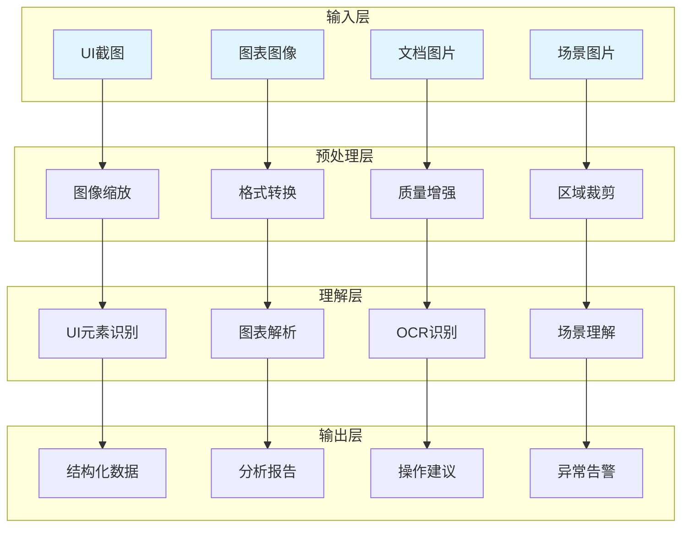

# 图像理解技术

使用视觉语言模型实现图像内容的智能理解与分析，包括UI截图理解、图表分析、文档识别等。

## 📊 技术架构



## 🏗️ 核心能力

### UI截图理解

```python
from typing import Dict, List, Tuple, Optional
from dataclasses import dataclass
import base64

@dataclass
class UIElement:
    """
    UI元素类
    表示界面中的一个可识别元素
    """
    element_type: str
    text: str
    location: Tuple[int, int]
    size: Tuple[int, int]
    confidence: float
    description: str
    is_interactive: bool

@dataclass
class UIAnalysis:
    """
    UI分析结果类
    """
    page_type: str
    title: str
    elements: List[UIElement]
    layout_description: str
    user_flows: List[str]
    accessibility_issues: List[Dict]

class UIUnderstandingEngine:
    """
    UI理解引擎
    分析UI截图并提取结构化信息
    """
    def __init__(self, vlm_client):
        self.vlm = vlm_client
    
    def analyze(self, image_path: str) -> UIAnalysis:
        """
        分析UI截图
        
        Args:
            image_path: 截图路径
            
        Returns:
            UIAnalysis: 分析结果
        """
        with open(image_path, "rb") as f:
            image_data = base64.b64encode(f.read()).decode()
        
        prompt = """
分析这个UI界面截图，提供以下信息：
1. 页面类型（登录页、首页、列表页、详情页、设置页等）
2. 页面标题
3. 所有可见UI元素（按钮、输入框、文本、图片、图标等）
4. 布局描述
5. 用户可能的操作流程
6. 可访问性问题

以JSON格式返回结果。
"""
        
        response = self.vlm.analyze_image(image_data, prompt)
        
        elements = [
            UIElement(
                element_type=e.get("type", "unknown"),
                text=e.get("text", ""),
                location=tuple(e.get("location", [0, 0])),
                size=tuple(e.get("size", [0, 0])),
                confidence=e.get("confidence", 0.0),
                description=e.get("description", ""),
                is_interactive=e.get("is_interactive", False)
            )
            for e in response.get("elements", [])
        ]
        
        return UIAnalysis(
            page_type=response.get("page_type", "unknown"),
            title=response.get("title", ""),
            elements=elements,
            layout_description=response.get("layout_description", ""),
            user_flows=response.get("user_flows", []),
            accessibility_issues=response.get("accessibility_issues", [])
        )
    
    def find_element_by_description(
        self,
        image_path: str,
        description: str
    ) -> Optional[UIElement]:
        """
        根据描述查找元素
        
        Args:
            image_path: 截图路径
            description: 元素描述
            
        Returns:
            UIElement: 找到的元素，未找到返回None
        """
        analysis = self.analyze(image_path)
        
        for element in analysis.elements:
            if description.lower() in element.description.lower():
                return element
        
        return None
    
    def get_interactive_elements(
        self,
        image_path: str
    ) -> List[UIElement]:
        """
        获取所有可交互元素
        
        Args:
            image_path: 截图路径
            
        Returns:
            list: 可交互元素列表
        """
        analysis = self.analyze(image_path)
        
        return [
            element for element in analysis.elements
            if element.is_interactive
        ]
```

### 图表分析

```python
from typing import Dict, List, Any
from dataclasses import dataclass
from enum import Enum

class ChartType(Enum):
    """图表类型"""
    LINE = "line"
    BAR = "bar"
    PIE = "pie"
    SCATTER = "scatter"
    AREA = "area"
    TABLE = "table"
    UNKNOWN = "unknown"

@dataclass
class DataPoint:
    """数据点"""
    label: str
    value: float
    series: str = None

@dataclass
class ChartAnalysis:
    """图表分析结果"""
    chart_type: ChartType
    title: str
    x_axis_label: str
    y_axis_label: str
    data_points: List[DataPoint]
    trends: List[str]
    anomalies: List[Dict]
    insights: List[str]

class ChartUnderstandingEngine:
    """
    图表理解引擎
    分析图表图像并提取数据
    """
    def __init__(self, vlm_client):
        self.vlm = vlm_client
    
    def analyze(self, image_path: str) -> ChartAnalysis:
        """
        分析图表
        
        Args:
            image_path: 图表图片路径
            
        Returns:
            ChartAnalysis: 分析结果
        """
        with open(image_path, "rb") as f:
            image_data = base64.b64encode(f.read()).decode()
        
        prompt = """
分析这个数据图表：
1. 图表类型（折线图、柱状图、饼图、散点图等）
2. 图表标题
3. X轴标签
4. Y轴标签
5. 所有数据点（包含标签、数值、系列）
6. 趋势分析
7. 异常点识别
8. 关键洞察

以JSON格式返回结果。
"""
        
        response = self.vlm.analyze_image(image_data, prompt)
        
        data_points = [
            DataPoint(
                label=dp.get("label", ""),
                value=dp.get("value", 0),
                series=dp.get("series")
            )
            for dp in response.get("data_points", [])
        ]
        
        return ChartAnalysis(
            chart_type=ChartType(response.get("chart_type", "unknown")),
            title=response.get("title", ""),
            x_axis_label=response.get("x_axis_label", ""),
            y_axis_label=response.get("y_axis_label", ""),
            data_points=data_points,
            trends=response.get("trends", []),
            anomalies=response.get("anomalies", []),
            insights=response.get("insights", [])
        )
    
    def extract_table_data(self, image_path: str) -> List[Dict]:
        """
        从图表提取表格数据
        
        Args:
            image_path: 图表图片路径
            
        Returns:
            list: 表格数据
        """
        with open(image_path, "rb") as f:
            image_data = base64.b64encode(f.read()).decode()
        
        prompt = """
从图表中提取所有数据，以表格形式返回。
包含列名和对应的数值。
格式：[{"column": "name", "values": [...]}]
"""
        
        response = self.vlm.analyze_image(image_data, prompt)
        return response.get("table", [])
    
    def compare_charts(
        self,
        chart1_path: str,
        chart2_path: str
    ) -> Dict:
        """
        对比两个图表
        
        Args:
            chart1_path: 图表1路径
            chart2_path: 图表2路径
            
        Returns:
            dict: 对比结果
        """
        with open(chart1_path, "rb") as f:
            data1 = base64.b64encode(f.read()).decode()
        
        with open(chart2_path, "rb") as f:
            data2 = base64.b64encode(f.read()).decode()
        
        prompt = """
对比这两个图表：
1. 数据差异
2. 趋势变化
3. 异常对比
4. 关键发现

返回详细的对比分析。
"""
        
        return self.vlm.compare_images(data1, data2, prompt)
```

### 文档识别

```python
from typing import Dict, List, Any
from dataclasses import dataclass

@dataclass
class DocumentRegion:
    """文档区域"""
    region_type: str
    content: str
    location: Tuple[int, int, int, int]
    confidence: float

@dataclass
class DocumentAnalysis:
    """文档分析结果"""
    full_text: str
    regions: List[DocumentRegion]
    tables: List[Dict]
    structure: Dict
    language: str

class DocumentUnderstandingEngine:
    """
    文档理解引擎
    识别文档内容并提取结构化信息
    """
    def __init__(self, vlm_client):
        self.vlm = vlm_client
    
    def analyze(self, document_path: str) -> DocumentAnalysis:
        """
        分析文档
        
        Args:
            document_path: 文档路径
            
        Returns:
            DocumentAnalysis: 分析结果
        """
        with open(document_path, "rb") as f:
            image_data = base64.b64encode(f.read()).decode()
        
        prompt = """
分析这个文档：
1. 提取所有文字内容
2. 识别文档区域（标题、正文、表格、图片等）
3. 提取表格数据
4. 分析文档结构
5. 识别文档语言

以JSON格式返回结果。
"""
        
        response = self.vlm.analyze_image(image_data, prompt)
        
        regions = [
            DocumentRegion(
                region_type=r.get("type", "unknown"),
                content=r.get("content", ""),
                location=tuple(r.get("location", [0, 0, 0, 0])),
                confidence=r.get("confidence", 0.0)
            )
            for r in response.get("regions", [])
        ]
        
        return DocumentAnalysis(
            full_text=response.get("full_text", ""),
            regions=regions,
            tables=response.get("tables", []),
            structure=response.get("structure", {}),
            language=response.get("language", "unknown")
        )
    
    def extract_text(self, document_path: str) -> str:
        """
        提取文档文字
        
        Args:
            document_path: 文档路径
            
        Returns:
            str: 提取的文字
        """
        with open(document_path, "rb") as f:
            image_data = base64.b64encode(f.read()).decode()
        
        prompt = "提取文档中的所有文字内容，保持原有格式和排版。"
        
        response = self.vlm.analyze_image(image_data, prompt)
        return response.get("text", "")
    
    def extract_tables(self, document_path: str) -> List[Dict]:
        """
        提取文档表格
        
        Args:
            document_path: 文档路径
            
        Returns:
            list: 表格数据列表
        """
        with open(document_path, "rb") as f:
            image_data = base64.b64encode(f.read()).decode()
        
        prompt = """
识别文档中的所有表格，提取表格数据。
格式：[{"headers": [...], "rows": [[...], ...]}]
"""
        
        response = self.vlm.analyze_image(image_data, prompt)
        return response.get("tables", [])
```

## 🎯 应用场景

### 测试用例生成

基于UI截图自动生成测试用例。

```python
class TestCaseGeneratorFromScreenshot:
    """
    基于截图的测试用例生成器
    """
    def __init__(self, vlm_client):
        self.vlm = vlm_client
        self.ui_engine = UIUnderstandingEngine(vlm_client)
    
    def generate_test_cases(
        self,
        screenshot_path: str,
        test_types: List[str] = None
    ) -> List[Dict]:
        """
        从截图生成测试用例
        
        Args:
            screenshot_path: 截图路径
            test_types: 测试类型列表
            
        Returns:
            list: 测试用例列表
        """
        if test_types is None:
            test_types = ["功能测试", "UI测试", "可访问性测试"]
        
        analysis = self.ui_engine.analyze(screenshot_path)
        
        test_cases = []
        
        for element in analysis.elements:
            if element.is_interactive:
                test_cases.append({
                    "test_id": f"TC_{element.element_type}_{len(test_cases) + 1}",
                    "test_name": f"测试{element.description}",
                    "test_type": "功能测试",
                    "preconditions": ["页面已加载"],
                    "test_steps": [
                        f"定位元素：{element.description}",
                        f"执行点击操作",
                        "验证响应"
                    ],
                    "expected_results": ["元素响应正常"],
                    "priority": "P2"
                })
        
        for issue in analysis.accessibility_issues:
            test_cases.append({
                "test_id": f"TC_A11Y_{len(test_cases) + 1}",
                "test_name": f"可访问性测试：{issue.get('description', '')}",
                "test_type": "可访问性测试",
                "preconditions": ["页面已加载"],
                "test_steps": ["验证可访问性要求"],
                "expected_results": [issue.get("recommendation", "")],
                "priority": "P3"
            })
        
        return test_cases
```

### 智能元素定位

使用视觉描述定位UI元素。

```python
class VisualElementLocator:
    """
    视觉元素定位器
    基于语义描述定位UI元素
    """
    def __init__(self, vlm_client):
        self.vlm = vlm_client
        self.ui_engine = UIUnderstandingEngine(vlm_client)
    
    def locate(
        self,
        screenshot_path: str,
        description: str
    ) -> Optional[Dict]:
        """
        定位元素
        
        Args:
            screenshot_path: 截图路径
            description: 元素描述
            
        Returns:
            dict: 定位结果
        """
        element = self.ui_engine.find_element_by_description(
            screenshot_path,
            description
        )
        
        if element is None:
            return None
        
        center_x = element.location[0] + element.size[0] // 2
        center_y = element.location[1] + element.size[1] // 2
        
        return {
            "found": True,
            "element_type": element.element_type,
            "text": element.text,
            "location": element.location,
            "size": element.size,
            "center": (center_x, center_y),
            "confidence": element.confidence
        }
    
    def locate_all(
        self,
        screenshot_path: str,
        element_type: str = None
    ) -> List[Dict]:
        """
        定位所有匹配元素
        
        Args:
            screenshot_path: 截图路径
            element_type: 元素类型过滤
            
        Returns:
            list: 定位结果列表
        """
        analysis = self.ui_engine.analyze(screenshot_path)
        
        results = []
        for element in analysis.elements:
            if element_type and element.element_type != element_type:
                continue
            
            center_x = element.location[0] + element.size[0] // 2
            center_y = element.location[1] + element.size[1] // 2
            
            results.append({
                "found": True,
                "element_type": element.element_type,
                "text": element.text,
                "location": element.location,
                "size": element.size,
                "center": (center_x, center_y),
                "confidence": element.confidence
            })
        
        return results
```

### 图表数据验证

验证图表数据的正确性。

```python
class ChartDataValidator:
    """
    图表数据验证器
    """
    def __init__(self, vlm_client):
        self.vlm = vlm_client
        self.chart_engine = ChartUnderstandingEngine(vlm_client)
    
    def validate(
        self,
        chart_path: str,
        expected_data: Dict
    ) -> Dict:
        """
        验证图表数据
        
        Args:
            chart_path: 图表路径
            expected_data: 预期数据
            
        Returns:
            dict: 验证结果
        """
        analysis = self.chart_engine.analyze(chart_path)
        
        errors = []
        warnings = []
        
        if expected_data.get("title") and analysis.title != expected_data["title"]:
            errors.append(f"标题不匹配：期望'{expected_data['title']}'，实际'{analysis.title}'")
        
        if expected_data.get("chart_type") and analysis.chart_type.value != expected_data["chart_type"]:
            warnings.append(f"图表类型不匹配：期望'{expected_data['chart_type']}'，实际'{analysis.chart_type.value}'")
        
        expected_points = expected_data.get("data_points", [])
        for exp_point in expected_points:
            found = False
            for act_point in analysis.data_points:
                if act_point.label == exp_point.get("label"):
                    found = True
                    if abs(act_point.value - exp_point.get("value", 0)) > 0.01:
                        errors.append(
                            f"数据点'{exp_point['label']}'值不匹配："
                            f"期望{exp_point['value']}，实际{act_point.value}"
                        )
                    break
            
            if not found:
                errors.append(f"缺少数据点：{exp_point.get('label')}")
        
        return {
            "valid": len(errors) == 0,
            "errors": errors,
            "warnings": warnings,
            "actual_data": {
                "title": analysis.title,
                "chart_type": analysis.chart_type.value,
                "data_points": [
                    {"label": dp.label, "value": dp.value}
                    for dp in analysis.data_points
                ]
            }
        }
```

## 📚 学习资源

### 官方文档

| 资源 | 描述 | 链接 |
|-----|------|------|
| **GPT-4V API** | GPT-4V图像理解API | [platform.openai.com](https://platform.openai.com/docs/guides/vision) |
| **Claude Vision** | Claude视觉能力文档 | [docs.anthropic.com](https://docs.anthropic.com/claude/docs/vision) |
| **Google Cloud Vision** | Google视觉AI文档 | [cloud.google.com/vision](https://cloud.google.com/vision/docs) |

### 经典论文

| 论文 | 描述 | 链接 |
|-----|------|------|
| **ViT** | Vision Transformer | [arxiv.org/abs/2010.11929](https://arxiv.org/abs/2010.11929) |
| **CLIP** | 图文对比学习 | [arxiv.org/abs/2103.00020](https://arxiv.org/abs/2103.00020) |
| **BLIP** | 视觉语言预训练 | [arxiv.org/abs/2201.12086](https://arxiv.org/abs/2201.12086) |

### 开源工具

| 工具 | 描述 | 链接 |
|-----|------|------|
| **PaddleOCR** | 百度开源OCR | [github.com/PaddlePaddle/PaddleOCR](https://github.com/PaddlePaddle/PaddleOCR) |
| **Tesseract** | 开源OCR引擎 | [github.com/tesseract-ocr/tesseract](https://github.com/tesseract-ocr/tesseract) |
| **EasyOCR** | 易用OCR库 | [github.com/JaidedAI/EasyOCR](https://github.com/JaidedAI/EasyOCR) |

## 🔗 相关资源

- [视觉测试实践](/ai-testing-tech/vlm-tech/visual-testing/) - 视觉测试详解
- [多模态RAG应用](/ai-testing-tech/vlm-tech/multimodal-rag/) - 多模态检索增强
- [LLM技术](/ai-testing-tech/llm-tech/) - 大语言模型技术
