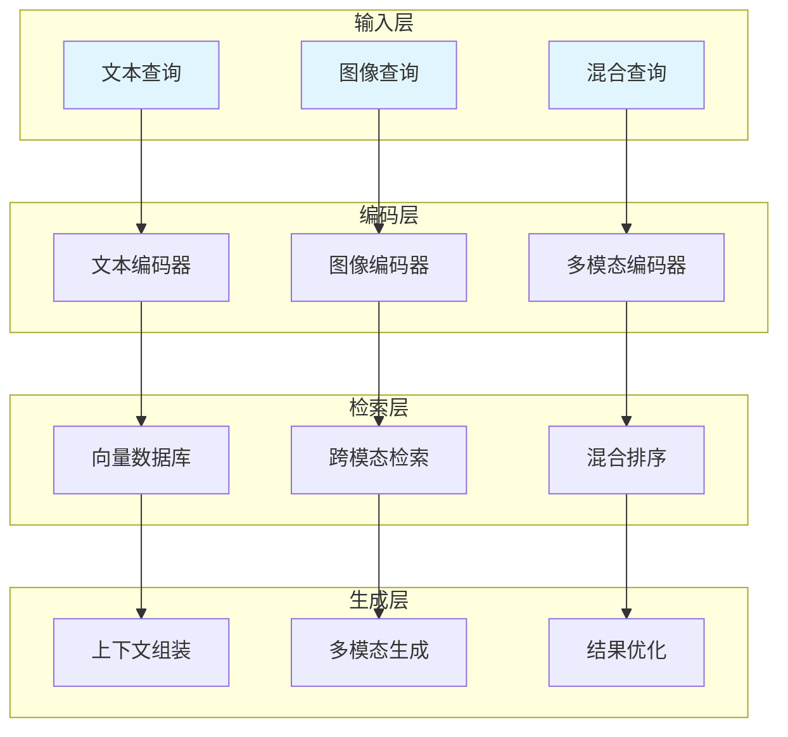

# 多模态RAG应用

图文混合检索增强生成技术，实现跨模态的知识检索和内容生成。

## 📊 技术架构



## 🏗️ 核心组件

### 多模态编码器

```python
from typing import Dict, List, Optional, Union
from dataclasses import dataclass
import base64
import numpy as np

@dataclass
class MultimodalEmbedding:
    """
    多模态嵌入类
    """
    text_embedding: Optional[List[float]] = None
    image_embedding: Optional[List[float]] = None
    combined_embedding: Optional[List[float]] = None

class MultimodalEncoder:
    """
    多模态编码器
    将文本和图像编码为统一向量空间
    """
    def __init__(self, vlm_client, embedding_dim: int = 768):
        self.vlm = vlm_client
        self.embedding_dim = embedding_dim
    
    def encode_text(self, text: str) -> List[float]:
        """
        编码文本
        
        Args:
            text: 文本内容
            
        Returns:
            list: 文本嵌入向量
        """
        return self.vlm.get_text_embedding(text)
    
    def encode_image(self, image_path: str) -> List[float]:
        """
        编码图像
        
        Args:
            image_path: 图像路径
            
        Returns:
            list: 图像嵌入向量
        """
        with open(image_path, "rb") as f:
            image_data = base64.b64encode(f.read()).decode()
        
        return self.vlm.get_image_embedding(image_data)
    
    def encode_multimodal(
        self,
        text: str = None,
        image_path: str = None
    ) -> MultimodalEmbedding:
        """
        编码多模态内容
        
        Args:
            text: 文本内容
            image_path: 图像路径
            
        Returns:
            MultimodalEmbedding: 多模态嵌入
        """
        text_embedding = None
        image_embedding = None
        combined_embedding = None
        
        if text:
            text_embedding = self.encode_text(text)
        
        if image_path:
            image_embedding = self.encode_image(image_path)
        
        if text_embedding and image_embedding:
            combined_embedding = self._combine_embeddings(
                text_embedding,
                image_embedding
            )
        elif text_embedding:
            combined_embedding = text_embedding
        elif image_embedding:
            combined_embedding = image_embedding
        
        return MultimodalEmbedding(
            text_embedding=text_embedding,
            image_embedding=image_embedding,
            combined_embedding=combined_embedding
        )
    
    def _combine_embeddings(
        self,
        text_emb: List[float],
        image_emb: List[float]
    ) -> List[float]:
        """
        组合文本和图像嵌入
        
        Args:
            text_emb: 文本嵌入
            image_emb: 图像嵌入
            
        Returns:
            list: 组合后的嵌入
        """
        text_arr = np.array(text_emb)
        image_arr = np.array(image_emb)
        
        combined = (text_arr + image_arr) / 2
        
        norm = np.linalg.norm(combined)
        if norm > 0:
            combined = combined / norm
        
        return combined.tolist()
```

### 多模态向量存储

```python
from typing import Dict, List, Any, Optional
from dataclasses import dataclass
import json

@dataclass
class MultimodalDocument:
    """
    多模态文档类
    """
    doc_id: str
    text_content: str
    image_paths: List[str]
    text_embedding: Optional[List[float]] = None
    image_embeddings: Optional[List[List[float]]] = None
    metadata: Dict = None

class MultimodalVectorStore:
    """
    多模态向量存储
    支持图文混合检索
    """
    def __init__(self, encoder: MultimodalEncoder):
        self.encoder = encoder
        self.documents: Dict[str, MultimodalDocument] = {}
        self.text_index: List[tuple] = []
        self.image_index: List[tuple] = []
    
    def add_document(self, document: MultimodalDocument):
        """
        添加文档
        
        Args:
            document: 多模态文档
        """
        text_embedding = self.encoder.encode_text(document.text_content)
        
        image_embeddings = []
        for image_path in document.image_paths:
            emb = self.encoder.encode_image(image_path)
            image_embeddings.append(emb)
        
        document.text_embedding = text_embedding
        document.image_embeddings = image_embeddings
        
        self.documents[document.doc_id] = document
        
        self.text_index.append((document.doc_id, text_embedding))
        
        for i, img_emb in enumerate(image_embeddings):
            self.image_index.append((f"{document.doc_id}_img_{i}", img_emb))
    
    def search_by_text(
        self,
        query: str,
        top_k: int = 5
    ) -> List[Dict]:
        """
        文本检索
        
        Args:
            query: 查询文本
            top_k: 返回数量
            
        Returns:
            list: 检索结果
        """
        query_embedding = self.encoder.encode_text(query)
        
        scores = []
        for doc_id, doc_emb in self.text_index:
            score = self._cosine_similarity(query_embedding, doc_emb)
            scores.append((doc_id, score))
        
        scores.sort(key=lambda x: x[1], reverse=True)
        
        results = []
        for doc_id, score in scores[:top_k]:
            doc = self.documents.get(doc_id)
            if doc:
                results.append({
                    "doc_id": doc_id,
                    "score": score,
                    "text_content": doc.text_content,
                    "image_paths": doc.image_paths,
                    "metadata": doc.metadata
                })
        
        return results
    
    def search_by_image(
        self,
        image_path: str,
        top_k: int = 5
    ) -> List[Dict]:
        """
        图像检索
        
        Args:
            image_path: 查询图像路径
            top_k: 返回数量
            
        Returns:
            list: 检索结果
        """
        query_embedding = self.encoder.encode_image(image_path)
        
        scores = []
        for idx, img_emb in self.image_index:
            score = self._cosine_similarity(query_embedding, img_emb)
            doc_id = idx.rsplit("_img_", 1)[0]
            scores.append((doc_id, score))
        
        scores.sort(key=lambda x: x[1], reverse=True)
        
        seen_docs = set()
        results = []
        for doc_id, score in scores:
            if doc_id in seen_docs:
                continue
            seen_docs.add(doc_id)
            
            doc = self.documents.get(doc_id)
            if doc:
                results.append({
                    "doc_id": doc_id,
                    "score": score,
                    "text_content": doc.text_content,
                    "image_paths": doc.image_paths,
                    "metadata": doc.metadata
                })
            
            if len(results) >= top_k:
                break
        
        return results
    
    def hybrid_search(
        self,
        text_query: str = None,
        image_query: str = None,
        text_weight: float = 0.5,
        top_k: int = 5
    ) -> List[Dict]:
        """
        混合检索
        
        Args:
            text_query: 文本查询
            image_query: 图像查询路径
            text_weight: 文本权重
            top_k: 返回数量
            
        Returns:
            list: 检索结果
        """
        text_results = {}
        image_results = {}
        
        if text_query:
            for result in self.search_by_text(text_query, top_k * 2):
                text_results[result["doc_id"]] = result["score"]
        
        if image_query:
            for result in self.search_by_image(image_query, top_k * 2):
                image_results[result["doc_id"]] = result["score"]
        
        all_doc_ids = set(text_results.keys()) | set(image_results.keys())
        
        combined_scores = []
        for doc_id in all_doc_ids:
            text_score = text_results.get(doc_id, 0)
            image_score = image_results.get(doc_id, 0)
            
            combined = text_weight * text_score + (1 - text_weight) * image_score
            combined_scores.append((doc_id, combined))
        
        combined_scores.sort(key=lambda x: x[1], reverse=True)
        
        results = []
        for doc_id, score in combined_scores[:top_k]:
            doc = self.documents.get(doc_id)
            if doc:
                results.append({
                    "doc_id": doc_id,
                    "score": score,
                    "text_content": doc.text_content,
                    "image_paths": doc.image_paths,
                    "metadata": doc.metadata
                })
        
        return results
    
    def _cosine_similarity(
        self,
        vec1: List[float],
        vec2: List[float]
    ) -> float:
        """
        计算余弦相似度
        
        Args:
            vec1: 向量1
            vec2: 向量2
            
        Returns:
            float: 相似度
        """
        arr1 = np.array(vec1)
        arr2 = np.array(vec2)
        
        dot = np.dot(arr1, arr2)
        norm1 = np.linalg.norm(arr1)
        norm2 = np.linalg.norm(arr2)
        
        if norm1 == 0 or norm2 == 0:
            return 0.0
        
        return dot / (norm1 * norm2)
```

### 多模态RAG系统

```python
from typing import Dict, List, Any, Optional
from dataclasses import dataclass

@dataclass
class RAGResponse:
    """
    RAG响应类
    """
    answer: str
    sources: List[Dict]
    confidence: float
    retrieved_images: List[str]

class MultimodalRAGSystem:
    """
    多模态RAG系统
    实现图文混合检索增强生成
    """
    def __init__(
        self,
        vlm_client,
        encoder: MultimodalEncoder,
        vector_store: MultimodalVectorStore
    ):
        self.vlm = vlm_client
        self.encoder = encoder
        self.vector_store = vector_store
    
    def query(
        self,
        text_query: str = None,
        image_query: str = None,
        top_k: int = 5
    ) -> RAGResponse:
        """
        执行查询
        
        Args:
            text_query: 文本查询
            image_query: 图像查询路径
            top_k: 检索数量
            
        Returns:
            RAGResponse: 响应结果
        """
        if text_query and image_query:
            results = self.vector_store.hybrid_search(
                text_query=text_query,
                image_query=image_query,
                top_k=top_k
            )
        elif text_query:
            results = self.vector_store.search_by_text(text_query, top_k)
        elif image_query:
            results = self.vector_store.search_by_image(image_query, top_k)
        else:
            return RAGResponse(
                answer="请提供文本或图像查询",
                sources=[],
                confidence=0.0,
                retrieved_images=[]
            )
        
        context = self._build_context(results)
        
        answer = self._generate_answer(
            query=text_query or "请描述这个图像",
            context=context,
            image_query=image_query
        )
        
        retrieved_images = []
        for result in results:
            retrieved_images.extend(result.get("image_paths", []))
        
        confidence = sum(r["score"] for r in results) / len(results) if results else 0
        
        return RAGResponse(
            answer=answer,
            sources=results,
            confidence=confidence,
            retrieved_images=retrieved_images[:5]
        )
    
    def _build_context(self, results: List[Dict]) -> str:
        """
        构建上下文
        
        Args:
            results: 检索结果
            
        Returns:
            str: 上下文字符串
        """
        context_parts = []
        
        for i, result in enumerate(results, 1):
            context_parts.append(f"[文档{i}]\n{result['text_content']}")
        
        return "\n\n".join(context_parts)
    
    def _generate_answer(
        self,
        query: str,
        context: str,
        image_query: str = None
    ) -> str:
        """
        生成答案
        
        Args:
            query: 查询
            context: 上下文
            image_query: 图像查询路径
            
        Returns:
            str: 生成的答案
        """
        prompt = f"""
基于以下上下文回答问题：

上下文：
{context}

问题：{query}

请提供详细、准确的回答。
"""
        
        if image_query:
            with open(image_query, "rb") as f:
                image_data = base64.b64encode(f.read()).decode()
            
            return self.vlm.analyze_image(image_data, prompt).get("answer", "")
        else:
            return self.vlm.generate(prompt)
    
    def add_knowledge(
        self,
        doc_id: str,
        text_content: str,
        image_paths: List[str] = None,
        metadata: Dict = None
    ):
        """
        添加知识
        
        Args:
            doc_id: 文档ID
            text_content: 文本内容
            image_paths: 图像路径列表
            metadata: 元数据
        """
        document = MultimodalDocument(
            doc_id=doc_id,
            text_content=text_content,
            image_paths=image_paths or [],
            metadata=metadata or {}
        )
        
        self.vector_store.add_document(document)
```

## 🎯 应用场景

### 测试知识库问答

构建测试知识库，支持图文混合查询。

```python
class TestKnowledgeQA:
    """
    测试知识库问答系统
    """
    def __init__(self, vlm_client):
        self.encoder = MultimodalEncoder(vlm_client)
        self.vector_store = MultimodalVectorStore(self.encoder)
        self.rag = MultimodalRAGSystem(vlm_client, self.encoder, self.vector_store)
    
    def add_test_documentation(
        self,
        doc_id: str,
        title: str,
        content: str,
        screenshots: List[str] = None
    ):
        """
        添加测试文档
        
        Args:
            doc_id: 文档ID
            title: 标题
            content: 内容
            screenshots: 截图列表
        """
        self.rag.add_knowledge(
            doc_id=doc_id,
            text_content=f"{title}\n\n{content}",
            image_paths=screenshots,
            metadata={"title": title, "type": "documentation"}
        )
    
    def ask(
        self,
        question: str,
        screenshot: str = None
    ) -> Dict:
        """
        提问
        
        Args:
            question: 问题
            screenshot: 相关截图
            
        Returns:
            dict: 回答结果
        """
        response = self.rag.query(
            text_query=question,
            image_query=screenshot
        )
        
        return {
            "answer": response.answer,
            "sources": [
                {
                    "doc_id": s["doc_id"],
                    "title": s["metadata"].get("title", ""),
                    "score": s["score"]
                }
                for s in response.sources
            ],
            "confidence": response.confidence
        }
```

### 视觉缺陷检索

根据缺陷描述或截图检索相似问题。

```python
class VisualDefectRetriever:
    """
    视觉缺陷检索器
    """
    def __init__(self, vlm_client):
        self.encoder = MultimodalEncoder(vlm_client)
        self.vector_store = MultimodalVectorStore(self.encoder)
    
    def add_defect(
        self,
        defect_id: str,
        description: str,
        screenshot: str,
        resolution: str = None
    ):
        """
        添加缺陷记录
        
        Args:
            defect_id: 缺陷ID
            description: 描述
            screenshot: 截图路径
            resolution: 解决方案
        """
        self.vector_store.add_document(MultimodalDocument(
            doc_id=defect_id,
            text_content=f"{description}\n\n解决方案：{resolution or '待解决'}",
            image_paths=[screenshot],
            metadata={
                "type": "defect",
                "description": description,
                "resolution": resolution
            }
        ))
    
    def find_similar(
        self,
        description: str = None,
        screenshot: str = None,
        top_k: int = 5
    ) -> List[Dict]:
        """
        查找相似缺陷
        
        Args:
            description: 描述
            screenshot: 截图路径
            top_k: 返回数量
            
        Returns:
            list: 相似缺陷列表
        """
        if description and screenshot:
            results = self.vector_store.hybrid_search(
                text_query=description,
                image_query=screenshot,
                top_k=top_k
            )
        elif description:
            results = self.vector_store.search_by_text(description, top_k)
        elif screenshot:
            results = self.vector_store.search_by_image(screenshot, top_k)
        else:
            return []
        
        return [
            {
                "defect_id": r["doc_id"],
                "description": r["metadata"].get("description", ""),
                "resolution": r["metadata"].get("resolution"),
                "similarity": r["score"],
                "screenshot": r["image_paths"][0] if r["image_paths"] else None
            }
            for r in results
        ]
```

### 测试报告生成

基于历史数据生成测试报告。

```python
class TestReportGenerator:
    """
    测试报告生成器
    使用多模态RAG生成报告
    """
    def __init__(self, vlm_client):
        self.encoder = MultimodalEncoder(vlm_client)
        self.vector_store = MultimodalVectorStore(self.encoder)
        self.vlm = vlm_client
    
    def add_historical_report(
        self,
        report_id: str,
        summary: str,
        details: str,
        charts: List[str] = None
    ):
        """
        添加历史报告
        
        Args:
            report_id: 报告ID
            summary: 摘要
            details: 详情
            charts: 图表列表
        """
        self.vector_store.add_document(MultimodalDocument(
            doc_id=report_id,
            text_content=f"摘要：{summary}\n\n详情：{details}",
            image_paths=charts or [],
            metadata={"type": "report", "summary": summary}
        ))
    
    def generate_report(
        self,
        test_results: Dict,
        style: str = "standard"
    ) -> str:
        """
        生成报告
        
        Args:
            test_results: 测试结果
            style: 报告风格
            
        Returns:
            str: 生成的报告
        """
        query = f"""
根据以下测试结果生成{style}风格的测试报告：
- 总用例数：{test_results.get('total', 0)}
- 通过数：{test_results.get('passed', 0)}
- 失败数：{test_results.get('failed', 0)}
"""
        
        similar_reports = self.vector_store.search_by_text(query, 3)
        
        context = "\n\n".join([
            r["text_content"] for r in similar_reports
        ])
        
        prompt = f"""
参考历史报告风格：
{context}

生成新的测试报告：
{query}

请包含执行摘要、测试统计、失败分析和改进建议。
"""
        
        return self.vlm.generate(prompt)
```

## 📚 学习资源

### 官方文档

| 资源 | 描述 | 链接 |
|-----|------|------|
| **CLIP Paper** | 图文对比学习原论文 | [arxiv.org/abs/2103.00020](https://arxiv.org/abs/2103.00020) |
| **BLIP-2** | 视觉语言预训练 | [github.com/salesforce/LAVIS](https://github.com/salesforce/LAVIS) |
| **Faiss** | 向量检索库 | [github.com/facebookresearch/faiss](https://github.com/facebookresearch/faiss) |

### 经典论文

| 论文 | 描述 | 链接 |
|-----|------|------|
| **CLIP** | 图文对比学习 | [arxiv.org/abs/2103.00020](https://arxiv.org/abs/2103.00020) |
| **BLIP** | 视觉语言预训练 | [arxiv.org/abs/2201.12086](https://arxiv.org/abs/2201.12086) |
| **Flamingo** | 少样本多模态模型 | [arxiv.org/abs/2204.14198](https://arxiv.org/abs/2204.14198) |

### 开源工具

| 工具 | 描述 | 链接 |
|-----|------|------|
| **LlamaIndex** | 多模态RAG框架 | [github.com/run-llama/llama_index](https://github.com/run-llama/llama_index) |
| **Chroma** | 向量数据库 | [github.com/chroma-core/chroma](https://github.com/chroma-core/chroma) |
| **Pinecone** | 云向量数据库 | [pinecone.io](https://www.pinecone.io/) |

## 🔗 相关资源

- [图像理解技术](/ai-testing-tech/vlm-tech/image-understanding/) - 图像理解技术
- [视觉测试实践](/ai-testing-tech/vlm-tech/visual-testing/) - 视觉测试详解
- [LLM技术](/ai-testing-tech/llm-tech/) - 大语言模型技术
- [RAG技术](/ai-testing-tech/rag-tech/) - 检索增强生成
