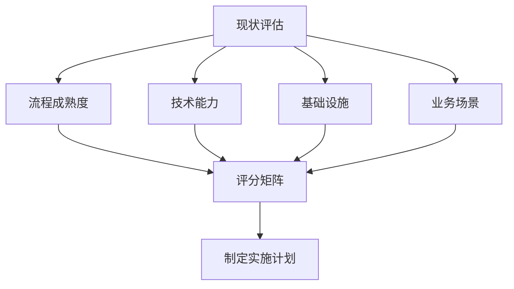

# AI测试最佳实践

总结AI测试实施的最佳实践，提供可落地的实施指南，帮助团队避免常见陷阱，提升AI测试成功率。

## 概述

AI测试最佳实践是基于大量实践案例总结出的经验教训，涵盖实施路径规划、常见陷阱规避、团队能力建设和成功案例分析。遵循这些最佳实践可以显著提高AI测试项目的成功率。

### 核心价值

- **降低实施风险**：通过经验总结避免常见错误
- **加速落地进程**：提供经过验证的实施路径
- **提升团队能力**：明确能力建设方向和方法
- **实现价值最大化**：确保AI测试投入产出比

## AI测试实施路径

### 第一阶段：准备与评估（1-2个月）

#### 1. 现状评估

**评估内容**：
- 现有测试流程成熟度
- 团队技术能力水平
- 测试数据和基础设施
- 业务场景复杂度

**评估方法**：


**评估指标**：

| 维度 | 评估项 | 权重 | 评分标准 |
|------|--------|------|----------|
| 流程成熟度 | 自动化覆盖率 | 20% | 0-5分 |
| 技术能力 | AI/ML基础 | 20% | 0-5分 |
| 基础设施 | 数据可用性 | 25% | 0-5分 |
| 业务场景 | AI适用性 | 35% | 0-5分 |

#### 2. 目标设定

**SMART原则**：
- **S**pecific：明确具体的应用场景
- **M**easurable：可量化的效果指标
- **A**chievable：可实现的目标水平
- **R**elevant：与业务目标相关
- **T**ime-bound：明确的时间节点

**目标示例**：
```
在6个月内，在UI测试场景中实现：
- 测试用例生成效率提升50%
- 测试维护成本降低30%
- 缺陷发现率提升20%
```

#### 3. 资源准备

**技术资源**：
- AI测试工具选型和采购
- 基础设施升级（计算资源、存储）
- 数据平台建设

**人力资源**：
- 核心团队组建（3-5人）
- 技能培训计划
- 外部专家引入

### 第二阶段：试点验证（2-3个月）

#### 1. 场景选择

**选择原则**：
- 优先选择高价值场景
- 数据基础较好的场景
- 技术复杂度适中的场景
- 失败影响可控的场景

**推荐试点场景**：

| 场景 | 适用性 | 难度 | 预期收益 |
|------|--------|------|----------|
| 测试数据生成 | 高 | 低 | 中 |
| UI测试用例生成 | 高 | 中 | 高 |
| API测试生成 | 高 | 中 | 高 |
| 测试结果分析 | 中 | 中 | 中 |
| 缺陷根因分析 | 中 | 高 | 高 |

#### 2. 方案设计

**设计要素**：
```
┌─────────────────────────────────────────┐
│          AI测试方案设计框架              │
├─────────────────────────────────────────┤
│  1. 业务场景分析                         │
│     - 测试需求梳理                       │
│     - 痛点问题识别                       │
│     - 成功标准定义                       │
├─────────────────────────────────────────┤
│  2. 技术方案设计                         │
│     - AI能力选择                         │
│     - 工具链集成                         │
│     - 数据流设计                         │
├─────────────────────────────────────────┤
│  3. 实施计划制定                         │
│     - 里程碑规划                         │
│     - 资源分配                           │
│     - 风险预案                           │
└─────────────────────────────────────────┘
```

#### 3. 快速验证

**验证步骤**：
1. 搭建最小可行方案（MVP）
2. 小规模数据测试
3. 效果评估和调优
4. 决定是否扩大范围

**验证指标**：
- 功能完整性：是否满足基本需求
- 效果达标性：是否达到预期效果
- 成本可控性：投入是否在预算内
- 可扩展性：是否具备推广条件

### 第三阶段：规模推广（3-6个月）

#### 1. 推广策略

**分阶段推广**：
```
阶段1：单团队试点（1个团队，1-2个场景）
  ↓
阶段2：多团队推广（2-3个团队，3-5个场景）
  ↓
阶段3：全面推广（全组织，多场景覆盖）
```

**推广原则**：
- 先易后难，逐步深入
- 成功案例驱动，口碑传播
- 持续培训，能力建设
- 定期复盘，优化改进

#### 2. 平台建设

**平台能力**：
- 统一的AI测试工具平台
- 标准化的测试流程
- 共享的测试资产库
- 完善的监控和告警

**平台架构**：
```
┌──────────────────────────────────────────┐
│              用户界面层                   │
│  测试设计 | 测试执行 | 结果分析 | 报告查看  │
└──────────────────────────────────────────┘
                    ↓
┌──────────────────────────────────────────┐
│              AI能力层                     │
│  用例生成 | 智能执行 | 结果分析 | 自愈修复  │
└──────────────────────────────────────────┘
                    ↓
┌──────────────────────────────────────────┐
│              数据服务层                   │
│  数据管理 | 模型管理 | 知识库 | 配置中心    │
└──────────────────────────────────────────┘
                    ↓
┌──────────────────────────────────────────┐
│              基础设施层                   │
│  计算资源 | 存储资源 | 网络资源 | 安全体系  │
└──────────────────────────────────────────┘
```

#### 3. 流程优化

**流程改进**：
- 将AI测试纳入标准测试流程
- 建立AI测试质量门禁
- 优化人机协作模式
- 持续改进机制

### 第四阶段：持续优化（长期）

#### 1. 效果评估

**评估维度**：
- 效率提升：测试效率、执行速度
- 质量提升：缺陷发现率、漏测率
- 成本优化：人力成本、维护成本
- 能力提升：团队技能、创新能力

#### 2. 持续改进

**改进机制**：
- 定期效果评估（季度）
- 问题收集和分类
- 改进方案制定
- 实施和验证

## 常见陷阱与规避方法

### 陷阱1：过度依赖AI

**问题描述**：
盲目相信AI输出，缺乏人工验证和监督，导致质量问题。

**典型案例**：
某团队使用AI生成测试用例，未进行人工审核直接使用，结果生成的用例覆盖了错误的功能路径，导致严重缺陷漏测。

**规避方法**：
```
┌─────────────────────────────────────────┐
│        AI测试人机协作模式                │
├─────────────────────────────────────────┤
│  AI负责：                                │
│  - 大规模用例生成                        │
│  - 重复性任务执行                        │
│  - 数据分析和模式识别                    │
├─────────────────────────────────────────┤
│  人工负责：                              │
│  - 测试策略制定                          │
│  - 关键用例审核                          │
│  - 复杂场景判断                          │
│  - 结果验证和决策                        │
└─────────────────────────────────────────┘
```

**最佳实践**：
1. 建立AI输出审核机制
2. 设置人工干预触发条件
3. 保持测试人员的专业判断
4. 定期评估AI输出质量

### 陷阱2：忽视数据质量

**问题描述**：
过度关注AI模型，忽视测试数据质量，导致AI效果不佳。

**典型案例**：
某团队投入大量资源选择和调优AI模型，但使用的测试数据存在大量噪声和不一致，导致AI生成的测试用例质量低下。

**规避方法**：

**数据质量标准**：
| 维度 | 标准 | 检查方法 |
|------|------|----------|
| 完整性 | 数据完整率>95% | 数据完整性检查 |
| 准确性 | 数据准确率>98% | 人工抽样验证 |
| 一致性 | 数据一致性>95% | 数据一致性校验 |
| 时效性 | 数据更新及时 | 更新时间监控 |

**数据治理流程**：
```
数据采集 → 数据清洗 → 数据标注 → 数据验证 → 数据使用
    ↓          ↓          ↓          ↓          ↓
  规范化     质量检查    标注规范    验收标准    版本管理
```

### 陷阱3：目标不切实际

**问题描述**：
设定过高的期望目标，忽视AI的局限性，导致项目失败。

**典型案例**：
某团队期望AI测试能够完全替代人工测试，在短时间内实现100%自动化，结果因目标不切实际导致项目失败。

**规避方法**：

**合理目标设定**：
```
不切实际的目标：
- 100%自动化测试
- 完全替代人工测试
- 零缺陷漏测
- 立即见效

合理的目标：
- 高价值场景自动化率>70%
- AI辅助人工测试，效率提升50%
- 缺陷发现率提升20%
- 6个月见效，持续优化
```

**目标调整机制**：
1. 定期评估目标合理性
2. 根据实际情况动态调整
3. 设置阶段性里程碑
4. 保持目标与能力匹配

### 陷阱4：忽视团队能力建设

**问题描述**：
只关注工具引入，忽视团队能力培养，导致工具无法有效使用。

**典型案例**：
某公司采购了先进的AI测试平台，但团队缺乏AI相关技能，无法有效使用平台功能，最终平台闲置。

**规避方法**：

**能力建设路径**：
```
阶段1：基础能力（0-3个月）
- AI测试基础概念
- 工具基本使用
- Prompt Engineering基础

阶段2：应用能力（3-6个月）
- AI测试方案设计
- 工具高级应用
- 问题诊断和优化

阶段3：创新能力（6-12个月）
- AI测试平台设计
- 自定义能力开发
- 最佳实践总结
```

**培训体系**：
- 系统化培训课程
- 实战项目演练
- 定期技术分享
- 外部专家指导

### 陷阱5：缺乏持续投入

**问题描述**：
期望一次性投入后持续见效，忽视AI测试需要持续优化和维护。

**典型案例**：
某团队完成AI测试平台建设后，未安排持续优化资源，导致平台效果逐渐下降，最终被弃用。

**规避方法**：

**持续投入规划**：
| 阶段 | 投入重点 | 资源占比 |
|------|----------|----------|
| 建设期 | 平台开发、能力建设 | 70% |
| 运营期 | 效果优化、问题解决 | 50% |
| 成熟期 | 持续改进、创新探索 | 30% |

**长效机制**：
1. 建立专门的AI测试团队
2. 制定持续优化计划
3. 建立效果监控体系
4. 定期评估和改进

## 团队能力建设

### 能力模型

**AI测试工程师能力模型**：
```
┌─────────────────────────────────────────┐
│  L4: 专家级                             │
│  - AI测试架构设计                        │
│  - 平台规划和建设                        │
│  - 技术创新和研究                        │
├─────────────────────────────────────────┤
│  L3: 高级                               │
│  - AI测试方案设计                        │
│  - 复杂问题解决                          │
│  - 团队技术指导                          │
├─────────────────────────────────────────┤
│  L2: 中级                               │
│  - AI工具熟练应用                        │
│  - 测试场景落地                          │
│  - 问题分析和优化                        │
├─────────────────────────────────────────┤
│  L1: 初级                               │
│  - AI测试基础概念                        │
│  - 工具基本使用                          │
│  - 简单场景应用                          │
└─────────────────────────────────────────┘
```

### 技能矩阵

**核心技能要求**：

| 技能领域 | 初级 | 中级 | 高级 | 专家 |
|----------|------|------|------|------|
| 测试基础 | 掌握 | 精通 | 精通 | 精通 |
| AI/ML基础 | 了解 | 掌握 | 精通 | 精通 |
| 编程能力 | 基础 | 熟练 | 精通 | 精通 |
| 数据处理 | 基础 | 熟练 | 精通 | 精通 |
| 工具应用 | 基础 | 熟练 | 精通 | 创新 |
| 方案设计 | - | 基础 | 熟练 | 精通 |

### 培训体系

**培训课程体系**：

**基础课程**（40学时）：
1. AI测试概论（8学时）
   - AI测试发展历程
   - 核心概念和术语
   - 应用场景概览

2. 测试基础回顾（8学时）
   - 测试理论和方法
   - 测试流程和规范
   - 测试工具基础

3. AI技术基础（12学时）
   - 机器学习基础
   - 深度学习入门
   - NLP和CV基础

4. AI测试工具（12学时）
   - 主流工具介绍
   - 工具选型方法
   - 基础操作实践

**进阶课程**（60学时）：
1. Prompt Engineering（16学时）
   - Prompt设计原则
   - 高级技巧和方法
   - 实战案例分析

2. AI测试设计（16学时）
   - AI测试策略
   - 用例设计方法
   - 场景适配技巧

3. 数据工程（12学时）
   - 数据采集和处理
   - 数据质量管理
   - 数据安全合规

4. 效果优化（16学时）
   - 效果评估方法
   - 问题诊断技巧
   - 优化策略实施

**高级课程**（80学时）：
1. AI测试架构（24学时）
   - 平台架构设计
   - 技术选型决策
   - 性能优化

2. Agent开发（24学时）
   - Agent设计原理
   - 开发框架使用
   - 自定义开发

3. 质量保障（16学时）
   - AI测试质量体系
   - 风险控制方法
   - 合规审计

4. 创新实践（16学时）
   - AI前沿技术探索
   - 创新方法研究
   - 最佳实践总结

### 实践项目

**分级实践项目**：

**初级项目**：
- 使用AI工具生成测试用例
- 执行AI生成的测试脚本
- 分析AI测试报告

**中级项目**：
- 设计AI测试方案
- 优化AI测试效果
- 解决常见问题

**高级项目**：
- 开发测试Agent
- 设计AI测试平台
- 推动团队转型

### 认证体系

**内部认证标准**：

**初级认证**：
- 完成基础课程学习
- 通过理论考试（>80分）
- 完成1个初级实践项目
- 获得AI测试助理工程师证书

**中级认证**：
- 完成进阶课程学习
- 通过理论和实践考试
- 完成2个中级实践项目
- 获得AI测试工程师证书

**高级认证**：
- 完成高级课程学习
- 通过综合能力评估
- 完成1个高级实践项目
- 获得高级AI测试工程师证书

## 成功案例分析

### 案例一：某电商平台UI测试智能化

#### 背景介绍

**公司背景**：
- 大型电商平台
- 测试团队规模：50人
- 主要挑战：UI测试维护成本高，用例生成效率低

**问题现状**：
- UI自动化用例维护成本高，每月维护工时占比40%
- 新功能测试用例生成慢，平均每个用例需要2小时
- 测试覆盖率不足，核心流程覆盖率仅60%

#### 解决方案

**技术方案**：
```
┌──────────────────────────────────────────┐
│         UI测试智能化架构                  │
├──────────────────────────────────────────┤
│  用例生成层                               │
│  - 基于需求文档生成测试场景               │
│  - 基于UI截图生成测试步骤                 │
│  - 智能数据准备                           │
├──────────────────────────────────────────┤
│  执行维护层                               │
│  - 智能元素定位                           │
│  - 自动脚本修复                           │
│  - 异常智能处理                           │
├──────────────────────────────────────────┤
│  结果分析层                               │
│  - 失败原因智能分析                       │
│  - 缺陷根因定位                           │
│  - 测试报告自动生成                       │
└──────────────────────────────────────────┘
```

**实施路径**：
1. **第1-2月**：试点验证
   - 选择2个核心业务模块
   - 搭建AI测试平台
   - 验证效果和可行性

2. **第3-5月**：规模推广
   - 扩展到10个业务模块
   - 培训测试团队
   - 优化平台功能

3. **第6-8月**：全面应用
   - 覆盖所有UI测试场景
   - 建立持续优化机制
   - 形成最佳实践

#### 实施效果

**量化成果**：
| 指标 | 实施前 | 实施后 | 提升幅度 |
|------|--------|--------|----------|
| 用例生成效率 | 2小时/个 | 0.5小时/个 | 75% |
| 维护成本占比 | 40% | 15% | 62.5% |
| 测试覆盖率 | 60% | 85% | 41.7% |
| 缺陷发现率 | 基准 | +25% | 25% |

**业务价值**：
- 测试效率显著提升，团队产能提高50%
- 测试质量明显改善，线上缺陷减少30%
- 团队满意度提升，工作更有成就感

#### 关键成功因素

1. **选择合适的切入点**：从高价值、数据基础好的场景开始
2. **循序渐进推进**：先试点验证，再规模推广
3. **重视能力建设**：系统培训团队，提升AI测试能力
4. **持续优化改进**：建立长效机制，持续提升效果

### 案例二：某金融公司API测试自动化

#### 背景介绍

**公司背景**：
- 金融科技公司
- 测试团队规模：30人
- 主要挑战：API测试用例编写慢，接口变更影响大

**问题现状**：
- API测试用例编写效率低，每个接口平均需要4小时
- 接口变更导致大量用例失效，维护工作量大
- 测试数据准备复杂，依赖多个系统

#### 解决方案

**技术方案**：
```
┌──────────────────────────────────────────┐
│         API测试自动化架构                 │
├──────────────────────────────────────────┤
│  智能生成层                               │
│  - 基于接口文档生成测试用例               │
│  - 智能测试数据生成                       │
│  - 边界值和异常场景自动识别               │
├──────────────────────────────────────────┤
│  自动维护层                               │
│  - 接口变更自动检测                       │
│  - 用例自动适配更新                       │
│  - 影响范围智能分析                       │
├──────────────────────────────────────────┤
│  智能执行层                               │
│  - 智能测试调度                           │
│  - 异常自动重试                           │
│  - 结果智能验证                           │
└──────────────────────────────────────────┘
```

#### 实施效果

**量化成果**：
- 用例编写效率提升80%
- 接口变更维护成本降低70%
- 测试覆盖率从50%提升到90%
- 回归测试时间缩短60%

#### 经验总结

1. **数据质量是关键**：高质量的接口文档是AI生成准确用例的基础
2. **流程优化并行**：AI工具引入的同时优化测试流程
3. **人机协作最佳**：AI生成+人工审核的组合效果最好

### 案例三：某互联网公司测试数据生成

#### 背景介绍

**公司背景**：
- 互联网服务公司
- 测试团队规模：100人
- 主要挑战：测试数据准备复杂，数据安全合规要求高

**问题现状**：
- 测试数据准备耗时长，平均每个场景需要1天
- 数据脱敏处理复杂，容易遗漏
- 数据一致性难以保证

#### 解决方案

**技术方案**：
- 基于AI的智能数据生成
- 自动数据脱敏和合规检查
- 数据版本管理和一致性保障

#### 实施效果

**量化成果**：
- 数据准备效率提升90%
- 数据合规率100%
- 数据一致性显著提升
- 数据维护成本降低80%

#### 经验总结

1. **安全合规优先**：金融行业数据安全是第一要务
2. **工具链整合**：AI数据生成与现有工具链深度集成
3. **持续监控**：建立数据质量监控体系，确保持续合规

## 实施检查清单

### 准备阶段检查清单

- [ ] 完成现状评估报告
- [ ] 明确实施目标和范围
- [ ] 获得管理层支持
- [ ] 组建核心团队
- [ ] 制定详细实施计划
- [ ] 准备必要资源

### 试点阶段检查清单

- [ ] 选择合适的试点场景
- [ ] 完成技术方案设计
- [ ] 搭建测试环境
- [ ] 准备测试数据
- [ ] 完成团队培训
- [ ] 建立效果评估体系

### 推广阶段检查清单

- [ ] 总结试点经验教训
- [ ] 制定推广计划
- [ ] 完善平台功能
- [ ] 扩大团队培训
- [ ] 建立支持体系
- [ ] 制定运维流程

### 运营阶段检查清单

- [ ] 建立效果监控体系
- [ ] 制定持续优化计划
- [ ] 建立问题反馈机制
- [ ] 定期评估和改进
- [ ] 总结最佳实践
- [ ] 推动创新发展

## 参考资料

### 实施指南
- [AI测试实施手册](https://example.com) - 详细的实施步骤和方法
- [AI测试工具选型指南](https://example.com) - 工具选型的评估框架
- [AI测试ROI评估](https://example.com) - 投入产出评估方法

### 培训资源
- [AI测试培训课程](https://example.com) - 系统化的培训课程
- [AI测试实践社区](https://example.com) - 经验交流和分享
- [AI测试认证体系](https://example.com) - 能力认证标准

### 行业案例
- [互联网行业AI测试案例集](https://example.com) - 互联网行业实践案例
- [金融行业AI测试案例集](https://example.com) - 金融行业实践案例
- [制造业AI测试案例集](https://example.com) - 制造业实践案例
