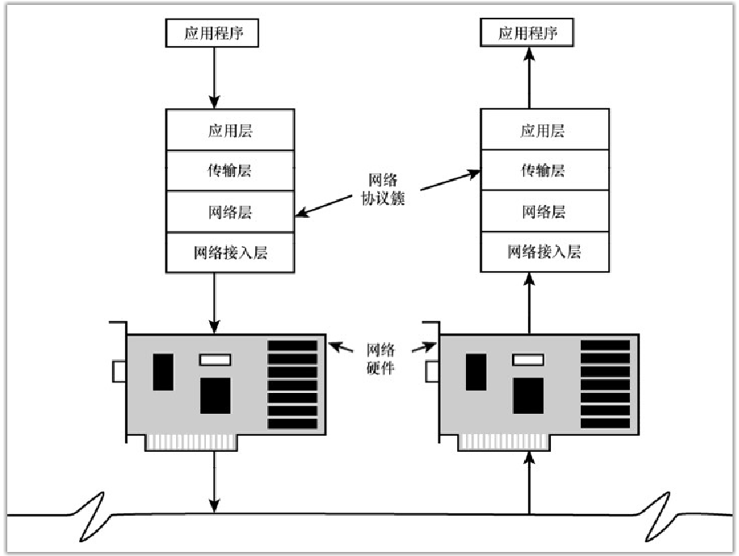

# 网络协议

两台主机要通信就必须遵守共同的规则，就好比两个人要沟通就需要使用共同的语言一样。两台电脑之间进行通信所共同遵守的规则，就是网络通信协议。

网络通信协议简称网络协议，是计算机在网络中实现通信时必须遵守的规则和约定，主要是对信息传输的速率、传输代码、代码结构、传输控制步骤、差错控制等做出规定并制订出标准。只有采用相同网络协议的计算机才能进行信息的沟通与交流。协议由以下3部分组成。

- 语义（Semantics）：规定双方完成通信需要的控制信息及应执行的动作。
- 语法（Syntax）：规定通信双方交换的数据或控制信息的格式和结构。
- 时序（Timing）：规定通信双方彼此的应答关系，包括速度的匹配和顺序。

网络中传输的数据包通常由两部分组成：

- 首部：首部的结构由协议的具体规范详细定义，在数据包的首部，明确标明了协议应该如何读取数据。通过首部，能够了解该协议必要的信息以及所要处理的数据。
- 数据：上一层传输过来的数据。
